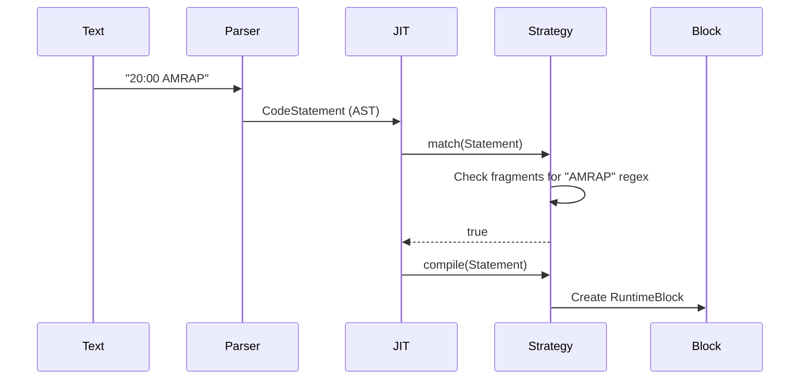
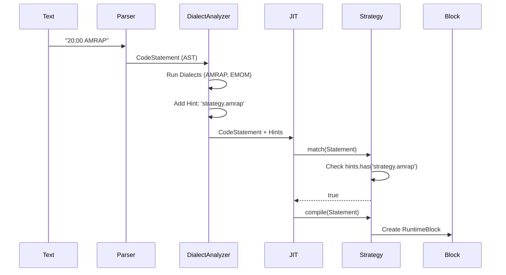

# Deep Dive: JIT Compiler, Parser, and Metrics Architecture

## 1. Architecture Overview: From Text to Execution

The WOD Wiki engine follows a multi-stage pipeline to transform workout text into executable runtime blocks.

**The Pipeline:**
1.  **Lexing & Parsing (Chevrotain):** Raw text is tokenized and parsed into a Concrete Syntax Tree (CST).
2.  **AST Generation (Visitor):** The CST is visited to produce an Abstract Syntax Tree (AST) of `ICodeStatement` objects, wrapped in a `WodScript`.
3.  **JIT Compilation (Strategies):** The `ScriptRuntime` uses a `JitCompiler` to iterate through a prioritized list of strategies. Each strategy inspects the AST (CodeStatement) and decides if it can handle it.
4.  **Runtime Block Creation:** The matching strategy creates a `RuntimeBlock` populated with specific `Behaviors` (e.g., `TimerBehavior`, `LoopCoordinatorBehavior`) and `Metrics`.
5.  **Execution & Tracking:** The block runs, updating `RuntimeMemory` and generating `ExecutionSpans` (history).
6.  **Analytics & Output:** `ExecutionSpans` are transformed into `Segments` and `AnalyticsGroups` for the UI.

## 2. JIT Strategies & Keyword Handling

The core logic for interpreting workout semantics lies in the JIT Strategies. These are **not** part of the parser grammar but are heuristic checks applied at runtime compilation.

### Strategy Precedence
The `JitCompiler` attempts to match a `CodeStatement` against strategies in this strict order:

1.  **`TimeBoundRoundsStrategy` (AMRAP)**
2.  **`IntervalStrategy` (EMOM)**
3.  **`TimerStrategy`**
4.  **`RoundsStrategy`**
5.  **`GroupStrategy`**
6.  **`EffortStrategy`** (Fallback)

### Deep Dive: Keyword Matching (The "Coded Up" Logic)

The user correctly identified that concepts like AMRAP are "coded up" into the system. This logic resides in the `match()` method of specific strategies.

#### AMRAP (TimeBoundRoundsStrategy)
*   **Trigger:** A statement containing a `Timer` fragment AND (`Rounds` fragment OR an `Action`/`Effort` text containing "AMRAP").
*   **Logic:**
    *   `fragments.some(f => f.value.includes('AMRAP'))`
*   **Generated Block:**
    *   A `RuntimeBlock` with `TimerBehavior` (countdown) and `LoopCoordinatorBehavior` (infinite loop).
    *   Tracks "Rounds" metrics.

#### EMOM (IntervalStrategy)
*   **Trigger:** A statement containing a `Timer` fragment AND an `Action`/`Effort` text containing "EMOM".
*   **Logic:**
    *   `fragments.some(f => f.value.includes('EMOM'))`
*   **Generated Block:**
    *   A `RuntimeBlock` with `TimerBehavior` (interval timer) and `LoopCoordinatorBehavior` (restarts timer `n` times).

### The Gap: Syntax vs. Semantics
Currently, the **syntax** (Parser) treats "AMRAP" just as a generic "Action" or "Effort" text. The **semantics** (JIT) re-reads that text to infer behavior. This coupling makes it hard to add new workout types without modifying the core strategies.

**Proposed Solution: Dialect Post-Parser**
See Section 5 for the architectural proposal to decouple this using JIT Hints.

## 3. Fragments to Metrics Transformation

The translation from source code (`fragments[][]`) to runtime data (`metrics[][]`) is handled by the `FragmentCompilationManager`.

**The Flow:**
1.  **Source:** `CodeStatement` contains `fragments` (e.g., `{ type: 'weight', value: 135 }`).
2.  **Compilation:** `ScriptRuntime` calls `fragmentCompiler.compileStatementFragments(statement)`.
3.  **Fragment Compilers:** Specific compilers (e.g., `ResistanceFragmentCompiler`, `RepFragmentCompiler`) extract values.
    *   `ResistanceFragmentCompiler` -> `{ type: 'resistance', value: 135, unit: 'lbs' }`
4.  **RuntimeMetric:** These values are aggregated into a `RuntimeMetric` object.
5.  **Block Assignment:** The `RuntimeMetric` is passed to the `RuntimeBlock` constructor.
6.  **Execution:** When the block starts (`mount`), it passes these metrics to the `ExecutionTracker` to start an `ExecutionSpan`.

### Swapping Metrics (Reporting Subsets)
A `RuntimeBlock` itself typically holds a *static* set of compiled metrics. However, dynamic reporting (swapping) happens via **Behaviors**:

*   **Metric Updates:** A behavior (like `TimerBehavior` or a specialized `MetricBehavior`) can interact with `runtime.tracker`.
*   **Span Management:** The `ExecutionTracker` maintains `activeSpans`. A block can technically start multiple spans or update the current span's metrics dynamically.
*   **Subset Reporting:** To report on a *subset* of records, a block would need to spawn child blocks or distinct spans for each phase. For example, an "Interval" block manages child blocks. The *Parent* block reports the "Interval" (Round 1), while *Child* blocks report specific exercises ("Pushups"). The `AnalyticsTransformer` reconstructs this hierarchy.

## 4. Output & Execution Records (The Source of Truth)

The engine has one canonical output path for data: the **Execution Log**.

### The Data Model
1.  **`ExecutionSpan` (The Atom):** Represents a single unit of work (a block execution).
    *   Contains: `startTime`, `endTime`, `metrics` (reps, weight, etc.), `label`, `blockId`.
2.  **`ExecutionLog` (The History):** An array of completed `ExecutionSpan` objects.
3.  **`ActiveSpans` (The Present):** A map of currently running spans.

### The Pipeline
1.  **Runtime:** Blocks execute -> `ExecutionTracker` creates/updates Spans.
2.  **Storage:** `ExecutionLogService` saves the log to `LocalStorage` (or other providers).
3.  **Transformation:** `AnalyticsTransformer.ts` reads the log and active spans.
    *   **Flattening:** Converts nested spans into a linear timeline of `Segments`.
    *   **Time Series:** Synthesizes second-by-second data points (`power`, `heart_rate`) for graphs.
    *   **Grouping:** Organizes metrics into `AnalyticsGroups` (Performance, Health).

**Key Insight:** The `RuntimeBlock` does *not* talk to the UI directly. It writes to the `ExecutionTracker`. The UI reads *only* from the transformed `ExecutionLog`.

## 5. Proposal: Dialect-Based Post-Parser (JIT Hints)

To address the "hardcoded" nature of AMRAP/EMOM logic, we propose a **Post-Parser Hinting System**.

### Concept
Introduce a middleware phase between Parsing and JIT Compilation that annotates the AST with **Hints**.

**Current Flow:**
`Text -> Parser -> AST -> JIT (Regex "AMRAP") -> Block`

**Proposed Flow:**
`Text -> Parser -> AST -> Dialect Analyzer (Hints) -> JIT (Check Hints) -> Block`

### Implementation
1.  **`CodeMetadata` Expansion:** Add a `hints: Set<string>` field to `CodeMetadata` on the `CodeStatement`.
2.  **Dialect Processors:** Create small, pluggable analyzers that run before the JIT.
    *   `AmrapDialect`: Scans for "AMRAP", adds `hint: 'strategy.amrap'`.
    *   `EmomDialect`: Scans for "EMOM", adds `hint: 'strategy.interval'`.
3.  **Strategy Refactoring:**
    *   `TimeBoundRoundsStrategy` `match()` changes from:
        `fragments.some(f => f.value.includes('AMRAP'))`
    *   To:
        `statement.meta.hints.has('strategy.amrap')`

### Benefits
*   **Decoupling:** Strategies become pure logic (HOW to run AMRAP), not syntax parsers (detecting "AMRAP").
*   **Extensibility:** Users can define new keywords (e.g., "Max Effort") that map to existing strategies via simple Dialect plugins, without touching the core runtime.
*   **Performance:** String parsing happens once in the analyzer, not every time the JIT re-evaluates (though JIT caching mitigates this, clear separation is cleaner).

This architecture aligns with the user's request for an abstracted "dialect based post parser" to guide compilation context.

## 6. Implementation Detail & Visualizations

This section details the specific code changes and models required to implement the **Dialect-Based Post-Parser**.

### Workflow Comparison

#### Before: Coupled Semantics
In the current architecture, the Strategy is responsible for both *identifying* the workout type (parsing) and *implementing* it (compilation).



#### After: Decoupled Dialects
In the proposed architecture, a `DialectAnalyzer` runs first. Strategies only check for semantic *hints*, not string patterns.



### New Models

We introduce `IDialect` and update `CodeMetadata` to carry hints.

```typescript
// src/core/models/Dialect.ts

/**
 * A Dialect inspects a statement and adds semantic hints
 * that guide JIT compilation strategies.
 */
export interface IDialect {
    /** Unique identifier for the dialect (e.g., 'amrap', 'crossfit') */
    id: string;

    /**
     * Inspects a statement and returns a set of hints to apply.
     * @param statement The AST node to inspect
     * @returns Array of hint strings (e.g., 'strategy.amrap') or empty
     */
    analyze(statement: ICodeStatement): string[];
}

// src/core/models/CodeMetadata.ts (Updated)
export interface CodeMetadata {
    // ... existing fields

    /**
     * Semantic hints added by Dialect Analyzers.
     * Strategies use these to decide if they should handle the statement.
     */
    hints?: Set<string>;
}
```

### Code Comparison: Before vs. After

#### BEFORE: Hardcoded Regex in Strategy
Currently, `TimeBoundRoundsStrategy.ts` mixes parsing logic with compilation logic.

```typescript
// src/runtime/strategies/TimeBoundRoundsStrategy.ts (Current)

export class TimeBoundRoundsStrategy implements IRuntimeBlockStrategy {
    match(statements: ICodeStatement[], _runtime: IScriptRuntime): boolean {
        // ... (validation checks)

        const fragments = statements[0].fragments;
        const hasTimer = fragments.some(f => f.fragmentType === FragmentType.Timer);
        const hasRounds = fragments.some(f => f.fragmentType === FragmentType.Rounds);

        // MIXED CONCERN: Strategy is parsing strings
        const hasAmrapAction = fragments.some(f =>
            (f.fragmentType === FragmentType.Action || f.fragmentType === FragmentType.Effort) &&
            (f.value as string)?.toUpperCase().includes('AMRAP')
        );

        return hasTimer && (hasRounds || hasAmrapAction);
    }
    // ... compile()
}
```

#### AFTER: Decoupled Logic
The parsing logic moves to a dedicated Dialect, and the Strategy becomes pure semantic logic.

**1. The Dialect (New File)**
```typescript
// src/dialects/AmrapDialect.ts

export class AmrapDialect implements IDialect {
    id = 'amrap';

    analyze(statement: ICodeStatement): string[] {
        const fragments = statement.fragments;

        // Parsing logic lives here
        const hasAmrapText = fragments.some(f =>
            (f.fragmentType === FragmentType.Action || f.fragmentType === FragmentType.Effort) &&
            (f.value as string)?.toUpperCase().includes('AMRAP')
        );

        if (hasAmrapText) {
            return ['strategy.amrap'];
        }
        return [];
    }
}
```

**2. The Updated Strategy**
```typescript
// src/runtime/strategies/TimeBoundRoundsStrategy.ts (Proposed)

export class TimeBoundRoundsStrategy implements IRuntimeBlockStrategy {
    match(statements: ICodeStatement[], _runtime: IScriptRuntime): boolean {
        // ... (validation checks)

        const stmt = statements[0];
        const hasTimer = stmt.fragments.some(f => f.fragmentType === FragmentType.Timer);

        // PURE LOGIC: Check for the hint, not the string
        const isAmrap = stmt.meta.hints?.has('strategy.amrap');
        const isRounds = stmt.fragments.some(f => f.fragmentType === FragmentType.Rounds);

        return hasTimer && (isRounds || isAmrap);
    }
}
```

### Benefits of the New Approach
1.  **Multiple Triggers:** You could add a `MaxEffortDialect` that *also* emits `strategy.amrap` hints for "ME" workouts, reusing the exact same execution logic without touching the Strategy code.
2.  **Testing:** Dialects can be unit tested purely on string parsing. Strategies can be unit tested purely on logic (mocking the hints).
3.  **Performance:** Regex checks happen once during the `DialectAnalyzer` pass (post-parse), not every time the JIT re-evaluates the statement.
