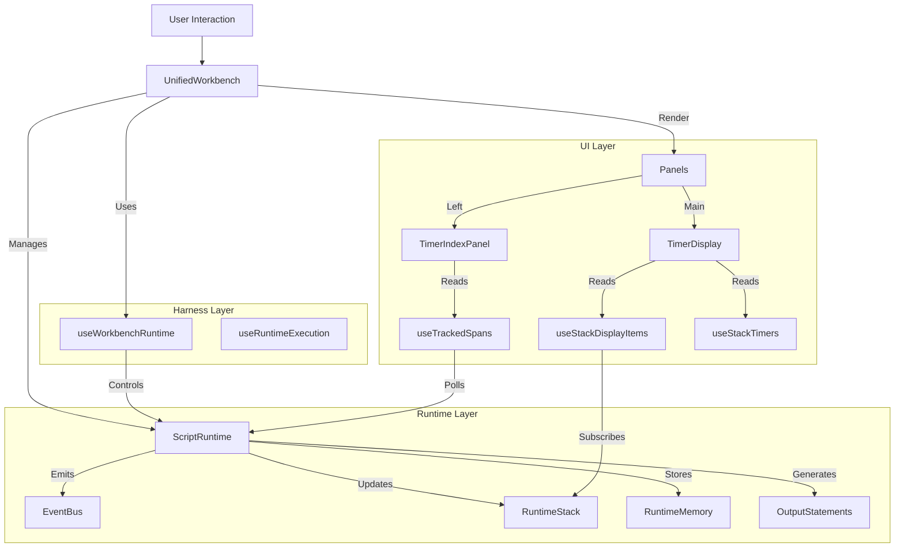
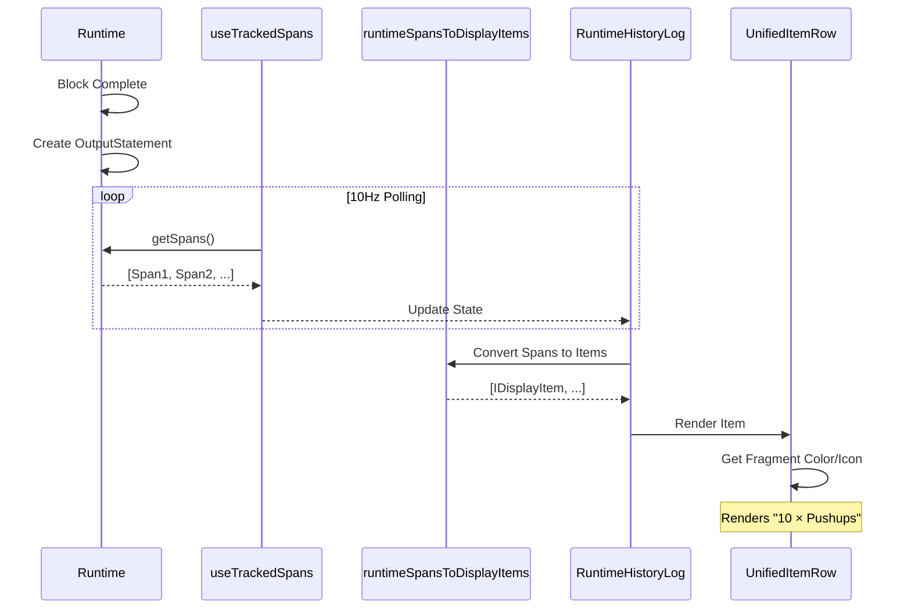
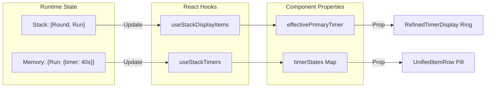
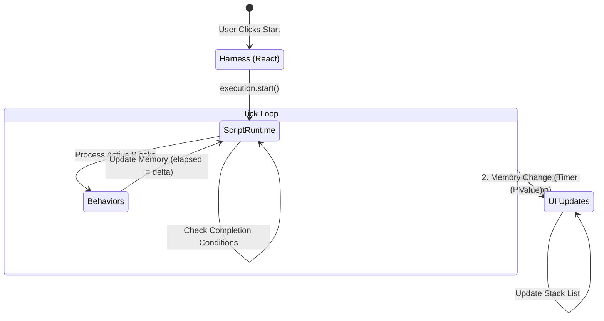

# Storybook Playground Deep Dive

This document covers the architecture of the Storybook Playground, focusing on how the Runtime, UI, and Harness interact to render `OutputStatements` and Timer blocks.

## 1. System Overview

The Playground (`UnifiedWorkbench`) is a self-contained environment that connects a specialized **Harness** (manages Runtime lifecycle) to a set of **Visualizers** (Timer, History, Stack). It uses a "Sliding Viewport" architecture to switch between **Plan** (Editor), **Track** (Execution), and **Analyze** (History) modes.

### Core Architecture

---

## 2. Rendering OutputStatements (History/Log)

The **History Panel** (`TimerIndexPanel` -> `RuntimeHistoryLog`) is responsible for displaying the linear progression of the workout. It works by transforming runtime execution data into a unified display format.

### Data Flow
1. **Generation**: When a block completes or emits data, the Runtime generates an `OutputStatement`.
2. **Buffering**: These are stored internally in the Runtime's history buffer.
3. **Retrieval**: The `useTrackedSpans` hook polls the runtime (simulating a reactive stream) to fetch the latest execution spans.
4. **Transformation**: `runtimeSpansToDisplayItems` converts raw execution spans into `IDisplayItem[]`, normalizing them for the UI.
5. **Rendering**: `UnifiedItemList` processes these items and renders them using `UnifiedItemRow`.

### Visual Rendering Mechanism
Each row uses `FragmentVisualizer` to render the content. This is a critical abstraction: **The UI does not know about "Rounds" or "Pushups", it only knows about Fragments.**

*   `OutputStatement` → `fragments` (e.g., `{ type: 'rep', value: 10 }`)
*   `FragmentVisualizer` → Maps `'rep'` to `×` icon and styling.

---

## 3. Rendering Timer Blocks

The **Timer Screen** (`TrackPanelPrimary` -> `TimerDisplay`) is more complex because it must be reactive to the live state of the runtime stack, not just collecting history.

### The Stack-Driven UI Pattern
The Timer UI is **Derived State** from the Runtime Stack. It does not maintain its own "timer state"; it simply mirrors the top of the stack.

1.  **Stack Hook**: `useStackDisplayItems` subscribes to `stack:push` and `stack:pop` events.
2.  **Memory Hook**: `useStackTimers` reads the `Memory` of active blocks to find their current duration/elapsed time.
3.  **RefinedTimerDisplay**: Accepts these processed props and renders:
    *   **Main Ring**: The "Primary" timer (usually the leaf block, or a pinned parent like "For Time").
    *   **Stack List**: The left-side list showing the hierarchy (e.g., 3 Rounds > Round 1 > Run 400m).

### Timer State Binding
Visual components bind to specific memory slots in the Runtime Blocks:

| Component | Bound To | Data Source |
|-----------|----------|-------------|
| **Main Ring** | `Primary Timer` | `block.memory.timer` (duration, elapsed) |
| **Stack List** | `Runtime Stack` | `runtime.stack.blocks` + `block.sourceId` |
| **Controls** | `Active Controls` | `block.memory.controls` (enabled/visible flags) |

### Block Rendering Workflow

---

## 4. Harness & Runtime Integration

The "Harness" in the context of the Playground is managed by `useWorkbenchRuntime`. This hook acts as the bridge between the React lifecycle and the imperative `ScriptRuntime`.

### Roles
1.  **Initialization**: Creates `RuntimeFactory` and spins up a `ScriptRuntime` instance when a block is selected.
2.  **Lifecycle Management**: Calls `dispose()` on the runtime when switching views to prevent memory leaks.
3.  **Control Proxying**: Exposes `start()`, `pause()`, `stop()` methods that map directly to `execution.start()` (which drives the runtime loop).
4.  **Event Bridging**: Listens for `WorkoutEvent`s (like global shortcuts) and pipes them into the runtime.

### State Diagram: The Tick Loop

This diagram shows how a single "Tick" propagates from the Harness through the Runtime and onto the Screen.

## 5. Summary of Key Components

*   **`UnifiedWorkbench`**: The container. Orchestrates the view modes.
*   **`useWorkbenchRuntime`**: The brain. Manages the `ScriptRuntime` instance.
*   **`TimerDisplay`**: The reactive view. Subscribes to the stack to show what is happening *now*.
*   **`RuntimeHistoryLog`**: The passive view. Polls the runtime to show what *happened*.
*   **`UnifiedItemRow`**: The atomic UI unit. Uses `FragmentVisualizer` to render code fragments (reps, weight, time) consistently across both panels.
