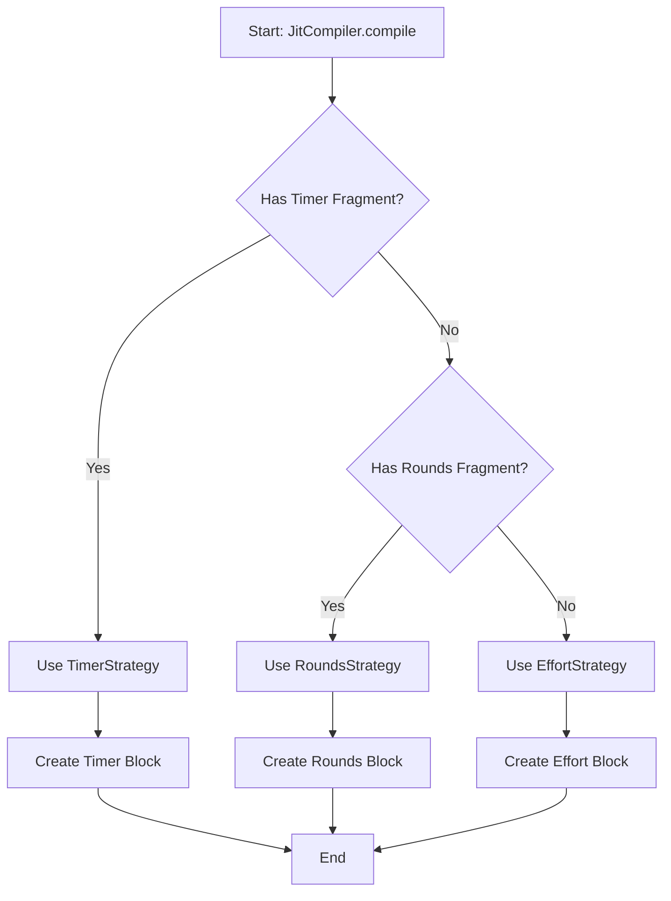
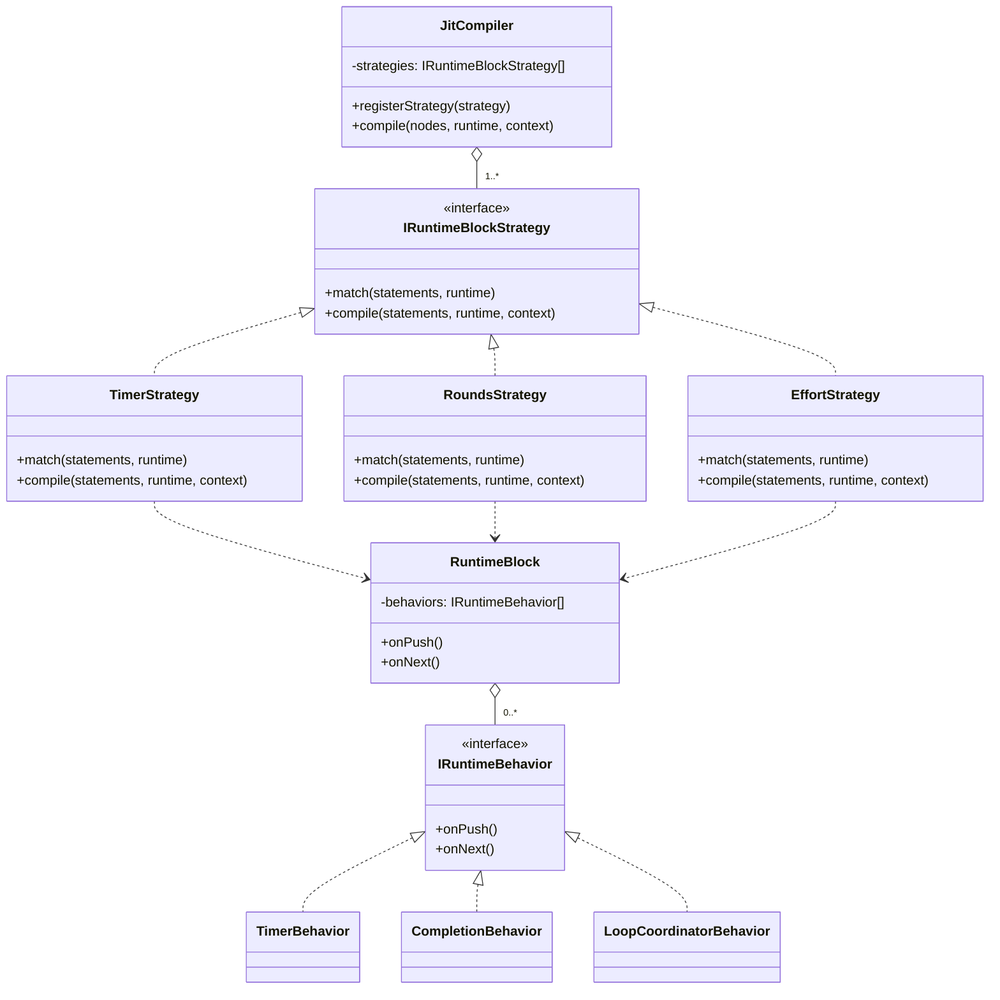

## Runtime Strategy Selection Flowchart

```mermaid
flowchart TD
    A[Start: JitCompiler.compile] --> B{Has Timer Fragment?};
    B -- Yes --> C[Use TimerStrategy];
    B -- No --> D{Has Rounds Fragment?};
    D -- Yes --> E[Use RoundsStrategy];
    D -- No --> F[Use EffortStrategy];
    C --> G[Create Timer Block];
    E --> H[Create Rounds Block];
    F --> I[Create Effort Block];
    G --> Z[End];
    H --> Z[End];
    I --> Z[End];
```

## Runtime Components Class Diagram

```mermaid
classDiagram
    class JitCompiler {
        -strategies: IRuntimeBlockStrategy[]
        +registerStrategy(strategy)
        +compile(nodes, runtime, context)
    }

    class IRuntimeBlockStrategy {
        <<interface>>
        +match(statements, runtime)
        +compile(statements, runtime, context)
    }

    class TimerStrategy {
        +match(statements, runtime)
        +compile(statements, runtime, context)
    }

    class RoundsStrategy {
        +match(statements, runtime)
        +compile(statements, runtime, context)
    }

    class EffortStrategy {
        +match(statements, runtime)
        +compile(statements, runtime, context)
    }

    class RuntimeBlock {
        -behaviors: IRuntimeBehavior[]
        +onPush()
        +onNext()
    }

    class IRuntimeBehavior {
        <<interface>>
        +onPush()
        +onNext()
    }

    class TimerBehavior
    class CompletionBehavior
    class LoopCoordinatorBehavior

    JitCompiler o-- "1..*" IRuntimeBlockStrategy
    IRuntimeBlockStrategy <|.. TimerStrategy
    IRuntimeBlockStrategy <|.. RoundsStrategy
    IRuntimeBlockStrategy <|.. EffortStrategy

    TimerStrategy ..> RuntimeBlock
    RoundsStrategy ..> RuntimeBlock
    EffortStrategy ..> RuntimeBlock

    RuntimeBlock o-- "0..*" IRuntimeBehavior
    IRuntimeBehavior <|.. TimerBehavior
    IRuntimeBehavior <|.. CompletionBehavior
    IRuntimeBehavior <|.. LoopCoordinatorBehavior
```