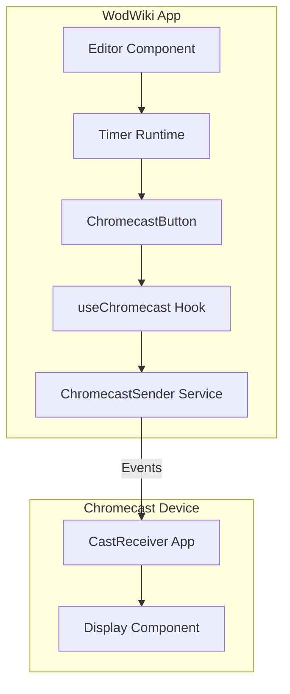
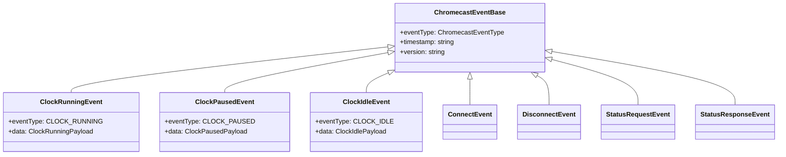
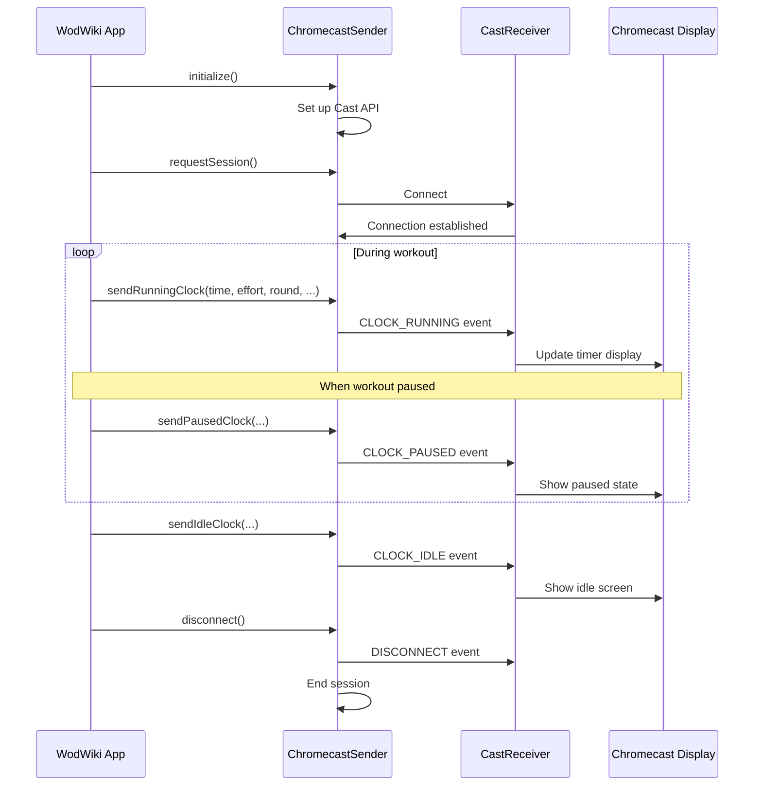

# Chromecast Integration

This document provides a comprehensive overview of the Chromecast functionality implemented in the wod-wiki platform, enabling users to cast workout timers to Chromecast-enabled displays.

## Architecture Overview

The Chromecast integration follows a sender-receiver architecture pattern:



## Core Components

### 1. ChromecastSender Service (`services/ChromecastSender.ts`)

The `ChromecastSender` service provides a clean API for sending events to a Chromecast receiver. It handles:

- Connection management to Chromecast devices
- Event dispatching to the receiver application
- Error handling and reconnection logic

Key methods:
- `initialize()`: Sets up the Cast API
- `requestSession()`: Establishes a cast session with a receiver
- `sendEvent()`: Sends a generic ChromecastEvent to the receiver
- `sendRunningClock()`, `sendPausedClock()`, `sendIdleClock()`: Helper methods for sending specific timer states

Example usage:
```typescript
const sender = new ChromecastSender();
await sender.initialize();
await sender.requestSession();
await sender.sendRunningClock(
  60, // seconds
  "Pushups", // current exercise
  1, // current round
  { repetitions: 10, roundTotal: 3 }
);
```

### 2. useChromecast Hook (`hooks/useChromecast.ts`)

A React hook that simplifies interaction with the Cast API in components. It provides:

- Connection state management (`isAvailable`, `isConnected`, `isConnecting`)
- Device information (`deviceName`)
- Error handling
- Methods for connection management and sending messages

Usage in a component:
```typescript
const {
  isAvailable,
  isConnected,
  deviceName,
  connect,
  disconnect,
  sendMessage
} = useChromecast();
```

### 3. ChromecastButton Component (`ChromecastButton.tsx`)

A UI component that:
- Displays the Chromecast icon with appropriate styling based on connection state
- Handles connection/disconnection when clicked
- Provides visual feedback about connection status

### 4. CastReceiver Component (`CastReceiver.tsx`)

The receiver application that runs on the Chromecast device. It:
- Initializes the Chromecast receiver runtime
- Listens for messages from sender applications
- Updates the timer display based on received events
- Provides visual feedback through the WodTimer component

## Event System (`types/chromecast-events.ts`)

The communication between sender and receiver is based on a well-defined event system:

### Protocol

- Namespace: `urn:x-cast:com.google.cast.wod-wiki`
- Protocol Version: `1.0.0`

### Event Types



### Event Payloads

Each event carries specific data:

1. **ClockRunningPayload**:
   - `timerValue`: Current time in seconds
   - `timerDisplay`: Formatted time string
   - `effort`: Current exercise name
   - `repetitions?`: Current rep count (if applicable)
   - `resistance?`: Weight/resistance (if applicable)
   - `distance?`: Distance (if applicable)
   - `roundCurrent`: Current round number
   - `roundTotal?`: Total rounds (may be undefined for AMRAP)
   - `isAMRAP`: Whether this is an "As Many Rounds As Possible" workout
   - `estimatedCompletionPercentage?`: 0-100 if known

2. **ClockPausedPayload**:
   - All properties from ClockRunningPayload except estimatedCompletionPercentage
   - `pauseDuration?`: How long the clock has been paused in seconds

3. **ClockIdlePayload**:
   - `currentTime`: Formatted current time (hh:mm)
   - `message?`: Optional status or welcome message

### Helper Functions

The event system provides helper functions for creating events:

- `createBaseEvent()`: Creates a base event object with common fields
- `createClockRunningEvent()`: Creates a ClockRunningEvent
- `createClockPausedEvent()`: Creates a ClockPausedEvent
- `createClockIdleEvent()`: Creates a ClockIdleEvent
- Type guards: `isClockRunningEvent()`, `isClockPausedEvent()`, `isClockIdleEvent()`

## Communication Flow



## Integration with Runtime

The Chromecast functionality integrates with the wod-wiki runtime system to:

1. Receive workout state updates (time, current exercise, round information)
2. Transmit this information to the Chromecast device in real-time
3. Keep the Chromecast display synchronized with the main application

## Browser Compatibility

The Chromecast functionality requires:
- Chrome browser or a compatible browser with the Cast extension
- Access to the Cast API (requires HTTPS in production)

## Development and Testing

For development and testing purposes:
- The `MockChromecastReceiver` component in the stories directory provides a simulated receiver
- The receiver application can be tested in the Chrome browser directly
- The sender application includes debug logging to troubleshoot connection issues
