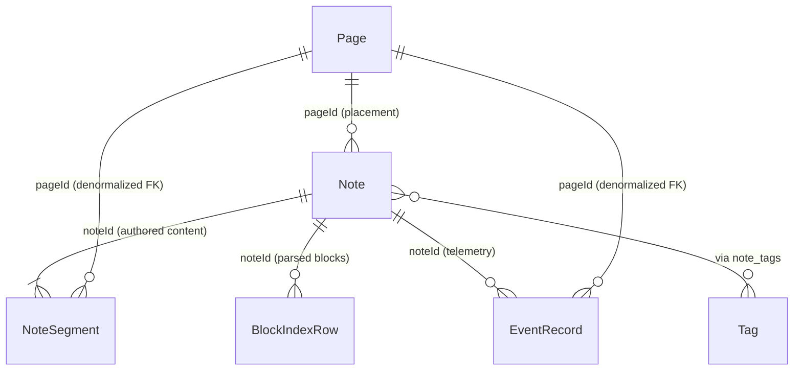

# Domain Audit & Alignment: Note, Page, and WQL Composition

> [!info] Document Purpose
> This document audits the data attributes, ownership boundaries, and query interactions of [[Note]] and [[Page]], specifically how WQL (`find:`, `rows:`, `agg:`) resolves and composes them.
> It highlights existing conflations, documents current runtime behavior, and provides tagged decision sections for alignment.

---

## 1. Executive Summary & Core Conflict

There is a fundamental semantic collision in the codebase between two definitions of "Page":

1. **Storage Entity ([[Page]] / `page` table)**:
   - A lightweight **placement and routing anchor** (`id`, `date?`, `slug?`, `title?`).
   - Has **no body, no markdown, no segments, and no tags**.
   - Multiple workout [[Note]]s point to one calendar Page via `Note.pageId` (e.g. stacking multiple notes on a single journal date `/journal/2026-09-26`).

2. **WQL Target & Document Role (`find:page` / `Note.type === 'page'`)**:
   - A document-style note (guides, syntax canvases, dashboards, landing content).
   - **This is stored in the `notes` table, not the `page` table.**
   - In fact, WQL's `find:page` executor completely bypasses the `page` table and queries the `notes` table filtering for document types and `sourceId` prefixes.

---

## 2. Storage & Data Ownership Audit



### 2.1 Note (`notes` table)
* **Storage Owner**: Canonical unit of authored content and exercise logic.
* **Fields Owned**:
  | Field | Type | Storage Role / Meaning |
  | :--- | :--- | :--- |
  | `id` | `string` (UUID) | Canonical entity ID. Primary key across all authoring and telemetry links. |
  | `title` | `string` | Display name of the note or workout. |
  | `slug?` | `string` | Human-readable route sugar (resolves `slug -> UUID`; not a join key). |
  | `pageId?` | `string` (FK) | Reference to owning [[Page]] placement (e.g., date page). Singular placement. |
  | `type?` | `NoteKind` | Content taxonomy descriptor: `'note' \| 'template' \| 'playground' \| 'journal' \| 'collection' \| 'syntax' \| 'dashboard' \| 'behavior' \| 'analytics' \| 'home' \| 'page'`. |
  | `sourceId?` | `string` | Origin provenance. Contains parent note UUID, or URI prefixes like `page:...`, `guides:...`, `collection:...`, `feed:...`, `playground`. |
  | `catalog?` | `string` | Seed directory identifier for bundled content. |
  | `createdAt` | `number` | Unix timestamp (ms). Used by WQL time windows. |
  | `seedOrigin?` | `'seed' \| 'user'` | Ownership marker for seed synchronization. |
* **Content Relation**:
  - Raw markdown does **not** live on `Note`. It lives in 1:N versioned rows in [[NoteSegment]] (`segments` table).
  - Derived blocks live in [[BlockIndexRow]] (`block_index` table).

### 2.2 Page (`page` table)
* **Storage Owner**: Placement, calendar dates, and named collection anchors.
* **Fields Owned**:
  | Field | Type | Storage Role / Meaning |
  | :--- | :--- | :--- |
  | `id` | `string` (UUID) | Primary key. |
  | `date?` | `string` (`YYYY-MM-DD`) | Unique index `by-date`. Identifies calendar/journal day. |
  | `slug?` | `string` | Unique index `by-slug`. Identifies named custom routes (`/c/:slug`, `/p/:slug`). |
  | `title?` | `string` | Optional display label for the page container. |
  | `createdAt` | `number` | Unix timestamp (ms). |
* **What Page Does NOT Own**:
  - **No markdown or segments**: A page has no body text of its own.
  - **No tags**: Tagging occurs exclusively via `note_tags` on `Note.id`.
  - **No telemetry**: Sessions and results reference `Note.id` directly.

### 2.3 Denormalized `pageId` Fan-Out
`pageId` is duplicated from `Note` onto subordinate tables to allow indexed range queries without joining `notes`:
- `segments.pageId`
- `sessions.pageId`
- `results.pageId`
- `attachments.pageId`
- `events.pageId`

---

## 3. How WQL Queries Compose Note and Page

WQL provides three query families:
1. `find:<target>{filters} [last <window>]` (Content Discovery)
2. `rows:<plane>{filters}` (Execution Statement Records)
3. `<agg>:<metric>{filters} [by {dim}] [where find:...]` (Analytics & Joins)

### 3.1 Content Discovery (`find:`)
In `packages/wql/src/QueryService.ts` (`runFind`):

```ts
// How QueryService currently discriminates page vs note:
const isPageTarget = parsed.target === 'page';
const hasTypeFilter = parsed.filters.some(f => f.key === 'type' || f.key === 'page');
const hasPageSource = parsed.filters.some(f => f.key === 'source' && f.values.some(v => v.value === 'page' || v.value === 'pages'));
const isPage = (n: Note) =>
  n.type !== 'note' && (
    n.sourceId?.startsWith('page:') ||
    n.sourceId?.startsWith('guides:') ||
    ['collection', 'syntax', 'behavior', 'analytics', 'dashboard', 'home', 'page'].includes(n.type ?? '')
  );

if (isPageTarget || hasPageSource) {
  notes = notes.filter(isPage);
} else if (parsed.target === 'note' && !hasTypeFilter) {
  notes = notes.filter(n => !isPage(n));
}
```

* **`find:note`**:
  - Loads all records from `noteStore` + `staticNoteStore`.
  - Filters out records matching `isPage(n)`.
  - Result: Only returns workout/executable notes (unless `type:` is explicitly specified).
* **`find:page`**:
  - **Does not query the `page` table.**
  - Queries the `notes` table and filters for `isPage(n) === true`.
  - Result: Returns guide/canvas/dashboard/collection `Note` records.
* **`find:block`**:
  - Queries `block_index`. Each block points to both `noteId` and `pageId`.

### 3.2 Filter Scopes on Content Queries
* **`source:<scope>`**:
  - `source:journal`: Notes where `!sourceId || sourceId === 'journal'` (excluding playground IDs).
  - `source:collections`: Notes where `sourceId.startsWith('collection:') || sourceId.startsWith('page:collection:')`.
  - `source:page` / `source:pages`: Notes where `sourceId === 'page' || sourceId.startsWith('page:') || sourceId.startsWith('guides:')`.
  - `source:playground`: Notes where `sourceId === 'playground' || type === 'playground'`.
* **`type:<kind>`**: Matches `Note.type` (e.g. `type:wod`, `type:collection`).
* **`tags:<label>`**: Intersects `noteId` via `note_tags` / `Tag` index.
* **`catalog:<id>`**: Matches static content directory slug (e.g. `crossfit-girls`).
* **Time Windows (`last 2w`, `from ... to ...`)**:
  - Evaluated against `Note.createdAt`.
  - **Gap**: Calendar journal pages store their canonical date in `Page.date` (`YYYY-MM-DD`), but WQL time-window queries evaluate against `Note.createdAt` (Unix ms). Seeded workouts or backdated entries can lead to date mismatches.

### 3.3 Statement Rows & Cross-Store Joins
* **`rows:all{note:<noteId>}` / `rows:segment{block:<blockId>}`**:
  - Scans `events` (`EventRecord`) filtering directly by `noteId` or `blockContentId`.
  - Note: `rows:` supports filtering by `note` and `block`, but has no direct `page:<pageId>` scope key in `WQL_ROWS_SCOPE_KEYS`.
* **`agg:metric{} where find:note{...}`**:
  1. Executes `runFind` for the `find:note` predicate.
  2. Extracts the resulting list of matching `noteId` values.
  3. Filters `EventRecord` telemetry where `event.noteId IN (matchingNotes)`.
  4. Computes aggregation over the filtered event stream.

---

## 4. Alignment & Decision Matrix

Use these sections to mark decisions and track consensus.

### Decision 1: What does `find:page` mean?
- [ ] **Option A (Current Implementation)**: `find:page` is a semantic sugar for document-style `Note`s (guides, syntax, canvases, dashboards).
  - *Tradeoff*: Confusing naming because `Page` is also an IndexedDB table.
- [ ] **Option B (Separate Entity Target)**: `find:page` queries the `page` table to discover date/custom page containers; document notes use `find:note{type:page}` or `find:note{source:guides}`.
  - *Tradeoff*: Breaks existing WQL scripts expecting `find:page` to return canvas documents.
- [ ] **Option C (Deprecate `find:page` target)**: Keep `find:note` as the sole content target with `source:` / `type:` discriminators (`find:note{source:page}`).
  - *Tradeoff*: Cleaner target vocabulary (`note`, `block`, `effort`), retires pseudo-target.

### Decision 2: Page Placement vs. Query Composition
- [ ] **Contract Rule**: `Note.pageId` is strictly **physical placement** (which calendar date or notebook owns this note).
- [ ] **Contract Rule**: A note appearing in a collection, tag list, or stream view is **composition via query**, and must NEVER modify or overwrite `Note.pageId`.
- [ ] **Contract Rule**: Multi-note pages (like `JournalDatePage`) compose independent `Note` records; they do not merge them into a single synthetic note.

### Decision 3: Time-Window Evaluation Alignment
- [ ] **Current**: Evaluates `window` against `Note.createdAt`.
- [ ] **Proposed Alignment**: For notes with a calendar `pageId`, evaluate date windows against the parent `Page.date` (or normalize `Note.createdAt` to noon UTC of the journal date upon save).
  - *Why*: Prevents imported or backdated workouts from falling into the wrong calendar query bucket.

### Decision 4: Dual-ID Navigation Seam (`noteId` vs `pageId`)
- [ ] List views and query cards must expose both:
  - `noteId`: Links to the universal editor (`/notes/:noteId`).
  - `pageId`: Links to the containing view/page context (`/journal/:date` or `/p/:slug`).

---

## 5. Related Files & Seams

* Store schemas: `apps/playground/src/types/storage.ts`
* IndexedDB initialization: `apps/playground/src/services/storage/IndexedDBStorage.ts`
* WQL engine & query execution: `packages/wql/src/QueryService.ts`
* WQL vocabulary & targets: `packages/wql/src/vocabulary.ts`
* Domain model specifications:
  - `docs/domain-model/Note.md`
  - `docs/domain-model/Page.md`
  - `docs/domain-model/collection.md`
  - `docs/domain-model/NoteSegment.md`
