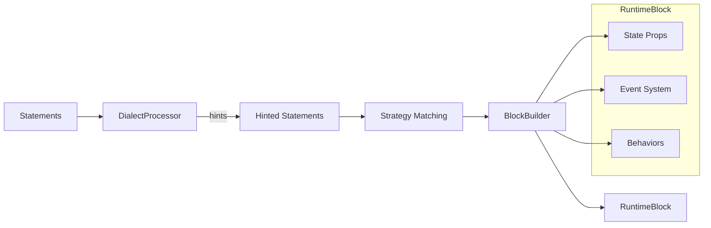

# Compiler Layer

> **Input:** `ICodeStatement[]`  
> **Output:** `IRuntimeBlock` with behaviors, state properties, and event system

## Responsibility

Transform parsed statements into executable runtime blocks with appropriate behaviors and typed state.

## Key Interfaces

- **Input:** `CodeStatement[]` (parsed statements with hints)
- **Output:** `IRuntimeBlock` with:
  - `behaviors: IRuntimeBehavior[]`
  - `timerState?`, `roundState?` (typed state)
  - `on()`, `emit()` (event system)
  - `fragments: ICodeFragment[][]`
  - `blockType: string`

## Compilation Flow



## Strategy Types

| Strategy | Block Type | State Added | Behaviors Added |
|----------|------------|-------------|-----------------|
| `GenericTimerStrategy` | Timer | `timerState` | `BoundTimerBehavior` |
| `GenericLoopStrategy` | Rounds | `roundState` | `BoundLoopBehavior` |
| `AmrapLogicStrategy` | AMRAP | `timerState`, `roundState` | Both |
| `EffortStrategy` | Effort | `timerState` (up) | `SinglePassBehavior` |

## Test Contract

```typescript
// Compiler MUST produce:
// 1. Correct blockType for statement patterns
// 2. Expected state properties initialized
// 3. Event system (on/emit) ready
// 4. Fragments preserved from source

const block = compiler.compile(statements, runtime);
expect(block?.blockType).toBe('Timer');
expect(block?.timerState).toBeDefined();
expect(typeof block?.on).toBe('function');
```

## Related Files

- [[01-parser-layer|Parser Layer]] (input)
- [[03-runtime-layer|Runtime Layer]] (output consumer)
- [[../contracts/IRuntimeBlock|IRuntimeBlock]]
