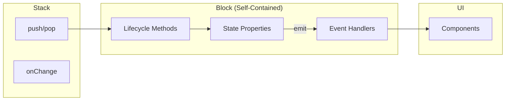
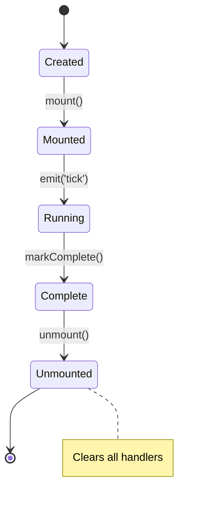

# Runtime Layer

> **Input:** `IRuntimeBlock` with behaviors  
> **Output:** State changes via block properties, events via `emit()`

## Responsibility

Execute block lifecycle and manage state through block-owned properties.

## Simplified Architecture (Option D)



## Block State Properties

| Property | Type | Purpose |
|----------|------|---------|
| `timerState` | `{ elapsed, running, duration }` | Timer tracking |
| `roundState` | `{ current, total }` | Loop progress |
| `fragments` | `ICodeFragment[][]` | Exercise data |

## Events

| Event | Trigger | Handler Use |
|-------|---------|-------------|
| `tick` | Clock interval | Update elapsed time |
| `complete` | Block done | Trigger stack pop |
| `stateChange` | Any mutation | Re-render UI |

## Lifecycle



## Test Contract

```typescript
// Runtime test - create block directly
const block = new TimerBlock(60000);

block.on('tick', () => {
  if (block.timerState.elapsed >= block.timerState.duration) {
    block.markComplete();
  }
});

block.mount();
block.timerState.elapsed = 60000;
block.emit('tick');

expect(block.isComplete()).toBe(true);
```

## Related Files

- [[02-compiler-layer|Compiler Layer]] (input)
- [[05-ui-layer|UI Layer]] (consumer via events)
- [[../contracts/IRuntimeBlock|IRuntimeBlock]]
