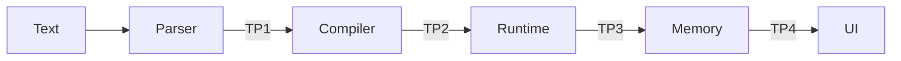

# Domain Model Testing

> Test boundaries aligned with the 4 key contracts in the domain model architecture.

## Test Point Overview



## Test Points

| # | Layer | Contract | Documentation | Audit Status |
|---|-------|----------|---------------|--------------|
| 1 | Parser | Text → `ICodeStatement[]` | [parser-tests.md](parser-tests.md) | [Audit Report](audit-report.md#test-point-1-parser-contract-text--icodestatement) |
| 2 | Compiler | Statement[] → `IRuntimeBlock` | [compiler-tests.md](compiler-tests.md) | [Audit Report](audit-report.md#test-point-2-compiler-contract-statement--iruntimeblock) |
| 3 | Memory | Block Lifecycle → State | [memory-tests.md](memory-tests.md) | [Audit Report](audit-report.md#test-point-3-runtime-contract-block-lifecycle--state) |
| 4 | UI | Block Events → Display | [ui-tests.md](ui-tests.md) | [Audit Report](audit-report.md#test-point-4-ui-contract-memory--display) |


## Quick Start

```bash
# Run all unit tests
bun run test

# Run parser tests only
bun test src/parser/__tests__ --preload ./tests/unit-setup.ts

# Run runtime tests only
bun test src/runtime/__tests__ --preload ./tests/unit-setup.ts

# Run component tests
bun run test:components

# Run all tests including E2E
bun run test:all
```

## Coverage Gaps

See individual test point documentation for specific missing coverage items.
