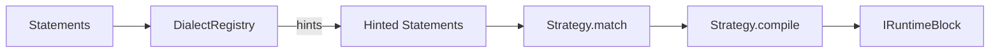

# Compiler Layer Tests (Test Point 2)

> **Contract:** `ICodeStatement[] → IRuntimeBlock`

## What This Tests

The compiler layer transforms parsed statements into executable runtime blocks with behaviors, typed state, and event systems.

## Test Boundaries

| Input | Output | Assert |
|-------|--------|--------|
| `ICodeStatement[]` | `IRuntimeBlock` | blockType, behaviors |
| Timer statements | `timerState` property | duration, direction, elapsed |
| Rounds statements | `roundState` property | current, total |
| Dialect hints | Strategy matching | Correct strategy selected |

## Existing Tests

| Test File | Coverage |
|-----------|----------|
| [JitCompiler.test.ts](file:///x:/wod-wiki/src/runtime/__tests__/JitCompiler.test.ts) | Dialect registry, strategy matching, hint propagation |
| [JitComposition.test.ts](file:///x:/wod-wiki/src/runtime/compiler/__tests__/JitComposition.test.ts) | Strategy composition |
| [WorkoutRootStrategy.test.ts](file:///x:/wod-wiki/src/runtime/compiler/strategies/__tests__/WorkoutRootStrategy.test.ts) | Root block strategy |

## Compilation Flow



## Test Pattern

```typescript
import { JitCompiler } from '../compiler/JitCompiler';
import { DialectRegistry } from '../../services/DialectRegistry';

describe('Compiler Contract', () => {
  const mockRuntime = { /* ... */ } as IScriptRuntime;
  
  it('produces correct block type', () => {
    const compiler = new JitCompiler([timerStrategy], new DialectRegistry());
    const block = compiler.compile([timerStatement], mockRuntime);
    
    expect(block?.blockType).toBe('Timer');
    expect(block?.timerState).toBeDefined();
  });
});
```

## Missing Coverage

- [ ] Block state initialization assertions
- [ ] Event system (`on()`/`emit()`) readiness tests
- [ ] Fragment preservation from source
- [ ] Behavior composition tests for each strategy

## Run Tests

```bash
bun test src/runtime/__tests__/JitCompiler.test.ts --preload ./tests/unit-setup.ts
bun test src/runtime/compiler/__tests__ --preload ./tests/unit-setup.ts
```
