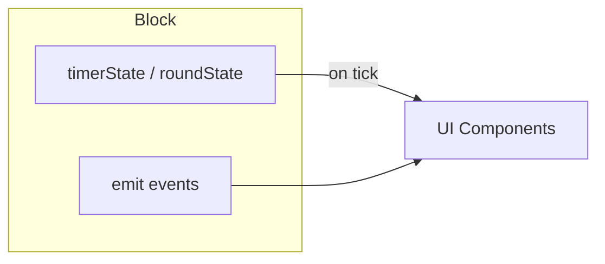

# Memory Layer Tests (Test Point 3)

> **Contract:** `Block Lifecycle → Memory State`

## What This Tests

Memory layer tests validate that block lifecycle events correctly update memory state. With Option D architecture, this focuses on block-owned state rather than external memory.

## Test Boundaries

| Input | Output | Assert |
|-------|--------|--------|
| `block.mount()` | State initialized | timerState/roundState ready |
| `block.emit('tick')` | State updated | elapsed incremented |
| `block.unmount()` | Handlers cleared | No memory leaks |
| Cross-block state | Memory allocation | Shared data accessible |

## Existing Tests

| Test File | Coverage |
|-----------|----------|
| [RuntimeStackLifecycle.test.ts](file:///x:/wod-wiki/src/runtime/__tests__/RuntimeStackLifecycle.test.ts) | Push/pop lifecycle, hook ordering |
| [RootLifecycle.test.ts](file:///x:/wod-wiki/src/runtime/__tests__/RootLifecycle.test.ts) | Root block lifecycle |
| [LifecycleTimestamps.test.ts](file:///x:/wod-wiki/src/runtime/__tests__/LifecycleTimestamps.test.ts) | Timestamp tracking |
| Behavior tests | Individual behavior lifecycle |

## Option D Architecture



> [!NOTE]
> `IRuntimeMemory` is **deprecated** for UI binding. Blocks own their state directly.

## Test Pattern

```typescript
describe('Block State Lifecycle', () => {
  it('clears handlers on unmount', () => {
    const block = new TimerBlock(60000);
    const handler = vi.fn();
    
    block.on('tick', handler);
    block.emit('tick');
    expect(handler).toHaveBeenCalledTimes(1);
    
    block.unmount();
    block.emit('tick');
    expect(handler).toHaveBeenCalledTimes(1); // Not called after unmount
  });
});
```

## Missing Coverage

- [ ] Handler cleanup verification
- [ ] Cross-block shared state tests
- [ ] Memory allocation/deallocation for retained uses
- [ ] State property updates through emit cycle

## Run Tests

```bash
bun test src/runtime/__tests__/RuntimeStackLifecycle.test.ts --preload ./tests/unit-setup.ts
bun test src/runtime/__tests__/RootLifecycle.test.ts --preload ./tests/unit-setup.ts
```
