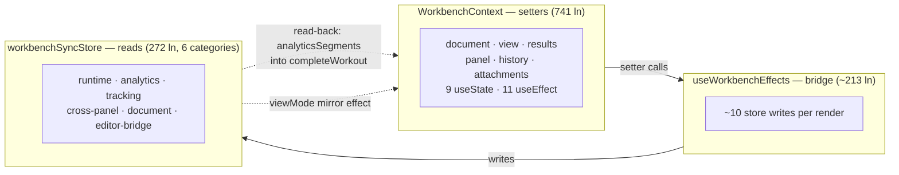
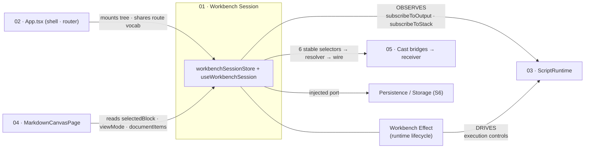
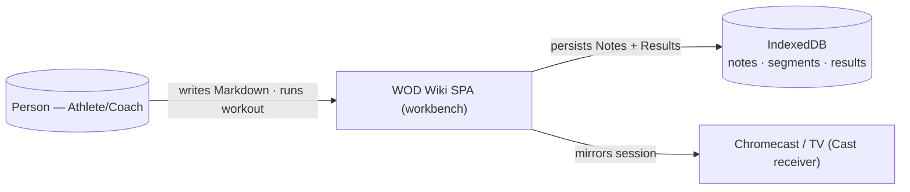
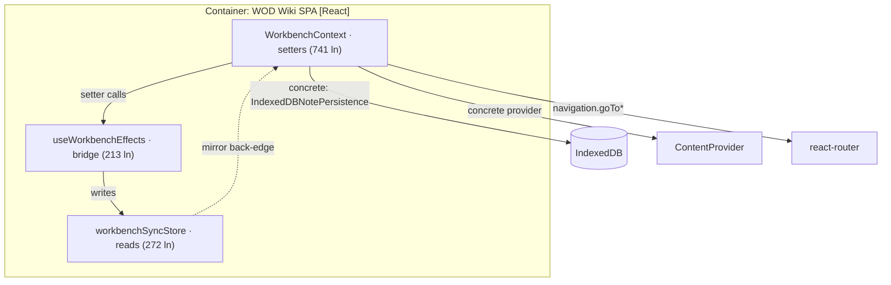
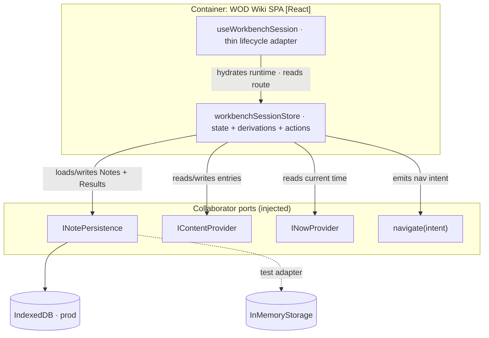
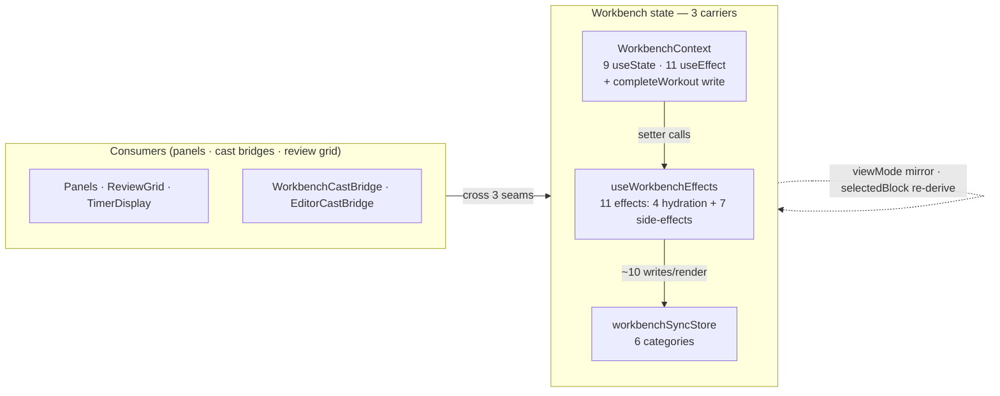
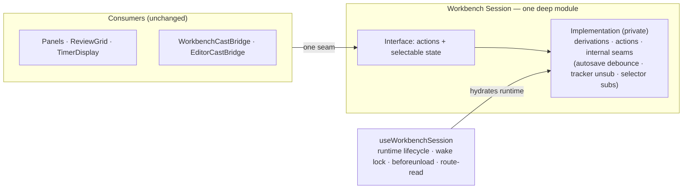

# Finding 01 — The workbench state layer: three carriers, no locality

> **Severity:** Critical. **Subsystem:** React state / contexts.
> **Status vs prior work:** Carries forward GML #1 / minimax #03. Sub-story
> **S1a** (single-source `selectedBlock` + `viewMode`) shipped. The bucket
> migration, effects rehoming, and carrier retirement (**S1b / S1c**) remain
> the largest open thread in the codebase. This finding re-verifies the
> current shape (the code has moved through three refactor sessions since the
> original survey) and confirms the deepening target is unchanged.

## Vocabulary

Architecture terms are the skill's `LANGUAGE.md`: **module**, **interface**,
**implementation**, **depth** (deep = high leverage; shallow = interface nearly
as complex as the implementation), **seam**, **adapter**, **leverage**,
**locality**. Domain terms (Statement, Metric, Origin…) live in
[`CONTEXT.md`](../../CONTEXT.md). We name one new domain concept below —
**Workbench State** — proposed for `CONTEXT.md` should this finding be adopted.

## Modules involved

| Module | Size today | Role |
| --- | --- | --- |
| `src/contexts/WorkbenchContext.tsx` | **741 ln** | God module. `useState` ×9, `useEffect` ×11, `useMemo` ×4, `useCallback` ×9, `useRef` ×2. Owns document / view / results / panel / history / attachment **setters** plus the `completeWorkout` write path. |
| `src/stores/workbenchSyncStore.ts` | **272 ln** | Zustand store. Its own header enumerates **six** state categories (runtime & execution, active tracking, analytics, cross-panel, document, editor bridge). Owns the runtime / analytics / tracking **reads**. |
| `src/components/layout/useWorkbenchEffects.ts` | ~213 ln | Bridge: ~10 store writes per render. The seam — duct tape — between the other two. |

First-party consumers of the Context: `useWorkbenchEffects`, `Workbench.tsx`.
Store readers: 11+ (cast bridges, panels, review grid, timer display).

## Problem — the seam is in the wrong place

Workbench state is split across three modules **by category**: the Context owns
the *setters*, the Store owns the *reads*, and the Effects hook is the *bridge*
between them. The setter/read line is itself unstable, which is the emblem of
the missing locality:

- **`viewMode` still crosses the seam.** `WorkbenchContext.tsx:503-505` keeps a
  one-line effect that mirrors the route-derived `viewMode` into the store:
  `useEffect(() => { useWorkbenchSyncStore.getState().setViewMode(viewMode); }, [viewMode])`.
  S1a intended to single-source it; the mirror effect survived. So `viewMode`
  is *route-derived in the Context* **and** *canonical in the Store*.
- **`completeWorkout` reads state smeared across modules.** Its body
  (`WorkbenchContext.tsx:517-588`) reads `contentRef.current`, `selectedBlockId`,
  `provider`, `notePersistence`, `routeId`, `currentEntry`, `navigation`
  (all Context) **and** `useWorkbenchSyncStore.getState().analyticsSegments`
  (the Store) **and** `localStorage` (active-notebook). One operation, three
  modules plus a ref plus a global.
- The Store's own header (`workbenchSyncStore.ts:1-24`) still claims it
  *"Replaces the React Context-based pattern"* — yet the Context it was meant
  to replace is now 741 lines and grew since the last survey.

Each carrier is **shallow** relative to the others: none alone can answer the
question *"what is the current workbench state, and what can I do to it?"* To
answer it you must hold all three in mind at once.

### Diagram — three carriers, no locality

The dotted back-edges are the unstable setter/read line: state that *should*
live in one place crossing the seam in both directions.

## Deletion test

Apply the test to each carrier (and to the **boundary between them**, which is
where the real friction lives):

- **Delete `WorkbenchContext`** → its 11 effects' side-effects (persistence
  calls, attachment processing, history loading, the `completeWorkout` write
  path) reappear spread across whatever consumes it. **Complexity spreads —
  load-bearing.**
- **Delete `workbenchSyncStore`** → the selector-based read rail the cast
  bridges, panels, and review grid depend on vanishes. **Load-bearing.**
- **Delete `useWorkbenchEffects`** → the Context↔Store mirroring stops; state
  desynchronises. **Load-bearing.**

All three are load-bearing *individually*. The friction is not that any one
file is dead — it is that they are **three modules where one coherent state
module would do**, and the seam between them is the wrong cut.

## Solution (plain English — no interface proposed yet)

Make workbench state **one coherent module** so the question *"what is the
current workbench state, and what can I do to it?"* has one home. The
Context-vs-Store-by-category split was originally an optimisation
(selector subscriptions for render performance) — that optimisation should be
an **internal** concern of one state module, not a structural fact that every
consumer and maintainer must cross.

Direction (the grilling loop will pin the concrete shape):

1. Make the Store canonical for **all** workbench state (document, view,
   results, panel, history, attachments, runtime, analytics, cross-panel) with
   setters + reads co-located.
2. Shrink `WorkbenchContext` to a thin React adapter (or remove it if hooks
   suffice). The selector-subscription optimisation stays — as an internal
   detail of the Store.
3. Dissolve `useWorkbenchEffects`: its bridging becomes direct store actions at
   the few mutation sites. **Move** the 11 effects' side-effects (persistence,
   attachments) to their owning modules — do not drop them.
4. `completeWorkout` reads from one module; the `viewMode` mirror effect
   disappears.

This is the same pattern the cast refactor already proved (it pulled
`castTransport` out of the god store into `CastTransportContext`), applied to
the remaining domains.

> If adopted, add **Workbench State** to `CONTEXT.md`: *"the coherent state of
> the workbench (document, view, results, panel, history, attachments, runtime,
> analytics, cross-panel) and the actions on it. One home, exercised without
> rendering React."*

## Benefits

- **Locality.** A bug in workbench state today forces you to hold Context +
  Store + Effects in mind. `completeWorkout`'s cross-module read is the emblem.
  After deepening, that read is local — fix once, fixed everywhere.
- **Leverage.** Consumers learn one state surface instead of three. The
  selector-subscription render optimisation keeps working as an internal
  detail, not a structural fact every maintainer holds.
- **Tests.** The workbench has **no direct, non-React test** today precisely
  because its behaviour is smeared across Context setters, Store actions, and
  an Effects bridge that only fires inside React. One state module is
  exercisable by driving its actions and asserting observable state — the
  **interface becomes the test surface**.

## Evidence

- `WorkbenchContext.tsx:517-588` — `completeWorkout` reads Context fields + the
  Store + `localStorage`.
- `WorkbenchContext.tsx:503-505` — the surviving `viewMode` Context→Store
  mirror effect.
- `workbenchSyncStore.ts:1-24` — header enumerates six state categories and
  claims to "replace" the Context that still exists at 741 ln.
- `useWorkbenchEffects.ts` — ~10 store writes per render bridging the two.
- No `workbenchState.test.ts` exists (confirmed by search).

## Risks

- The 11 effects do real persistence/attachment work — **move** side-effects,
  don't drop them.
- `WorkbenchContext.tsx` is the single biggest churn hotspot in the library
  tree (`CLAUDE.md`). Migrate bucket-by-bucket, build green between each
  (S1a proved the pattern).
- Cast bridges read ~7 store fields — keep that field set stable during
  migration (the cast track already settled those fields).

## Related / ADR conflicts

- **GML #4 / Cast track** — the store's cast-adjacent fields existed solely to
  feed the cast bridges; the same "state split to cross a React boundary"
  pattern, already cured on the cast side.
- **GML #3 / ScriptRuntime** — the runtime lifecycle was *partially* extracted
  out of `WorkbenchContext` into `RuntimeLifecycleProvider`; that
  decomposition stalled halfway and is part of why the Context is still large.
- No recorded ADR contradicts this. If it is rejected with a load-bearing
  reason, record an ADR so future surveys don't re-suggest it.

---

## Cross-finding contracts

Worked out in the grilling loop (2026-06-20) so the depending code is
accounted for. Finding 01 is the hub; the contracts below pin every boundary
it shares with the other findings.

| Boundary | Contract | Coordination |
| --- | --- | --- |
| **01 → 03 (runtime)** | Session **observes** via `subscribeToOutput` + `subscribeToStack` (the post-mount seam); a Workbench Effect **drives** via execution controls. | Shared observer seam. **01 lands first** (seams exist today); 03's later observer-collaborator extraction does a mechanical call-site move. The session + Cast proxy = two subscribers, which *justifies* 03's extraction. See [ADR-0002](../adr/0002-workbench-session-observes-runtime-via-observer-seams.md). |
| **01 → 05 (cast)** | `WorkbenchCastBridge` reads 6 selectors (`runtime`, `execution.status`, `viewMode`, `selectedBlock`, `documentItems`, `analyticsSegments`) → `workbenchModeResolver` → wire. | Keep the 6 selectors readable. The receiver consumes the *resolved message*, so it is insulated from 01's internal reshaping. |
| **01 → 04 (canvas)** | `MarkdownCanvasPage` reads `selectedBlock` / `viewMode` / `documentItems`. | Independent — shares selectors, not logic. |
| **02 → 01 (routing)** | Both touch `react-router`. | One `NavigationIntent` vocabulary (the shape `useReactRouterNavigation` already has), consumed by 01's `navigate(intent)` port and 02's route classifier. |

**Net:** 01 is coupled only to 03 (at a now-named, healthy seam). 04 and 05 are
insulated; 02 shares one navigation vocabulary. No finding blocks 01, and 01
blocks none. The consolidate-over-decompose and reactive-observer decisions are
recorded in [ADR-0001](../adr/0001-workbench-session-single-store.md) and
[ADR-0002](../adr/0002-workbench-session-observes-runtime-via-observer-seams.md).

---

## C4 diagrams

The deepening across the three C4 levels (before → after).

### Level 1 — System Context (unchanged, by design)

The change is invisible at L1 — no user, external system, or contract changes.
That is the point: the deepening is internal.

### Level 2 — Container (the seams become explicit)

Before, the workbench reaches directly into concrete collaborators with the
couplings implicit. After, it talks to named ports — and a real test adapter
appears (two adapters = a real seam).

**Before:**

**After:**

### Level 3 — Component (the actual deepening)

Three shallow carriers → one deep module whose interface is *"the session
state and the actions on it"*, with the render-optimisation and autosave
demoted to private internal seams.

**Before — three shallow carriers, no locality:**

**After — one deep module, interface = test surface:**

### Delta summary

| C4 level | What changes | What stays |
| --- | --- | --- |
| **L1 Context** | Nothing | User, IndexedDB, Cast — identical |
| **L2 Container** | Concrete couplings → **injected ports**; a real **test adapter** appears | The container's external dependencies |
| **L3 Component** | **3 shallow carriers → 1 deep module** + 1 thin adapter; 22 effects → ~8 derivations + ~6 actions + ~4 lifecycle; the `viewMode`/`selectedBlock` mirror deleted; `completeWorkout` reads one place | Consumers unchanged; selector-subscription render optimisation preserved (now internal) |
