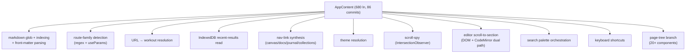

# Finding 02 — `playground/src/App.tsx` is a god component

> **Severity:** High. **Subsystem:** playground application shell.
> **Status vs prior work:** **New.** Prior reviews focused on the library
> (`src/**`) and named `MarkdownCanvasPage` as the playground hotspot. They did
> not treat `App.tsx` itself as a deepening target, even though it is the
> single highest-churn file in the entire repository.

## Vocabulary

Architecture terms per `LANGUAGE.md`: **module**, **interface**,
**implementation**, **depth**, **seam**, **adapter**, **leverage**,
**locality**. A **god module** is one whose interface and implementation both
span many unrelated responsibilities — shallow *and* wide, so neither callers
nor maintainers get leverage or locality.

## Module involved

| Module | Size today | Role |
| --- | --- | --- |
| `playground/src/App.tsx` | **680 ln** | The playground application shell. `AppContent` (from line 106) owns routing, data loading, navigation synthesis, theme, scroll-spy, search palette wiring, keyboard shortcuts, and the page-tree branch. |

Churn: **99.9th %ile, 86 commits** — the biggest hotspot in the repository per
`CLAUDE.md` / Repowise. Higher churn than any file the prior reviews touched.

## Problem — many unrelated responsibilities behind one component

`AppContent` is a single React component that owns at least a dozen distinct
responsibilities. Reading the top of the file makes the breadth visible:

- **Markdown bundle loading + indexing** — `import.meta.glob` (line 95) and the
  `workoutItems` `useMemo` (125-157) parse every markdown file into a typed
  index, including front-matter (`search: hidden`) classification.
- **Route-family detection** — `isPlaygroundRoute`, `isJournalEntryRoute`, and
  the hand-rolled `feedItemMatch` / `feedDetailMatch` regexes (114-123) classify
  the URL because `useParams` only captures generic `{category, name, id}`.
- **URL → workout resolution**, **IndexedDB recent-results read**, **workout
  selection navigation**, **page nav-link synthesis** (canvas / docs / journal
  / collections), **theme resolution** (system vs explicit), **scroll-spy**
  (`IntersectionObserver` for active L3), **editor scroll-to-section** with a
  DOM + CodeMirror dual path, **search-palette orchestration** (open + journal
  entry creation flow), **keyboard shortcuts**, **NavContext sync**, and the
  **giant page-tree ternary** that branches across 20+ page components.

The import block alone (lines 1-69) reaches into layout, navbar, nav, palette,
theme, audio, react-router, ~20 page components, cast, and IndexedDB. A change
to *any* of these concerns is a change to `App.tsx` — which is why it churns at
the 99.9th %ile.

### Diagram — one component, many responsibilities

Each box is a reason to touch the file. Twelve reasons × 86 commits is the
churn.

## Deletion test

- **Delete `AppContent`** → the playground has no shell; every responsibility
  above reappears somewhere. **Complexity spreads — load-bearing.**
- The problem is not that the module is dead. It is that the **seam is
  missing**: routing, data loading, navigation synthesis, and rendering are
  smeared into one component, so each responsibility is **shallow** (no
  leverage) and changes to one force you to hold all the others in mind (no
  locality).

## Solution (plain English — no interface proposed yet)

Pull the responsibilities behind their own seams so `AppContent` becomes a
**routing + layout composition** rather than the place the work happens.
Candidate homes (to be confirmed in the grilling loop):

- **A navigation module** that owns route-family detection, URL → workout
  resolution, and nav-link synthesis. Today this logic is inline regexes +
  `useMemo`s inside the component; it has no name and no home.
- **A workout-index module** that owns the `import.meta.glob` indexing and
  front-matter classification. It is pure data shaping with no React
  dependency — it should not live in a component body.
- **A scroll-spy / active-section module** for the `IntersectionObserver` +
  editor dual-path scroll logic.
- **Search-palette wiring** as its own concern, not interleaved with routing.

The component keeps only what is inherently React-and-routing: the provider
stack, the `<Routes>` tree, and the layout shell.

## Benefits

- **Locality.** A change to nav-link synthesis no longer requires opening the
  680-line file that also owns IndexedDB reads and scroll-spy. Each concern
  lives in one module.
- **Leverage.** The workout index and route classifier become reusable,
  testable units instead of inline `useMemo`s bound to one component's
  lifetime.
- **Tests.** None of the extracted concerns can be tested today without
  rendering the whole shell (routing, providers, glob). A workout-index module
  is pure data; a route classifier is a pure function. Both become exercisable
  without React — the **interface is the test surface**.
- **Churn.** The 99.9th-%ile churn is a direct symptom of twelve
  responsibilities sharing one file. Separating them does not reduce total
  change, but it concentrates each change in one place — the file stops being
  the merge-conflict epicentre.

## Evidence

- `App.tsx:1-69` — import block spanning layout, navbar, nav, palette, theme,
  audio, react-router, ~20 page components, cast, IndexedDB.
- `App.tsx:95-157` — `import.meta.glob` bundle loading + `workoutItems` indexing
  + front-matter classification, inline in module/component scope.
- `App.tsx:106-123` — `AppContent` doing route-family detection with regexes.
- `CLAUDE.md` / Repowise — 680 ln, 99.9th %ile churn, 86 commits (highest in
  repo).

## Risks

- The boundaries are still settling (the file is actively churned). Extracting
  too eagerly risks a re-do. Anchor each extraction on a responsibility that is
  *already* coherent (the workout index, the route classifier) rather than on
  a speculative split.
- The page-tree ternary is large; treat it as a routing table, not as
  behaviour to extract.

## Related / ADR conflicts

- **Finding 04 (Canvas page)** — `MarkdownCanvasPage` is the *child* of
  `App.tsx` in the canvas route; both are god components on the same path.
  Deepening either helps the other.
- **GML #1 (Workbench)** — different tree (`src/**` library vs
  `playground/src/**` app), same disease (one module, many responsibilities,
  no seam).
- No recorded ADR contradicts this.
