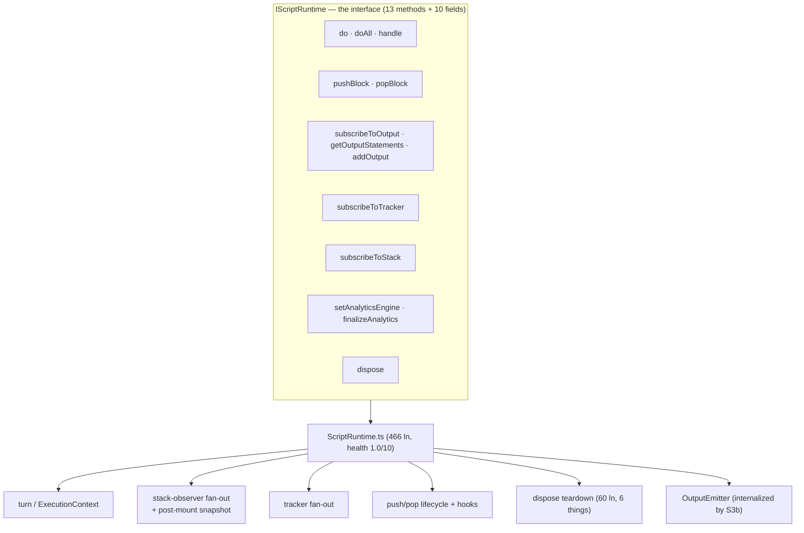

# Finding 03 — `ScriptRuntime` is still a god module: the interface never narrowed

> **Severity:** High. **Subsystem:** runtime engine.
> **Status vs prior work:** Carries forward GML #3 / minimax #05. Sub-stories
> **S3a** (merge the two snapshot constructors) and **S3b** (internalize
> `OutputEmitter` via `attach()`) shipped — they fixed the *symptoms* (the
> duplicate snapshot path; per-call runtime-shaped emit args). **The interface
> narrowing — the leverage part — was explicitly deferred.** This finding is
> the deferred remainder: the god *interface* is intact, and code health is
> still 1.0/10 (worst in the repository).

## Vocabulary

Per `LANGUAGE.md`: **module**, **interface** (everything a caller must know —
not just the type signature), **implementation**, **depth**, **seam**,
**adapter**, **leverage**, **locality**. A **god module** carries many
unrelated responsibilities behind one interface, so it is shallow *and* wide.

## Modules involved

| Module | Size today | Role |
| --- | --- | --- |
| `src/runtime/ScriptRuntime.ts` | **466 ln**, health **1.0/10** | The runtime orchestrator. Owns the turn loop, the stack-observer fan-out, the tracker fan-out, stack-snapshot emission, push/pop lifecycle, dispose teardown, and clock/event-bus wiring. |
| `src/runtime/contracts/IScriptRuntime.ts` | 196 ln | The interface callers cross. **13 methods + ~10 public fields** (see below). |
| `src/runtime/OutputEmitter.ts` | — | The one concern S3b successfully internalized (output buffer + subscriber notification + analytics enrichment + emission helpers, via `attach()`). |

## Problem — the interface is the test surface, and it is enormous

`IScriptRuntime` exposes, across unrelated concerns:

- **Turn loop:** `do`, `doAll`, `handle` (3)
- **Lifecycle convenience:** `pushBlock`, `popBlock` (2)
- **Output:** `subscribeToOutput`, `getOutputStatements`, `addOutput` (3)
- **Tracker:** `subscribeToTracker` (1)
- **Stack observers:** `subscribeToStack` (1)
- **Analytics:** `setAnalyticsEngine`, `finalizeAnalytics` (2)
- **Lifecycle:** `dispose` (1)

…plus **public fields** callers reach into directly: `options`, `tracker`,
`script`, `eventBus`, `stack`, `jit`, `clock`, `nowProvider`, `errors`,
`analyticsContext`.

That is ~13 methods and ~10 fields spanning **seven responsibilities**. The
implementation confirms it: `ScriptRuntime` holds `_activeContext`
(`ExecutionContext`), `_trackerListeners` + `_trackerSubscriptionUnsub`,
`_stackObservers` + `_stackSubscriptionUnsub`, `_output` (OutputEmitter),
`_nextHandlerUnsub`, and the push/pop/dispose teardown. S3b moved the *output
buffer* behind `OutputEmitter`; the other six concerns are still inline.

### Why it costs

- **Locality.** The stack-observer fan-out, the tracker fan-out, and the
  post-mount snapshot contract all live in the same 466-line file as the turn
  loop. A change to *any* of them forces you to hold the whole class in mind.
  This is the file with the worst health score in the repo.
- **Leverage.** `do` / `doAll` / `handle` are three public entry points that
  all delegate to one turn — the interface is wider than the behaviour.
  `pushBlock` / `popBlock` are conveniences over `PushBlockAction` /
  `PopBlockAction`. The surface is padded relative to the real capability.
- **Testability.** S3a+S3b closed the `mixed-timers.md` pre-mount leak at the
  *implementation* level (the snapshot constructor merge + OutputEmitter
  internalization). But the contract — *"snapshots expose only post-mount
  state"* — is still implicit in the god class, not named at a seam. The
  `post-mount-snapshot-invariant` compliance test asserts the *outcome*; it
  cannot assert the *contract* because there is no observer-bus seam to test
  through.

## Diagram — seven responsibilities, one interface

`OutputEmitter` is the one concern that escaped into its own module. The other
five jobs are still inline, all reachable through the one fat interface.

## Deletion test

- **Delete `ScriptRuntime`** → the runtime engine is gone; the seven jobs
  reappear in whatever replaces it. **Load-bearing.**
- **Delete `OutputEmitter`** → the output-buffer concern collapses back into
  the god class (where it was before S3b). **Load-bearing — and the proof that
  the same cure is available for the remaining concerns.**
- The friction is the **boundary inside the class**: stack-observer fan-out,
  tracker fan-out, and snapshot emission are each coherent enough to sit behind
  their own seam (as `OutputEmitter` proved), but today they share one
  interface with the turn loop.

## Solution (plain English — no interface proposed yet)

Finish the job S3b started: extract the remaining fan-out concerns behind
their own seams so `ScriptRuntime` narrows to **"maintain the live stack and
run the turn,"** with snapshot/output/tracker/analytics emission as
collaborators it composes rather than inlines. Direction (grilling loop pins
the shape):

- A **stack-observer collaborator** that owns `_stackObservers`, the
  subscription, and the post-mount snapshot contract. Its seam enforces
  *"snapshots expose only post-mount state"* — the workaround
  (`_notifyStackSettled`, the post-turn re-emit) becomes unnecessary because
  the collaborator's contract excludes pre-mount state by construction. (This
  is minimax #05's `RuntimeObserverBus` direction.)
- A **tracker collaborator** that owns the reference-counted tracker
  subscription.
- `do` / `doAll` / `handle` collapse toward one turn entry point; the
  convenience wrappers either stay as thin delegates or move to callers.

The interface narrows because callers stop reaching into fields
(`eventBus`, `stack`, `jit`, `clock`) and fan-out paths that are not their
business. S3b already proved the move is safe (`OutputEmitter.attach()`).

> If adopted, `CONTEXT.md` already names **Mounted Block** (added by G3). This
> finding gives that term a home at a seam, not just a docblock.

## Benefits

- **Locality.** The post-mount snapshot contract moves from an implicit
  invariant in a 466-line class to a named property of one collaborator. The
  bug class S3a was patching becomes impossible to reintroduce.
- **Leverage.** Callers cross a narrow turn/snapshot surface instead of a
  13-method, 10-field interface. Three entry points collapse toward one.
- **Tests.** The stack-observer collaborator is exercisable with a stub action
  that mounts nothing — proving the post-mount contract directly, not just its
  downstream outcome. **The interface becomes the test surface** for the
  contract that today lives only in a docblock and a compliance test.

## Evidence

- `IScriptRuntime.ts:37-196` — the 13-method, ~10-field interface.
- `ScriptRuntime.ts:35-72` — public fields + the inline `_tracker*`,
  `_stackObserver*`, `_activeContext`, `_nextHandlerUnsub` internals.
- `ScriptRuntime.ts:46-48` — the docblock showing `OutputEmitter` already owns
  output buffer + subscriber notification + analytics enrichment (the proven
  extraction pattern).
- Code health **1.0/10** per `CLAUDE.md` — worst in the repository, unchanged.

## Risks

- **Highest blast radius.** `IScriptRuntime` is consumed by the Chromecast
  proxy runtime, the test builder, and the React hook (~121 reference sites per
  the S3b log). Narrowing it is the part S3b deliberately deferred precisely
  because of this surface. Sequence behind a behaviour-equivalence A/B over the
  `tests/runtime-compliance/` suite.
- The post-mount ordering is load-bearing for Chromecast (the TV proxy needs a
  snapshot immediately after the turn). Any collaborator extraction must
  preserve "snapshot fires after `ExecutionContext.execute()` returns."
- `dispose()` is ~60 lines doing 6 things — a collaborator extraction must
  preserve every teardown step.

## Related / ADR conflicts

- **GML #3 / S3 track** — this *is* the deferred tail of that track. No
  contradiction; it is the unfinished leverage half.
- **G3 (post-mount invariant)** — named the invariant; this finding gives it a seam.
- **Finding 01 (Workbench Session)** — the session is a **second subscriber**
  of this finding's observer collaborator (alongside the Chromecast proxy).
  Per [ADR-0002](../adr/0002-workbench-session-observes-runtime-via-observer-seams.md),
  the session observes the runtime via `subscribeToOutput` + `subscribeToStack`
  (the post-mount seam), not by polling. Two real subscribers justify the
  extraction; **01 lands first, 03 second** (a mechanical call-site move when
  the observer collaborator is extracted).
- No recorded ADR contradicts this. If the interface is deliberately kept wide
  (e.g. the proxy genuinely needs every field), that is exactly the decision
  worth recording as an ADR so this finding stops resurfacing.
