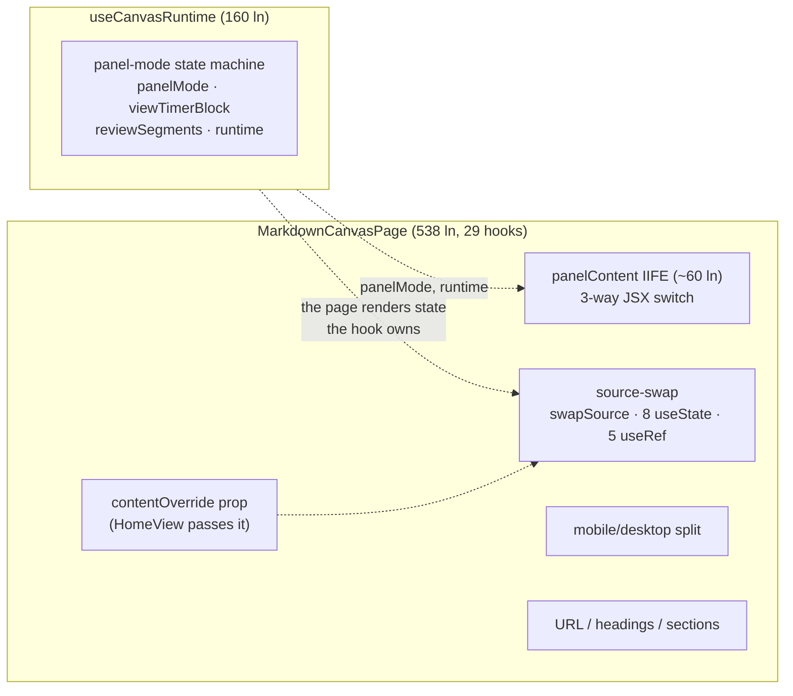

# Finding 04 — `MarkdownCanvasPage` does five sub-jobs the hook already half-owns

> **Severity:** Medium. **Subsystem:** playground canvas route.
> **Status vs prior work:** Carries forward GML gap **G2** / minimax **#06**.
> **Open.** No story has landed. This finding re-verifies the current shape:
> the prior doc's diagnosis is accurate, the line numbers have drifted, and the
> deepening target is unchanged.

## Vocabulary

Per `LANGUAGE.md`: **module**, **interface**, **implementation**, **depth**,
**seam**, **adapter**, **leverage**, **locality**.

## Modules involved

| Module | Size today | Role |
| --- | --- | --- |
| `playground/src/canvas/MarkdownCanvasPage.tsx` | **538 ln** | The page. Owns five sub-jobs in one component: **29 hook calls** (`useState` ×9, `useEffect` ×5, `useMemo` ×6, `useCallback` ×9). |
| `playground/src/hooks/useCanvasRuntime.ts` | **160 ln** | Owns the panel-mode state machine + runtime. Returns a 14-key object. **Does not** own editor source or source-swap. |
| `playground/src/App.tsx` | 680 ln | Parent; passes `workoutFiles` to the canvas (see Finding 02). |

Churn: **99.8th %ile, 32 commits** — second-highest in the playground.

## Problem — the panel-mode seam is split between two modules

The page and the hook cooperate to answer one question — *"what should the
canvas show right now?"* — but the answer is smeared across both:

- **The hook** (`useCanvasRuntime`) owns the panel-mode state machine
  (`panelMode`, `viewTimerBlock`, `reviewSegments`, `selectedSegmentIds`,
  `persistedResults`) and the runtime. It returns a 14-key object.
- **The page** owns the **panel-mode rendering** (a ~60-line `panelContent`
  IIFE around lines 364-432 that switches between `RuntimeTimerPanel` /
  `ReviewGrid` / editor) **and** the **source-swap orchestration**
  (`swapSource` / `handleEditorChange` / `resetActiveSource`, ~lines 142-188)
  **and** the **mobile/desktop split** (`desktopPanel` / `mobilePanel`) **and**
  the **URL/headings/section** logic.

So the state machine lives in one module but the rendering of that state and
the editor-source bookkeeping (8 of the page's own `useState`s + 5 `useRef`s)
live in the other. Two files must be held in mind to know what is on screen.
The page mixes `runtime.X` reads with 8 local `useState`s that all describe
editor-source/swap bookkeeping — a locality miss.

A `contentOverride` prop is wired into `swapSource`. **It is live, not dead** —
`HomeView.tsx:22,141` passes it to inject search-palette content into the home
editor, and `MarkdownCanvasPage.tsx:192-197` reacts to it. *(Corrects GML G2 /
minimax #06, which called it dead.)*

### Diagram — the seam is split between page and hook

The dotted edges are the misplaced seams: the hook owns the mode, the page
renders the mode and owns the editor bookkeeping that the mode drives.

## Deletion test

- **Delete the page** → the canvas route has no view; the five sub-jobs
  reappear. **Load-bearing.**
- **Delete the hook** → the panel-mode state machine and runtime vanish.
  **Load-bearing.**
- The friction is the **boundary**: panel-mode rendering and source-swap belong
  behind the same seam as the panel-mode state machine that already lives in
  the hook. Moving them in **concentrates** complexity (the hook gains ~130 ln,
  loses nothing); leaving them out **moves** it on every change.

## Solution (plain English — no interface proposed yet)

Make the hook the single home for *"what the canvas shows"*, and the page a
**layout composition** over it. Direction (grilling loop pins the shape):

- Pull the `panelContent` IIFE into a `<CanvasPanelContent>` component driven
  by the hook's `panelMode` / `block` / `runState`. The component owns no
  state; it renders what the hook decides.
- Leave `useCanvasRuntime` as-is (runtime + panel-mode). Move the editor-source
  bookkeeping (`swapSource` + `sourceEditsRef` / `swapTimerRef` + the
  `editorSource` / `editorOpacity` / `isEditorLoading` / `activeSourceKey`
  state) into a new `useCanvasEditorSource` hook — alongside `contentOverride`,
  which is **preserved** (it is live, see above). Decision: **split into focused
  hooks**, not fold into `useCanvasRuntime` (a 300-ln god hook would repeat the
  page's disease).
- Extract the mobile `onRun` override (`mobileRunState`) into a small
  `useMobileRunOverride` hook.
- The two `desktopPanel` / `mobilePanel` instantiations already share one
  `<CanvasEditorPanel variant=…>`; they differ only in `runState`, so at most
  pass a `runState` chooser to `SplitCanvasTemplate` (minor).

The page becomes layout + the URL/section wiring; the hook becomes the
testable surface for *"what should be shown."*

## Benefits

- **Locality.** The panel-mode state machine and its rendering and the
  source-swap that responds to it live in one module. Today a panel-mode bug
  forces a two-file read.
- **Leverage.** Five sub-jobs collapse to focused hooks + a layout page
  (`useCanvasRuntime` unchanged; new `useCanvasEditorSource` +
  `useMobileRunOverride`; `<CanvasPanelContent>` renders). `contentOverride`
  is preserved, not deleted (it is live).
- **Tests.** `useCanvasRuntime` becomes the testable surface: drive
  `panelMode` transitions and source-swap through the hook and assert what it
  decides, **without rendering the page**. Today that logic only fires inside
  the component.

## Evidence

- `MarkdownCanvasPage.tsx` — 538 ln, 9 `useState` + 5 `useEffect` + 6
  `useMemo` + 9 `useCallback` = 29 hook calls (vs the hook's 9).
- `MarkdownCanvasPage.tsx:~142-188` — source-swap (`swapSource` /
  `handleEditorChange` / `resetActiveSource`) in the page.
- `MarkdownCanvasPage.tsx:~364-432` — the ~60-line `panelContent` IIFE.
- `useCanvasRuntime.ts` — 160 ln, 14-key return, owns panel-mode + runtime, not
  editor source.
- `contentOverride` — **live**: `HomeView.tsx:22,141` passes it; `MarkdownCanvasPage.tsx:192-197` reacts. (Not dead — corrects G2/minimax #06.)

## Risks

- A `depsRef.current` stale-closure workaround lives in the page. Moving the
  consumer out must preserve the "no stale deps" guarantee — test with a
  source-swap followed immediately by a panel-mode change.
- The mobile/desktop split is genuinely two `runState` overrides; confirm they
  differ *only* in `onRun` before collapsing to one `variant` component.
- The boundaries are still settling (32 commits). Anchor the extraction on
  what is already coherent (the IIFE, the source-swap), not a speculative
  split.

## Related / ADR conflicts

- **Finding 02 (App.tsx)** — `MarkdownCanvasPage`'s parent. Both are god
  components on the canvas route; deepening either reduces churn on the other.
- minimax #06 proposed a **Workbench Effects** `CONTEXT.md` term (renderless
  components that coordinate runtime sources into a store). If adopted, the
  canvas hook is a candidate expression of that pattern.
- No recorded ADR contradicts this.
