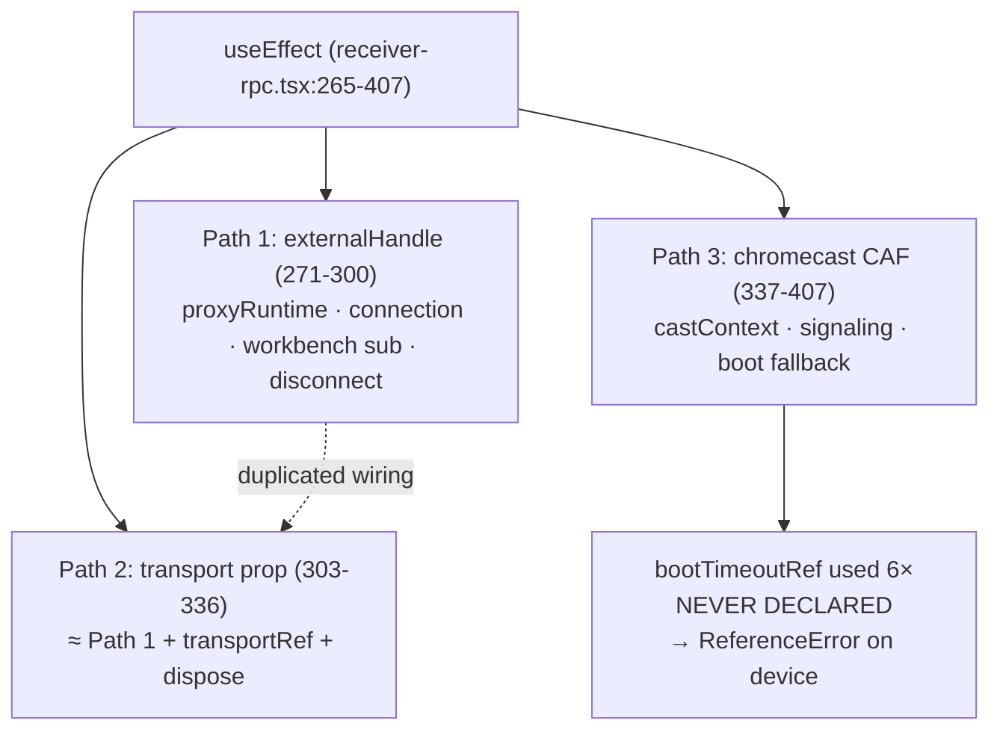

# Finding 05 — `receiver-rpc.tsx` has three init paths and a latent bug they hid

> **Severity:** Medium. **Subsystem:** cast receiver (playground).
> **Status vs prior work:** Carries forward GML #4 sub-story **S4c**. The
> substantive work shipped — the three inline `ChromecastProxyRuntime` rebuilds
> were replaced with `createReceiverSession(...)`, and `ReceiverSessionManager`
> (164 ln) now centralizes audio routing + workbench/disconnect fan-out. **What
> remains is the init-path duplication itself — and it has hidden a real bug.**

## Vocabulary

Per `LANGUAGE.md`: **module**, **interface**, **implementation**, **depth**,
**seam**, **adapter**, **leverage**, **locality**.

## Modules involved

| Module | Size today | Role |
| --- | --- | --- |
| `playground/src/receiver-rpc.tsx` | **669 ln** | The cast/TV receiver app. One `useEffect` (265-407) holds **three** init paths. |
| `src/services/cast/rpc/ReceiverSessionManager.ts` | 164 ln | Exports `ReceiverSessionHandle` + `createReceiverSession(transport, options?, deps?)`. Centralizes audio routing + workbench fan-out + disconnect fan-out. Does **not** own transport lifetime. |

## Problem — three init paths, duplicated wiring, and a bug the duplication hid

The boot `useEffect` (`receiver-rpc.tsx:265-407`) holds three init paths. The
file's own comment says *"Two paths"* — it is stale; there are three:

1. **`externalHandle` path (271-300)** — session already wired by a parent
   (`LocalReceiverApp`). Wires `activeSessionHandleRef`, `runtimeRef`,
   `setProxyRuntime`, `setConnectionStatus('connected')`, `dismissBootLoader`,
   `handle.onWorkbenchUpdate`, `handle.onDisconnected`. Cleanup unsubscribes but
   does **not** dispose (the parent owns the handle).
2. **`transport` prop path (303-336)** — legacy; builds a session in-place via
   `createReceiverSession(transport)`. **Near-identical body to path 1**, plus
   `transportRef` bookkeeping. Cleanup unsubscribes **and** disposes.
3. **Chromecast CAF path (337-407)** — the real-device path: `castContext.start`,
   a diagnostic keydown listener, the `READY` handler, `ReceiverCastSignaling`,
   and `setupTransport()` on a `webrtc-offer`. Cleanup disposes runtime,
   transport, and signaling.

Paths 1 and 2 duplicate the proxy-runtime / connection-status /
workbench-subscription / disconnect wiring almost line-for-line; the only real
difference is who owns the handle's lifetime. That duplication is the wrong
seam — **lifetime ownership** is the one thing that varies, but it is smeared
across the whole wiring body instead of isolated.

### The bug the duplication hid

Path 3 added a boot-fallback (show a degraded shell if the CAF `READY` event
never arrives within a timeout). It references a ref called **`bootTimeoutRef`**
at lines 366, 367, 368, 371, 392, 393, 394 — **but `bootTimeoutRef` is never
declared.** The declared refs are `runtimeRef`, `transportRef`,
`activeSessionHandleRef`, `bootFadeTimerRef`, `signalingRef`,
`workbenchStateRef` (lines 57-99). There is no `bootTimeoutRef`.

The file builds because Vite/esbuild strips types without type-checking. At
runtime the chromecast path throws `ReferenceError: bootTimeoutRef is not
defined` — but **only on a real Chromecast device**, which is exactly the path
dev/local-tab testing (paths 1 and 2) never exercises. This is the clearest
possible evidence of the cost: a feature added to one path in isolation missed
its ref declaration, and no test caught it because the paths are maintained
apart.

### Diagram — three paths, shared wiring smeared, one bug

## Deletion test

- **Delete the `useEffect`** → the receiver cannot boot on any path.
  **Load-bearing.**
- The friction is the **boundary inside the effect**: the shared
  proxy/connection/subscription wiring should sit behind one seam (or in
  `ReceiverSessionManager`, which already owns audio + fan-out), and the
  path-specific work (CAF boot, lifetime ownership) should be the only thing
  that varies. Today all three paths re-weire the same plumbing, which is why a
  ref used in one was never declared.

## Solution (plain English — no interface proposed yet)

Collapse the three paths to one wiring path plus one varying concern.
Direction (grilling loop pins the shape):

- Hoist the shared wiring (proxy runtime, connection status, workbench
  subscription, disconnect handling) into a single helper or into
  `ReceiverSessionManager`, so each path expresses only **what is specific to
  it**: where the handle comes from, and who owns its lifetime.
- Isolate the chromecast CAF boot (the `castContext.start`, the diagnostic
  listener, the boot fallback) as its own concern — and **fix the
  `bootTimeoutRef`** by giving the boot-timeout a real declared home (a new ref,
  or reuse `bootFadeTimerRef` if the intent was one timer).
- Update the stale *"Two paths"* comment — there are three, and after the
  refactor there should be one wiring path with three small adapters.

## Benefits

- **Locality.** The shared wiring lives once. The boot bug exists *because* the
  wiring is smeared — once it has one home, a missing ref is a compile error,
  not a device-only runtime crash.
- **Leverage.** Three near-duplicate bodies become one. A new transport kind is
  one adapter, not a fourth copy of the wiring.
- **Tests.** Today only paths 1 and 2 run in dev; path 3 (the one with the bug)
  is effectively untested. Unifying the wiring makes the shared path testable
  through one seam, and isolating the CAF boot lets the boot-fallback be
  asserted without a device.

## Evidence

- `receiver-rpc.tsx:265-407` — one `useEffect`, three init paths.
- `receiver-rpc.tsx:271-300` vs `303-336` — paths 1 and 2 share the
  proxy/connection/subscription/disconnect wiring; differ on lifetime + `dispose`.
- `receiver-rpc.tsx:366-368, 371, 392-394` — `bootTimeoutRef` used six times.
- `receiver-rpc.tsx:57-99` — the declared refs; **`bootTimeoutRef` is absent**.
- `receiver-rpc.tsx:259-264` — the stale *"Two paths"* comment (there are three).

## Risks

- **Highest blast-radius concern is the bug fix itself, not the refactor.** A
  minimal, shippable first step is to declare the missing ref (or correct it to
  the intended timer) independent of the path unification — that closes the
  device-only crash now.
- Path 3's CAF boot ordering is load-bearing (`start()` must precede
  `addCustomMessageListener()`; signaling must be created after `start()`).
  Preserve the ordering while extracting.
- Transport lifetime is intentionally **not** owned by `ReceiverSessionManager`
  (it disposes transports in path 3's cleanup). Any unification must keep
  lifetime ownership explicit.

## Related / ADR conflicts

- **GML #4 / S4 track** — this is the deferred tail of S4c. The cast refactor
  plan (`docs/cast-architecture-plan.md`) is already marked SUPERSEDED; this
  finding is the receiver-side remainder.
- `CONTEXT.md` already names **Cast Backend** and the `ReceiverSessionManager`
  seam. This finding finishes that seam on the receiver side.
- No recorded ADR contradicts this.
