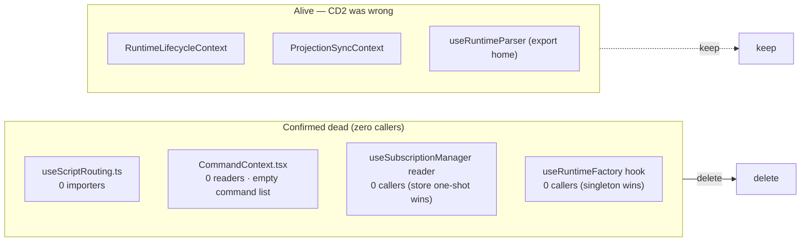

# Finding 06 — Dead code cleanup (with a correction to the prior survey)

> **Severity:** Low. **Subsystem:** cross-cutting contexts & hooks.
> **Status vs prior work:** Re-verifies GML #8 table **CD2** ("React contexts
> & hooks, dead or single-reader"), which was **never executed** and is now
> **partly stale**. This finding corrects it: three of the seven items CD2
> flagged are **alive** and must not be deleted. The remainder are confirmed
> dead or hypothetical seams.

## Vocabulary

Per `LANGUAGE.md`. The governing principle here is the **one-adapter test**:
*one adapter = a hypothetical seam; two adapters = a real seam; zero callers =
dead code.* A context that is **provided** but whose reader hook has **zero
callers** is a hypothetical seam — provided value that nothing reads.

## The correction first — do NOT delete these (CD2 was wrong)

| Module | CD2 said | Reality today | Evidence |
| --- | --- | --- | --- |
| `src/contexts/RuntimeLifecycleContext.ts` | 0 consumers | **Alive.** `useRuntimeLifecycle` reads it; `RuntimeLifecycleProvider` + `ScopedRuntimeProvider` provide it; tests import it. | `useRuntimeLifecycle.ts:9`, `RuntimeLifecycleProvider.tsx:5`, `useWorkbenchRuntime.test.tsx:5` |
| `src/contexts/ProjectionSyncContext.tsx` | 1 consumer, hardcodes `projections: []` | **Alive (2 sites).** `useProjectionSync` read in `useWorkbenchEffects`; `ProjectionSyncProvider` mounted in `CastButtonRpc`. | `useWorkbenchEffects.ts:28`, `CastButtonRpc.tsx:34` |
| `src/hooks/useRuntimeParser.ts` | 0 callers (only re-exports used) | **Alive as an export home.** `whiteboardScriptLanguage`, `extractStatements`, `MdTimerRuntime` are consumed by 6+ files. | `noteEditorServices.ts:4`, `whiteboard-linter.ts:15`, `parseScriptBlock.ts:6`, `WhiteboardCompanion.tsx:21`, `Editor/types/index.ts:7`, highlight test |

These three carry real consumers. Deleting them breaks the build. The CD2 row
for them is stale — likely an artefact of the three refactor sessions moving
call sites into place.

## Confirmed dead — deletion candidates (zero callers)

Each below passes the zero-caller test as of today.

### `src/hooks/useScriptRouting.ts`

- **Evidence:** the only occurrences of `useScriptRouting` in `src/`, `playground/`,
  `stories/`, `tests/` are its own definition (`:62`) and its own doc comment.
  **0 importers.**
- **Action:** delete. It is parallel to the live `useReactRouterNavigation`.
- **Deletion test:** complexity vanishes (it wraps `useNavigate`/`useParams`
  that callers already use directly). Pass-through — delete.

### `src/contexts/CommandContext.tsx`

- **Evidence:** `useCommandContext` has **0 readers** outside its own definition
  and the `editor-entry.ts` barrel re-export. The `CommandProvider` is mounted
  in `Workbench.tsx` and `playground/src/App.tsx`, but nothing calls
  `useCommandContext()`, so nothing calls `registerCommand()`, so the
  `commands` list is **always empty**. The Provider's global keydown dispatcher
  (lines 34-69) therefore iterates an empty list — it runs but does nothing.
- **Action:** delete, **or** wire it up. It is an aspirational command-shortcut
  registry that was never connected. If the shortcut feature is wanted, that is
  a product decision, not an architecture one; until then the Provider mounts a
  no-op listener and exposes an unread context.
- **Deletion test:** complexity vanishes — no reader, no registered commands.
  Hypothetical seam with zero adapters.

### `src/contexts/SubscriptionManagerContext.ts` (the reader hook)

- **Evidence:** `useSubscriptionManager()` has **0 callers** (the only other
  hit is a prose reference in `stories/.../CastButtonRpc.mdx:15`, not a call).
  The context is *provided* by `RuntimeLifecycleProvider` and
  `ScopedRuntimeProvider`, but the subscription manager is actually consumed
  via `useWorkbenchSyncStore.getState().subscriptionManager` (the cast-refactor
  one-shot read pattern), not via the context reader.
- **Action:** delete the `useSubscriptionManager` reader (and the context if
  nothing provides-then-reads it). The store one-shot is the real path.
- **Deletion test:** the *reader* is a pass-through with zero callers. The
  *field* on the store is alive — keep that, drop the unused React-context
  indirection. One adapter (the provider) for a zero-reader seam = hypothetical.

### `src/hooks/useRuntimeFactory.ts` (the hook, not the singleton)

- **Evidence:** the **hook** `useRuntimeFactory` has 0 callers. The module's
  *singleton* `runtimeFactory` and *type* `IRuntimeFactory` are alive
  (`runtimeTimerModel.ts:2`, `Workbench.tsx:37`, `RuntimeLifecycleProvider.tsx:3`).
  Only the React-hook wrapper is unused.
- **Action:** delete the hook export; keep the singleton + type.
- **Deletion test:** the hook wraps a singleton that is imported directly. The
  wrapper is a pass-through — delete it, keep the singleton.

## Diagram — how the dead items map

## Benefits

- **Locality.** Four unused modules stop cluttering `src/contexts/` and
  `src/hooks/`. A future reader of `CommandContext` no longer has to determine
  whether the shortcut feature is wired up (it is not).
- **Leverage.** None expected — these are deletions, not deepenings. The win is
  a smaller, honest surface.
- **Tests.** None required — zero callers means nothing breaks. The CD2
  correction itself is the verification artifact: the table above is the
  evidence that the three "alive" items must stay.

## Evidence

- `useScriptRouting` — repo-wide search returns only its own file.
- `CommandContext.tsx:13-81` — the Provider; `:83-87` the unread reader;
  `:34-69` the keydown handler over the always-empty `commands`.
- `SubscriptionManagerContext.ts:18` — the reader; 0 callers (store one-shot is
  the real path).
- `useRuntimeFactory` — hook uncalled; `runtimeFactory` singleton + type alive.
- Alive items: see the correction table above.

## Risks

- **CommandContext is a product question, not just a deletion.** Confirm the
  command-shortcut feature is not planned before deleting; if it is, the right
  move is to wire it up, not delete it.
- `SubscriptionManagerContext` is provided in two places — removing the context
  (not just the reader) touches both providers. Removing only the reader hook
  is the minimal, safe step.
- Re-run the zero-caller search immediately before deleting — these are the
  kind of imports a single in-flight feature branch can add back.

## Related / ADR conflicts

- **GML #8 / CD2** — this finding *is* that table, re-verified and corrected.
  If the project adopts the ADR convention, the correction ("these three are
  alive") is worth a one-line note so a future cleanup sprint does not re-flag
  them.
- No recorded ADR contradicts deletion of the confirmed-dead items.
