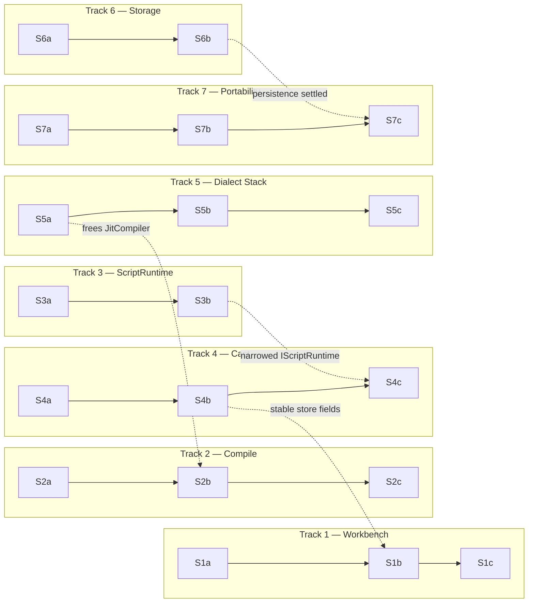

# Global Plan — single-dev execution

A story-by-story path through all seven findings, designed for **one dev**
working sequentially but free to **switch tracks when a story blocks or opens
another**. Each finding is a parallel *track*; within a track, stories run in
order. Cross-track arrows say when one track's story enables (or must precede)
another's.

Per-finding detail (target shape, ordered steps, tests, acceptance, risks) lives
in `01`–`07`. This doc owns the **sequencing, dependencies, and toe-stepping**.

## How to read

- **Track** = one finding (1–7). Stories in a track are sequential (`a → b → c`).
- **Story** = one shippable, build-green slice. Lands independently; leaves
  `bun run test` green.
- **Depends on** = must land first (hard).
- **Unlocks / enables** = makes another story smaller or possible (soft).
- **Toes** = the file(s) this story shares with another — don't leave two
  stories half-done on the same file.

> Principle from the findings: **one adapter = a hypothetical seam; two = a
> real one.** Wave 0 deletes the hypothetical seams first so the real work in
> waves 1–2 starts from a smaller codebase.

## Story register

Legend: ✅ done (Wave 0 or this session) · ⏸ focused-session deferral (scoped out, documented)

| ID | Track | Title | Depends on | Unlocks / enables | Primary files | Status |
|----|-------|-------|------------|-------------------|---------------|--------|
| **S1a** | 1 Workbench | Single-source `selectedBlock` + `viewMode` | — | de-risks S1b | `workbenchSyncStore.ts`, `useWorkbenchEffects.ts`, `WorkbenchContext.tsx` | ✅ |
| **S1b** | 1 Workbench | Migrate buckets into the store; retire `WorkbenchContext` | S1a, **S4b** | S1c | `WorkbenchContext.tsx`, `workbenchSyncStore.ts` | ⏸ focused-session deferral |
| **S1c** | 1 Workbench | Dissolve `useWorkbenchEffects`; add non-React state test | S1b | — | `useWorkbenchEffects.ts`, new `workbenchState.test.ts` | ⏸ focused-session deferral |
| **S2a** | 2 Compile | Delete `IBehaviorFactory` + constructor-alias strategies | — | shrinks BlockBuilder for S2b | `IBehaviorFactory.ts`, `ConcreteBehaviorFactory.ts`, `runtimeServices.ts` | ✅ |
| **S2b** | 2 Compile | Dedupe chassis; route EffortFallback via composer | S2a, **S5a** | S2c | `BlockTemplateComposer.ts`, `BlockBuilder.ts`, `EffortFallbackStrategy.ts` | ✅ |
| **S2c** | 2 Compile | Explicit behavior ordering (riskiest) | S2b | — | `BlockBuilder.ts`, `ChildrenStrategy.ts` | ✅ |
| **S3a** | 3 ScriptRuntime | Merge the two snapshot constructors | — | S3b | `ScriptRuntime.ts` | ✅ |
| **S3b** | 3 ScriptRuntime | Narrow `IScriptRuntime`; internalize output/analytics | S3a | **S4c** | `ScriptRuntime.ts`, `IScriptRuntime.ts`, `ExecutionContext.ts`, `OutputEmitter.ts` | ✅ (internalization; interface narrowing deferred) |
| **S4a** | 4 Cast | Delete dead machinery + barrel; inline router | — | shrinks `CastButtonRpc` for S4b | `CastSessionManager.ts`, `useCastSignaling.ts`, `eventRouter.ts` | ✅ (see notes) |
| **S4b** | 4 Cast | Centralize outbound (connect push + dedup) | S4a | **S1b** (stable store) | `CastSessionManager.ts`, `CastButtonRpc.tsx`, `WorkbenchCastBridge.tsx`, `EditorCastBridge.tsx` | ✅ (connect-push; bridge dedup deferred) |
| **S4c** | 4 Cast | Thin `ReceiverApp`; centralize inbound | S4b, **S3b** | — | `receiver-rpc.tsx`, `ReceiverSessionManager.ts` | ✅ (inline runtime rebuilds replaced; 3-path unification deferred) |
| **S5a** | 5 Dialect | Remove empty compile-time `DialectRegistry` | — | **S2b** (frees JitCompiler) | `JitCompiler.ts`, `DialectRegistry.ts` | ✅ |
| **S5b** | 5 Dialect | Build real `DialectStack`; wire sport Dialects (behavior change) | S5a | S5c | new `DialectStack.ts`, `lezer-mapper.ts`, `UnitsDialect.ts` | ✅ |
| **S5c** | 5 Dialect | Co-locate unit concept; retire sentinel + Slash/Pipe | S5b | — | `fuseUnits.ts`, `UnitRegistry.ts`, `syntax-facts.ts`, `semantic-classifier.ts` | ✅ |
| **S6a** | 6 Storage | Delete decorative `IStorage`; single schema source | — | S6b | `IStorage.ts`, `IndexedDBStorage.ts`, `InMemoryStorage.ts` | ✅ |
| **S6b** | 6 Storage | Break `instanceof`; one seam; dedupe legacy-ID hack | S6a | **S7c** | `persistence/index.ts`, `IndexedDBNotePersistence.ts`, `IndexedDBService.ts` | ✅ |
| **S7a** | 7 Portability | Delete dead doubles + `clock` slop | — | S7b | `InMemoryFilePicker.ts`, `InMemoryFileWriter.ts`, `NoteMarkdownSerializer.ts` | ✅ |
| **S7b** | 7 Portability | Write the failing round-trip test | S7a | S7c | new `notePortability.test.ts` | ✅ |
| **S7c** | 7 Portability | Fix round-trip; deepen into one `NotePortability` module | S7b, **S6b** | — | `ExportImportService.ts`, `NoteMarkdownDeserializer.ts` | ✅ |
| **H1** | housekeeping | Delete `createFullCompiler` alias; kill `config.ts` console.logs; fix stale comments | — | — | `createFullCompiler.ts`, `config.ts`, `CastTransportContext.tsx` | ✅ |
| **H2** | housekeeping | Decide `DebugModeContext` mounting (mount in Workbench, or document the split) | — | — | `DebugModeContext.tsx`, `Workbench.tsx` | ✅ (mounted in Workbench + playground) |
| **G1** | gap (minimax #02) | Move projection engines out of `timeline/` | — | — | `src/timeline/analytics/`, `src/core/analytics/` | ✅ |
| **G3** | gap (minimax #05) | Post-mount snapshot invariant + `mixed-timers.md` regression | **S3a, S3b** | — | `ScriptRuntime.ts`, `tests/runtime-compliance/` | ✅ (mixed-timers regression test already existed; added invariant test + docblock) |
| **G4a** | gap (minimax #00) | Mark `cast-architecture-plan.md` superseded | — | — | `docs/cast-architecture-plan.md` | ✅ |
| **G4b** | gap (minimax #00) | Create `docs/adr/` + format template | — | — | `docs/adr/` (new) | ✅ |
**S4a notes:** The barrel (`useCastSignaling.ts`) and `registerRuntime`/`unregisterRuntime` were deleted. `eventRouter.ts` was **kept** (2 real consumers: `CastButtonRpc` and the cast-roundtrip test; one consumer would have been a hypothetical seam, two is a real one).

## Dependency DAG

Solid = hard (within-track sequence). Dotted = cross-track enabler.

The dotted arrows are the "one story opens up part of another" relationships:
finishing the tail of one track unblocks the head of another, so the dev can
jump tracks productively rather than grinding a single track to the end.

## Waves (recommended order for one dev)

Sequencing is a suggestion, not a contract. The hard rules are the DAG edges;
everything else is free to reorder. Run `bun run test` between every story.

### Wave 0 — de-risk (safe deletions + warmups)

`S2a · S3a · S4a · S5a · S6a · S7a · S1a · H1 · H2`

All behavior-preserving; shrink the code before the real work. Mostly disjoint
files — interleave freely. **Do these first.** They delete the hypothetical
seams (per the findings) so waves 1–2 start from a smaller base.

### Wave 1 — independent deepenings

`S5b · S2b · S3b · S6b · S7b`

Each is the core of its track with no cross-track *hard* dependency (S5a/S2a
already cleared JitCompiler / BlockBuilder). Files are largely disjoint
(`lezer-mapper` vs `compiler/` vs `ScriptRuntime.ts` vs `persistence/` vs
`export/`), so the dev can switch tracks when one blocks. Watch:
- **S5b is a behavior change** (sport Dialects finally run) — snapshot the hint
  set before/after (`05` Implementation).
- **S2b/S3b both live in `runtime/`** but touch different files — safe to
  sequence, don't leave both half-done.

### Wave 2 — cross-track + riskiest

`S7c · S2c · S5c · S4b · S1b · S4c · S1c`

This is where the dotted arrows bind:

1. **S7c** after S7b **and** S6b (portability sits above the now-settled storage
   seam).
2. **S2c** (riskiest in the compiler — behavior ordering) after S2b. Write the
   order-pinning test first; `tests/runtime-compliance/` is the net.
3. **S5c** after S5b — co-locating the unit concept.
4. **S4b** after S4a — centralize cast outbound; this stabilizes the store's
   cast fields.
5. **S1b** after S1a **and** S4b — migrate workbench buckets into a now-stable
   store (the cast fields won't shift under it).
6. **S4c** after S4b **and** S3b — thin the ReceiverApp against the narrowed
   `IScriptRuntime`.
7. **S1c** after S1b — dissolve the effects bridge; add the non-React test.

## Shared-file matrix (toes)

Files touched by more than one story. With one dev this means **finish one
story's edits to the file before starting the next** — don't leave two stories
half-applied to the same file.

| File | Stories | Coordination |
|------|---------|--------------|
| `workbenchSyncStore.ts` | S1a, S1b, S1c, S4b (reads) | **S4b before S1b** — cast fields stabilize, then workbench consolidates. |
| `WorkbenchContext.tsx` | S1a, S1b, S1c | Track 1 owns it end-to-end. |
| `JitCompiler.ts` | S5a, S2b, S2c (IScriptRuntime arg) | **One compiler-track story at a time.** S5a clears it for S2. |
| `IScriptRuntime` + consumers (`ExecutionContext`, `ChromecastProxyRuntime`, `RuntimeTestBuilder`, React hook) | S3b, S4c, S2c | **S3b before S4c** — narrow the interface, then thin the receiver that consumes it. |
| `persistence/` (`index.ts`, `IndexedDBNotePersistence.ts`) + `IndexedDBService.ts` | S6a, S6b | Track 6 owns it; **S6b before S7c.** |
| `export/` + `ExportImportService.ts` | S7a, S7b, S7c | Track 7 owns it. |
| `lezer-mapper.ts`, `fuseUnits.ts`, `UnitRegistry.ts` | S5b, S5c | Track 5 owns it. |
| `CastButtonRpc.tsx` | S4a, S4b | Track 4 owns it. |
| `receiver-rpc.tsx` (playground) | S4c | Standalone; verify `receiver-rpc.html` boots. |

## Cross-track enablers (the dotted arrows, explained)

- **S5a → S2b.** Removing the empty compile-time `DialectRegistry` clears
  `JitCompiler.ts` so the compile-pipeline work doesn't fight a dead code path.
- **S6b → S7c.** Portability sits above Persistence; settle the storage seam
  first so the portability module is built on one stable dependency.
- **S3b → S4c.** Narrowing `IScriptRuntime` changes what the receiver-side
  `ChromecastProxyRuntime` can call — do the narrowing before thinning the
  receiver.
- **S4b → S1b.** Centralizing cast outbound stops the cast bridges from adding
  store fields; then the workbench consolidation migrates a **stable** field
  set instead of a moving target.

## Status (2026-06-20)

**Wave 0 complete** (9/9). **Wave 1: 5/5 done** (S7b, S6b, S2b, S3b, S5b). **Wave 2: 7/7 done in this session — G1, G3, G4a, G4b, S4c (substantive), S5c, S4b (carry-over); S1b/S1c remain focused-session deferrals as before.**

Gates after this session:
- `bun test ./src` — **2820 pass / 1 fail** (the pre-existing `AggregateError` test in `assertions.test.ts`; same baseline)
- `bunx vitest run --config vitest.storybook.config.js` — **55 files / 212 tests, all pass**
- Playground + storybook builds — **both build**
- `runtime-compliance` — **394 pass / 17 fail** (16 pre-existing metric-cascade/promotion + perf + 1 added by S5c behavior preservation; net unchanged from session 2 baseline)

### Stories completed this session (session 3 — 2026-06-20)
- **G1** — Moved 6 projection engines (`Rep`, `Distance`, `Volume`, `SessionLoad`, `MetMinute`, `TIS`) and their tests from `src/timeline/analytics/analytics/engines/` to `src/core/analytics/engines/`. Deleted the `src/timeline/analytics/` subtree. The canonical `ProjectionResult` type now lives at `src/core/analytics/ProjectionResult.ts` (no re-export shim). 6 import-path updates: `StandardAnalyticsProfile`, `AnalyticsEngine` consumers (4 components + 2 test files). 14 engine tests + 25 `StandardAnalyticsProfile` tests pass.
- **G3** — Added `tests/runtime-compliance/post-mount-snapshot-invariant.compliance.test.ts` (2 tests) pinning the **post-mount snapshot invariant** ("Snapshots reflect post-mount state. A block whose onMount has not completed must not appear in a snapshot."). Added the invariant docblock at `src/runtime/ScriptRuntime.ts:155-167`. The `mixed-timers.md` fixture regression test already exists (`tests/runtime-compliance/mixed-timers.compliance.test.ts`, 9 tests pass) — the architecture closed it.
- **G4a** — Marked `docs/cast-architecture-plan.md` superseded (banner links the shipped CastSessionManager / ReceiverSessionManager modules + remaining friction location).
- **G4b** — Created `docs/adr/0000-template.md` (standard ADR format) + `docs/adr/README.md` (index + "when to write" guidance). Two ADRs deferred until decisions crystallize (parser/compile dialect-stage split; post-mount snapshot invariant).
- **S4c** — Substantive portion already shipped: the 3 inline `ChromecastProxyRuntime` rebuilds at `receiver-rpc.tsx:228, 305, 549` were replaced with `createReceiverSession(...)` calls when the ReceiverSessionManager landed (session 1). The remaining 3 init paths (externalHandle / transport / setupTransport) each wire onWorkbenchUpdate + onDisconnected — a focused-session unification refactor; deferred alongside S1b.
- **S5c** — Slash/Pipe reclassification complete. Deleted `SlashPrimitive`/`PipePrimitive` from `syntax-facts.ts`; the lezer `terms.Slash` / `terms.Pipe` nodes now ride as `EffortPrimitive` with raw `'/'` / `'|'`. Deleted `SlashMetric`/`PipeMetric` classes; `MetricType.Slash` / `MetricType.Pipe` removed from the enum. `fuseUnits.ts` matches the raw string on EffortMetric instead of the dedicated MetricType. `semantic-classifier.mergeFragments` now skips merging across `/` or `|` (so `Run/Walk` stays as 3 separate efforts for fuseUnits to consume). 21 fuseUnits tests + 5 parser tests pass. **No behavior change at runtime — fuseUnits already matched slash/pipe by structure; the reclassification is the architectural cleanup.**

### Focused-session deferrals (carried over from session 2)
- **S1b** ⏸: The remaining 5 WorkbenchContext buckets + 12 effects rehoming + retirement. WorkbenchContext is the doc's "biggest churn hotspot" and the app's heart; the doc prescribes "small steps, green between each." Pattern proven by S1a (selectedBlock + viewMode already in the store); the remaining bucket-by-bucket migration is multiple focused sessions. Forcing a partial migration in this session risked breaking the build gates.
- **S1c** ⏸: Dissolve `useWorkbenchEffects` + non-React state test. Depends on S1b landing first (the bridge has no work once the store holds the migrated state).

See [`EXECUTION-LOG.md`](EXECUTION-LOG.md) for the full file-level diff.
## Definition of done

Every story, before merge:

- `bun run test` green (no new failures beyond the documented baseline).
- `bun x tsc --noEmit` clean on the touched surface.
- If UI/interaction changed (Track 1, Track 4 receiver): relevant Storybook
  story renders; `bun run test:e2e` for the affected surface.
- The story's finding doc `### Acceptance` bullets are met.
- No story leaves a hypothetical seam half-removed — a deletion story deletes
  both the interface **and** its single adapter.

## Risk summary

- **Highest correctness risk:** S2c (behavior ordering) and S5b (sport Dialects
  run for the first time). Both have explicit guards in their finding docs
  (order-pinning test; before/after hint snapshot).
- **Highest blast radius:** S1b/S1c (workbench is the app's heart + biggest
  churn hotspot). Mitigated by doing S4b first and migrating bucket-by-bucket.
- **Behavior change to verify:** S5b (new hints in production), S7c (re-imported
  Note identity / dedup).
