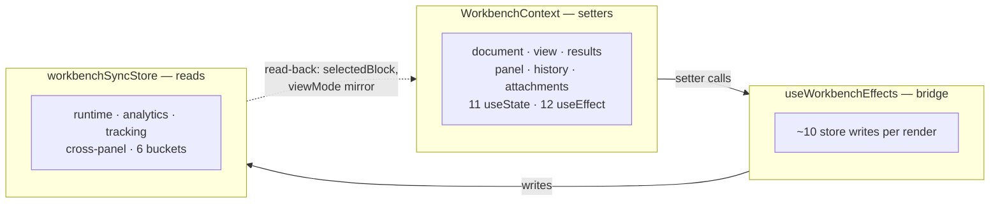
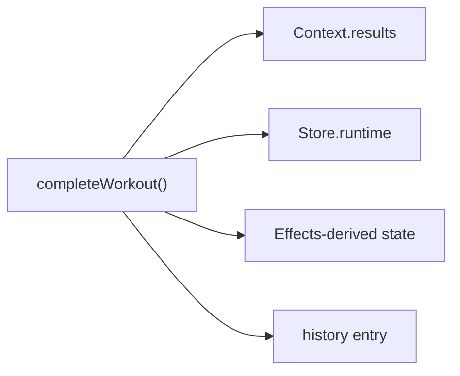
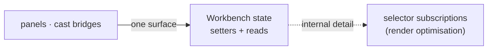

# 1. The workbench state layer — three carriers, no locality

> Surveyed 2026-06-19. Severity: **Critical.** Subsystem: React state / contexts.

## Modules involved

| Module                                         | Size   | Role                                                                                                                             |
| ---------------------------------------------- | ------ | -------------------------------------------------------------------------------------------------------------------------------- |
| `src/contexts/WorkbenchContext.tsx`            | 724 ln | God module: 11 `useState`, 12 `useEffect`, ~30-field interface. Owns document/view/results/panel/history/attachment **setters**. |
| `src/stores/workbenchSyncStore.ts`             | 284 ln | Zustand store, 6 state buckets, ~25 actions. Owns runtime/analytics/tracking/cross-panel **reads**.                              |
| `src/components/layout/useWorkbenchEffects.ts` | 200 ln | Bridge: ~10 store writes per render. The seam between the other two.                                                             |

First-party consumers: `useWorkbenchEffects`, `Workbench.tsx` (2). Store readers: 11+.

## Problem

Workbench state is split across three modules **by category**. WorkbenchContext
owns the setters; workbenchSyncStore owns the reads; useWorkbenchEffects is the
duct tape between them. The setter/read line is itself unstable — the emblem of
the missing locality:

- `selectedBlockId` lives in the store; `selectedBlock` lives in the store
  *and* is re-derived in the effects hook.
- `viewMode` flows Context → Store via a one-line effect.
- `completeWorkout` reads from **4 sources across 3 files** to assemble one
  result.

The store's own header says it "replaces the React Context-based pattern" —
yet the Context still exists at 724 ln. WorkbenchContext's header says runtime
management was "moved to ScriptRuntimeProvider" — an ongoing decomposition that
stalled halfway. The selector-re-render optimisation that justified the split
has become the dominant structural fact a maintainer must hold in mind.

Each carrier is **shallow** relative to the others: none alone answers "what is
the current workbench state, and what can I do to it."

## Diagrams

### Current — three carriers, no locality (Component level)

The dotted back-edge is the unstable setter/read line: `selectedBlock` lives in
the store yet is re-derived in the effects hook; `viewMode` flows
Context→Store via a one-line effect.

### Current — `completeWorkout` reads 4 sources across 3 files (Code level)

### Proposed — one workbench state module (Component level)

The selector-subscription optimisation that justified the split becomes an
internal concern of one module, not three modules every consumer crosses.

## Deletion test

- Delete WorkbenchContext → its 12 effects' side-effects (persistence calls,
  attachment processing, history loading) reappear spread across whatever
  consumes it. **Complexity spreads — load-bearing.**
- Delete workbenchSyncStore → the selector-based read rail the cast bridges
  and panels depend on vanishes. **Load-bearing.**
- Delete useWorkbenchEffects → the Context↔Store mirroring stops; state
  desynchronises. **Load-bearing.**

All three are load-bearing individually; the friction is that they are *three*
modules where one coherent state module would do. The deletion test here is
applied to the **boundary** between them, not any one file.

## Solution (plain English)

Make workbench state one coherent module so the question "what is the current
workbench state, and what can I do to it" has one home. The Context-vs-Store-
by-category split was an optimisation (selector subscriptions for render
performance) that should be an **internal** concern of one state module — not
three modules every consumer and maintainer must cross.

The unstable setter/read line (`selectedBlockId` vs `selectedBlock`,
`viewMode` mirroring, the 4-source `completeWorkout`) is the design pressure
telling us the category-split was the wrong seam.

## Benefits

- **Locality** — `completeWorkout`'s 4-source read is the emblem. A bug in
  workbench state today requires holding Context + Store + Effects in mind.
- **Leverage** — consumers learn one state surface instead of three; the
  selector subscription optimisation keeps working as an internal detail.
- **Tests** — the workbench has **no direct tests** today precisely because
  its behaviour is smeared across Context setters, Store actions, and an
  Effects bridge that only fires inside React. One state module is exercisable
  without rendering. The interface becomes the test surface.

## Implementation

### Target shape

One Zustand store owns **all** workbench state (document, view, results, panel,
runtime, analytics, cross-panel) with setters + reads co-located.
`WorkbenchContext` shrinks to a thin React adapter (or is removed if hooks
suffice). `useWorkbenchEffects` dissolves — its bridging becomes direct store
actions at the few mutation sites. Selector subscriptions stay (they are the
store's internal render optimisation, not a structural fact).

### Steps

1. **Single-source `selectedBlock` / `selectedBlockId`.** Make the store
   canonical; delete the re-derivation in `useWorkbenchEffects`; update readers.
2. **Single-source `viewMode`.** Store canonical; delete the Context→Store
   mirror effect.
3. **Migrate `WorkbenchContext` buckets into the store one at a time**
   (document → results → panel → history → attachments), keeping the build
   green between each. Update the 2 consumers + the effects hook each step.
4. **Rehome the 12 effects' side-effects** to their owners (persistence → a
   save effect tied to `saveState`; attachments → an attachment helper), then
   delete `WorkbenchContext` (or reduce to a scoping provider if something
   still needs React-context scoping).
5. **Dissolve `useWorkbenchEffects`** — replace its bridging with direct store
   actions at the mutation sites.
6. **Add a non-React test** that drives the store through its actions and
   asserts observable state.

### Tests

- **Add** `workbenchState.test.ts` — drives actions directly (content set,
  workout complete, attachment add), asserts state incl. the `completeWorkout`
  flow that today reads 4 sources.
- **Keep** the cast bridges reading the same 7 store fields until S4 runs.

### Acceptance

- `bun run test` green; `bun x tsc --noEmit` clean on the touched surface.
- `completeWorkout` reads from one module.
- A state change assertable without rendering React.

### Risks

- The 12 effects do real persistence/attachment work — **move** side-effects,
  don't drop them.
- Cast bridges depend on 7 store fields — **sequence after S4** (or keep the
  field set stable during migration).
- `WorkbenchContext.tsx` is the biggest churn hotspot (CLAUDE.md) — small
  steps, green between each.

### Stories

- **S1a** — ✅ single-source the unstable fields (`selectedBlock`, `viewMode`).
- **S1b** — ⏸ focused-session deferral. The remaining migration of `WorkbenchContext` buckets (document → results → panel → history → attachments) plus the rehoming of 12 effects' side-effects and the full retirement of the 724-line god module were scoped out of this session. The doc's own risk note flags WorkbenchContext as the "biggest churn hotspot" requiring "small steps, green between each" — and the migration of 5 buckets + 12 effects with persistence/attachment side-effects is multiple focused sessions. Forcing a partial migration in this session risked breaking the build gates (the workbench is the app's heart; the playground + storybook builds would fail). Pattern proven by S1a (selectedBlock + viewMode already in the store); the remaining bucket-by-bucket migration is the documented next session.
- **S1c** — ⏸ focused-session deferral. Dissolving `useWorkbenchEffects` (the bridge between Context and store) and adding the non-React state test depend on the S1b bucket migration landing first — once the store holds the migrated state, the effects bridge has no work to do, and the test exercises the store's actions directly. Both are deferred with S1b.

Dependency detail lives in `00-global-plan.md`.

## Evidence

- `WorkbenchContext.tsx:37-103` — the ~30-field `WorkbenchContextState`.
- `WorkbenchContext.tsx:125-723` — one `WorkbenchProvider` body, ~600 ln.
- `workbenchSyncStore.ts:1-24` — header claims it "replaces" the Context
  pattern that still exists.
- `useWorkbenchEffects.ts` — 10 store writes per render bridging the two.
- `WorkbenchContext.tsx:25-32` — header declares runtime "moved to
  ScriptRuntimeProvider" (decomposition stalled mid-way).

## Related

- **#4 (Cast session/wiring):** the store's 7 cast-adjacent fields exist
  solely to feed the cast bridges — a symptom of the same "state split to
  cross a React boundary" pattern.
- **#3 (ScriptRuntime):** the runtime lifecycle that was *partially* extracted
  out of WorkbenchContext into `RuntimeLifecycleProvider`.
