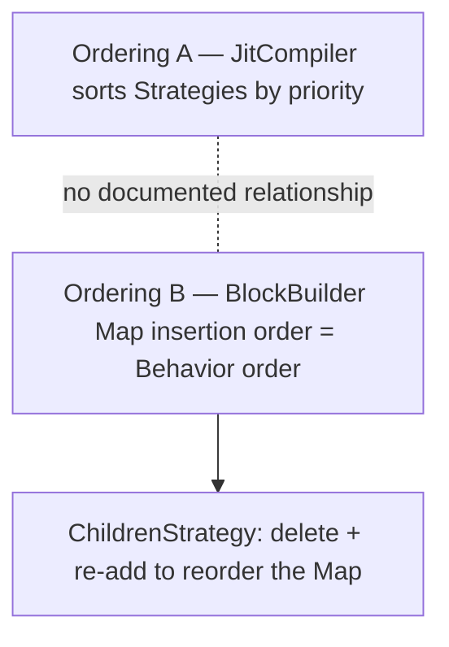
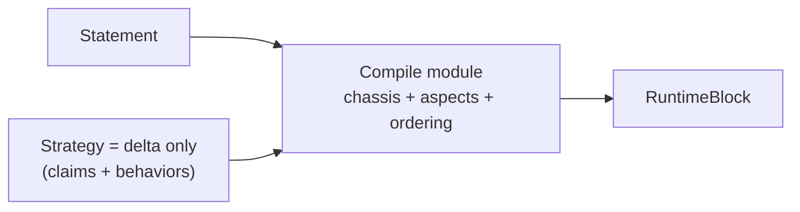

# 2. The Statement→Block compile pipeline — chassis fragmented across 8 modules

> Surveyed 2026-06-19. Severity: **Critical.** Subsystem: runtime compiler.

## Modules involved

| Module | Size | Role |
|--------|------|------|
| `src/runtime/compiler/JitCompiler.ts` | 148 ln | `compile()`: 6 sequenced steps; cache gated on step 1. |
| `src/runtime/compiler/BlockBuilder.ts` | 374 ln | Fluent setters + 3 aspect composers + `IBehaviorFactory` seam. |
| `src/runtime/compiler/BlockTemplate.ts` | ~100 ln | Pure-data interface; 5 consumers all fill the same shape. |
| `src/runtime/compiler/BlockTemplateComposer.ts` | 121 ln | The 7-step "common chassis." |
| `src/runtime/compiler/ConcreteBehaviorFactory.ts` | 66 ln | 3-entry registry; **only adapter**. |
| `src/runtime/compiler/contracts/IBehaviorFactory.ts` | 71 ln | Interface with **one implementer**. |
| 9 strategies under `src/runtime/compiler/strategies/` | — | 4 are constructor-aliases (SessionRoot, Idle, Rest, WaitingToStart). |
| `src/runtime/services/runtimeServices.ts` | 50 ln | `PRODUCTION_STRATEGIES` registration list. |

Domain terms: a **Strategy** assigns **Behaviors** to a **Block** compiled from
**Statements**. See `CONTEXT.md`.

## Problem

"How does a Statement become a running Block?" bounces across **7+ modules**:
`StartSessionAction → SessionRootStrategy → SessionRootBlock →
ChildSelectionBehavior → CompileAndPushBlock → JitCompiler → BlockBuilder →
BlockTemplateComposer → RuntimeBlock`.

Three structural defects:

1. **The chassis didn't centralize.** BlockTemplateComposer was meant to lift
   the common 7-step chain, but `EffortFallbackStrategy` still hand-rolls it
   (lines 67-78), and the composer *duplicates* `BlockBuilder.asTimer()`'s
   timer-mode → `completesBlock` mapping (`BlockTemplateComposer.ts:96` vs
   `BlockBuilder.ts:199-200`). The same rule lives in two places.

2. **Two undeclared orderings govern Behavior execution.** JitCompiler's
   priority sort (`JitCompiler.ts:130`) decides **Strategy** order;
   BlockBuilder's `Map<constructor, behavior>` insertion order decides
   **Behavior** order. `ChildrenStrategy.ts:107-111` explicitly deletes and
   re-adds `MetricPromotionBehavior` to move it to the Map's end — leaning on
   the private convention "Map preserves insertion order; delete + re-add puts
   the key last." The two orderings have **no documented relationship.**

3. **The `IBehaviorFactory` seam is hypothetical.** One adapter
   (`ConcreteBehaviorFactory`); `BlockBuilder.ts:19` still imports the three
   concrete Behavior constructors directly; **zero callers** of
   `setBehaviorFactory`. The JSDoc claim that the factory is "the only place
   that imports behavior constructors" is false.

Additionally, **4 of 9 "strategies" never match** — SessionRoot, Idle, Rest,
WaitingToStart have `match()` returning false and `apply()` as a no-op; their
real entry is a `build()` factory. They are constructors dressed as Strategies
to satisfy a uniform list.

## Diagrams

### Current — the Statement→Block bounce path, 7+ modules (Component level)

```mermaid
flowchart LR
  ST["Statement"] --> A1["StartSessionAction"]
  A1 --> A2["SessionRootStrategy.build"]
  A2 --> A3["SessionRootBlock"]
  A3 --> A4["ChildSelectionBehavior"]
  A4 --> A5["CompileAndPushBlockAction"]
  A5 --> A6["JitCompiler.compile"]
  A6 --> A7["BlockBuilder"]
  A7 --> A8["BlockTemplateComposer"]
  A8 --> A9["RuntimeBlock — running"]
```

### Current — two undeclared orderings (Component level)

A reader must understand **both** orderings to answer "does this Behavior run
before that one?" — and the link between them is a private Map convention, not
a contract.

### Proposed — deeper compile module (Component level)

The chassis, aspect composition, and the behavior-ordering contract move behind
one interface; a Strategy contributes only its delta.

## Deletion test

| Delete | Verdict |
|--------|---------|
| `IBehaviorFactory` + `ConcreteBehaviorFactory` | Inline the 3 `new` calls into `BlockBuilder.asTimer()`/`asContainer()`. No tests break, no caller changes. **Pass-through.** |
| `BlockTemplate.ts` (interface only) | Move inline into `BlockTemplateComposer.ts` as a param type. Zero callers change. **Pass-through.** |
| 4 constructor-aliased strategies | Replace with 4 functions returning `IRuntimeBlock`. Their slot in `PRODUCTION_STRATEGIES` is registration, not strategy. **Pass-through.** |
| `BlockTemplateComposer.ts` | Each strategy's ~20-line chain returns (5 call sites). Complexity spreads — **load-bearing, but shallow.** |
| `JitCompiler.compile()` | PromotionResolver, BlockBuilder, BlockTemplateComposer, DialectRegistry all become orphans; cache-invalidation reasoning scatters. **Load-bearing.** |

## Solution (plain English)

Deepen the compile module so the **chassis** (the 7-step composition chain),
the **aspect composition** (timer/repeater/container), and the
**behavior-ordering contract** sit behind one interface. A Strategy then
contributes only its **delta**: which Statements it claims, plus which
Behaviors it adds.

- Retire the hypothetical `IBehaviorFactory` seam (one adapter = no seam).
- Stop forcing block-factories (SessionRoot, Idle, Rest, WaitingToStart) and
  JIT Strategies to share one `IRuntimeBlockStrategy` interface — split the
  block-factory role from the strategy role so 4 of 9 entries stop being
  dead weight in the match pipeline.
- Make the priority-sort-vs-Map-insertion-order relationship **explicit and
  single-sourced.** Today it is the most correctness-risky defect in the area.

## Benefits

- **Locality** — the Behavior-execution-order invariant gets one home; "does
  this Block emit `MetricPromotionBehavior`?" stops requiring 3 files
  (AmrapLogic + BlockBuilder.build + RuntimeBlock memory).
- **Leverage** — a new Strategy is its delta, not a 115 ln file re-deriving
  metrics every Strategy already derives (rep-scheme, first-Duration, etc.).
- **Tests** — `BlockTemplate.test.ts` is currently a characterization test
  that pins the composer against an in-test "legacy" function the test itself
  defines (lines 144-180) — parity with itself. A deeper compile interface
  lets Strategies be tested through the **real** composition path.

## Implementation

### Target shape

A compile module owns the **chassis** (the 7-step composition chain), the
**aspect composition** (timer/repeater/container), and **one explicit
behavior-ordering**. Strategies implement a narrow `match(statements) → bool` +
`apply(builder, statements)` interface where `apply` adds only the delta.
Block-factories (SessionRoot, Idle, Rest, WaitingToStart) get a **separate**
interface and leave `PRODUCTION_STRATEGIES`.

### Steps

1. **Delete the hypothetical seams.** Remove `IBehaviorFactory` +
   `ConcreteBehaviorFactory`; inline the 3 `new` calls in
   `BlockBuilder.asTimer`/`asContainer`. (Grep first: zero callers of
   `setBehaviorFactory`.)
2. **Split constructor-aliased strategies out** of the JIT list
   (SessionRoot, Idle, Rest, WaitingToStart) into a block-factory registry;
   remove from `PRODUCTION_STRATEGIES`.
3. **Single-home the timer-mode → `completesBlock` mapping** (keep in
   `BlockBuilder.asTimer`; have `BlockTemplateComposer` call it). Delete the
   duplicate at `BlockTemplateComposer.ts:96`.
4. **Route `EffortFallbackStrategy` through the composer** — delete its
   hand-rolled chassis (lines 67-78).
5. **Make behavior ordering explicit.** Add an ordered-add API on BlockBuilder
   (e.g. `addBehaviorLast`) so order is a contract, not Map insertion order.
   **Write an order-pinning test first**, then delete the ChildrenStrategy
   delete+re-add hack (107-111).
6. **Delete `createFullCompiler`** deprecated alias (0 callers).

### Tests

- **Add (before step 5)** a behavior-order test asserting `MetricPromotion`
  runs last — pins current order so step 5 is a verified change, not a gamble.
- **Add** strategy-delta tests through the real compile path.
- **Delete** the `BlockTemplate` parity characterization test (it pins the
  composer against an in-test function the test itself defines).
- **Safety net:** `tests/runtime-compliance/` is the behavior-order regression
  suite — run it after every step.

### Acceptance

- `bun run test` green; `tests/runtime-compliance/` + `tests/jit-compilation/`
  green.
- "Does this Block emit `MetricPromotionBehavior`?" answerable from one file.

### Risks

- **Step 5 is the riskiest** — behavior order is load-bearing. The
  runtime-compliance suite is the safety net; the order-pinning test (step 5
  precondition) makes the change auditable.
- `JitCompiler.ts:117` cache is gated on promotions — don't touch the
  promotion path.
- `JitCompiler.ts` is shared with S5a and S3b — **one compiler-track story at a
  time.**

### Stories

- **S2a** — ✅ delete hypothetical seams + constructor-alias strategies.
- **S2b** — ✅ dedupe chassis; route EffortFallback through the composer.
- **S2c** — ✅ explicit behavior ordering. Added `BlockBuilder.moveBehaviorLast(type)` — the contract-named API for moving an already-added behavior to the end of the behavior list (replaces the `getBehavior → removeBehavior → addBehavior` hack in `ChildrenStrategy.ts:107-111`). The order-pinning test in `ChildrenStrategy.test.ts` pins the real contract: `MetricPromotionBehavior` runs AFTER `ChildSelectionBehavior` in the built block (`childIdx < promoIdx`); the build-time `CompletionTimestampBehavior` universal invariant is appended after strategies and is not part of the strategy-ordering contract. The move semantics (`delete + set` = Map end position) are identical to the previous hack, so behavior is preserved.

## Evidence

- `JitCompiler.ts:117` — forces `cacheKey = null` when promotions apply (cache
  gated on step 1).
- `JitCompiler.ts:130` — priority re-sort (Strategy order).
- `BlockBuilder.ts:115` — `addBehavior` keyed by `behavior.constructor`
  (Behavior order).
- `ChildrenStrategy.ts:107-111` — delete + re-add to move to Map end.
- `EffortFallbackStrategy.ts:67-78` — hand-rolled chassis bypassing the
  composer.
- `BlockTemplateComposer.ts:96` vs `BlockBuilder.ts:199-200` — duplicated
  timer-mode → `completesBlock` mapping.
- `BlockBuilder.ts:19` — direct imports of the concrete Behavior constructors
  the factory was supposed to own.

## Related

- **#3 (ScriptRuntime):** the execution engine that consumes the Blocks this
  pipeline produces.
- **#5 (Dialect Stack):** the JitCompiler also runs the empty compile-time
  DialectRegistry (see finding 5).
