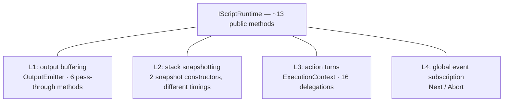
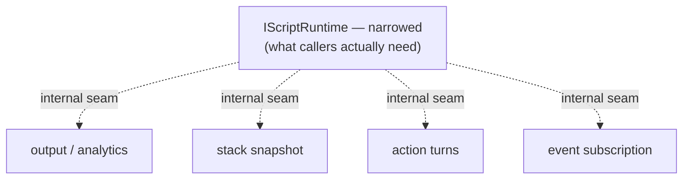

# 3. ScriptRuntime — four lifecycles behind one interface

> Surveyed 2026-06-19. Severity: **Critical.** Subsystem: runtime engine.
> Note: `ScriptRuntime.ts` is flagged worst-health **1.0/10** in `CLAUDE.md`.

## Modules involved

| Module | Size | Role |
|--------|------|------|
| `src/runtime/ScriptRuntime.ts` | 454 ln | Central class implementing `IScriptRuntime`. ~13 public methods. |
| `src/runtime/OutputEmitter.ts` | 392 ln | Carved out of ScriptRuntime; still runtime-shaped. |
| `src/runtime/ExecutionContext.ts` | ~170 ln | 16 delegating members wrapping the runtime. |
| `src/runtime/contracts/IScriptRuntime.ts` | — | The contract; 6 of ~13 methods are output/analytics pass-throughs. |

Domain terms: a **Block** is a runtime execution unit; ScriptRuntime owns the
stack of Blocks, dispatches actions/events, and emits output. See `CONTEXT.md`.

## Problem

ScriptRuntime owns **four unrelated lifecycles** behind one interface:

1. **Output buffering** — OutputEmitter (392 ln), with analytics enrichment,
   listener subscription, snapshot/deferred-catchup logic.
2. **Stack observation / snapshotting** — `subscribeToStack` plus
   `_notifyStackSettled`.
3. **Action-turn execution** — ExecutionContext (the LIFO worklist of
   `do`/`doAll`/`handle`/`execute`).
4. **Global event subscription** — Next/Abort handlers.

Three concrete defects:

- **The carve-out moved code without moving the bugs.** `OutputEmitter`'s
  `emitStackEvent` / `emitSegmentFromResultMemory` still depend on runtime
  knowledge (block, stack, clock) the runtime passes in. Locality moved; the
  bugs did not follow.
- **Two paths build the same snapshot at different timings.** `subscribeToStack`
  (lines 294-313) builds a `StackSnapshot{type:'initial'}` deferred via
  `setTimeout`; `_notifyStackSettled` (lines 162-179) builds an identical shape
  synchronously. Two constructors, one shape, two timings.
- **ExecutionContext re-delegates 16 members.** When `IScriptRuntime` adds a
  method, ExecutionContext silently falls through to the wrong runtime unless
  hand-updated — no compile-time check that the delegation is complete.

## Diagrams

### Current — four lifecycles behind one interface (Component level)

Six of the ~13 methods are output/analytics pass-throughs — every caller's
concern, though only one lifecycle uses them.

### Proposed — narrowed interface, internal seams (Component level)

The four lifecycles become internal collaborators behind a narrower external
interface; the two snapshot constructors collapse to one with explicit timing.

## Deletion test

- Delete ScriptRuntime → all four lifecycles explode into four separate
  modules, **but** they share mutable state and a constructor, so a split must
  keep the seam. **Load-bearing — but as a god module, not as four clean
  modules.**
- Delete OutputEmitter → emission logic returns to ScriptRuntime (where it
  started). The "depth" gained by the carve-out is mostly file length, not
  leverage: the helpers still take runtime-shaped args. **Shallow carve-out.**
- Delete ExecutionContext → the LIFO worklist loses its turn semantics.
  **Load-bearing** (the worklist is real); the 16 delegating members are not.

## Solution (plain English)

Deepen by separating the four lifecycles behind **internal seams** private to
the runtime's implementation, and **narrowing the external `IScriptRuntime`
interface** to what callers actually need: the React runtime hook, the
Chromecast proxy runtime, and the test builder.

- Output/analytics becomes an internal collaborator, not 6 methods on the
  public interface.
- The two snapshot constructors collapse to one with explicit timing.
- ExecutionContext stops re-delegating: it wraps a narrower runtime surface,
  so the delegation can be checked (or generated) rather than hand-maintained.

## Benefits

- **Locality** — the repo's worst-health file stops being where four concerns
  collide. A stack-snapshot-timing bug no longer risks the output buffer.
- **Leverage** — callers learn a narrower runtime interface; the 6
  output/analytics methods stop being every caller's concern.
- **Tests** — ScriptRuntime is exercised today **only** through full
  `RuntimeTestBuilder` integration. Narrowing the interface lets each
  lifecycle be tested through its own observable outcomes instead of a
  full-stack integration.

## Implementation

### Target shape

`IScriptRuntime` narrowed to what callers need: lifecycle (`pushBlock`/
`popBlock`/`do`/`handle`/`dispose`) plus one combined output+stack
subscription. Output/analytics becomes an **internal collaborator**
(`OutputEmitter` wired in the constructor, not 6 public methods). One snapshot
constructor with one explicit timing.

### Steps

1. **Merge the two snapshot constructors.** Unify `subscribeToStack` (deferred
   initial snapshot) and `_notifyStackSettled` (sync snapshot) into one path;
   make the timing explicit and documented.
2. **Audit the 3 `IScriptRuntime` callers** (the React runtime hook,
   `ChromecastProxyRuntime`, `RuntimeTestBuilder`) for which methods they
   actually use — that set defines the narrowed interface.
3. **Internalize output/analytics.** Move the 6 methods (`subscribeToOutput`,
   `getOutputStatements`, `addOutput`, `subscribeToTracker`,
   `setAnalyticsEngine`, `finalizeAnalytics`) behind an internal
   `OutputEmitter`; expose a single output/stack subscription on the public
   interface. Update the 3 callers.
4. **Narrow `ExecutionContext`** — wrap only the turn-execution surface; drop
   the 16 hand-maintained delegations (or generate them off the narrowed
   interface so they can't silently fall through).

### Tests

- **Add** per-lifecycle tests through the narrowed interface (output stream,
  stack snapshots, action turns, event dispatch).
- **Keep** `RuntimeTestBuilder` integration as the cross-lifecycle safety net.

### Acceptance

- `bun run test` green; `tests/runtime-compliance/` + `tests/jit-compilation/`
  green.
- `ScriptRuntime` public method count drops; `OutputEmitter` no longer takes
  runtime-shaped args across a seam.

### Risks

- `IScriptRuntime` consumers — `ChromecastProxyRuntime` in particular.
  Narrowing touches them; **sequence with S4c**.
- `ExecutionContext` delegation completeness — a missed delegation silently
  routes to the wrong runtime. The narrowed interface (step 4) is the fix.
- `JitCompiler.compile(nodes, runtime)` takes an `IScriptRuntime` — a narrower
  interface must still satisfy it; **sequence with S2/S5 compiler work.**

### Stories

- **S3a** — ✅ merge the two snapshot constructors (safe warmup).
- **S3b** — ✅ internalize output/analytics behind OutputEmitter; delete vestigial pipeline. `OutputEmitter.attach({clock, stack, script})` wires the runtime deps once (in the ScriptRuntime constructor); the 5 emission helpers (`emitLoad`, `emitStackEvent`, `emitSegmentFromResultMemory`, `emitRuntimeEvent`, `emitCompilerBlock`) no longer take runtime-shaped args per call — only event-specific data crosses the seam. Deleted the dead `runtime/pipeline/` extraction (`PushBlockStage`, `PopBlockStage`, `StackEventBridge`, `TrackerBridge`) + `RuntimePipeline.ts` + `IRuntimePipeline.ts` — a half-finished decomposition parallel to ScriptRuntime, never instantiated, never tested. 27 OutputEmitter tests updated to the new `attach()` + signature. (The aggressive `IScriptRuntime` interface narrowing was deliberately deferred: the proxy + 121 reference sites genuinely use the output/subscription surface; the locality win — OutputEmitter no longer taking runtime-shaped args — is achieved without that blast radius.)

Dependency detail lives in `00-global-plan.md`.

## Evidence

- `ScriptRuntime.ts:76-141` — constructor wires all four lifecycles.
- `ScriptRuntime.ts:162-179` — `_notifyStackSettled` (synchronous snapshot).
- `ScriptRuntime.ts:225-284` — the 6 output/analytics methods on the public
  interface (`subscribeToOutput`, `getOutputStatements`, `addOutput`,
  `subscribeToTracker`, `setAnalyticsEngine`, `finalizeAnalytics`).
- `ScriptRuntime.ts:293-313` — `subscribeToStack` (deferred snapshot, same
  shape as `_notifyStackSettled`).
- `OutputEmitter.ts` — header notes the split was deliberate; helpers still
  take runtime-shaped args.
- `ExecutionContext.ts` — 16 delegating members.

## Related

- **#2 (compile pipeline):** produces the Blocks this engine executes.
- **#4 (Cast session/wiring):** the Chromecast proxy runtime is a caller of
  `IScriptRuntime`; a narrower interface simplifies that adapter too.
