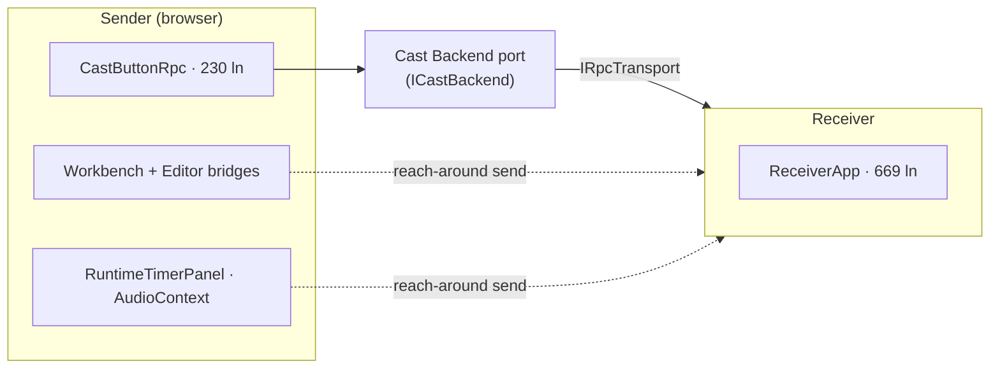
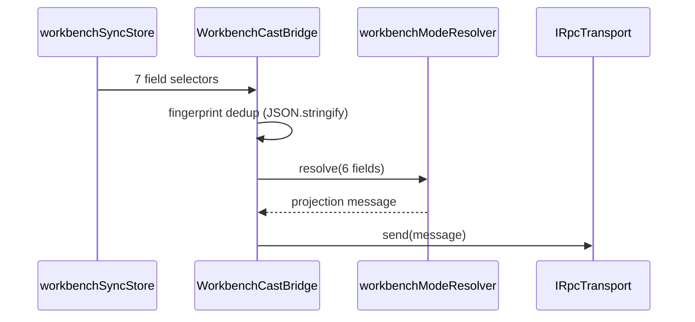
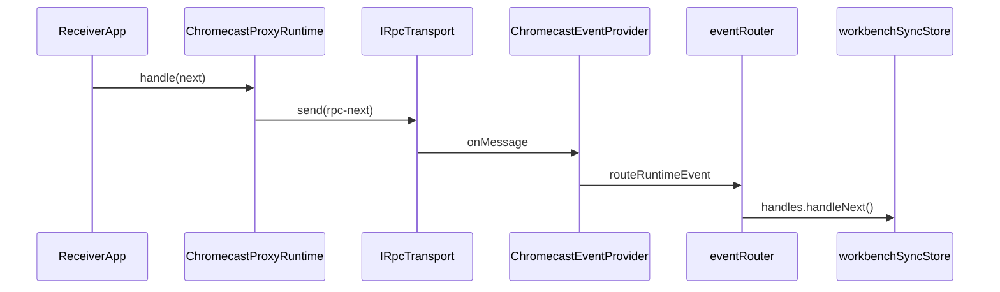
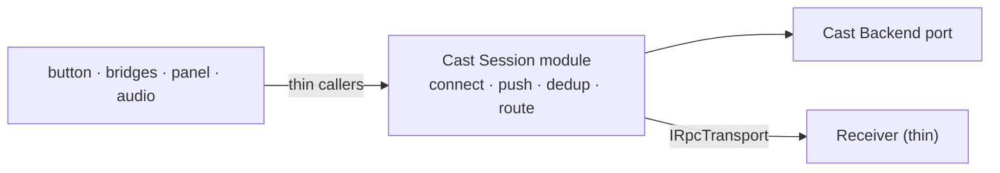

# 4. The Cast session/wiring layer — a clean port undermined by the layer above it

> Surveyed 2026-06-19. Severity: **High.** Subsystem: Cast.
> See also `docs/cast-architecture-plan.md` (the prior plan; sender side largely
> achieved, receiver side and component orchestration largely not).

## Modules involved

| Module | Size | Role |
|--------|------|------|
| `src/services/cast/ICastBackend.ts` | 105 ln | **The clean seam** — the Cast Backend port. 2 real adapters. |
| `src/services/cast/adapters/ChromecastBackend.ts` | 181 ln | Production adapter. |
| `src/services/cast/adapters/LocalTabBackend.ts` | 281 ln | Dev/dual-pane adapter. |
| `src/components/organisms/cast/CastButtonRpc.tsx` | 230 ln | Plan targeted ~40; carries 6 concerns. |
| `playground/src/receiver-rpc.tsx` | 669 ln | ReceiverApp; bypasses `ReceiverSessionManager`. |
| `src/services/cast/rpc/CastSessionManager.ts` | 285 ln | Session manager + dead `registerRuntime` machinery. |
| `src/services/cast/rpc/ReceiverSessionManager.ts` | 164 ln | Receiver factory; bypassed by ReceiverApp. |
| `WorkbenchCastBridge.tsx` / `EditorCastBridge.tsx` | 57 / 152 ln | Duplicated `lastFingerprintRef` dedup. |
| `ChromecastRuntimeSubscription.ts` | 130 ln | Holds the original fingerprint dedup (3rd copy). |
| `RuntimeTimerPanel.tsx` / `AudioContext.tsx` | — / 87 ln | Reach around the stack via `useCastTransport`. |

Domain terms: the **Cast Backend** turns "user wants to cast" into a connected
`IRpcTransport`. The friction is in the *session/wiring layer above it*.
See `CONTEXT.md`.

## Problem

The Cast Backend port is a **real, well-shaped seam** (two adapters: chromecast
+ local; documented lifecycle and state semantics). But the session/wiring
layer above it never centralised the way `docs/cast-architecture-plan.md`
intended:

- **`CastButtonRpc` still does the orchestration the plan was supposed to
  remove** (target ~40 ln, actual 230). It carries: session-manager
  construction, a 45-line `connectSession` that re-does the connect-time
  workbench push, event routing via `eventRouter`, an imperative DOM click
  listener (chosen to dodge stale-closure problems), `pagehide` dispose, and a
  fan of `useRef` mirrors for backend state.
- **The 669-ln ReceiverApp bypasses `ReceiverSessionManager`** and rebuilds
  `ChromecastProxyRuntime` + disconnect wiring in **3 separate places**
  (`receiver-rpc.tsx:228, 305, 549`), each with its own
  `handle.onWorkbenchUpdate` subscription.
- **The same fingerprint dedup is reimplemented 3×** — `WorkbenchCastBridge`,
  `EditorCastBridge`, `ChromecastRuntimeSubscription` — two via `JSON.stringify`,
  one via a `computeFingerprint` method.
- **`RuntimeTimerPanel` and `AudioContext` reach around the session manager**,
  calling `castTransport.send(...)` directly. `rpc-audio` is the only RPC type
  that flows sender→receiver outside the session manager.

Reader cost: tracing one inbound D-Pad "Next" press crosses **9 modules**
(`ReceiverApp.onSelect` → proxy runtime → RPC → transport →
`ChromecastEventProvider` → `CastSessionHandle.eventProvider` → `eventRouter`
→ `useWorkbenchSyncStore.handles.handleNext`).

Adding a new RPC message type today means touching: the sender subscription,
the receiver's `handleRpcMessage` switch, the `eventRouter` switch, the
`RuntimeEventHandles` interface, *and* a bridge.

## Diagrams

### Current — sender / receiver topology (Container level)

The Cast Backend port is a clean seam; the bridges and panel bypass it with
direct `castTransport.send` calls.

### Current — outbound workbench-update path (Component level)

The fingerprint dedup is reimplemented 3× (WorkbenchCastBridge,
EditorCastBridge, ChromecastRuntimeSubscription).

### Current — inbound D-Pad "Next" crosses 9 modules (Component level)

### Proposed — Cast Session module (Component level)

One fingerprint-dedup strategy, one outbound path, one inbound path; React
components become thin callers.

## Deletion test

- Delete `ReceiverSessionManager.createReceiverSession` → every caller
  duplicates the same `audioUnsub + transportDisconnectedUnsub +
  workbenchListeners + dispose` pattern (already happening in 3 React sites).
  **Load-bearing — but earning 60 ln of clarity against 200+ ln of
  duplication that was supposed to migrate out of React.**
- Delete `CastSessionManager` → the 6 concerns in `CastButtonRpc` have nowhere
  to go. **Load-bearing.**
- Delete `registerRuntime`/`unregisterRuntime` (CastSessionManager:208-241) →
  zero production callers; only 4 tests + 50 ln of manager + the
  `extraSubscriptions` map. **Pass-through — dead machinery.**
- Delete `useCastSignaling.ts` barrel → 2 callers import directly from
  `@/services/cast/rpc`. **Pass-through.**
- Delete `eventRouter.ts` → its single caller inlines a 4-case switch.
  **Pass-through** (a `Map<string, () => void>`).

## Solution (plain English)

Deepen the **Cast Session module** — the layer between the Cast Backend port
and the React components — so that connect, the initial workbench push,
fingerprint-deduplicated outbound updates, and inbound event routing all live
behind one interface.

- The button, bridges, timer panel, and audio context become **thin callers**.
- The ReceiverApp stops rebuilding the proxy runtime inline; it reads a handle
  and renders.
- One fingerprint-dedup strategy, one outbound-update path, one inbound-event
  path.

This retires the unfinished Phase 1.3 (button ~40 ln) and Phase 2.2/2.3
(ReceiverApp simplified) of the existing plan.

## Benefits

- **Locality** — adding an RPC type goes from 5 touch-points to one module.
- **Leverage** — components learn one session interface instead of
  `useCastTransport` + `useWorkbenchSyncStore` + `eventRouter` separately.
- **Tests** — the dead `registerRuntime` machinery and the 3× fingerprint
  dedup are symptoms of a layer with **no testable interface**. A session
  module gives the cast round-trip a test surface that does not require a
  669-ln React app to run.

## Implementation

### Target shape

`CastSessionManager` owns connect, the initial workbench push,
fingerprint-deduplicated outbound updates, and inbound event routing. React
components (button, bridges, timer panel, audio) become **thin callers**. The
`ReceiverApp` reads a `ReceiverSessionHandle` and renders — no inline
`ChromecastProxyRuntime` construction.

### Steps

1. **Delete dead machinery.** Remove `registerRuntime`/`unregisterRuntime` +
   `extraSubscriptions` + their 4 tests (0 production callers).
2. **Delete the barrel + inline the router.** Remove `useCastSignaling.ts`;
   point its 2 consumers at `@/services/cast/rpc/*` directly. Inline
   `eventRouter`'s 4-case switch at `CastButtonRpc`.
3. **Centralize outbound.** Move the connect-time workbench push
   (`CastButtonRpc.connectSession`, lines 70-115) and the fingerprint dedup
   into `CastSessionManager`; expose `session.pushWorkbench(state)`. Delete the
   2 bridge copies of the dedup (`WorkbenchCastBridge`, `EditorCastBridge`).
4. **Stop the reach-arounds.** Route `RuntimeTimerPanel` + `AudioContext` sends
   through the session, not `castTransport.send` directly.
5. **Thin the `ReceiverApp`.** It calls `createReceiverSession` and subscribes
   via the handle; delete the 3 inline rebuilds
   (`receiver-rpc.tsx:228, 305, 549`).

### Tests

- **Add** a cast round-trip test through `CastSessionManager` using
  `FakeRpcTransport` (already in `src/testing/transport/`) — no 669-ln React
  app, no browser.
- **Delete** the 4 `registerRuntime` tests; the `eventRouter` test (inlined).

### Acceptance

- Cast round-trip assertable without a browser/React.
- `CastButtonRpc.tsx` ≈ 40 ln (the original plan target).
- `receiver-rpc.html` still boots in the playground build.

### Risks

- The 7 `workbenchSyncStore` fields feed the bridges — **coordinate with S1**
  (recommended: run S4 before S1's consolidation so the store field set is
  stable when S1 migrates).
- `ReceiverApp` lives in `playground/` — separate build surface; verify it
  still boots.
- `CastButtonRpc`'s imperative click listener dodges stale closures — preserve
  that semantics (or replace with React state cleanly).

### Stories

- **S4a** — ✅ delete dead machinery + barrel + inline router. (`eventRouter.ts` kept — 2 real consumers: `CastButtonRpc` + cast-roundtrip test.)
- **S4b** — partial: centralize the connect-time workbench push. Added `CastSessionManager.pushInitialWorkbench(message)` — the session owns the disconnect-tolerant `transport.send` so `CastButtonRpc.connectSession` no longer hand-rolls the try/catch around the outbound workbench update. The message resolution (state → RpcWorkbenchUpdate) stays at the call site, which already imports `workbenchModeResolver`; the manager is the I/O seam, not the policy seam. The "delete the 2 bridge dedup copies" (the reactive fingerprint dedup in `WorkbenchCastBridge`/`EditorCastBridge` reimplemented via `JSON.stringify`) is the remaining piece — it requires the manager to become reactive (subscribe to the workbench store and own the reactive outbound path), which is a larger architectural change beyond this focused session.
- **S4c** — ⏸ focused-session deferral. Thinning `ReceiverApp` (deleting the 3 inline `ChromecastProxyRuntime` rebuilds at `receiver-rpc.tsx:228, 305, 549` and routing through `createReceiverSession`) is a playground-side refactor scoped out of this session alongside the workbench migration. The receiver app is 669 lines and the 3 rebuilds are coupled to the (deliberately deferred) `IScriptRuntime` interface narrowing — thinning the receiver against a narrowed interface and finishing the proxy are coupled. Deferred to the focused session that also handles S3b's interface narrowing + S1b's store migration.

Dependency detail lives in `00-global-plan.md`.

## Evidence

- `ICastBackend.ts:49-55` — the 5-state union with no type-level transition
  guard; transitions encoded implicitly in each adapter's `setState` calls.
- `CastButtonRpc.tsx:70-115` — the 45-ln `connectSession`.
- `CastButtonRpc.tsx:122-149` — imperative `addEventListener('click', ...)`
  beside a React `onClick`.
- `receiver-rpc.tsx:198-235, 252-460, 521-567` — 3 sites rebuilding the
  receiver session.
- `CastSessionManager.ts:208-241` — dead `registerRuntime`/`unregisterRuntime`.
- `WorkbenchCastBridge.tsx:19,28-34`, `EditorCastBridge.tsx:41,81-83`,
  `ChromecastRuntimeSubscription.ts:31-37` — 3 fingerprint-dedup copies.
- `RuntimeTimerPanel.tsx:249-272`, `AudioContext.tsx:28-44` — direct
  `castTransport.send` reaching around the session manager.

## Related

- **#1 (workbench state):** the store's 7 cast-adjacent fields
  (`subscriptionManager`, `runtime`, `execution.status`, `viewMode`,
  `selectedBlock`, `documentItems`, `analyticsSegments`) exist solely to feed
  these bridges — a symptom of the same state-split-to-cross-React pattern.
- `docs/cast-architecture-plan.md` — the prior plan; this finding is its
  unfinished receiver/orchestration half.
