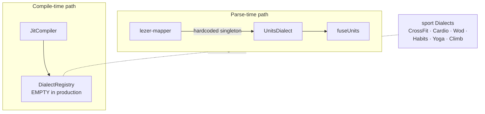
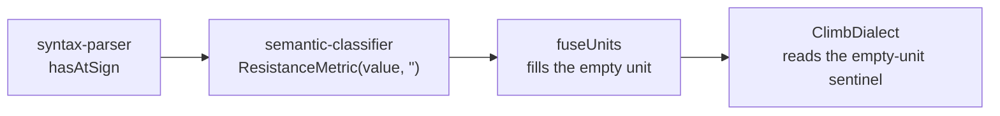
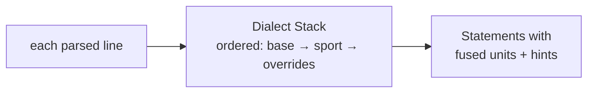

# 5. The Dialect Stack that doesn't exist (as a runnable module)

> Surveyed 2026-06-19. Severity: **High.** Subsystem: parser / dialects.
> **Lowest naming risk** — `CONTEXT.md` already defines the deep module.

## Modules involved

| Module | Size | Role |
|--------|------|------|
| `src/parser/lezer-mapper.ts` | 28 ln | Parse-time pipeline glue; hardcodes `baseUnits = new UnitsDialect()`. |
| `src/runtime/compiler/JitCompiler.ts` | 148 ln | Compile-time `new DialectRegistry()` — **empty in production**. |
| `src/services/DialectRegistry.ts` | 80 ln | `register`/`processAll` — only populated by test fixtures. |
| `src/dialects/UnitsDialect.ts` | 42 ln | The only Dialect with a `transform`; delegates to `fuseUnits`. |
| `src/dialects/units/fuseUnits.ts` | 344 ln | The Fusion algorithm; also holds the Dimension→Metric mapping. |
| `src/core/metrics/units/UnitRegistry.ts` | 141 ln | Unit→Dimension table. |
| Sport Dialects: `CrossFit`, `Cardio`, `Wod`, `Habits`, `Yoga`, `Climb` | 73-267 ln | All `analyze`-only; **never registered in production**. |

Domain terms: a **Dialect** recognizes a domain's patterns and emits **Hints**
+ domain **Metrics**; the **Dialect Stack** is the ordered list every line is
processed through (base **Units** Dialect → sport Dialects → personal-overrides,
later wins); **Fusion** rewrites adjacent bare Number + Text into dimensioned
Metrics. See `CONTEXT.md`.

## Problem

`CONTEXT.md` defines the **Dialect Stack** as the ordered list every line is
processed through. The code has **two parallel wirings that share no seam**:

1. **Parse-time path:** `lezer-mapper.ts:16` declares a module-singleton
   `const baseUnits = new UnitsDialect()`. Every `extractStatements` call runs
   this single Dialect on every statement. Hardcoded — no list, no extension
   hook. "Personal-overrides Dialect last" is **impossible** without forking
   the file.
2. **Compile-time path:** `JitCompiler.ts:40` constructs a `DialectRegistry`;
   `JitCompiler.compile():107` calls `dialectRegistry.processAll(...)`. But
   **no production path ever calls `registry.register()`**. The only
   registrations are test fixtures (`dialect-test-helpers.ts:25-50`,
   `application-launch.smoke.test.ts:41`).

So the six sport Dialects exist but **never run in production**. The deep
module `CONTEXT.md` already names does not exist as a runnable thing. Classic
one-adapter-everywhere: every real call site uses exactly one Dialect; the
registry is a **hypothetical seam**.

### Related leaks (same boundary)

- **The `@N` empty-unit sentinel crosses four layers.** `syntax-parser.ts:201-211`
  tags `hasAtSign`; `semantic-classifier.ts:107-111` emits
  `ResistanceMetric(value, '')` (importing a *runtime* metric class into the
  parser); `fuseUnits.ts:67-71` fills the empty unit; `ClimbDialect.ts:230-239`
  reads the same sentinel from a third layer to detect climb attempts. The
  leak is the *only* way the climb attempt-count feature works.
- **Slash/Pipe primitives thread a one-consumer signal through 4 files.**
  `syntax-facts.ts`, `syntax-parser.ts`, `semantic-classifier.ts`,
  `fuseUnits.ts` each carry the same explanatory comment ("fuseUnits consumes
  it for fraction conversion") verbatim. They exist solely so `fuseUnits` can
  match them.
- **Dimension→Metric mapping is split.** Unit→Dimension lives in `UnitRegistry`;
  Dimension→Metric (`length→Distance`, `mass→Resistance`) lives in
  `fuseUnits.ts:34-42`. A new Dimension needs edits in 3 files.

## Diagrams

### Current — two parallel wirings, no shared seam (Component level)

The Dialect Stack `CONTEXT.md` describes does not exist as a runnable thing:
one Dialect runs (hardcoded), the registry is empty, the sport Dialects are
orphaned.

### Current — the `@N` empty-unit sentinel crosses 4 layers (Code level)

A parser-internal contract is the only thing making the climb attempt-count
feature work — read from a fourth layer.

### Proposed — one real Dialect Stack (Component level)

The parse-time singleton and the empty compile-time registry collapse into one
ordered seam; the personal-overrides Dialect (a `CONTEXT.md` concept) becomes
possible.

## Deletion test

- Delete the compile-time `DialectRegistry` → production behaviour is
  identical (units already fused at parse time; sport Dialects never ran).
  **Pass-through in production.**
- Delete the parse-time `baseUnits` singleton → Fusion stops happening
  everywhere. **Load-bearing** — but it is a singleton, not a Stack.
- Delete Slash/Pipe primitive kinds → re-classify as `effort` with raw `'/'` /
  `'|'`; `fuseUnits` matches on the raw string. The 4-file scaffold collapses.
  **Pass-through** for the marker plumbing.

## Solution (plain English)

Make the **Dialect Stack a real module** — the single ordered place where the
base Units Dialect and the sport/personal Dialects are composed and run — so
the domain model in `CONTEXT.md` and the code agree. The parse-time singleton
and the empty compile-time registry collapse into one seam that actually has
the Stack behind it.

Co-locate the unit concept while doing so:

- The Dimension→Metric mapping moves next to the Unit Registry (one home for
  "what is a length at runtime"), out of `fuseUnits`.
- The `@N` empty-unit sentinel stops being a parser-internal contract read by
  a sport Dialect; if a "unit-less number pending fusion" concept is needed,
  it gets one named home, not four.
- Slash/Pipe stop being grammar-level primitive kinds carried through four
  modules for one consumer.

## Benefits

- **Locality** — "which Dialects run, in what order, where" has one answer
  instead of two parallel wirings. A new sport Dialect is registered once, not
  wired into a parser singleton.
- **Leverage** — the **personal-overrides Dialect** (a documented `CONTEXT.md`
  concept) becomes possible — today it is impossible.
- **Tests** — the Stack exists today **only in test helpers**
  (`dialect-test-helpers.ts` builds a fresh registry per Dialect). A real
  Stack module gives composition (ordering, later-wins, Hint accumulation) a
  test surface instead of leaving it implicit in fixture wiring.
- **Lowest naming risk** — `CONTEXT.md` already supplies "Dialect Stack."

## Implementation

### Target shape

A `DialectStack` module — the single ordered place where the base Units
Dialect + sport Dialects + personal-overrides register and run (transform then
analyze, per statement; later-wins metric merge; hint accumulation). Replaces
both the parse-time `baseUnits` singleton and the empty compile-time
`DialectRegistry`.

### Steps

1. **Remove the empty compile-time `DialectRegistry`** from `JitCompiler`
   (no-op in production) — or repurpose the file as the Stack.
2. **Build `DialectStack`:** ordered list, per-statement transform+analyze,
   later-wins metric merge, hint accumulation. Pure (statements in → statements
   + hints out).
3. **Wire it into the parse pipeline.** Replace `lezer-mapper`'s hardcoded
   `baseUnits` singleton with the Stack (Units Dialect as first entry);
   register the sport Dialects (CrossFit, Cardio, Wod, Habits, Yoga, Climb).
4. **Expose a personal-overrides registration point** (a `CONTEXT.md` concept
   that is currently impossible).
5. **Co-locate the unit concept.** Move the Dimension→Metric mapping from
   `fuseUnits` to the Unit Registry; give the `@N` empty-unit sentinel one
   named home (or eliminate it by having fusion own the `@N` case end-to-end).
6. **Delete Slash/Pipe primitive kinds** — re-classify as `effort` with raw
   `'/'`/`'|'`; `fuseUnits` matches the string. Collapses the 4-file scaffold.

### Tests

- **Add** `DialectStack` composition tests (ordering, later-wins, hint
  accumulation).
- **Add** sport-Dialect hint-emission tests — these **finally run in
  production** (new behavior).
- **Snapshot the hint set before/after** wiring sport Dialects — proves the
  behavior change is intentional.
- **Keep** the existing `fuseUnits` tests.

### Acceptance

- `DialectStack` is the single place Dialects run; `lezer-mapper` no longer
  hardcodes a singleton.
- A personal-overrides Dialect is registrable.
- `tests/parser-compliance/` + `tests/runtime-compliance/` green.

### Risks

- **Wiring sport Dialects to run is a behavior change** (they currently never
  run) — could surface unexpected hints. The before/after hint snapshot (above)
  is the guard.
- The `@N` sentinel is load-bearing for `ClimbDialect`'s attempt-count —
  **don't break climb**. Step 5 must preserve it.
- `lezer-mapper` is the parse pipeline entry — changing it touches every
  consumer (`md-timer`, `useRuntimeParser`, `parseScriptBlock`,
  `cursor-focus-panel`).
- `JitCompiler.ts` shared with S2/S3 — **one compiler-track story at a time.**

### Stories

- **S5a** — ✅ remove the empty compile-time `DialectRegistry`.
- **S5b** — ✅ build the real `DialectStack`; wire sport Dialects. `src/dialects/DialectStack.ts` (ordered list, per-statement transform+analyze, hint accumulation) replaces both the parse-time `baseUnits` singleton and the empty compile-time registry; `createDialectStack()` wires base Units first + the six sport Dialects + personal-overrides; `lezer-mapper.extractStatements` runs the full stack (production path), `extractStatementsRaw` is the test harness path. 14 composition + before/after snapshot tests in `src/dialects/__tests__/DialectStack.test.ts` pin ordering, hint accumulation, personal-overrides, and the behavior change (AMRAP script gains `workout.amrap`).
- **S5c** — ✅ co-locate unit concept; retire sentinel + Slash/Pipe. `metricForDimension` + `EMPTY_UNIT` named homes landed in `src/runtime/compiler/metrics/dimensionFactory.ts` (session 2). Slash/Pipe reclassification landed in session 3 (2026-06-20): deleted `SlashPrimitive`/`PipePrimitive` from `syntax-facts.ts`; `terms.Slash`/`terms.Pipe` nodes now ride as `EffortPrimitive` with raw `'/'`/`'|'`; deleted `SlashMetric`/`PipeMetric`; `MetricType.Slash`/`MetricType.Pipe` removed from the enum; `fuseUnits` matches raw string on EffortMetric; `mergeFragments` skips merging across `/` or `|`. No runtime behavior change — fuseUnits already matched slash/pipe structurally.

Dependency detail lives in `00-global-plan.md`.

## Evidence

- `lezer-mapper.ts:16` — `const baseUnits = new UnitsDialect()` module singleton.
- `lezer-mapper.ts:24-26` — `baseUnits.transform(statement)` in the parse loop.
- `JitCompiler.ts:40` — `new DialectRegistry()` default (empty).
- `JitCompiler.ts:107` — `dialectRegistry.processAll(effectiveNodes)` (no-op
  in production).
- `DialectRegistry.ts:51-75` — `process` loops `dialects.values()` in
  registration order; only test fixtures register.
- `semantic-classifier.ts:107-111` — parser emits `ResistanceMetric(value,'')`.
- `ClimbDialect.ts:230-239` — sport Dialect reads the empty-unit sentinel.
- `fuseUnits.ts:34-42` — Dimension→Metric mapping (should sit with the
  registry).

## Related

- **#2 (compile pipeline):** JitCompiler is shared territory — it both runs
  the (empty) compile-time DialectRegistry and the Strategy pipeline.
- `CONTEXT.md` — the Dialect Stack, Dialect, Fusion, Unit, Dimension entries
  are the authoritative description this finding measures the code against.
