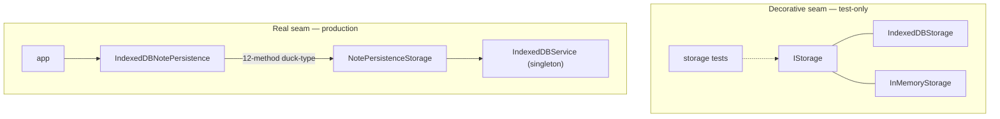
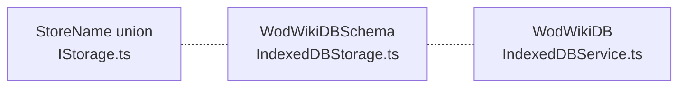
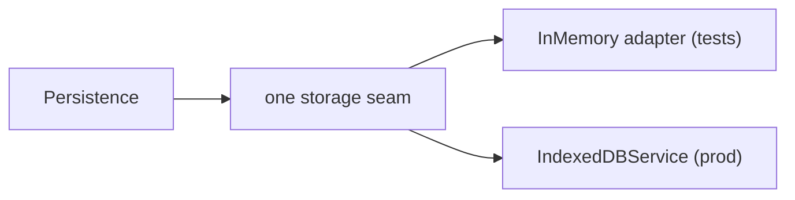

# 6. Storage has one decorative seam and one real one

> Surveyed 2026-06-19. Severity: **High.** Subsystem: storage / persistence.

## Modules involved

**Decorative seam (the IStorage layer):**

| Module | Size | Role |
|--------|------|------|
| `src/services/storage/IStorage.ts` | 80 ln | Store Name-parameterized interface. **Syntactically broken** — see Evidence. |
| `src/services/storage/IndexedDBStorage.ts` | 193 ln | Production-style adapter. Used **only by its own test**. |
| `src/services/storage/InMemoryStorage.ts` | 130 ln | Test adapter. Used **only by its own test**. |

**Real seam (what production actually crosses):**

| Module | Size | Role |
|--------|------|------|
| `src/services/persistence/types.ts` | 128 ln | `NotePersistenceStorage` — 12-method port mirroring `IndexedDBService`. |
| `src/services/db/IndexedDBService.ts` | 341 ln | The actual engine; singleton `indexedDBService`. |
| `src/services/persistence/IndexedDBNotePersistence.ts` | 383 ln | Default adapter; class-coupled to `IndexedDBContentProvider`. |
| `src/services/persistence/index.ts` | 27 ln | `createNotePersistence` uses `instanceof`. |

Domain terms: **Storage** is the raw per-store layer below **Persistence**,
keyed by **Store Name** (`notes`, `segments`, `results`, `attachments`,
`analytics`, `efforts`). A **Storage Adapter** satisfies `IStorage` for one
engine. See `CONTEXT.md`.

## Problem

Two storage seams coexist. **IStorage is decorative** — the deletion test is
decisive:

- `IndexedDBStorage` and `InMemoryStorage` together are ~323 ln of
  implementation + ~210 ln of tests, and **every caller of either adapter
  lives in `src/services/storage/*.test.ts`**. No production code in `src/` or
  `playground/src/` constructs or imports either adapter.
- The IStorage header's "typical use" snippet (`readonly('notes').getAll()`)
  has **no call site anywhere in the repo**.
- The cross-store `transaction()` affordance (documented for cascade delete)
  is exercised **only** by `InMemoryStorage.test.ts`. Real cascade-delete
  lives in `IndexedDBService.deleteNote` (58 ln of cursor-walking) and never
  goes through IStorage.

Production **Persistence** depends on a *different* 12-method port
(`NotePersistenceStorage`) that mirrors the `IndexedDBService` singleton
method-for-method, hand-rolled via duck-typing. `IndexedDBNotePersistence`
calls `this.storage.getAllNotes()`, `getLatestSegments(...)`,
`getResultsForSection(...)` — none of which exist on IStorage.

The schema is encoded **three times**: the `StoreName` union
(`IStorage.ts:30-37`), `WodWikiDBSchema` (`IndexedDBStorage.ts:16-43`), and
`WodWikiDB` (`IndexedDBService.ts:22-46`).

The `CONTEXT.md` story ("Storage Adapter satisfies Storage for one engine;
domain code depends on Persistence, not on a concrete adapter") is **true for
Persistence but false for Storage**.

### Secondary defects

- **Class coupling defeats `IContentProvider`.**
  `IndexedDBNotePersistence.ts:185` binds
  `private readonly contentProvider = new IndexedDBContentProvider()` (concrete
  class, not the interface). `persistence/index.ts:14` then branches on
  `provider instanceof IndexedDBContentProvider` to pick the adapter. To swap
  content providers you must also change the persistence factory.
- **N+1 ID resolution.** `IndexedDBNotePersistence.resolveByAnyId` calls
  `getNote(id)`, then on miss calls `getAllNotes()` and linear-scans for
  shortId/title. A 50-note list with 5 short-id matches triggers ~56 storage
  calls. The same `endsWith` suffix-match hack is duplicated in
  `IndexedDBService.getResultsForNote`.

## Diagrams

### Current — decorative seam vs real seam (Component level)

No production code crosses IStorage; production Persistence depends on a
different 12-method port that mirrors the IndexedDBService singleton.

### Current — the schema encoded 3 times (Code level)

Adding a store means editing two of these three (plus the production one) in
lockstep.

### Proposed — one storage seam (Component level)

Tests cross the same seam production does; the schema is defined once.

## Deletion test

| Delete | Verdict |
|--------|---------|
| Both IStorage adapters | Deletes only their own test files. **No production caller exists.** |
| `IStorage.ts` interface | Nothing in production imports it. **Pass-through.** |
| The 12-method `NotePersistenceStorage` port | `IndexedDBNotePersistence` loses its duck-typed backing. **Load-bearing** — this is the real seam. |
| `IndexedDBService` | The whole data layer collapses. **Load-bearing.** |

## Solution (plain English)

Pick **one** storage seam — the one production actually crosses
(`NotePersistenceStorage` over `IndexedDBService`) — and let the decorative
IStorage layer go. If the cross-store transaction affordance is genuinely
wanted, fold it into the real seam rather than maintaining a parallel
test-only interface.

Then make the `CONTEXT.md` Storage / Storage Adapter / Persistence layering
describe **one consistent seam** instead of two:

- Collapse the three schema encodings into one.
- Break the `instanceof IndexedDBContentProvider` coupling in both the
  persistence constructor and the factory — pick the adapter from data, not
  from class identity.

## Benefits

- **Locality** — the schema stops being encoded 3×; "where is a Store
  defined" has one answer.
- **Leverage** — tests cross the **same seam production does**. Today
  `InMemoryStorage` is a test double for a seam production never uses, while
  production's real double is a hand-rolled 12-method object in
  `IndexedDBNotePersistence.test.ts`.
- **Tests** — the interface-is-the-test-surface principle is restored: one
  storage seam, one in-memory adapter that both production tests and the real
  Persistence layer cross.

## Implementation

### Target shape

One storage seam — the one production crosses (`NotePersistenceStorage` over
`IndexedDBService`). Schema defined once. No `instanceof`; Persistence depends
on interfaces (`IContentProvider`), not concrete classes. The decorative
`IStorage` layer is gone (or its cross-store transaction affordance is folded
into the real seam).

### Steps

1. **Fix `IStorage.ts`.** Delete the decorative layer (its adapters are
   test-only), **or** fold the cross-store transaction affordance into the real
   seam. The file is currently syntactically broken (`open`/`close`/etc. dangle
   outside the interface body — it compiles only because nothing imports it).
2. **Single schema source.** Pick one (`WodWikiDB` in `IndexedDBService`);
   delete the duplicates (`StoreName` union, `WodWikiDBSchema`) or derive them.
3. **Break the `instanceof` coupling.** `createNotePersistence` picks the
   adapter from data/config, not class identity; `IndexedDBNotePersistence`
   depends on `IContentProvider`, not the concrete `IndexedDBContentProvider`.
4. **Dedupe the legacy-ID hack.** The `endsWith` suffix-match lives in both
   `IndexedDBService.getResultsForNote` and `IndexedDBNotePersistence` — move
   it to one place.

### Tests

- **Keep** `IndexedDBNotePersistence.test.ts` (uses `fake-indexeddb` via
  `tests/unit-setup.ts`) — it already crosses the real seam.
- **Delete** `InMemoryStorage.test.ts`, `IndexedDBStorage.test.ts` (they test
  only the decorative layer).
- **Add** a test that swaps the content provider without touching the
  persistence factory (proves the `instanceof` is gone).

### Acceptance

- One storage seam; schema defined once.
- Production tests cross the same seam (`fake-indexeddb`).
- A second content provider works without editing the persistence factory.

### Risks

- `IndexedDBNotePersistence` is the default adapter with real cascade-delete —
  don't regress the 58-ln cursor walk in `IndexedDBService.deleteNote`.
- `ContentProviderNotePersistence` is the Storybook/static path — **preserve
  both adapter paths.**
- Portability (S7) sits above Persistence — **sequence S6 before S7.**

### Stories

- **S6b** — ✅ break the `instanceof` coupling; one seam; dedupe the legacy-ID
  hack. Added `persistenceBackend` field to `IContentProvider`; extracted `sameNoteId()` to shared util.

Dependency detail lives in `00-global-plan.md`.

## Evidence

- `IStorage.ts:49-50` — **duplicated JSDoc** ("Read-write per-store view…"),
  signalling a missed copy-merge.
- `IStorage.ts:60-79` — `open`/`close`/`readonly`/`readwrite`/`transaction`
  appear **outside any `interface IStorage {}` body** — the file is
  syntactically malformed (the interface declaration is missing; the methods
  dangle). This compiles only because nothing imports `IStorage` in
  production.
- `IndexedDBNotePersistence.ts:184-186` — constructor takes
  `NotePersistenceStorage` (not `IStorage`) and a concrete
  `IndexedDBContentProvider`.
- `persistence/index.ts:13-21` — `instanceof IndexedDBContentProvider` branch.
- `IndexedDBService.ts:99-156` — the real cascade-delete that bypasses
  IStorage.
- `IndexedDBNotePersistence.ts:312-317` — N+1 `resolveByAnyId`.

## Related

- **#7 (Note Portability):** the export/import layer sits above Persistence
  and inherits its seam confusion.
- `CONTEXT.md` — the Storage / Storage Adapter / Persistence entries are the
  authoritative description this finding measures the code against.
