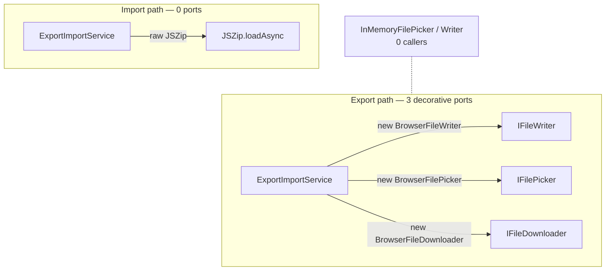
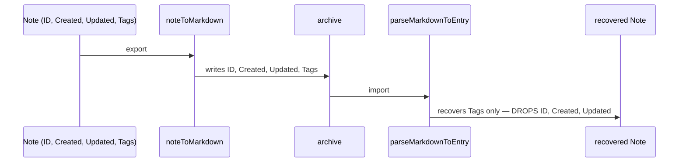
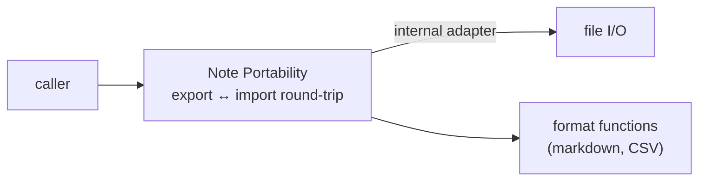

# 7. Note Portability (export/import) — a seam with no test surface, and a broken round-trip

> Surveyed 2026-06-19. Severity: **High.** Subsystem: export / import.

## Modules involved

| Module | Size | Role |
|--------|------|------|
| `src/services/ExportImportService.ts` | 138 ln | Only consumer of all 3 ports; always `new`s the browser adapter. |
| `src/services/export/IFilePicker.ts` | 6 ln | Port. |
| `src/services/export/IFileWriter.ts` | 9 ln | Port. |
| `src/services/export/IFileDownloader.ts` | 6 ln | Port. **One adapter only.** |
| `src/services/export/BrowserFilePicker.ts` / `BrowserFileWriter.ts` / `BrowserFileDownloader.ts` | 14 ln each | The only production adapters. |
| `src/services/export/InMemoryFilePicker.ts` / `InMemoryFileWriter.ts` | 13 / 25 ln | **Zero callers.** No `InMemoryFileDownloader` exists. |
| `src/services/export/NoteMarkdownSerializer.ts` | 33 ln | `noteToMarkdown`; dead `clock` param. |
| `src/services/export/NoteMarkdownDeserializer.ts` | 83 ln | `parseMarkdownToEntry` / `createNoteFromMarkdown`. |
| `src/services/export/NoteCsvFormatter.ts` | 143 ln | `escapeCSV` / `arrayToCSV` / `statementsToCSV` / `resultsToCSV`. |

Domain terms: **Persistence** exposes the Note domain (`getNote` / `listNotes`
/ `mutateNote` / `deleteNote`). Portability is the export/import of Notes.
See `CONTEXT.md`.

## Problem

Three structural defects:

1. **Three tiny ports are never injected — they are decorative.**
   `ExportImportService` instantiates the browser adapter at every call site
   (`new BrowserFileWriter()` lines 37, 73; `new BrowserFileDownloader()`
   38, 74; `new BrowserFilePicker()` 133). The InMemory adapters are **dead
   code** (zero references in `src/`, `playground/`, `tests/`, `stories/`);
   `IFileDownloader` has **only one adapter** — a textbook hypothetical seam.

2. **The import side bypasses the ports entirely.** `importFromZip`
   (lines 96-127) calls JSZip directly, with an apologetic comment ("IFileWriter
   is for writing; reading is a separate concern not yet port-seamed"). So the
   export side has 3 ports; the import side has 0. Asymmetric seam.

3. **The Markdown round-trip is broken and untested.** `noteToMarkdown`
   writes 8 metadata lines (ID, Created, Updated, Target Date, Tags, optionally
   Cloned From/To); `parseMarkdownToEntry` recovers Tags, Target Date, Cloned
   From/To, and a title — but **drops Created, Updated, and the original ID**.
   A re-imported Note gets a fresh ID and current timestamps, not what was
   exported. No test catches this:
   - `NoteMarkdownSerializer.test.ts:54-65` ("round-trips key fields through
     markdown") only asserts the output **contains** certain strings; it never
     feeds the output back to `parseMarkdownToEntry`. The test name lies.
   - `NoteMarkdownDeserializer.test.ts:77-84` just confirms the wrapper calls
     the inner function.
   - `ExportImportService.ts:96-127` (the only place a real round-trip would
     run) has **no companion test**.

This is the pure-functions-extracted-for-testability-while-the-real-bug-lives-
in-the-seam pattern: `escapeCSV` / `arrayToCSV` / `parseMarkdownToEntry` are
well-tested in isolation; the round-trip through `ExportImportService` has no
test at all.

### Secondary defects

- **Dead `clock` parameter.** `noteToMarkdown(markdown, clock?)` declares
  `clock?: INowProvider` but never reads it; tests pass a `frozenNow` clock
  that does nothing.
- **Narrower re-export.** `createNoteFromMarkdown(markdown, clock?)` is
  re-exported by `ExportImportService.ts:136` as `createNoteFromMarkdown(markdown)`
  — dropping the `clock` parameter the implementation supports.
- **Duplicated export glue.** `exportAllNotes` and `exportNote` are 30+ ln
  near-duplicates; the filename sanitizer
  `entry.id.replace(/[^a-zA-Z0-9-_]/g, '_')` repeats at lines 61 and 76.

## Diagrams

### Current — asymmetric export/import (Component level)

The ports are never injected (always `new`), the InMemory doubles are dead
code, and the import side bypasses the ports entirely.

### Current — the broken Markdown round-trip (Component level)

No test catches this: the serializer and deserializer are tested in isolation,
and the "round-trip" test only checks string containment.

### Proposed — one Note Portability module (Component level)

The round-trip a user performs becomes the testable interface; file I/O is an
internal adapter, and "what a round-trip preserves" becomes an assertable
invariant.

## Deletion test

| Delete | Verdict |
|--------|---------|
| `InMemoryFilePicker` + `InMemoryFileWriter` | 38 ln removed; no test breaks (no test imports them). **Dead code.** |
| `IFileDownloader` (one adapter) | `BrowserFileDownloader` becomes a plain function. **Hypothetical seam.** |
| The 3 ports entirely | `ExportImportService` (which already `new`s the browser adapters inline) loses nothing functional — only the *appearance* of a seam. **Decorative.** |
| `ExportImportService` | Export/import has no entry point. **Load-bearing** — this is where the real (untested) round-trip lives. |

## Solution (plain English)

Deepen into one **Note Portability** module (export **and** import, both
directions) whose interface is the round-trip a user actually performs:
**export a Note → archive → import → recover the Note**.

- File I/O becomes an **internal adapter** concern, not three decorative ports.
- The format functions (`noteToMarkdown`, `parseMarkdownToEntry`, CSV helpers)
  sit **behind** the portability interface, not next to unused doubles.
- The export/import asymmetry collapses: one read path, one write path.
- Decide explicitly what a round-trip must preserve (ID? timestamps?) and make
  that an **assertable invariant** of the interface — not an accident of which
  fields the serializer happens to write.

## Benefits

- **Locality** — "what does exporting and re-importing a Note preserve?" has
  one answer and one home, instead of being smeared across serializer,
  deserializer, and an untested orchestrator.
- **Leverage** — callers learn one portability interface instead of bouncing
  across 7 files (3 ports + 3 adapters + orchestrator + 3 formatters).
- **Tests** — the **broken round-trip becomes assertable through the
  interface** (today it is invisible). The dead InMemory doubles are replaced
  by a real test that crosses the same seam a user does.

## Implementation

### Target shape

One `NotePortability` module with `exportNote(s)` / `exportAll` / `import`
whose interface is the round-trip a user performs. File I/O is **one internal
adapter** (not 3 ports). The round-trip invariant (what is preserved) is
explicit and tested.

### Steps

1. **Delete dead code.** Remove `InMemoryFilePicker`/`Writer` (0 callers);
   remove the dead `clock` param from `noteToMarkdown`; fix the narrower
   `createNoteFromMarkdown` re-export.
2. **Write the FAILING round-trip test.** Export a Note → archive → import →
   assert ID/Created/Updated preserved. This exposes the current data loss;
   it will fail.
3. **Fix the round-trip.** `parseMarkdownToEntry` recovers ID/Created/Updated
   (or — if dropping them is deliberate — make that an explicit, documented
   invariant the test asserts instead).
4. **Deepen into one `NotePortability` module.** Inject file I/O as one
   internal adapter; collapse the export/import asymmetry by porting the read
   side off raw JSZip.
5. **Delete the 3 decorative ports** and the lying string-containment
   "round-trip" test.

### Tests

- **Add** the round-trip test (step 2 → green at step 3).
- **Delete** the `InMemory` doubles; the string-containment "round-trip" test.
- **Keep** the CSV/Markdown format unit tests (correct in isolation).

### Acceptance

- Round-trip test green; the preserve-invariant explicit.
- One portability interface; export/import symmetric.
- "Export a Note" answerable from one module, not 7 files.

### Risks

- Changing what import recovers (ID/timestamps) changes re-imported-note
  identity — could affect note dedup. **Decide the invariant deliberately**
  (step 3).
- The import side uses raw JSZip — porting it to the same adapter is real work
  but unblocks symmetry.
- Sits above Persistence — **sequence after S6** (the storage seam should be
  settled first).

### Stories

- **S7a** — ✅ delete dead doubles + slop. Also threaded `INowProvider` uniformly through the deserializer (no `Date.now()` fallbacks), per the user-stated `INowProvider` principle.
- **S7b** — ✅ write the failing round-trip test. `src/services/export/notePortability.test.ts` — 3 tests RED by design (id/createdAt/updatedAt dropped); go green when S7c fixes the deserializer.
- **S7c** — ✅ fix the round-trip; deepen into one Note Portability module. (1) `parseMarkdownToEntry` now recovers `id`/`createdAt`/`updatedAt` into a new `ParsedNoteEntry` type — the round-trip test is 6/6 green (was 3 RED). (2) End-to-end identity preservation: `IContentProvider.saveEntry` takes a new `NoteSaveInput` (optional id/createdAt/updatedAt); all 4 providers (IndexedDB, Static, LocalStorage, Mock) honor a recovered id so a re-imported note overwrites its original instead of duplicating. (3) Collapsed the decorative port layer: deleted `IFileWriter`/`IFilePicker`/`IFileDownloader` + their 3 browser adapters + the 2 dead `InMemory*` doubles + the barrel — `ExportImportService` is the single portability module with inlined browser-I/O helpers; export and import both use JSZip directly (symmetric).

Dependency detail lives in `00-global-plan.md`.

## Evidence

- `ExportImportService.ts:37-38, 73-74, 133` — direct `new Browser*` at every
  call site (ports never injected).
- `ExportImportService.ts:96-127` — `importFromZip` bypasses the ports (raw
  JSZip); comment admits "not yet port-seamed."
- `NoteMarkdownSerializer.ts:4` — `clock?` declared; never read in the body.
- `NoteMarkdownSerializer.test.ts:54-65` — "round-trip" test checks string
  containment only.
- `NoteMarkdownDeserializer.ts:64` vs `ExportImportService.ts:136` —
  `createNoteFromMarkdown` re-exported with the `clock` param dropped.
- `ExportImportService.ts:61, 76` — duplicated filename sanitizer.

## Related

- **#6 (Storage seam):** Portability sits above Persistence; the same
  "decorative port vs real path" pattern repeats one layer up.
