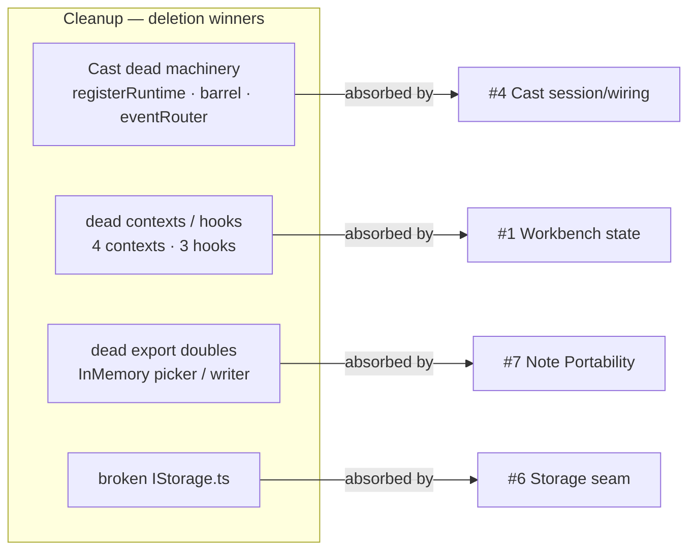

# 8. Cleanup — deletion winners (not deepening)

> **Status (2026-06-19):** Wave 0 complete. All items in the **Cast subsystem**, **Export subsystem**, **Storage subsystem** tables, and the standalone micro-stories (H1) are done. `DebugModeContext` mounting (H2) is resolved — provider mounted in both Workbench and playground. The **React contexts & hooks** table (CD2) is untouched and remains the next cleanup pass.
>

> Surveyed 2026-06-19. Severity: **Low.** These are not deepening opportunities;
> they are modules that **passed the deletion test cleanly** and can be removed
> (or folded into whichever deepening candidate absorbs them) with no behaviour
> change. Listed here so a future cleanup sprint has the inventory.

The framing for each: **one adapter = a hypothetical seam; zero callers = dead
code.** None of these require design — only deletion.

## Cast subsystem

| Item | Evidence | Action |
|------|----------|--------|
| `registerRuntime` / `unregisterRuntime` | `CastSessionManager.ts:208-241`; 0 production callers (only `CastSessionManager.test.ts:289-348`). 50 ln + 4 tests. | Delete methods, `extraSubscriptions` map, `ExtraSubscriptionEntry`, and the 4 tests. |
| `useCastSignaling.ts` barrel | 44 ln re-exporting what `rpc/index.ts` already exports; 1 production consumer (`CastButtonRpc`). | Delete; point the 2 consumers at `@/services/cast/rpc/*` directly. |
| `eventRouter.ts` (as a module) | 60 ln around a 4-case switch; 1 production caller. | Inline a `Map<string, () => void>` at the caller; delete module + test. |
| `createFullCompiler` deprecated alias | `src/testing/compiler/createFullCompiler.ts` (14 ln); 0 callers in `src/`, `tests/`, `playground/`. | Delete the file. |
| `config.ts` import-time `console.log`s | `config.ts:86-91` fire on every import. | Remove (or gate behind a debug flag). |
| Stale `CastTransportContext` comment | References `useWorkbenchSyncStore.getState().castTransport` which does not exist. | Delete or rewrite the comment. |

## React contexts & hooks (dead or single-reader)

| Item | Evidence | Action |
|------|----------|--------|
| `RuntimeLifecycleContext.ts` | 31 ln declaration; **0 consumers** (hook re-exported from `components/layout/useRuntimeLifecycle.ts`). | Delete the file; import the hook from its real home. |
| `SubscriptionManagerContext.ts` | 20 ln; **0 consumers**. The only read path is `useWorkbenchSyncStore.getState().subscriptionManager`. | Delete. |
| `CommandContext.tsx` | 88 ln; provider mounted in `Workbench.tsx` + playground `App.tsx` with **no readers**. Global keydown listener (lines 44-69) is speculative. | Delete unless a consumer is planned. |
| `ProjectionSyncContext.tsx` | 60 ln; **1 consumer** (`useWorkbenchEffects`); `updateFromSegments` hardcodes `projections: []` (lines 54-56). | Delete; inline the one `sendAnalyticsSummary` call. |
| `useRuntimeFactory` hook | 32 ln; **0 callers of the hook** (only the `runtimeFactory` singleton is imported). | Delete the hook; keep the singleton. |
| `useRuntimeParser` hook | 44 ln; **0 callers of the hook** (only re-exports used). | Delete. |
| `useScriptRouting` hook | 118 ln; **0 callers**; parallel to `useReactRouterNavigation`. | Delete. |
| `DebugModeContext` mounting gap | Provider mounted in playground but **not in the Workbench app** — 7 components fall through to a no-op default. | Mount it in the Workbench app, or document the deliberate split. |

## Export subsystem

| Item | Evidence | Action |
|------|----------|--------|
| `InMemoryFilePicker.ts` (13 ln) | 0 references outside its own file + `index.ts` re-export. | Delete. |
| `InMemoryFileWriter.ts` (25 ln) | 0 references; `toBlob()` returns fake text-concat, not a zip. | Delete. |
| `noteToMarkdown` dead `clock` param | `NoteMarkdownSerializer.ts:4` declares `clock?`, never reads it. | Remove the param; fix the 4 test call sites. |
| `createNoteFromMarkdown` narrower re-export | `ExportImportService.ts:136` drops the `clock` param the impl supports. | Re-export the full signature, or drop `clock` everywhere consistently. |

## Storage subsystem

| Item | Evidence | Action |
|------|----------|--------|
| `IStorage.ts` duplicated JSDoc | `IStorage.ts:49-50` — "Read-write per-store view…" twice. | Fix the copy-merge. |
| `IStorage.ts` broken syntax | `IStorage.ts:60-79` — `open`/`close`/`readonly`/`readwrite`/`transaction` dangle outside any `interface IStorage {}` body. Compiles only because nothing imports `IStorage` in production. | Either delete the decorative layer (see finding #6) or restore the interface declaration. |

## Diagrams

### How the cleanup maps onto the deepening candidates (Component level)

Cleanup items are pure deletions (no "proposed path") — most are absorbed
naturally by the deepening candidate that owns the surrounding module.

They can also be done **independently and first**, as a risk-free pruning pass
before any deeper refactor.

## Implementation

These are the **wave-0 safe deletions** — no design, no behavior change, no
cross-dependencies. Each item maps to the opening story of a deepening track
(see `00-global-plan.md`):

- Cast dead machinery → **S4a**
- dead contexts / hooks → **S1 track** (or a standalone housekeeping story)
- dead export doubles → **S7a**
- broken `IStorage.ts` → **S6a**

Standalone micro-stories not owned by a track (do anytime in wave 0):
`createFullCompiler` alias; `config.ts` import-time `console.log`s; the stale
`CastTransportContext` comment; the `DebugModeContext` mounting gap (decide
deliberately: mount in Workbench app, or document the split).
