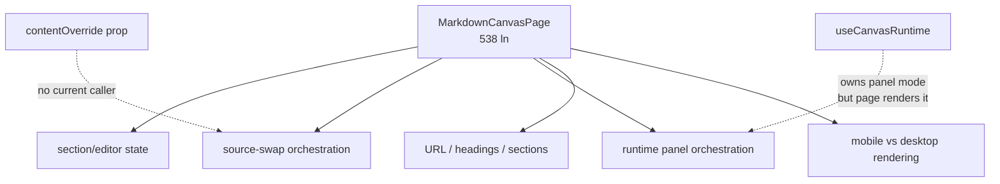
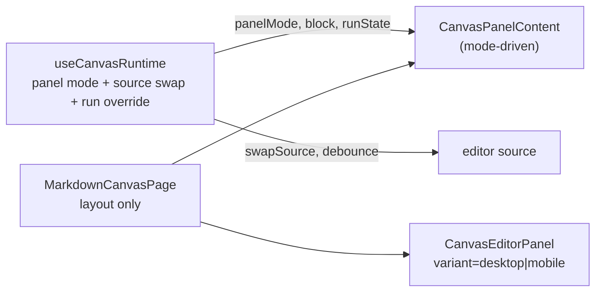

# G2 — Decompose `MarkdownCanvasPage` (5 sub-jobs → 2)

> Source: minimax [#06](../../../minimax/improve/06-canvas-page-five-subjobs.md).
> Not in the global plan. **Severity:** Medium (locality + churn).

## Problem

`MarkdownCanvasPage.tsx` (538 ln, 99.8th %ile churn, 32 commits) bundles five
sub-jobs in one component: section/editor state, source-swap orchestration,
runtime panel orchestration, URL/headings/sections, and mobile-vs-desktop
rendering. The panel-mode state machine lives in `useCanvasRuntime` (a hook),
but the panel-content logic (a 60-line IIFE returning one of three JSX trees)
and the source-swap logic live in the page. A `contentOverride` prop is wired
but no current caller passes it — dead path.

The global plan's Track 1 (workbench state layer) addresses `WorkbenchContext`
and `workbenchSyncStore`, but `MarkdownCanvasPage` is a playground app
component outside that tree.

## Modules involved

| Module | Size | Role |
|--------|------|------|
| `playground/src/canvas/MarkdownCanvasPage.tsx` | 538 ln | The page; 5 sub-jobs, 60-line `panelContent` IIFE, dead `contentOverride` path |
| `playground/src/hooks/useCanvasRuntime.ts` | — | Owns panel-mode state machine; the page reaches into it |
| `playground/src/App.tsx` | 676 ln | Parent; passes `workoutFiles` to the canvas |

## Diagrams

### Current — five sub-jobs fan in to one page (Component level)

### Proposed — hook owns panel state, page renders (Component level)

## Solution

Pull the panel-mode rendering and source-swap logic into `useCanvasRuntime`
where the panel-mode state machine already lives. The page becomes a layout
composition. Two stories: G2a (extract panel content + source swap), G2b
(collapse mobile/desktop + delete dead path).

---

## G2a — Extract `CanvasPanelContent`; move source-swap to hook

### Steps

1. Extract the 60-line `panelContent` IIFE (lines 348–411) into a new
   `<CanvasPanelContent mode={runtime.panelMode} block={...} ...>` component.
   The component receives `panelMode`, `block`, `runtime`, and render
   callbacks as props — it does not own state.
2. Move the source-swap logic (`swapSource`, `sourceEditsRef`, `swapTimerRef`,
   lines 188, 207–211) into `useCanvasRuntime`. The hook already owns
   `panelMode` and the runtime; source-swap is the natural complement.
3. Replace the page's direct calls to `swapSource` with calls through the
   hook's return value.
4. Verify the `depsRef.current` stale-closure workaround (lines 257–260)
   still holds — the hook must not capture stale closures when the consumer
   moves out of the page.

### Tests

- **Add** a `useCanvasRuntime` test that drives source-swap through the hook
  and asserts the debounced fade fires.
- **Keep** existing canvas page tests; they should pass unchanged after the
  extract (the page still renders the same trees, just delegates to the new
  component).

### Acceptance

- `bun run test` green.
- `MarkdownCanvasPage.tsx` no longer contains the `panelContent` IIFE.
- `useCanvasRuntime` owns source-swap logic.
- `CanvasPanelContent` is a standalone component.

### Risks

- The `depsRef.current` pattern is a stale-closure workaround. Moving the
  consumer out of the page must preserve the "no stale deps" guarantee.
  Test with a source-swap followed by an immediate panel-mode change.

---

## G2b — Collapse mobile/desktop panels; delete dead path

### Steps

1. Collapse `desktopPanel` / `mobilePanel` (lines 466–484) into one
   `<CanvasEditorPanel variant="desktop|mobile">` — the `variant` prop
   already exists.
2. Extract the `mobileRunState` `useMemo` (line 458) into a
   `useMobileRunOverride` hook — it wraps `runtime.runState` only to override
   `onRun` for mobile timers.
3. Delete the `contentOverride` prop and the `swapSource(contentOverride, ...)`
   path (lines 188, 207–211). No current caller passes `contentOverride` in
   the canvas path.
4. Verify mobile and desktop panels render identically except for the `onRun`
   override.

### Tests

- **Add** a `useMobileRunOverride` test that asserts `onRun` is overridden
  on mobile and unchanged on desktop.
- **Verify** `App.tsx` no longer needs to pass `contentOverride`.

### Acceptance

- `bun run test` green.
- One `CanvasEditorPanel` component with a `variant` prop replaces two
  separate panel branches.
- `contentOverride` prop is gone — no dead path.
- `MarkdownCanvasPage.tsx` line count drops by ~80–100 lines.

### Risks

- The mobile-vs-desktop split is genuinely two panels with different
  `runState` overrides. If they differ in more ways than `onRun`, collapsing
  to one `variant` component needs a broader prop surface. Inspect the two
  panels' prop diff before collapsing.

## Stories

- **G2a** — extract `CanvasPanelContent`; move source-swap to hook. No hard
  dependency; easier after global-plan **S1c** (workbench state settled, so
  the canvas page's store reads are stable).
- **G2b** — collapse mobile/desktop; delete dead path. Depends on **G2a**.
