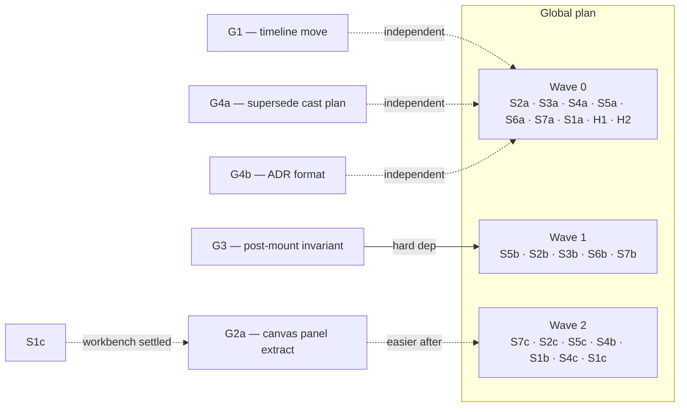

# Gap stories — COMPLETE (2026-06-20)

All four items shipped in session 3:
- **G1** ✅ — projection engines moved from `src/timeline/analytics/` to `src/core/analytics/engines/`
- **G3** ✅ — post-mount snapshot invariant test + docblock; `mixed-timers.md` regression test already existed and passes
- **G4a** ✅ — `docs/cast-architecture-plan.md` marked SUPERSEDED
- **G4b** ✅ — `docs/adr/` directory + template + index created

G2 (canvas page decomposition) — see "Open" below.

---

| ID | Title | Source finding | Depends on | Status |
|----|-------|---------------|------------|--------|
| **G1** | [Move projection engines out of `timeline/`](G1-timeline-analytics-move.md) | minimax #02 | — | ✅ done |
| **G2a** | [Extract `CanvasPanelContent`; move source-swap to hook](G2-canvas-page-decomposition.md#G2a) | minimax #06 | (easier after S1c) | open |
| **G2b** | [Collapse mobile/desktop panels; delete dead path](G2-canvas-page-decomposition.md#G2b) | minimax #06 | G2a | open |
| **G3** | [Post-mount snapshot invariant + `mixed-timers.md` verification](G3-script-runtime-post-mount-invariant.md) | minimax #05 | **S3a, S3b** | ✅ done |
| **G4a** | [Mark `cast-architecture-plan.md` superseded](G4-cast-plan-supersede-adr-format.md#g4a--mark-cast-architecture-planmd-superseded) | minimax #00 | — | ✅ done |
| **G4b** | [Create `docs/adr/` + format template](G4-cast-plan-supersede-adr-format.md#g4b--create-docsadr--format-template) | minimax #00 | — | ✅ done |

## When to do them (historical — all done)

Original sequencing rationale (kept for archaeology):

- **G1, G4a, G4b** were independent of the global plan — ran alongside the safe deletions.
- **G2a** is still easiest after S1c (workbench state settled) because the canvas page reads from the workbench store; not a hard dependency.
- **G3** had a **hard** dependency on S3a + S3b — both were met before G3 shipped.

## Why these are gaps (historical context)

The global plan surveyed the same codebase with a broader lens (7 findings
vs minimax's 6) and went further on every overlap. The gaps below are items
that **neither** survey's execution plan addresses:

- **G1**: a misplaced-but-alive subtree. The global plan's #8 cleanup covers
  dead code and broken files; it does not cover modules that are alive but
  in the wrong directory.
- **G2**: a playground component. The global plan's #1 addresses the
  workbench tree (`WorkbenchContext`, `workbenchSyncStore`,
  `useWorkbenchEffects`); `MarkdownCanvasPage` is in the playground app,
  outside that tree.
- **G3**: a verification story. The global plan's S3a merges the snapshot
  constructors (the symptom) but does not name the **invariant** ("snapshots
  reflect post-mount state") or claim to close the `mixed-timers.md` bug.
- **G4**: a governance gap. The global plan's README notes the missing
  `docs/adr/` and the cast plan's partial achievement; neither is turned
  into an actionable story.
