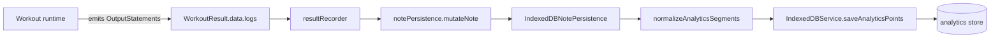
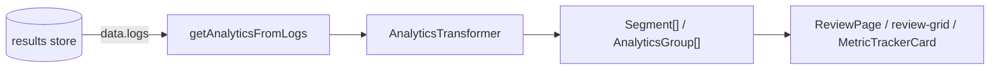

# IndexedDB Analytics Table Workflows

This document focuses specifically on the `analytics` IndexedDB store: what data flows into it, how each field is produced, and which read/write paths touch it. It is a companion to [`indexeddb-storage-and-page-queries.md`](indexeddb-storage-and-page-queries.md); read that first for the overall schema and the `page`/`note`/`segment`/`result` relationships.

- Generated: 2026-07-15
- Database: `wodwiki-db`, version 9
- Source of truth: `src/types/storage.ts`, `src/services/persistence/IndexedDBNotePersistence.ts`, `src/services/AnalyticsTransformer.ts`

---

## 1. What the `analytics` store is for

The `analytics` store is a **derived denormalization** of `WorkoutResult.data.logs`. Its only purpose is to support **cross-workout trend queries** (e.g. "average reps over the last 30 sessions"). No current feature reads from it.

> **Golden rule:** `WorkoutResult.data.logs` is the source of truth. `getAnalyticsFromLogs()` is the authoritative read path for display. If the `analytics` store disagrees with the logs, the logs win.

---

## 2. Row shape and field semantics

| Field | Type | Required | Indexed | Source / Meaning |
|---|---|---|---|---|
| `id` | `string` (UUID) | Yes | Primary key | Synthetic: `${segmentId}-${metricKey}-${now}` (or `${segmentId}-elapsed-${now}`). |
| `noteId` | `string` (UUID) | Yes | No | Parent note that owns the segment. |
| `pageId` | `string` (UUID) | No | `by-page` | Proposed: direct page link. **Current code does not write this** (migration `AN-01`). |
| `segmentId` | `string` (UUID) | Yes | `by-segment` | Runtime segment id, cast to string. |
| `segmentVersion` | `number` | Yes | No | Segment version at recording time. Defaults to `0` if no version is found. |
| `resultId` | `string` (UUID) | Yes | `by-result` | The `WorkoutResult.id` this row was derived from. |
| `type` | `string` | Yes | `by-type` | **Analytics-facing metric key**. In the current implementation this is set to the same value as `metricKey`. Reserved for future family normalization (e.g. `reps`, `load`, `elapsed`). |
| `value` | `number \| any` | Yes | No | Numeric metric value extracted from the metric source. Complex values are reduced to `.amount` when present. |
| `unit` | `string` | No | No | **Analytics-facing unit**. Derived from `metric.unit` → `metric.metadata.unit` → `''`. |
| `label` | `string` | Yes | No | **Analytics-facing display label**, formatted as `"<SegmentName> – <metricLabel>"`. |
| `metricKey` | `string` | No | No | **Original key** emitted by the runtime or calculator. Resolved as `metric.key ?? metric.metadata.target ?? metric.type`. |
| `metricLabel` | `string` | No | No | **Original human-readable label** from the metric source. Falls back to `humanizeMetricKey(metricKey)` if no explicit label is provided. |
| `metricUnit` | `string` | No | No | **Original unit** from the metric source. Same resolution chain as `unit`. |
| `timestamp` | `number` | Yes | No | Effective workout time: `segment.absoluteStartTime ?? now`. |
| `createdAt` | `number` | Yes | No | Row generation time (`Date.now()` at persistence). |

### Why keep both `type/label/unit` and `metricKey/metricLabel/metricUnit`?

The two groups exist because **derivation and display have different stability requirements**:

- `metricKey` / `metricLabel` / `metricUnit` are **source-faithful**. They record exactly what the runtime or an analytics processor emitted, so the row can be re-interpreted later even if the display rules change.
- `type` / `label` / `unit` are **consumer-facing**. They can be normalized, translated, or decorated (today the label is prefixed with the segment name) without destroying the original metadata.

Example from `IndexedDBNotePersistence.test.ts`:

| `metricKey` | `metricLabel` | `metricUnit` | `type` | `label` | `unit` |
|---|---|---|---|---|---|
| `reps` | `Reps` | `''` | `reps` | `AMRAP – Reps` | `''` |
| `zone2` | `Zone 2` | `pts` | `zone2` | `Fran – Zone 2` | `pts` |
| `totalLoad` | `Total Load` | `pts` | `totalLoad` | `Fran – Total Load` | `pts` |
| `elapsed` | `Elapsed` | `s` | `elapsed` | `<SegmentName> – Elapsed` | `s` |

The `metricKey`/`metricLabel`/`metricUnit` triplet is the **source snapshot**; the `type`/`label`/`unit` triplet is the **display-ready projection**.

---

## 3. Data flow into the analytics store



### 3.1 Inputs to normalization

`normalizeAnalyticsSegments(segments, noteId, resultId, segmentVersions, blockContentId)` receives:

- `segments` — `AnalyticsSegmentInput[]` produced by the runtime (one item per executed segment). Each segment contains:
  - `id` — runtime segment id (number or string).
  - `name` — segment display name.
  - `elapsed` — elapsed time in seconds.
  - `absoluteStartTime` — effective workout timestamp.
  - `metrics` — a `MetricContainer` serialized structure, **or** `metric` — a plain record of key/value pairs (legacy path).
- `noteId` — the persisted note id.
- `resultId` — the `WorkoutResult.id` being saved.
- `segmentVersions` — map of segment id → current segment version. Defaults to `0`.
- `blockContentId` — optional content-stable id; currently written as `blockContentId` in the row (migration `AN-02` renames it to `segmentId` in the proposed schema, but the existing code still uses `blockContentId`).

### 3.2 Per-segment derivation

For each segment:

1. **Elapsed time metric** — if `segment.elapsed > 0`, a hard-coded row is emitted:
   - `type = 'elapsed'`
   - `metricKey = 'elapsed'`
   - `metricLabel = 'Elapsed'`
   - `metricUnit = 's'`
   - `label = "<SegmentName> – Elapsed"`

2. **Segment metrics** — the segment's `metrics` (or legacy `metric`) container is flattened into individual `PersistableMetricSource` items. For each source:
   - `metricKey` is resolved from `key` → `metadata.target` → `type`.
   - `metricLabel` is resolved from `metadata.label` → `humanizeMetricKey(metricKey)`.
   - `metricUnit` is resolved from `unit` → `metadata.unit` → `''`.
   - The numeric value is extracted from `value` directly, or from `value.amount` for complex value objects.
   - A row is emitted only if a finite numeric value exists.

### 3.3 Persistence seam

`IndexedDBNotePersistence.mutateNote()` writes the result first, then calls `this.storage.saveAnalyticsPoints(points)`. The write is **best-effort**: if it fails, the workout result is still fully functional.

---

## 4. Read paths

### 4.1 Display / review (canonical path): derive from logs

No page currently reads from the `analytics` store. Instead, the UI derives analytics on demand from `WorkoutResult.data.logs`:



Key functions:

| Function                                 | File                                   | Purpose                                              |
| ---------------------------------------- | -------------------------------------- | ---------------------------------------------------- |
| `getAnalyticsFromLogs`                   | `src/services/AnalyticsTransformer.ts` | Canonical derivation from `StoredOutputStatement[]`. |
| `getAnalyticsFromRuntime`                | `src/services/AnalyticsTransformer.ts` | Live derivation from a mounted `IScriptRuntime`.     |
| `useWorkbenchServices().deriveAnalytics` | `src/hooks/useWorkbenchServices.ts`    | Hook wrapper around `getAnalyticsFromLogs`.          |

Both read paths filter outputs to `outputType === 'segment' | 'analytics' | 'milestone'`, ignoring `load`, `system`, and `event` outputs.

### 4.2 Future cross-workout trend path (not implemented)

The intended read path for trends is the `analytics` store directly, using indexes:

- `by-type` — aggregate a metric family across sessions.
- `by-result` — get all analytics rows for a single workout.
- `by-segment` — trend one segment's metric over time.
- `by-page` — proposed page-scoped aggregation (requires migration `AN-01` / `P-10`).

Because these reads are not yet implemented, the `analytics` store is effectively **write-only** today.

---

## 5. Workflows that touch the analytics table

### 5.1 Recording a completed workout (write)

Triggered from:

- `RuntimeTimerPanel` — calls `runtime.finalizeAnalytics()`, then `playgroundRecorder.record()` → `notePersistence.mutateNote()`.
- `WallClockPage` — on completion, writes through `playgroundRecorder.record()`.
- `JournalPage` — records results and analytics via `notePersistence.mutateNote()`.

Steps:

1. Runtime produces `OutputStatement[]` and writes them to `WorkoutResult.data.logs`.
2. Recorder packages `analyticsSegments` (a runtime-derived summary of segments).
3. `IndexedDBNotePersistence` resolves current segment versions via `getAnalyticsSegmentVersions()`.
4. `normalizeAnalyticsSegments()` flattens segments into `AnalyticsDataPoint[]`.
5. `IndexedDBService.saveAnalyticsPoints()` bulk-puts the rows into the `analytics` store.

### 5.2 Reviewing a completed workout (read)

Triggered from:

- `ReviewPage` (`/review/:runtimeId`) — calls `indexedDBService.getResultById(runtimeId)`.
- Any review grid or analytics chart that receives a `WorkoutResult`.

Steps:

1. Read `WorkoutResult.data.logs` from the `results` store.
2. Call `getAnalyticsFromLogs(outputs)`.
3. Render `Segment[]` and `AnalyticsGroup[]` directly.

The `analytics` store is **not consulted**.

### 5.3 Live session tracking (read-while-write)

During an active workout, the `AnalyticsEngine` emits `'analytics'` `OutputStatement`s through the output stream. These are consumed by:

- `MetricTrackerCard` — scans live `outputs` for `analytics` outputs to show session totals.
- `workbenchSessionStore` — derives `analyticsSegments`/`analyticsGroups` from the runtime's output list.

These live outputs are **not persisted to the `analytics` store**; they are ephemeral UI updates. The store is only written once at workout completion.

### 5.4 Deleting a workout (cascade)

`IndexedDBService.deleteNote()` opens a single read-write transaction across `notes`, `segments`, `results`, `attachments`, and `analytics`. Analytics rows are deleted by result/note association, not by primary key individually.

---

## 6. Current vs proposed schema differences

| Aspect | Current | Proposed (from `indexeddb-storage-and-page-queries.md`) |
|---|---|---|
| `pageId` field | Not written | Optional, indexed `by-page` |
| `blockContentId` field | Written on every row | Removed; proposed schema uses `segmentId` + `segmentVersion` |
| `segmentVersion` | Written, defaults to `0` | Kept, but sourced from the actual segment version |
| Index `by-content` | On `blockContentId` | Proposed removal; cross-workout queries use `by-segment` / `by-page` / `by-type` |
| Index `by-calendar` | N/A | Renamed to `by-page` (migration `AN-01`) |

Migration items relevant to this store (from `indexeddb-storage-and-page-queries.md`):

- `AN-01` — add `pageId` and `by-page` index.
- `AN-02` — remove `blockContentId`; rely on `segmentId` + `segmentVersion`.
- `P-10` / `REL-05` — page→analytics relationship.
- `R-05` / `R-06` — results store moves to segment-centric keys.

## 8. Two-layer architecture: annotations vs aggregates

The analytics system can be understood as two separate layers that run over the same stream of `OutputStatement`s. The current code implements both, but only in the **live-workout** path; it does not yet support re-deriving them after a result is edited.

```mermaid
flowchart TB
    subgraph Layer1["Layer 1: Annotation / Enrichment"]
        A[Raw segment output] -->|IRealtimeProcessor| B[Enriched OutputStatement]
        B --> C[WorkoutResult.data.logs]
    end

    subgraph Layer2["Layer 2: Aggregation / Projection"]
        C --> D[ISummaryProcessor]
        D --> E[ProjectionResult]
        E --> F['analytics' OutputStatement]
        F --> C
    end

    subgraph Derived["Derived persistence"]
        C --> G[AnalyticsTransformer]
        G --> H[Segment[] / AnalyticsGroup[]]
        H --> I[normalizeAnalyticsSegments]
        I --> J[(analytics store)]
    end
```

### 8.1 Layer 1 — Annotation (per-record enrichment)

**Concept:** every time a single workout record is produced, derive additional single-point metrics from it and append them to that record. Example: given a segment with `reps`, `weight`, and `elapsed`, calculate `power = (reps × weight) / elapsed` and attach it to the same segment.

**Current implementation:** `IRealtimeProcessor`.

| Processor | Input metrics | Annotated metric | Scope |
|---|---|---|---|
| `TwoPassEffortResolutionProcess` | effort text | resolved effort (MET, discipline, intensity) | one segment |
| `PaceEnrichmentProcess` | `Rep`/`Distance` + `Elapsed` | pace / speed | one segment |
| `PowerEnrichmentProcess` | `Load`/`Rep` + `Elapsed` | power (kg/s or load/s) | one segment |

The annotated output is returned from `AnalyticsEngine.run(output)` and stored in `WorkoutResult.data.logs`. This is the **canonical record**: later display reads (`getAnalyticsFromLogs`) see the enriched metrics because they are part of the log.

### 8.2 Layer 2 — Aggregation (cross-record projection)

**Concept:** after every new record is written, re-scan the entire session and produce compound metrics. Example: `totalVolume = Σ(reps × weight)` across all segments; `totalDistance = Σ(distance)`; `MET-minutes = Σ(MET × minutes)`.

**Current implementation:** `ISummaryProcessor`.

| Processor | Aggregate | Formula |
|---|---|---|
| `RepProjectionEngine` | total reps | `Σ reps` |
| `DistanceProjectionEngine` | total distance | `Σ distance` |
| `VolumeProjectionEngine` | total volume | `Σ(reps × resistance)` |
| `MetMinuteProjectionEngine` | MET-minutes | `Σ(MET × active minutes)` |
| `SessionLoadProjectionEngine` | session load (AU) | `sRPE × duration` |
| `TISProcessor` | TIS score | cross-discipline composite |
| `CalculateBlockProcessor` | user-defined | expression evaluated over all outputs |

The engine runs these on **every new segment** (`run`) and once more at finalize (`finalize`). The projection results are wrapped in `'analytics'` `OutputStatement`s and also appended to `WorkoutResult.data.logs`. So during a live workout the aggregates are recalculated after each segment — exactly the model you described.

### 8.3 How the layers map to the `analytics` IndexedDB store

| Layer | Where it lives | How it reaches the `analytics` store |
|---|---|---|
| Annotation | `WorkoutResult.data.logs` as enriched `OutputStatement`s | Indirectly, via `getAnalyticsFromRuntime` → `Segment[]` → `normalizeAnalyticsSegments` |
| Aggregation | `WorkoutResult.data.logs` as `'analytics'` `OutputStatement`s | Same path; the aggregate values end up in the `value` field of `AnalyticsDataPoint` rows |
| `AnalyticsDataPoint` rows | `wodwiki-db.analytics` | Best-effort write at result persistence time; not read by any current feature |

### 8.4 Where the current design diverges from your model

**Gap 1: No post-hoc re-derivation.**

The `AnalyticsEngine` is wired to a live runtime. Once a `WorkoutResult` is persisted, there is no service that:

1. Replays `data.logs` through a fresh `AnalyticsEngine`.
2. Re-runs realtime processors on edited records.
3. Re-runs summary processors over the edited history.
4. Re-writes `data.logs` and the `analytics` store rows.

So if a user edits a result after the workout, the annotations and aggregates are **not** recalculated today. The edit would likely change the raw segment values, but derived metrics like `power`, `pace`, or `totalVolume` would remain stale.

**Gap 2: The `analytics` store is a snapshot, not a source of truth.**

The `analytics` store receives a flattened copy of `analyticsSegments` (which already went through both layers). It does **not** store the original annotated `OutputStatement`s. If you wanted to re-derive annotations after an edit, you would have to start from `WorkoutResult.data.logs`, not from the `analytics` store.

**Gap 3: `analyticsSegments` passed to persistence is display-shaped, not record-shaped.**

The persistence path receives `Segment[]` from `getAnalyticsFromRuntime`. That is the output of the `AnalyticsTransformer`, optimized for rendering, not the raw annotated record stream. To support your model cleanly, the persistence seam should probably receive the enriched `OutputStatement[]` (or be able to regenerate them) so that future edits can replay the annotation layer.

### 8.5 What a post-hoc edit path would look like

To make your two-layer model robust across edits, the system would need something like:

```ts
async function rederiveResultAnalytics(result: WorkoutResult): Promise<WorkoutResult> {
  // 1. Build a fresh engine with the same profile as a live workout.
  const engine = createAnalyticsEngineForBlock(/* profile, context */);
  const emitter = new OutputEmitter();
  emitter.setAnalyticsEngine(engine);

  // 2. Replay the edited raw outputs through the annotation layer.
  for (const rawOutput of result.data.rawLogs ?? result.data.logs) {
    emitter.add(rawOutput);
  }

  // 3. Finalize the aggregation layer.
  emitter.finalizeAnalytics();

  // 4. Replace logs with the re-annotated / re-aggregated stream.
  result.data.logs = emitter.getAll();

  // 5. Re-derive the analytics store rows.
  const segments = getAnalyticsFromLogs(result.data.logs).segments;
  await saveAnalyticsPoints(normalizeAnalyticsSegments(segments, ...));

  return result;
}
```

Note: today `OutputEmitter` and `AnalyticsEngine` are coupled to a live runtime; extracting a replayable "derive from raw logs" service would require decoupling the engine from the runtime lifecycle.

### 8.6 Summary of alignment

| Your concept | Existing code | Status |
|---|---|---|
| Annotations appended to each record as it is logged | `IRealtimeProcessor` in `AnalyticsEngine.run` | ✅ Implemented |
| Aggregates recalculated after every new record | `ISummaryProcessor` re-run on every segment in `AnalyticsEngine.run` | ✅ Implemented |
| Aggregates emitted as compound metrics | `ProjectionResult` → `'analytics'` `OutputStatement` | ✅ Implemented |
| Annotations/aggregates stored on the result | `WorkoutResult.data.logs` | ✅ Implemented |
| Re-derive annotations after user edits a result | No public replay/re-derive service | ⚠️ Gap |
| Re-derive aggregates after user edits a result | No public replay/re-derive service | ⚠️ Gap |
| `analytics` store as the place for both layers | Store is a derived, write-only snapshot | ⚠️ Misaligned — store is not the source of truth |


1. **Never build a read path that depends on the `analytics` store** without first implementing trend queries and reconciling the store with logs.
2. **Preserve `metricKey`/`metricLabel`/`metricUnit` exactly as the source emitted them**; decorate only `type`/`label`/`unit`.
3. **Keep writes best-effort** — the workout result is still valid if analytics persistence fails.
4. **Use `getAnalyticsFromLogs()` for display** — it is the canonical derivation and is kept in sync with the runtime output format.
5. **Delete analytics rows transactionally** with their parent note/result to avoid orphan trend data.
