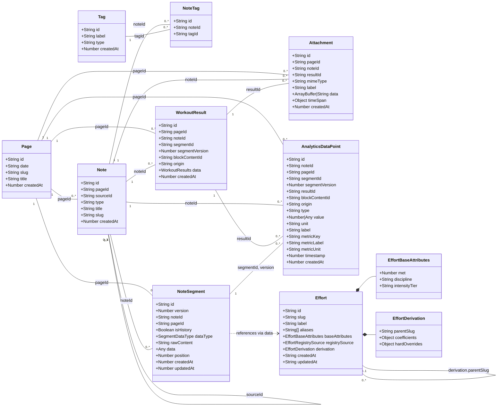

# IndexedDB Storage UML & Page Query Inventory

This document maps the browser-side `wodwiki-db` IndexedDB schema. Sections 1 and 2 describe the **proposed target schema**; Sections 3–5 describe the **current** production code paths; Section 6 is the migration change log for ticket planning.

- Generated: 2026-07-20
- Database: `wodwiki-db`, version 11
- Source of truth (current): `src/types/storage.ts`, `src/services/db/IndexedDBService.ts`

---

  ## 1. Proposed storage schema (UML class diagram)

### Proposed physical stores and indexes

| Store | keyPath | Indexes | Notes |
|---|---|---|---|
| `page` | `id` | `by-date` (date, unique), `by-slug` (slug, unique) | Generalized container; can be looked up by calendar date or by slug. `date` is optional for non-calendar pages; `slug` is optional for calendar pages. |
| `notes` | `id` | `by-page` (pageId), `by-slug` (slug, unique) | Header/relationship table; content lives in segments |
| `tags` | `id` | `by-label` (label, unique), `by-type` (type) | Normalized tag definitions |
| `note_tags` | `id` | `by-note` (noteId), `by-tag` (tagId) | Note ↔ Tag many-to-many join |
| `segments` | `[id, version]` | `by-note` (noteId), `by-page` (pageId), `by-type` (dataType), `by-history` (isHistory) | Versioned content chunks; payload flattened into `data` |
| `results` | `id` | `by-note` (noteId), `by-page` (pageId), `by-segment` (segmentId), `by-content` (blockContentId), `by-origin` (origin), `by-completed` (createdAt) | `completedAt` renamed to `createdAt` (v11 shipped) |
| `attachments` | `id` | `by-note` (noteId), `by-page` (pageId), `by-result` (resultId), `by-time` (createdAt) | Binary blobs; can belong to a result |
| `analytics` | `id` | `by-result` (resultId), `by-page` (pageId), `by-content` (blockContentId), `by-metric` (metricKey), `by-discipline` (discipline), `by-origin` (origin), `by-type` (type) | Denormalized summary metrics only |
| `efforts` | `slug` | `by-discipline` (baseAttributes.discipline), `by-source` (registrySource) | Effort catalog |

---

## 2. Per-table field reference (editable scratch sheet)

Use these tables as a scratch space when modifying the IndexedDB structure. Each table lists the fields, types, indexing, and foreign-key relationships. This section reflects the **proposed target schema** from Section 1.

### `page`

| Field | Type | Required | Indexed | Description | Connects to |
|---|---|---|---|---|---|
| `id` | `string` (UUID) | Yes | Primary key | UUID page identity | — |
| `date` | `string` | No | `by-date` (unique) | ISO calendar date `YYYY-MM-DD` (local time) | — |
| `slug` | `string` | No | `by-slug` (unique) | Route-friendly lookup key; alternative to `date` | — |
| `title` | `string` | No | No | Optional display title | — |
| `createdAt` | `number` | Yes | No | Unix ms (UTC) | — |

> **Note:** A `page` is a generalized container. Calendar pages use `date`; custom pages use `slug`. Either can be present, and both may coexist on a single page. Lookups can use whichever identifier is most natural for the route (`/journal/:date` or `/page/:slug`).

### `notes` (page-aware, normalized)

| Field | Type | Required | Indexed | Description | Connects to |
|---|---|---|---|---|---|
| `id` | `string` (UUID) | Yes | Primary key | UUID v8 canonical identity | — |
| `pageId` | `string` (UUID) | No | `by-page` | Page this note belongs to (journal/plan/custom page) | → `page.id` |
| `sourceId` | `string` (UUID) | No | No | Source note/template (replaces `templateId`) | → `notes.id` |
| `type` | `NoteKind` | No | No | `note` / `template` / `playground` / `journal` | — |
| `title` | `string` | Yes | No | Display name | — |
| `slug` | `string` | No | `by-slug` (unique) | Route-friendly alias | — |
| `createdAt` | `number` | Yes | No | Unix ms | — |

> **Removed from `notes`:** `rawContent` (moved to segments), `segmentIds` (segments link back via `noteId`), `clonedIds` (no longer tracked), `journalDate` (replaced by `pageId`), `tags[]` (replaced by `tags` + `note_tags`), `createdFrom` (replaced by `sourceId`), `updatedAt` (version/content handles this), and `targetDate` (derived from page date).

### `tags`

| Field | Type | Required | Indexed | Description | Connects to |
|---|---|---|---|---|---|
| `id` | `string` (UUID) | Yes | Primary key | UUID | — |
| `label` | `string` | Yes | `by-label` (unique) | Tag text, e.g. `notebook:abc-123` | — |
| `type` | `string` | Yes | `by-type` | Tag category: template, playground, qualification, etc. | — |
| `createdAt` | `number` | Yes | No | Unix ms | — |

### `note_tags`

| Field | Type | Required | Indexed | Description | Connects to |
|---|---|---|---|---|---|
| `id` | `string` (UUID) | Yes | Primary key | UUID | — |
| `noteId` | `string` (UUID) | Yes | `by-note` | Parent note | → `notes.id` |
| `tagId` | `string` (UUID) | Yes | `by-tag` | Linked tag | → `tags.id` |

### `segments` (page-aware, flattened payload)

| Field | Type | Required | Indexed | Description | Connects to |
|---|---|---|---|---|---|
| `id` | `string` (section id) | Yes | Compound key `[id, version]` | `NoteSegment.id` from `generateSectionId`; embeds a hash of the first 64 content chars, identifying the content incarnation. The `version` number is the lineage. | — |
| `version` | `number` | Yes | Compound key `[id, version]` | Monotonic version (1, 2, 3…) | — |
| `noteId` | `string` (UUID) | Yes | `by-note` | Parent note UUID | → `notes.id` |
| `pageId` | `string` (UUID) | No | `by-page` | Page for easy page-scoped queries | → `page.id` |
| `isHistory` | `boolean` | Yes | `by-history` | Identifies this row as a history snapshot of a later-updated segment | — |
| `dataType` | `SegmentDataType` | Yes | `by-type` | `script` / `youtube` / `markdown` / `frontmatter` / `wod` / `title` / `h1`–`h6` | — |
| `rawContent` | `string` | Yes | No | Original markdown / source text | — |
| `data` | `any` | Yes | No | Structured JSON payload (includes scriptBlock) | — |
| `position` | `number` | Yes | No | Document-order position; backfilled from removed `note.segmentIds` | — |
| `createdAt` | `number` | Yes | No | Unix ms | — |
| `updatedAt` | `number` | Yes | No | Unix ms | — |

### `results` (page-aware, segment-centric)

| Field | Type | Required | Indexed | Description | Connects to |
|---|---|---|---|---|---|
| `id` | `string` (UUID) | Yes | Primary key | UUID | — |
| `pageId` | `string` (UUID) | No | `by-page` | Direct link to the page for aggregation | → `page.id` |
| `noteId` | `string` (UUID) | Yes | `by-note` | Parent note UUID | → `notes.id` |
| `segmentId` | `string` (section id) | No | `by-segment` | `NoteSegment.id` that was executed (`generateSectionId`); embeds a hash of the first 64 content chars, identifying the content incarnation; **not a UUID**. `segmentVersion` is the lineage. | → `segments.id` |
| `segmentVersion` | `number` | No | No | Version of the segment at recording time | → `segments.version` |
| `blockContentId` | `string` | Yes | `by-content` | Content-stable cross-note key (RETAINED) | — |
| `data` | `WorkoutResults` | Yes | No | Full runtime output | — |
| `createdAt` | `number` | Yes | `by-completed` | Unix ms (renamed from `completedAt` in v11) | — |
| `origin` | `'journal' \| 'playground'` | Yes | No | Result provenance; default journal/progress filters exclude `playground`; legacy rows fall back to `playground/` noteId prefix | — |

> **New field (2026-07-20):** `origin: 'journal' | 'playground'` on results and analytics. Default journal/progress views exclude `playground`; `by-origin` index is optional in v10.

### `attachments`

| Field | Type | Required | Indexed | Description | Connects to |
|---|---|---|---|---|---|
| `id` | `string` (UUID) | Yes | Primary key | UUID | — |
| `pageId` | `string` (UUID) | No | `by-page` | Page link for aggregation | → `page.id` |
| `noteId` | `string` (UUID) | Yes | `by-note` | Parent note UUID | → `notes.id` |
| `resultId` | `string` (UUID) | No | `by-result` | Associated workout result | → `results.id` |
| `mimeType` | `string` | Yes | No | e.g. `application/gpx+xml`, `application/json` | — |
| `label` | `string` | Yes | No | Human-readable label | — |
| `data` | `ArrayBuffer \| string` | Yes | No | Raw blob or JSON string | — |
| `createdAt` | `number` | Yes | `by-time` | Unix ms | — |
| `timeSpan.start` | `number` | Yes | No | Unix ms | — |
| `timeSpan.end` | `number` | Yes | No | Unix ms | — |

### `analytics`

| Field            | Type            | Required | Indexed      | Description                  | Connects to          |
| ---------------- | --------------- | -------- | ------------ | ---------------------------- | -------------------- |
| `id`             | `string` (UUID) | Yes      | Primary key  | UUID                         | —                    |
| `noteId`         | `string` (UUID) | Yes      | No           | Parent note UUID             | → `notes.id`         |
| `pageId`         | `string` (UUID) | No       | `by-page`    | Direct link to page          | → `page.id`          |
| `segmentId`      | `string` (section id) | Yes      | `by-segment` | `NoteSegment.id` that produced this fact (`generateSectionId`); embeds a hash of the first 64 content chars, identifying the content incarnation; **not a UUID**. `segmentVersion` is the lineage. | → `segments.id`      |
| `segmentVersion` | `number`        | Yes      | No           | Segment version at recording | → `segments.version` |
| `resultId`       | `string` (UUID) | Yes      | `by-result`  | Source workout result        | → `results.id`       |
| `blockContentId` | `string`        | Yes      | `by-content` | Content-stable cross-note key (RETAINED) | —                    |
| `grain`          | `'summary'`     | Yes      | No           | Always `'summary'` in v10; per-segment facts are not stored | —                    |
| `discipline`     | `string`        | No       | `by-discipline` | Workout-level discipline (e.g. 'strength', 'rowing') | — |
| `type`           | `string`        | Yes      | `by-type`    | Metric key / family          | —                    |
| `value`          | `number \| any` | Yes      | No           | Metric value                 | —                    |
| `unit`           | `string`        | No       | No           | Unit of measure              | —                    |
| `label`          | `string`        | Yes      | No           | Human-readable label         | —                    |
| `metricKey`      | `string`        | No       | No           | Original metric key          | —                    |
| `metricLabel`    | `string`        | No       | No           | Original metric label        | —                    |
| `metricUnit`     | `string`        | No       | No           | Original metric unit         | —                    |
| `timestamp`      | `number`        | Yes      | No           | Effective workout date       | —                    |
| `createdAt`      | `number`        | Yes      | No           | Generation date              | —                    |
| `origin`         | `'journal' \| 'playground'` | Yes | No | Row provenance; default trend queries exclude `playground`; legacy rows fall back to `playground/` noteId prefix | — |

> **New field (2026-07-20):** `origin: 'journal' | 'playground'` on results and analytics. Default journal/progress views exclude `playground`; `by-origin` index is optional in v10.

### `efforts`

| Field | Type | Required | Indexed | Description | Connects to |
|---|---|---|---|---|---|
| `id` | `string` (UUID) | Yes | No | UUID | — |
| `slug` | `string` | Yes | Primary key | Canonical identifier | — |
| `label` | `string` | Yes | No | Human-readable name | — |
| `aliases` | `string[]` | Yes | No | Alternative names for fuzzy matching | — |
| `baseAttributes.met` | `number` | Yes | No | MET value | — |
| `baseAttributes.discipline` | `string` | No | `by-discipline` | Sport discipline | — |
| `baseAttributes.intensityTier` | `enum` | No | No | `low` / `moderate` / `high` | — |
| `registrySource` | `enum` | Yes | `by-source` | `bundled` / `user` / `synthetic-unresolved` | — |
| `derivation.parentSlug` | `string` | No | No | Parent effort slug | → `efforts.slug` |
| `derivation.coefficients` | `object` | No | No | Calculation coefficients | — |
| `derivation.hardOverrides` | `object` | No | No | Overrides | — |
| `createdAt` | `string` | No | No | ISO timestamp | — |
| `updatedAt` | `string` | No | No | ISO timestamp | — |

### Table relationships (proposed)

| From store | Cardinality | To store | Join field(s) |
|---|---|---|---|
| `page` | 1:N | `notes` | `page.id` = `notes.pageId` |
| `page` | 1:N | `segments` | `page.id` = `segments.pageId` |
| `page` | 1:N | `results` | `page.id` = `results.pageId` |
| `page` | 1:N | `attachments` | `page.id` = `attachments.pageId` |
| `page` | 1:N | `analytics` | `page.id` = `analytics.pageId` |
| `notes` | 1:N | `segments` | `notes.id` = `segments.noteId` |
| `notes` | 1:N | `results` | `notes.id` = `results.noteId` |
| `notes` | 1:N | `attachments` | `notes.id` = `attachments.noteId` |
| `notes` | 1:N | `analytics` | `notes.id` = `analytics.noteId` |
| `notes` | 1:N | `note_tags` | `notes.id` = `note_tags.noteId` |
| `tags` | 1:N | `note_tags` | `tags.id` = `note_tags.tagId` |
| `results` | 1:N | `analytics` | `results.id` = `analytics.resultId` |
| `results` | 1:N | `attachments` | `results.id` = `attachments.resultId` |
| `segments` | 1:N | `analytics` | `segments.id` + `segments.version` = `analytics.segmentId` + `analytics.segmentVersion` |
| `segments` | references | `efforts` | `data` may reference `efforts.slug` |
| `notes` | self-reference | `notes` | `notes.sourceId` → `notes.id` |
| `efforts` | self-reference | `efforts` | `efforts.derivation.parentSlug` → `efforts.slug` |

---

## 3. How queries reach the database

All page-level reads eventually hit one of these seams:

| Layer | File | Role |
|---|---|---|
| `IndexedDBService` | `src/services/db/IndexedDBService.ts` | The only direct IDB caller; owns the `wodwiki-db` connection (v9) |
| `IndexedDBContentProvider` | `src/services/content/IndexedDBContentProvider.ts` | `IContentProvider` implementation over the IDB stores |
| `IndexedDBNotePersistence` | `src/services/persistence/IndexedDBNotePersistence.ts` | `INotePersistence` implementation used by `notePersistence` and the Workbench session |
| `playgroundContent` | `playground/src/services/playgroundContent.ts` | Convenience API over `IndexedDBContentProvider` using `category/name` composite IDs |
| `journalNotes` | `playground/src/services/journalNotes.ts` | Journal-specific CRUD over `INotePersistence` |
| `playgroundRecorder` | `playground/src/services/resultRecorder.ts` | Result-write seam over `INotePersistence` |
| `CompositeEffortRegistry` | `src/effort-registry/CompositeEffortRegistry.ts` | In-memory effort registry backed by `getAll('efforts')` / `put('efforts')` |

---

## 4. Page query inventory

### App pages (injected `IContentProvider`)

#### `NotebooksPage` (`/`)

- **Reads:**
  - `provider.getEntries()` → `IndexedDBContentProvider.getEntries` → `IndexedDBService.getAllNotes()` (index: `by-target-date`)
  - `useNotebooks()` → `notebookService.getAll()` from `localStorage` key `wodwiki:notebooks`
- **Client-side filters:** notebook tag (`tags.includes(notebook:{id})`), month, date range, list of dates
- **Writes:** `provider.saveEntry`, `provider.updateEntry`, `provider.cloneEntry`, `provider.deleteEntry`
- **Notes:** `useCreateWorkoutEntry` also calls `provider.saveEntry` + `provider.getEntries`; command-palette workout list is static (Vite glob)

#### `CollectionsPage` (`/collections`)

- **Reads:** `useScriptCollections()` → `getScriptCollections()` (Vite glob of `markdown/collections/**/*.md`, static at build time)
- **Client-side filters:** collection selection via `?col=`
- **Writes:** `provider.saveEntry` (clone-to-plan / clone-to-track / clone-with-date)
- **Notes:** No persistence reads; items are synthetic `HistoryEntry` records

---

### Playground pages

#### `PlaygroundLandingPage` (`/`, `/legacy`)

- **Reads:** Static `useWorkoutItems()` (Vite glob), `usePaletteStore`
- **Writes:** None
- **Notes:** No persistent data access

#### `PlaygroundNotePage` (`/playground/:id`)

- **Reads:**
  - `usePlaygroundContent` → `playgroundContent.getPage(id)` → `IndexedDBContentProvider.getEntry(id)` → `IndexedDBService.getNote(id)` with `getNoteBySlug(id)` fallback
  - `indexedDBService.getResultsForNote(noteId)` (index: `by-note`)
- **Writes:**
  - `usePlaygroundContent` → `playgroundContent.savePage` → `IndexedDBContentProvider.saveEntry` / `updateEntry`
  - `createJournalNoteFromWorkout` → `journalNotes.create` → `notePersistence.createNote`
- **Notes:** `playgroundContent` uses `category/name` as the Note.id

#### `WorkoutEditorPage` (`/collections/:category/:name`)

- **Reads:**
  - `usePlaygroundContent` → `playgroundContent.getPage(pageId)` → `IndexedDBContentProvider.getEntry`
  - Initial `mdContent` comes from Vite glob
- **Writes:**
  - `playgroundContent.savePage`
  - `createJournalNoteFromWorkout` (start workout or schedule)
- **Notes:** Collection-readonly mode; edits are persisted to IndexedDB under the collection page id

#### `JournalPage` (`/journal/:id`)

- **Reads:**
  - `WorkbenchSessionProvider` → `workbenchSessionStore.loadEntry` → `notePersistence.getNote(routeId)` → `IndexedDBContentProvider.getEntry` + `selectResults`
  - `getNoteFromSession` → `notePersistence.getNote(fullNoteId, {projection:'workbench', resultSelection:{mode:'all-for-note'}})`
- **Writes:**
  - `playgroundRecorder.record` → `notePersistence.mutateNote` (result + analytics)
  - `setContent` autosave → `provider.updateEntry` (content/title)
- **Notes:** Legacy route ids are lazily migrated via `findOrMigrate`

#### `JournalDatePage` (`/journal/:date`)

- **Reads:**
  - `journalNotes.listByDate(journalDate)` → `notePersistence.listNotes({journalDate, kind:'journal', projection:'summary'})` → `IndexedDBContentProvider.getEntries` (all notes) + client-side filter
  - `indexedDBService.getResultsForNote(n.id)` for each note (index: `by-note`)
- **Writes:**
  - `journalNotes.update(uuid, noteContent)` → `notePersistence.mutateNote` (rawContent + title)
- **Notes:** Stitches multiple notes into one editor view; splits content on save

#### `WallClockPage` (`/run/:runtimeId`)

- **Reads:** `pendingRuntimes` (in-memory map)
- **Writes:** `playgroundRecorder.record` → `notePersistence.mutateNote`
- **Notes:** No IndexedDB reads on load; only writes the result on completion

#### `ReviewPage` (`/review/:runtimeId`)

- **Reads:** `indexedDBService.getResultById(runtimeId)` (primary key of `results`)
- **Writes:** None
- **Notes:** Analytics derived in-memory from `result.data.logs`

#### `FeedItemPage` (`/feeds/:feedSlug/:feedDate/:feedItem`)

- **Reads:**
  - `getScriptFeedItem` (static build-time)
  - `usePlaygroundContent` → `playgroundContent.getPage` for local edits
- **Writes:**
  - `playgroundContent.savePage`
  - `createJournalNoteFromWorkout`
- **Notes:** Local edits saved under `feed/{slug}/{date}/{item}`

#### `FeedDetailPage` (`/feeds/:feedSlug`)

- **Reads:**
  - `getScriptFeed(feedSlug)` (static)
  - `playgroundContent.getPage('journal/' + dateKey)` for each date present in the feed
- **Writes:** `createJournalNoteFromWorkout`
- **Notes:** Maps feed items + journal entry summaries

#### `EffortDetailPage` (`/effort/:slug`)

- **Reads:**
  - `useEffortContent` → `useEffortRegistry` → `registry.resolve(slug)` (memory + `IndexedDBService.getAll('efforts')`)
  - `getEffortMarkdown(slug)` (static markdown fallback)
- **Writes:**
  - `registry.upsert(effort)` → `IndexedDBService.put('efforts', effort)` (primary key `slug`)
- **Notes:** Auto-clones bundled effort on first edit

#### `EffortsCatalogPage` (`/efforts`)

- **Reads:**
  - `useEffortRegistry` → `registry.list()` (all bundled + user efforts, loaded once from `IndexedDBService.getAll('efforts')`)
- **Client-side filters:** origin, discipline, query
- **Writes:** None on this page
- **Notes:** Filters are in-memory

#### `LoadZipPage` (`/load?zip=...`)

- **Reads:** `useZipProcessor` → `decodeZip(zip)`
- **Writes:** `journalNotes.create` → `notePersistence.createNote` (type: `playground`, slug: `playground/{id}`)
- **Notes:** Redirects to `/playground/:id`

#### `JournalZipLoadPage` (`/load/journal`, `/load/journal/:date`)

- **Reads:** `useJournalZipProcessor` → `decodeZip(zip)`
- **Writes:** `journalNotes.create` → `notePersistence.createNote` (journal date note)
- **Notes:** Backdates require confirmation; redirects to `/journal/:date/:noteId`

#### `Concept3LandingPage` (`/concept3`)

- **Reads:** Static sample source
- **Writes:** None
- **Notes:** No persistence

#### `NotFoundPage`

- **Reads/Writes:** None

---

## 5. Cross-cutting observations

- **`getAllNotes()` is the universal list entry point.** Most filtering (tags, dates, search, kind, notebook) happens client-side after this single IndexedDB call.
- **`getResultsForSection` uses `by-note` + JS filter** rather than the purpose-built `by-content` index; `getResultsByContentId` exists on the service but is not used here.
- **Cascade deletes are transactional.** `IndexedDBService.deleteNote` opens one read-write transaction over `notes`, `segments`, `results`, `attachments`, and `analytics`.
- **Analytics are now read by cross-workout features.** `IndexedDBNotePersistence.getSimilarWorkoutResults` reads the `analytics` store by `blockContentId`, and the `InlineResultPanel` 'Across notes' section surfaces similar workouts. Review data is still derived from `WorkoutResult.data.logs`.
- **Effort registry is a two-tier cache.** Bundled efforts are static imports; user efforts are loaded once from the `efforts` store into memory.

---

## 6. Schema change log (for ticket / code-update planning)

This change log tracks every difference between the **current** production schema (the code paths described in Sections 3–5) and the **proposed** target schema (Sections 1–2). Each row is sized to become a ticket or a sub-task.

> **v10 additive ship (2026-07-20):** The following changes were implemented in IndexedDB schema version 10: P-01 through P-17, N-01, T-01 through T-03, S-01 through S-03, R-01 through R-05, R-08/R-09 (origin), A-01 through A-02, AN-01 through AN-02, AN-03/AN-06/AN-07/AN-10/AN-11 (grain, discipline, by-metric, by-discipline, by-origin), plus V10-01. The v10 upgrade runs `backfillV10` (calendar pages from `journalDate`, `pageId` propagation, `segmentId` from `blockId`, `origin` from `playground/`/`canvas:` prefixes, `isHistory` computation, and an analytics purge). `getOrCreatePageForDate` is race-tolerant (handles `ConstraintError` on the unique `by-date` index by re-fetching). Items originally marked **deferred to v11+** were shipped in v11: N-02 through N-10, S-04 through S-07, R-06 through R-07, the `tags[]` → `note_tags` data migration, and slug-based pages.

| ID | Store | Change | Item | Original | Proposed | Rationale / Notes |
|---|---|---|---|---|---|---|
| P-01 | — | **Rename store** | `calendar` → `page` | `calendar` store | `page` store | Generalizes the calendar-date concept into a page container |
| P-02 | `page` | **Add field** | `slug` | — | `string` (optional, indexed `by-slug`, unique) | Allows a page to be looked up by slug instead of by date. **v10 schema support shipped; slug-based routes deferred.** |
| P-03 | `page` | **Modify field** | `date` | Required | Optional | A page can now exist without a calendar date (e.g., a custom slug-based page). **v10 schema support shipped; non-calendar slug pages deferred.** |
| P-04 | `page` | **Set key type** | `id` | N/A | UUID | Page identity is a UUID; human-readable identifiers are `date` and `slug` |
| P-05 | `page` | **Remove field** | `updatedAt` | Was planned in scratch sheet | Removed | Not needed for an immutable page header record |
| P-06 | `notes` | **Rename field** | `calendarId` → `pageId` | `calendarId: string` | `pageId: string` | Notes now belong to a `page`, not specifically a calendar date |
| P-07 | `segments` | **Rename field** | `calendarId` → `pageId` | `calendarId: string` | `pageId: string` | Segments now belong to a `page` |
| P-08 | `results` | **Rename field** | `calendarId` → `pageId` | `calendarId: string` | `pageId: string` | Results now belong to a `page` |
| P-09 | `attachments` | **Rename field** | `calendarId` → `pageId` | `calendarId: string` | `pageId: string` | Attachments now belong to a `page` |
| P-10 | `analytics` | **Rename field** | `calendarId` → `pageId` | `calendarId: string` | `pageId: string` | Analytics rows now belong to a `page` |
| P-11 | `page` | **Modify index** | `by-date` | On required `date` | On optional `date` (unique) | Still supports calendar-date lookups; nulls allowed for non-calendar pages |
| P-12 | `page` | **Add index** | `by-slug` | — | On `slug` (unique) | Supports slug-based page lookups. **v10 schema support shipped; slug-based page feature deferred.** |
| P-13 | `notes` | **Modify index** | `by-calendar` → `by-page` | On `calendarId` | On `pageId` | Renamed to match new store name |
| P-14 | `segments` | **Modify index** | `by-calendar` → `by-page` | On `calendarId` | On `pageId` | Renamed to match new store name |
| P-15 | `results` | **Modify index** | `by-calendar` → `by-page` | On `calendarId` | On `pageId` | Renamed to match new store name |
| P-16 | `attachments` | **Modify index** | `by-calendar` → `by-page` | On `calendarId` | On `pageId` | Renamed to match new store name |
| P-17 | `analytics` | **Modify index** | `by-calendar` → `by-page` | On `calendarId` | On `pageId` | Renamed to match new store name |
| N-01 | `notes` | **Add field** | `calendarId`/`pageId` | — | `string` (UUID, optional, indexed `by-page`) | Links a note to its page |
| N-02 | `notes` | **Remove field** | `journalDate` | `string` | Removed | Replaced by `pageId`. **v11 shipped** 2026-07-20. |
| N-03 | `notes` | **Remove field** | `rawContent` | `string` | Removed | Cached content moves to segments; `notes` becomes a header/relationship table. **v11 shipped** 2026-07-20. |
| N-04 | `notes` | **Remove field** | `segmentIds` | `string[]` | Removed | Document order now comes from `segments.position`. **v11 shipped** 2026-07-20. |
| N-05 | `notes` | **Remove field** | `clonedIds` | `string[]` | Removed | Clone lineage derived by querying `sourceId === entry.id`. **v11 shipped** 2026-07-20. |
| N-06 | `notes` | **Remove field** | `tags` | `string[]` | Removed | Tags extracted to normalized `tags` + `note_tags` design. **v11 shipped** 2026-07-20 (data migration). |
| N-07 | `notes` | **Remove field** | `createdFrom` | `NoteCreationSource` | Removed | Provenance handled by `sourceId`. **v11 shipped** 2026-07-20. |
| N-08 | `notes` | **Remove field** | `updatedAt` | `number` | Removed | Version/content timestamps handle this; `by-updated`/`by-target-date` dropped. **v11 shipped** 2026-07-20. |
| N-09 | `notes` | **Remove field** | `targetDate` | `number` | Removed | Sort date derived from `page.date`; client-side sort at callers. **v11 shipped** 2026-07-20. |
| N-10 | `notes` | **Rename field** | `templateId` → `sourceId` | `templateId: string` | `sourceId: string` | Generalizes the concept to any source note, not just templates. **v11 shipped** 2026-07-20. |
| T-01 | — | **Add store** | `tags` | Does not exist | New store with `id` (UUID), `label`, `type`, `createdAt` | Normalized tag definitions |
| T-02 | `tags` | **Add field** | `type` | — | `string` (indexed `by-type`) | Distinguishes tag categories: template, playground, qualification, etc. |
| T-03 | — | **Add store** | `note_tags` | Does not exist | Join store with `id` (UUID), `noteId`, `tagId` | Many-to-many mapping between notes and tags |
| S-01 | `segments` | **Add field** | `pageId` | — | `string` (UUID, optional, indexed `by-page`) | Lets segments be queried directly by page |
| S-02 | `segments` | **Add field** | `updatedAt` | — | `number` | Needed to distinguish latest segment and support history snapshots |
| S-03 | `segments` | **Add field** | `isHistory` | — | `boolean` (indexed `by-history`) | Flags a segment row as a historical snapshot of a later update |
| S-04 | `segments` | **Remove field** | `level` | `number` | Removed | Heading level rolled into `dataType` as `h1`–`h6` values. **v11 shipped** 2026-07-20. |
| S-05 | `segments` | **Remove field** | `scriptBlock` | `ScriptBlock` | Removed | Rolled into the `data` payload; consumers cast based on `dataType`. **v11 shipped** 2026-07-20. |
| S-06 | `segments` | **Modify field** | `dataType` | `script` / `youtube` / `markdown` / `header` / `frontmatter` / `wod` / `title` | Add `h1`–`h6` in place of `header` | Heading level becomes part of the type enumeration. **v11 shipped** 2026-07-20. |
| S-07 | `segments` | **Add field** | `position` | — | `number` | Document-order position; backfilled from removed `note.segmentIds`. **v11 shipped** 2026-07-20. |
| R-01 | `results` | **Add field** | `pageId` | — | `string` (UUID, optional, indexed `by-page`) | Direct page link for aggregation without joining through notes |
| R-02 | `results` | **Rename field** | `blockId` → `segmentId` | `string` | `string` (same positional value as `blockId`) | **REVERSED as written** (2026-07-20): `blockId` is renamed to `segmentId`, not removed. The positional value is preserved. |
| R-03 | `results` | **Retain field** | `blockContentId` | `string` | `string` (content-stable key) | **REVERSED** (2026-07-20): `blockContentId` is retained. The `cross-note-result-aggregation` ADR stands; it is the cross-note "find similar workouts" join. |
| R-04 | `results` | **Rename field** | `version` → `segmentVersion` | `number` | `number` (NoteSegment.version) | **SUPERSEDED** (2026-07-20): `version` (`computeVersion` lineage) is retired in favor of `segmentVersion`. Legacy rows keep `version`; drop in v11+ data migration. `computeVersion` is deleted. |
| R-05 | `results` | **Add field** | `segmentId` | — | `string` (content-incarnation section id, optional, indexed `by-segment`) | Identifies which segment was executed. **Not a UUID** — it is the content-incarnation `NoteSegment.id` (`generateSectionId`), embedding a hash of the first 64 content chars. `segmentVersion` is the lineage. Write path implemented 2026-07-20. |
| R-06 | `results` | **Rename field** | `completedAt` → `createdAt` | `completedAt: number` | `createdAt: number` | Renamed for consistency. **v11 shipped** 2026-07-20. |
| R-07 | `results` | **Modify index** | `by-completed` | On `completedAt` | On `createdAt` (renamed field) | Index keyPath rename. **v11 shipped** 2026-07-20. |
| A-01 | `attachments` | **Add field** | `pageId` | — | `string` (UUID, optional, indexed `by-page`) | Direct page link |
| A-02 | `attachments` | **Add field** | `resultId` | — | `string` (UUID, optional, indexed `by-result`) | Attachments can be assigned to a specific workout result |
| AN-01 | `analytics` | **Add field** | `pageId` | — | `string` (UUID, optional, indexed `by-page`) | Direct page link |
| AN-02 | `analytics` | **Retain field** | `blockContentId` | `string` | `string` (content-stable key) | **REVERSED** (2026-07-20): analytics retains `blockContentId` + the `by-content` index. Cross-note aggregation and "find similar workouts" depend on it. |
| AN-03 | `analytics` | **Add field** | `grain` | — | `'summary'` | Always `'summary'` in the v10 design; per-segment facts are not stored. **v10 shipped** 2026-07-20. |
| AN-04 | `analytics` | **Add field** | `origin` | — | `'journal' \| 'playground'` | Row provenance. **v10 shipped** 2026-07-20. |
| AN-05 | `analytics` | **Remove field** | `effortSlug` | Was proposed | — | Removed from the final design; the store is summary-only and no longer carries per-effort facts. |
| AN-06 | `analytics` | **Add field** | `discipline` | — | `string` | Workout-level discipline. **v10 shipped** 2026-07-20. |
| AN-07 | `analytics` | **Add index** | `by-metric` | — | On `metricKey` | Cross-workout metric queries. **v10 shipped** 2026-07-20. |
| AN-08 | `analytics` | **Remove index** | `by-effort` | Was proposed | — | Removed from the final design; no `effortSlug` field on summary facts. |
| AN-09 | `analytics` | **Remove index** | `by-grain` | Was proposed | — | Removed from the final design; all rows are `grain: 'summary'`, so the index filters nothing. |
| AN-10 | `analytics` | **Add index** | `by-discipline` | — | On `discipline` | Cross-workout discipline queries. **v10 shipped** 2026-07-20. |
| AN-11 | `analytics` | **Add index** | `by-origin` | — | On `origin` | Journal vs playground filtering. **v10 shipped** 2026-07-20. |
| R-08 | `results` | **Add field** | `origin` | — | `'journal' \| 'playground'` | Result provenance. **v10 shipped** 2026-07-20. |
| R-09 | `results` | **Add index** | `by-origin` | — | On `origin` | Journal vs playground filtering. **v10 shipped** 2026-07-20. |
| V10-01 | `analytics` | **Purge + backfill** | `backfillV10` | N/A | N/A | v10 upgrade purges analytics and re-derives facts with `grain`, `pageId`, `origin`, and new segment-centric keys. **v10 shipped** 2026-07-20. |
| REL-01 | `page` | **Relationship change** | 1:N `notes` | — | `page.id` = `notes.pageId` | Page owns many notes |
| REL-02 | `page` | **Relationship change** | 1:N `segments` | — | `page.id` = `segments.pageId` | Page owns many segments |
| REL-03 | `page` | **Relationship change** | 1:N `results` | — | `page.id` = `results.pageId` | Page owns many results |
| REL-04 | `page` | **Relationship change** | 1:N `attachments` | — | `page.id` = `attachments.pageId` | Page owns many attachments |
| REL-05 | `page` | **Relationship change** | 1:N `analytics` | — | `page.id` = `analytics.pageId` | Page owns many analytics rows |
| REL-06 | `notes` | **Relationship change** | 1:N `note_tags` | — | `notes.id` = `note_tags.noteId` | Note-to-tag join |
| REL-07 | `tags` | **Relationship change** | 1:N `note_tags` | — | `tags.id` = `note_tags.tagId` | Tag-to-note join |
| REL-08 | `results` | **Relationship change** | 1:N `attachments` | — | `results.id` = `attachments.resultId` | A result can own many attachments |
| REL-09 | `notes` | **Relationship change** | self-reference `sourceId` | `notes.templateId` → `notes.id` | `notes.sourceId` → `notes.id` | Renamed and generalized |
| REL-10 | `notes` | **Relationship change** | remove self-reference `clonedIds` | `notes.clonedIds` → `notes.id` | Removed | Clone lineage no longer stored |
| REL-11 | `segments` | **Relationship change** | references `efforts` | `scriptBlock` references `efforts.slug` | `data` references `efforts.slug` | Effort reference moved into payload |
| REL-12 | `page` | **Relationship change** | `date` ↔ `notes` | `notes.journalDate` → `calendar.date` | `page.date` → `notes.pageId` | Calendar-date membership now through the `page` entity |
| REL-13 | `page` | **Relationship change** | `slug` ↔ `notes` | — | `page.slug` can be used to resolve `notes.pageId` | Optional slug-based page lookup |

### Migration work areas (ticket-sized)

Each ID prefix above maps to a natural work area:

- **P-*** — Page store rename and slug/date dual lookup
- **N-*** — Note table simplification and removal of deprecated fields
- **T-*** — Tag normalization (`tags` + `note_tags` stores)
- **S-*** — Segment payload flattening and history tracking
- **R-*** — Results segment-centric rewrite and `completedAt` rename
- **A-*** — Attachments page and result linkage
- **AN-*** — Analytics page linkage and `blockContentId` removal
- **REL-*** — Index and relationship updates across stores

### High-level migration plan

#### v10 — shipped additively (2026-07-20)

1. **IndexedDB upgrade handler** (`src/services/db/IndexedDBService.ts`)
   - Create `page`, `tags`, `note_tags` stores.
   - Rename `calendar` store to `page`; migrate `calendar` rows → `page` rows.
   - Add `pageId` FK on `notes`, `segments`, `results`, `attachments`, `analytics` and `by-page` indexes on each.
   - Add `segments.updatedAt` and `segments.isHistory` (+ `by-history` index).
   - Add `attachments.resultId` (+ `by-result` index).
   - Add `origin` field and `by-origin` index on `results` and `analytics`.
   - Add `analytics.grain` and indexes `by-metric`, `by-discipline` on `analytics`.
   - Rename `by-calendar` → `by-page` on all stores.
   - Retain `by-content` on `results` and `analytics`.
   - Leave `completedAt` → `createdAt` rename and `notes`/`segments` field slim-down for v11.

2. **Data migration** (`backfillV10`)
   - For every unique `notes.journalDate`, create a `page` row with a UUID and `date` set to `YYYY-MM-DD`.
   - Populate `notes.pageId`, `segments.pageId`, and `results.pageId` by joining through the parent note.
   - Populate `results.segmentId` from `results.blockId` and `results.segmentVersion` from `results.version`.
   - Populate `results.origin` and `analytics.origin` from `noteId` prefix (`playground/` or `canvas:` → `'playground'`, otherwise `'journal'`).
   - Compute `segments.isHistory` based on `updatedAt` ordering.
   - Purge `analytics` and re-derive fact rows with `grain`, `pageId`, `origin`, and new segment-centric keys.

3. **Type and code surface updates** (v10)
   - Update `src/types/storage.ts` interfaces for `page`, `tags`, `note_tags`, and new fields/indexes.
   - Update `resultRecorder.ts` to write `segmentId` + `segmentVersion` (and retain `blockContentId`).
   - Update analytics normalization to write `grain` (always `'summary'`), `pageId`, `origin`, and workout-level `discipline`.
   - `getOrCreatePageForDate` is race-tolerant (handles `ConstraintError` on the unique `by-date` index by re-fetching the existing page).
   - Update `PageService` / `journalNotes` to look up/create `page` rows by `date` and link notes.
   - Fix `updateEntry` to actually save the mutated Note when metadata/content changes or page linkage occurs.

#### v11 — shipped destructively (2026-07-20)

1. **IndexedDB upgrade handler** (`src/services/db/IndexedDBService.ts`)
   - Rename `results.completedAt` → `createdAt` and rebuild the `by-completed` index on `createdAt`.
   - `notes` table slim-down: drop `journalDate`, `rawContent`, `segmentIds`, `clonedIds`, `tags`, `createdFrom`, `updatedAt`, `targetDate`; rename `templateId` → `sourceId`; drop `by-updated` and `by-target-date` indexes.
   - `segments` table changes: add `position`; drop `level` and `scriptBlock`; expand `dataType` to include `h1`–`h6` in place of `header`.
   - `tags` / `note_tags` stores already exist from v10; v11 migrates `note.tags[]` → `note_tags` and adds cascade delete of `note_tags` in `deleteNote`.

2. **Data migration** (`backfillV11`)
   - Rename `results.completedAt` values to `results.createdAt`.
   - Backfill `segments.position` from the removed `note.segmentIds` ordering.
   - Convert `segments.level` → `dataType` (`header` → `h1`–`h6`) and move `segments.scriptBlock` into `segments.data`.
   - For each note, migrate `note.tags[]` into `tags` + `note_tags` rows; drop the `tags` array.
   - Rename `notes.templateId` values to `notes.sourceId` and remove the deprecated fields.
   - Late page linkage: ensure any notes without `pageId` are linked to a page.

3. **Type and code surface updates** (v11)
   - Update `src/types/storage.ts` interfaces to the slimmed `Note` and flattened `NoteSegment` shapes.
   - `HistoryEntry` (app projection) keeps derived fields (`journalDate`, `tags`, `rawContent`, `updatedAt`, `targetDate`) as deliberate containment so playground consumers didn't rewrite; `templateId` → `sourceId` renamed there too; `clonedIds`/`createdFrom` removed.
   - `getAllNotes()` no longer uses `by-target-date`; callers sort client-side.
   - Content reconstruction reads `segments` ordered by `position`.
   - Reverse clone links derive by querying `sourceId === entry.id`.
   - Update `deleteNote` cascade to clean `note_tags`.

#### Rollback / compatibility

- v10 was a one-way additive upgrade. v11 is a destructive migration that removes the deferred fields. A full export/import backup is required before the v11 upgrade runs; rollback is only possible from that backup.
