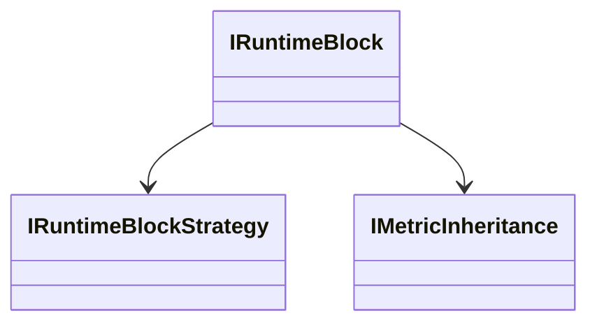

# IRuntimeBlock

## Purpose
Represents an executable block in the runtime.

## Key Methods
- inherit(...)
- execute(...)

## Known Implementations
- src/runtime/RuntimeBlock.ts
- src/runtime/MockRuntimeBlock.ts

## Interactions

