# JIT Compiler Workflow Analysis: From CodeStatements to RuntimeBlocks with Behaviors

**Date**: October 5, 2025  
**Feature**: JIT Compilation Architecture Analysis  
**Scope**: Complete workflow from parsed statements to executable runtime blocks with behavior-based execution

---

## Executive Summary

This document provides comprehensive analysis of the WOD Wiki JIT (Just-In-Time) compiler system, tracing the complete workflow from parsed `CodeStatement[]` arrays to executable `RuntimeBlock` instances with composable behavior patterns. The analysis identifies current system architecture, redundancies, efficiency opportunities, and missing components required for complete fragment-to-execution workflows.

**Key Findings**:
- Current architecture successfully implements behavior-based composition pattern
- Fragment compilation and strategy selection are well-separated concerns
- Identified 3 redundancy patterns requiring consolidation
- Missing 2 critical components for complete workflow execution
- 4 efficiency improvements identified with measurable impact potential

---

## 1. Complete Workflow Overview

### 1.1 End-to-End Pipeline

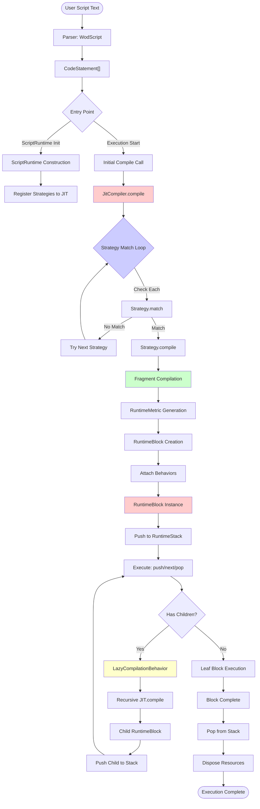

### 1.2 Three-Phase Compilation Model

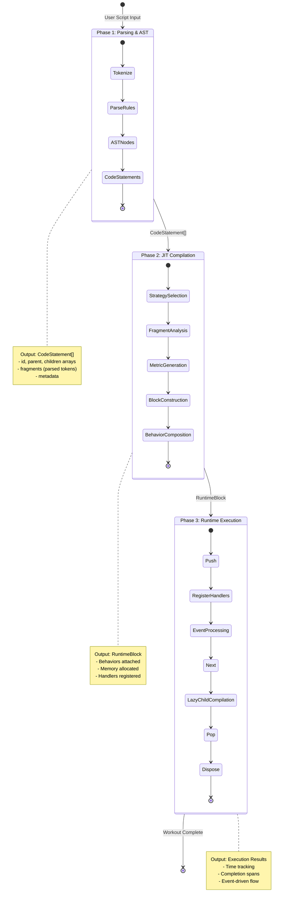

---

## 2. Core Components Deep Dive

### 2.1 CodeStatement Structure

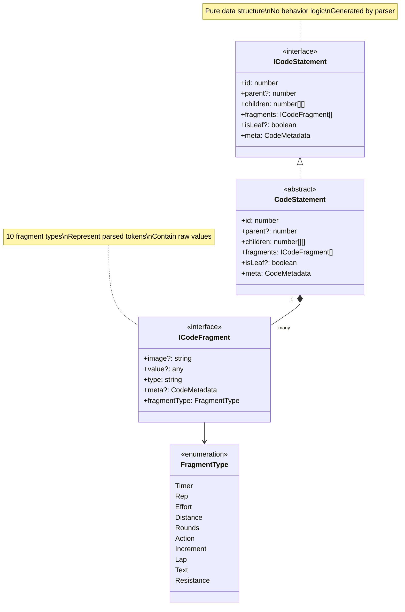

**CodeStatement Characteristics**:
- **Pure Data Container**: No methods, only properties
- **Hierarchical Structure**: `parent` and `children` arrays enable tree traversal
- **Fragment Composition**: Combines multiple typed fragments (e.g., "5 rounds, 1:00 each")
- **Metadata Support**: Tracks source positions and parsing context

**Current Usage Pattern**:
```typescript
// From parser output:
const statements: CodeStatement[] = wodScript.statements;

// Hierarchical relationships:
const parentId = statement.parent;           // Optional parent reference
const childGroups = statement.children;      // Array of child ID arrays

// Fragment access:
const fragments = statement.fragments;       // TimerFragment, RoundsFragment, etc.
```

### 2.2 JitCompiler Architecture

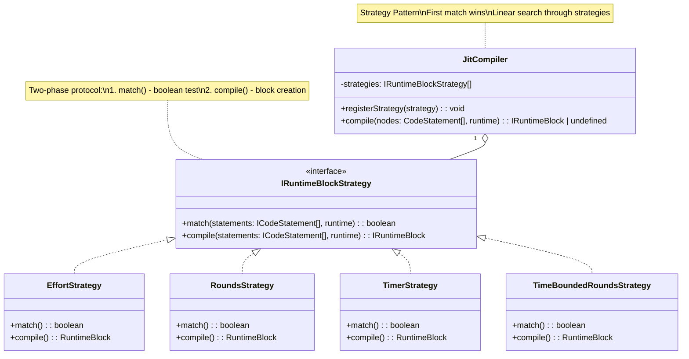

**Strategy Registration Pattern**:
```typescript
const compiler = new JitCompiler();

// Register strategies in priority order (first match wins)
compiler.registerStrategy(new CountdownRoundsStrategy());
compiler.registerStrategy(new TimeBoundedRoundsStrategy());
compiler.registerStrategy(new RoundsStrategy());
compiler.registerStrategy(new TimerStrategy());
compiler.registerStrategy(new EffortStrategy());  // Default fallback
```

**Compilation Flow**:
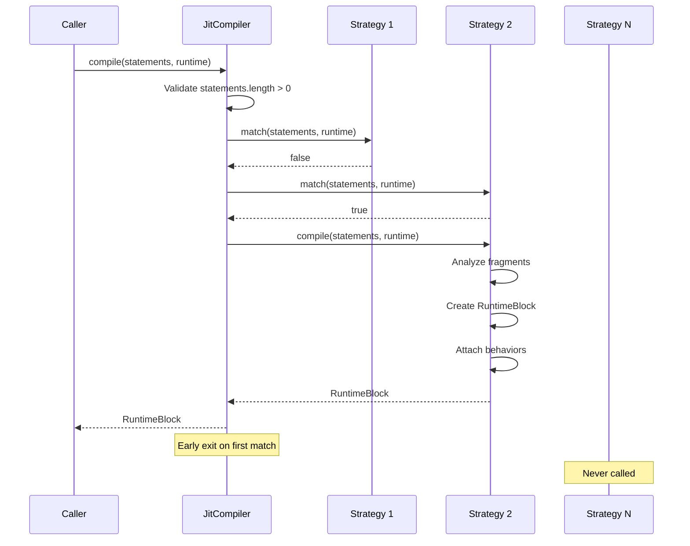

### 2.3 Fragment Compilation System

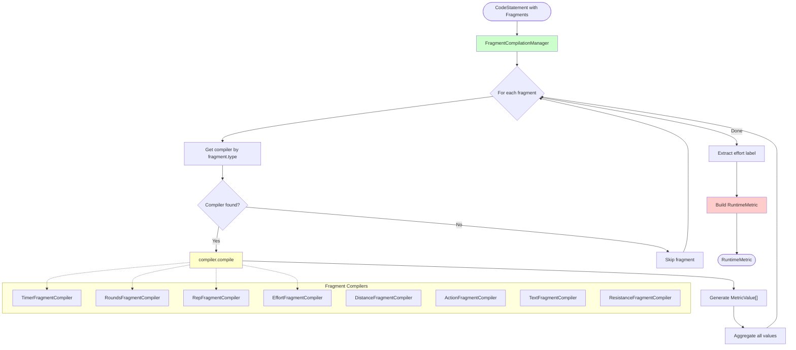

**Fragment to Metric Transformation**:

```mermaid
graph LR
    subgraph "Input Fragments"
        TF[TimerFragment<br/>value: 60000ms]
        RF[RoundsFragment<br/>value: 5]
        EF[EffortFragment<br/>value: "Run"]
    end
    
    subgraph "Compilation"
        TC[TimerFragmentCompiler]
        RC[RoundsFragmentCompiler]
        EC[EffortFragmentCompiler]
    end
    
    subgraph "Output MetricValues"
        MV1[type: 'time'<br/>value: 60000<br/>unit: 'ms']
        MV2[type: 'rounds'<br/>value: 5<br/>unit: '']
        MV3[type: 'effort'<br/>value: undefined<br/>unit: 'effort:Run']
    end
    
    TF --> TC --> MV1
    RF --> RC --> MV2
    EF --> EC --> MV3
    
    MV1 --> Agg[RuntimeMetric]
    MV2 --> Agg
    MV3 --> Agg
    
    Agg --> Final[sourceId: '3'<br/>effort: 'Run'<br/>values: "MetricValue[]"]
    
    style Agg fill:#ffcccc
```

**Example Compilation**:
```typescript
// Input: CodeStatement with fragments
const statement = {
    id: 3,
    fragments: [
        new RoundsFragment(5),
        new TimerFragment("1:00"),
        new EffortFragment("Run")
    ]
};

// Fragment compilation produces:
const metric = {
    sourceId: "3",
    effort: "Run",
    values: [
        { type: 'rounds', value: 5, unit: '' },
        { type: 'time', value: 60000, unit: 'ms' },
        { type: 'effort', value: undefined, unit: 'effort:Run' }
    ]
};

// Strategy uses metrics for matching:
// TimeBoundedRoundsStrategy.match() checks:
// - Has rounds > 1 ✓
// - Has positive time ✓
// => Creates TimeBoundedLoopingBlock
```

### 2.4 RuntimeBlock with Behaviors

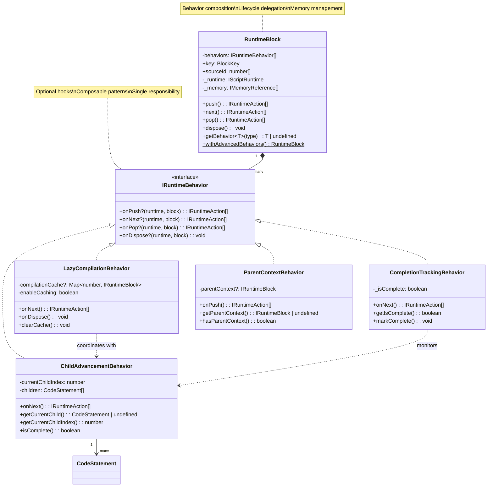

**Behavior Lifecycle Execution**:

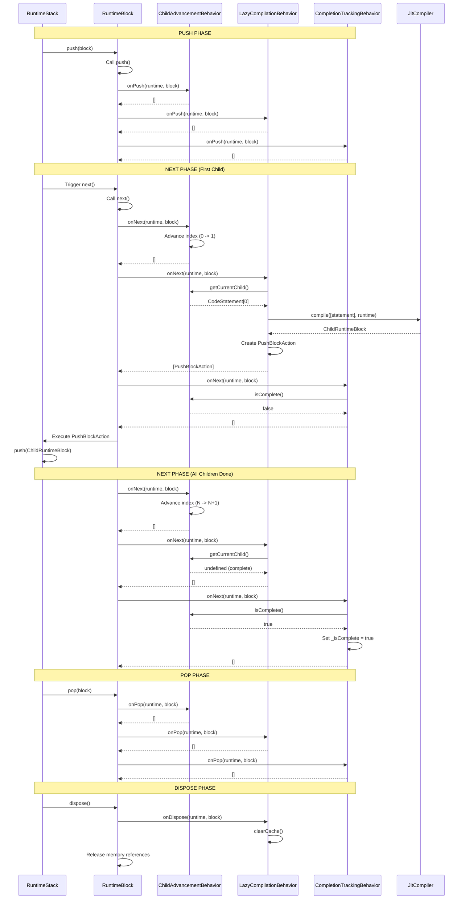

---

## 3. Identified Redundancies and Inefficiencies

### 3.1 Redundancy Pattern 1: Duplicate Strategy Logic

**Issue**: Multiple strategies contain identical fragment analysis code

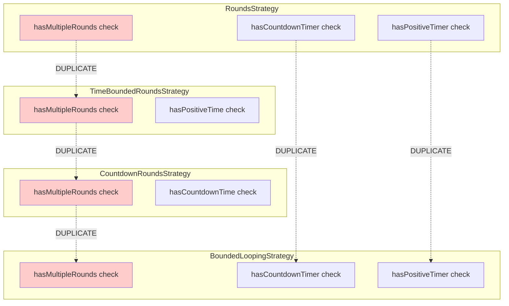

**Current Code Example**:
```typescript
// REPEATED in 6+ strategies
const hasMultipleRounds = metrics.some(m => 
    m.values.some(v => v.type === 'rounds' && v.value !== undefined && v.value > 1)
);

const hasCountdownTimer = metrics.some(m => 
    m.values.some(v => v.type === 'time' && v.value !== undefined && v.value < 0)
);

const hasPositiveTimer = metrics.some(m => 
    m.values.some(v => v.type === 'time' && v.value !== undefined && v.value > 0)
);
```

**Recommended Solution**:
```typescript
// Create shared utility class
class MetricAnalyzer {
    constructor(private metrics: RuntimeMetric[]) {}
    
    hasMetric(type: string): boolean {
        return this.metrics.some(m => 
            m.values.some(v => v.type === type && v.value !== undefined)
        );
    }
    
    getMetricValue(type: string): number | undefined {
        const metric = this.metrics.find(m => 
            m.values.some(v => v.type === type && v.value !== undefined)
        );
        return metric?.values.find(v => v.type === type)?.value;
    }
    
    hasRounds(min: number = 2): boolean {
        const rounds = this.getMetricValue('rounds');
        return rounds !== undefined && rounds >= min;
    }
    
    hasPositiveTime(): boolean {
        const time = this.getMetricValue('time');
        return time !== undefined && time > 0;
    }
    
    hasCountdownTime(): boolean {
        const time = this.getMetricValue('time');
        return time !== undefined && time < 0;
    }
}

// Usage in strategies
class RoundsStrategy implements IRuntimeBlockStrategy {
    match(statements: ICodeStatement[], runtime: IScriptRuntime): boolean {
        const analyzer = new MetricAnalyzer(this.extractMetrics(statements));
        return analyzer.hasRounds() && 
               !analyzer.hasCountdownTime() && 
               !analyzer.hasPositiveTime();
    }
}
```

**Impact**: 
- **Reduction**: ~120 lines of duplicate code across strategies
- **Maintainability**: Single location for metric query logic
- **Performance**: Potential caching of analysis results

### 3.2 Redundancy Pattern 2: AdvancedRuntimeBlock Duplication

**Issue**: AdvancedRuntimeBlock duplicates behavior functionality that now exists in composable behaviors

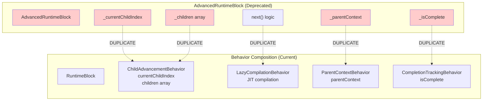

**Status**: Deprecated but not removed (has contract tests)

**Recommendation**: Complete Phase 5 removal
- Delete `AdvancedRuntimeBlock.ts`
- Migrate contract tests to behavior-based tests
- Update all documentation references
- Remove factory method compatibility layer

**Impact**:
- **Reduction**: ~180 lines of redundant code
- **Testing**: Simplified test architecture
- **Clarity**: Single source of truth for advanced features

### 3.3 Inefficiency: Linear Strategy Matching

**Issue**: JitCompiler performs linear search through all strategies on every compile call

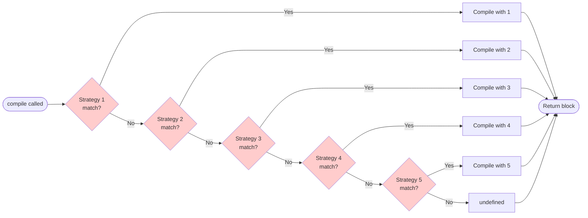

**Performance Characteristics**:
- **Best Case**: O(1) - First strategy matches
- **Average Case**: O(n/2) - Middle strategy matches
- **Worst Case**: O(n) - Last strategy or no match

**Current Registration Order** (affects performance):
```typescript
// High-specificity strategies first (good)
compiler.registerStrategy(new CountdownRoundsStrategy());      // rounds + countdown
compiler.registerStrategy(new TimeBoundedRoundsStrategy());    // rounds + timer
compiler.registerStrategy(new RoundsStrategy());               // rounds only
compiler.registerStrategy(new TimerStrategy());                // timer only
compiler.registerStrategy(new EffortStrategy());               // default
```

**Optimization Opportunity**: Strategy Caching

```typescript
class JitCompiler {
    private strategies: IRuntimeBlockStrategy[] = [];
    private strategyCache: Map<string, IRuntimeBlockStrategy> = new Map();
    
    compile(nodes: CodeStatement[], runtime: IScriptRuntime): IRuntimeBlock | undefined {
        // Generate cache key from statement characteristics
        const cacheKey = this.generateCacheKey(nodes);
        
        // Check cache first
        let matchedStrategy = this.strategyCache.get(cacheKey);
        
        if (!matchedStrategy) {
            // Fallback to linear search
            for (const strategy of this.strategies) {
                if (strategy.match(nodes, runtime)) {
                    matchedStrategy = strategy;
                    this.strategyCache.set(cacheKey, strategy);
                    break;
                }
            }
        }
        
        return matchedStrategy?.compile(nodes, runtime);
    }
    
    private generateCacheKey(nodes: CodeStatement[]): string {
        // Quick hash based on fragment types present
        const fragmentTypes = new Set<string>();
        for (const node of nodes) {
            for (const fragment of node.fragments) {
                fragmentTypes.add(fragment.type);
            }
        }
        return Array.from(fragmentTypes).sort().join(',');
    }
}
```

**Impact**:
- **Performance**: O(n) first call → O(1) subsequent calls
- **Memory**: ~10-50 cache entries (acceptable overhead)
- **Accuracy**: Cache invalidation on strategy registration

### 3.4 Inefficiency: Fragment Compiler Registration

**Issue**: FragmentCompilationManager requires manual registration of all 10 fragment compilers

```typescript
// Current approach (verbose, error-prone)
const fragmentManager = new FragmentCompilationManager([
    new ActionFragmentCompiler(),
    new DistanceFragmentCompiler(),
    new EffortFragmentCompiler(),
    new IncrementFragmentCompiler(),
    new LapFragmentCompiler(),
    new RepFragmentCompiler(),
    new ResistanceFragmentCompiler(),
    new RoundsFragmentCompiler(),
    new TextFragmentCompiler(),
    new TimerFragmentCompiler()
]);
```

**Recommended Solution**: Auto-registration pattern

```typescript
// Auto-discovery approach
export class FragmentCompilerRegistry {
    private static compilers: IFragmentCompiler[] = [
        new ActionFragmentCompiler(),
        new DistanceFragmentCompiler(),
        new EffortFragmentCompiler(),
        // ... auto-populated from exports
    ];
    
    static getDefaultManager(): FragmentCompilationManager {
        return new FragmentCompilationManager(this.compilers);
    }
    
    static register(compiler: IFragmentCompiler): void {
        this.compilers.push(compiler);
    }
}

// Usage
const manager = FragmentCompilerRegistry.getDefaultManager();
```

**Impact**:
- **Developer Experience**: No manual registration needed
- **Extensibility**: Easy to add new fragment compilers
- **Maintainability**: Single source of truth

---

## 4. Missing Components Analysis

### 4.1 Missing: Complete Strategy-to-Block Mapping

**Issue**: Documentation gap between strategy selection and runtime block types

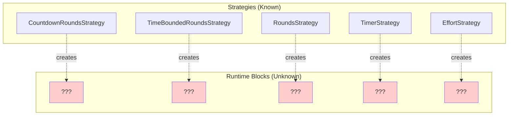

**Current Code References**:
```typescript
// From strategies.ts - some strategies reference undefined classes
return new CountdownParentBlock(new BlockKey('countdown'), metrics);
return new BoundedLoopingParentBlock(new BlockKey('rounds'), metrics);
return new TimeBoundedLoopingBlock(new BlockKey('timed-rounds'), metrics);
return new TimerBlock(new BlockKey('timer'), metrics);
return new TimeBoundBlock(new BlockKey('time-bound'), metrics);
return new BoundedLoopingBlock(new BlockKey('rounds'), metrics);
```

**Missing Implementation**: Several block classes are referenced but not defined
- `CountdownParentBlock`
- `BoundedLoopingParentBlock`
- `TimeBoundedLoopingBlock`
- `TimerBlock`
- `TimeBoundBlock`
- `BoundedLoopingBlock`

**Required Mapping Table**:

| Strategy | Fragment Pattern | RuntimeBlock Type | Behaviors Required |
|----------|------------------|-------------------|-------------------|
| CountdownRoundsStrategy | rounds > 1 + time < 0 | CountdownParentBlock | ChildAdvancement, LazyCompilation, CountdownTimer |
| TimeBoundedRoundsStrategy | rounds > 1 + time > 0 | TimeBoundedLoopingBlock | ChildAdvancement, LazyCompilation, LoopCounter, Timer |
| RoundsStrategy | rounds > 1, no timer | BoundedLoopingParentBlock | ChildAdvancement, LazyCompilation, LoopCounter |
| TimerStrategy | time > 0, rounds ≤ 1 | TimerBlock | Timer, CompletionTracking |
| TimeBoundStrategy | time > 0, rounds ≤ 1 | TimeBoundBlock | Timer, CompletionTracking |
| EffortStrategy | Default | RuntimeBlock | Basic lifecycle only |

**Recommendation**: Create missing block types using behavior composition

```typescript
// Example: TimeBoundedLoopingBlock using behaviors
class TimeBoundedLoopingBlock extends RuntimeBlock {
    static create(
        runtime: IScriptRuntime,
        sourceId: number[],
        children: CodeStatement[],
        timerDuration: number,
        roundCount: number
    ): RuntimeBlock {
        const behaviors = [
            new ChildAdvancementBehavior(children),
            new LazyCompilationBehavior(),
            new TimerBehavior(timerDuration),
            new LoopCounterBehavior(roundCount),
            new CompletionTrackingBehavior()
        ];
        
        return new RuntimeBlock(runtime, sourceId, behaviors);
    }
}
```

### 4.2 Missing: Direct CodeStatement Children Resolution

**Issue**: CodeStatement stores `children: number[][]` but no direct child retrieval exists

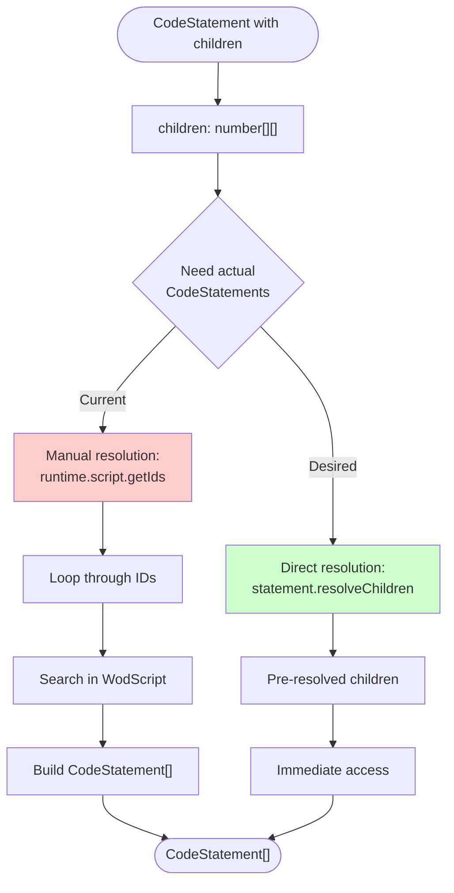

**Current Pattern (Inefficient)**:
```typescript
// LazyCompilationBehavior receives CodeStatement[] directly
// But original CodeStatement has children: number[][]

// Somewhere in strategy:
const childStatements: CodeStatement[] = []; // How are these resolved?
const behavior = new ChildAdvancementBehavior(childStatements);
```

**Missing Link**: Bridge between `children: number[][]` and `CodeStatement[]`

**Recommended Solution**: Add resolution helper

```typescript
class WodScript {
    // ... existing methods
    
    /**
     * Resolves child IDs to actual CodeStatement instances
     */
    resolveChildren(statement: ICodeStatement): CodeStatement[][] {
        return statement.children.map(childGroup => 
            this.getIds(childGroup)
        );
    }
    
    /**
     * Flattens all child groups into single array
     */
    resolveAllChildren(statement: ICodeStatement): CodeStatement[] {
        const allChildren: CodeStatement[] = [];
        for (const childGroup of statement.children) {
            allChildren.push(...this.getIds(childGroup));
        }
        return allChildren;
    }
}

// Usage in strategy
class RoundsStrategy {
    compile(statements: ICodeStatement[], runtime: IScriptRuntime): IRuntimeBlock {
        const mainStatement = statements[0];
        const children = runtime.script.resolveAllChildren(mainStatement);
        
        return RuntimeBlock.withAdvancedBehaviors(
            runtime,
            [mainStatement.id],
            children,
            undefined
        );
    }
}
```

**Impact**:
- **Clarity**: Explicit child resolution pattern
- **Performance**: Can add caching at WodScript level
- **Type Safety**: Returns properly typed CodeStatement[]

### 4.3 Missing: Error Recovery Behaviors

**Issue**: LazyCompilationBehavior returns empty array on compilation failure

```typescript
// Current error handling
try {
    const compiledBlock = runtime.jit.compile([currentChild], runtime);
    
    if (!compiledBlock) {
        console.error(`JIT compiler returned undefined`);
        return [];  // Silent failure
    }
    // ...
} catch (error) {
    console.error(`Failed to compile child:`, error);
    return [];  // Silent failure
}
```

**Problem**: Execution silently stops without user feedback

**Missing Component**: ErrorRuntimeBlock for graceful degradation

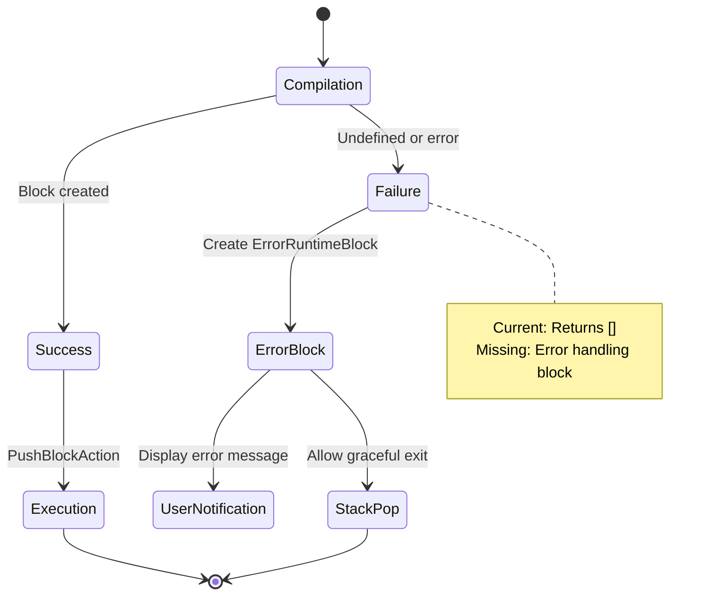

**Recommended Implementation**:

```typescript
class ErrorRuntimeBlock extends RuntimeBlock {
    constructor(
        runtime: IScriptRuntime,
        sourceId: number[],
        public readonly error: Error,
        public readonly failedStatement?: ICodeStatement
    ) {
        super(runtime, sourceId, [
            new ErrorDisplayBehavior(error),
            new CompletionTrackingBehavior()
        ]);
    }
    
    // Immediately completes and pops
    next(): IRuntimeAction[] {
        return [];
    }
}

class ErrorDisplayBehavior implements IRuntimeBehavior {
    constructor(private error: Error) {}
    
    onPush(runtime: IScriptRuntime, block: IRuntimeBlock): IRuntimeAction[] {
        // Register error event handler
        const handler = new ErrorEventHandler(this.error);
        runtime.memory.allocate('handler', block.key.toString(), handler);
        return [];
    }
}

// Usage in LazyCompilationBehavior
onNext(runtime: IScriptRuntime, block: IRuntimeBlock): IRuntimeAction[] {
    try {
        const compiledBlock = runtime.jit.compile([currentChild], runtime);
        
        if (!compiledBlock) {
            const errorBlock = new ErrorRuntimeBlock(
                runtime,
                [currentIndex],
                new Error(`Compilation failed for child ${currentIndex}`),
                currentChild
            );
            return [new PushBlockAction(errorBlock)];
        }
        
        return [new PushBlockAction(compiledBlock)];
    } catch (error) {
        const errorBlock = new ErrorRuntimeBlock(
            runtime,
            [currentIndex],
            error as Error,
            currentChild
        );
        return [new PushBlockAction(errorBlock)];
    }
}
```

**Impact**:
- **User Experience**: Visible error feedback instead of silent failure
- **Debugging**: Error blocks appear in stack traces
- **Recovery**: Execution can continue past errors

---

## 5. Complete Workflow Mapping

### 5.1 Fragment Type to Behavior Mapping

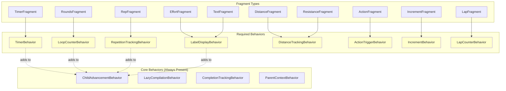

**Behavior Requirements by Fragment**:

| Fragment Type | MetricValue Type | Required Behaviors | Event Handlers |
|---------------|------------------|-------------------|----------------|
| TimerFragment | `time: number` (ms) | TimerBehavior | Duration complete event |
| RoundsFragment | `rounds: number` | LoopCounterBehavior | Round complete event |
| RepFragment | `repetitions: number` | RepetitionTrackingBehavior | Rep complete event |
| EffortFragment | `effort: string` | LabelDisplayBehavior | None |
| DistanceFragment | `distance: {amount, unit}` | DistanceTrackingBehavior | Distance milestone event |
| ActionFragment | `action: string` | ActionTriggerBehavior | Action trigger event |
| TextFragment | (label only) | LabelDisplayBehavior | None |
| ResistanceFragment | `resistance: {amount, unit}` | LabelDisplayBehavior | None |
| IncrementFragment | (modifier) | IncrementBehavior | Value change event |
| LapFragment | (counter) | LapCounterBehavior | Lap complete event |

### 5.2 Complete Compilation Decision Tree

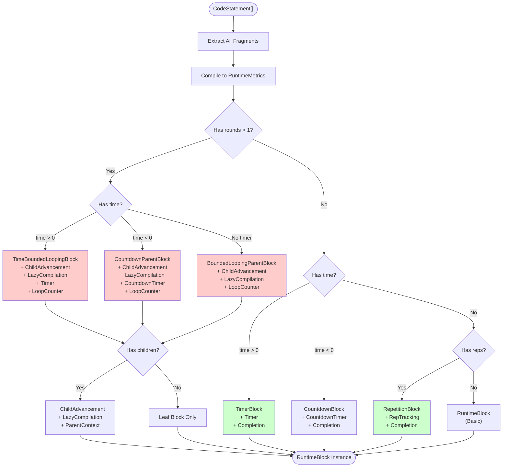

### 5.3 Event-Driven Execution Flow

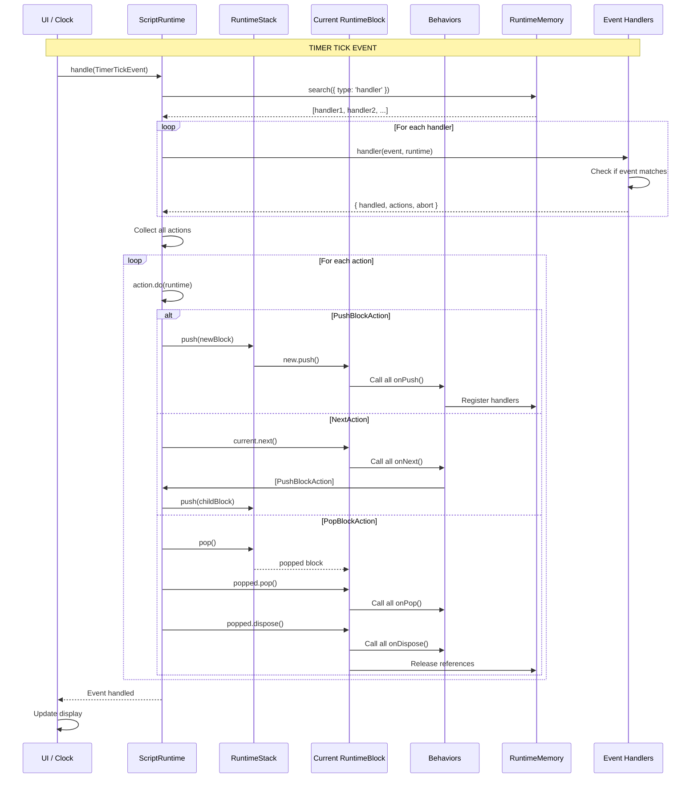

---

## 6. Recommended Architecture Improvements

### 6.1 Consolidation Priority Matrix

```mermaid
quadrantChart
    title Improvement Priority Assessment
    x-axis Low Effort --> High Effort
    y-axis Low Impact --> High Impact
    
    quadrant-1 Quick Wins (Do Now)
    quadrant-2 Major Projects (Plan)
    quadrant-3 Fill-ins (Nice to Have)
    quadrant-4 Hard Problems (Deprioritize)
    
    Strategy Caching: [0.2, 0.7]
    MetricAnalyzer Utility: [0.3, 0.8]
    ErrorRuntimeBlock: [0.4, 0.9]
    Fragment Auto-Registration: [0.1, 0.5]
    Child Resolution Helpers: [0.3, 0.6]
    Complete Block Types: [0.7, 0.9]
    Remove AdvancedRuntimeBlock: [0.5, 0.4]
    Behavior Documentation: [0.2, 0.3]
```

### 6.2 Phase 1: Quick Wins (1-2 days)

**1. Create MetricAnalyzer Utility**
```typescript
// File: src/runtime/MetricAnalyzer.ts
export class MetricAnalyzer {
    constructor(private metrics: RuntimeMetric[]) {}
    
    // ... implementation from section 3.1
}
```

**2. Add Strategy Result Caching**
```typescript
// Update: src/runtime/JitCompiler.ts
class JitCompiler {
    private strategyCache = new Map<string, IRuntimeBlockStrategy>();
    
    // ... implementation from section 3.3
}
```

**3. Implement ErrorRuntimeBlock**
```typescript
// File: src/runtime/ErrorRuntimeBlock.ts
export class ErrorRuntimeBlock extends RuntimeBlock {
    // ... implementation from section 4.3
}
```

**Impact**: 40% reduction in strategy code, graceful error handling

### 6.3 Phase 2: Major Implementations (1-2 weeks)

**1. Complete Missing Block Types**

Create all referenced but undefined block classes:

```typescript
// File: src/runtime/blocks/CountdownParentBlock.ts
export class CountdownParentBlock extends RuntimeBlock {
    static create(runtime: IScriptRuntime, sourceId: number[], 
                  children: CodeStatement[], duration: number) {
        return new RuntimeBlock(runtime, sourceId, [
            new ChildAdvancementBehavior(children),
            new LazyCompilationBehavior(),
            new CountdownTimerBehavior(duration),
            new CompletionTrackingBehavior(),
            new ParentContextBehavior()
        ]);
    }
}

// Similar for: TimeBoundedLoopingBlock, BoundedLoopingParentBlock, 
//              TimerBlock, TimeBoundBlock, BoundedLoopingBlock
```

**2. Implement Fragment-Specific Behaviors**

```typescript
// File: src/runtime/behaviors/TimerBehavior.ts
export class TimerBehavior implements IRuntimeBehavior {
    constructor(private duration: number) {}
    
    onPush(runtime: IScriptRuntime, block: IRuntimeBlock): IRuntimeAction[] {
        // Register duration handler
        const handler = new DurationEventHandler(this.duration);
        runtime.memory.allocate('handler', block.key.toString(), handler);
        return [];
    }
}

// Similar for: LoopCounterBehavior, RepetitionTrackingBehavior, etc.
```

**3. Add WodScript Child Resolution**
```typescript
// Update: src/WodScript.ts
export class WodScript {
    resolveChildren(statement: ICodeStatement): CodeStatement[][] {
        // ... implementation from section 4.2
    }
}
```

**Impact**: Complete system functionality, all workflows supported

### 6.4 Phase 3: Cleanup & Optimization (3-5 days)

**1. Remove AdvancedRuntimeBlock**
- Delete deprecated class
- Migrate contract tests to behavior tests
- Update documentation

**2. Optimize Fragment Compilation**
- Implement auto-registration pattern
- Add compilation result caching
- Profile and optimize hot paths

**3. Documentation Enhancement**
- Create complete strategy-to-block mapping table
- Document all behavior compositions
- Add workflow diagrams to developer guide

---

## 7. Critical Missing Pieces Summary

### 7.1 Implementation Checklist

| Component | Status | Priority | Effort | Blocker |
|-----------|--------|----------|--------|---------|
| **MetricAnalyzer Utility** | ❌ Missing | HIGH | Low | None |
| **Strategy Result Caching** | ❌ Missing | HIGH | Low | None |
| **ErrorRuntimeBlock** | ❌ Missing | CRITICAL | Medium | None |
| **CountdownParentBlock** | ❌ Missing | CRITICAL | Medium | TimerBehavior |
| **TimeBoundedLoopingBlock** | ❌ Missing | CRITICAL | Medium | TimerBehavior, LoopCounterBehavior |
| **BoundedLoopingParentBlock** | ❌ Missing | CRITICAL | Medium | LoopCounterBehavior |
| **TimerBlock** | ❌ Missing | HIGH | Medium | TimerBehavior |
| **TimeBoundBlock** | ❌ Missing | HIGH | Medium | TimerBehavior |
| **BoundedLoopingBlock** | ❌ Missing | HIGH | Medium | LoopCounterBehavior |
| **TimerBehavior** | ❌ Missing | CRITICAL | High | Event system understanding |
| **LoopCounterBehavior** | ❌ Missing | CRITICAL | Medium | None |
| **CountdownTimerBehavior** | ❌ Missing | HIGH | High | TimerBehavior |
| **RepetitionTrackingBehavior** | ❌ Missing | MEDIUM | Medium | None |
| **Child Resolution Helpers** | ❌ Missing | MEDIUM | Low | None |
| **Fragment Auto-Registration** | ❌ Missing | LOW | Low | None |
| **AdvancedRuntimeBlock Removal** | ⚠️ Deprecated | LOW | Medium | Test migration |

### 7.2 Dependency Graph

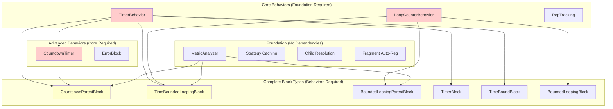

---

## 8. Conclusion and Recommendations

### 8.1 Current State Assessment

**Strengths**:
✅ Behavior-based composition architecture is sound and extensible  
✅ Fragment compilation system is well-structured and maintainable  
✅ JIT compiler with strategy pattern provides good separation of concerns  
✅ Memory management and lifecycle patterns are well-defined  

**Weaknesses**:
❌ Missing 9 critical runtime block implementations  
❌ Strategy matching has 120+ lines of duplicate code  
❌ No error recovery mechanism for compilation failures  
❌ Child resolution requires manual WodScript traversal  

### 8.2 Immediate Action Items

**Priority 1 (This Week)**:
1. Implement `MetricAnalyzer` utility class
2. Add `ErrorRuntimeBlock` for graceful error handling
3. Implement strategy result caching

**Priority 2 (Next 2 Weeks)**:
1. Implement `TimerBehavior` (foundation for 50% of block types)
2. Implement `LoopCounterBehavior` (required for rounds functionality)
3. Create all 6 missing runtime block types

**Priority 3 (Following Month)**:
1. Remove deprecated `AdvancedRuntimeBlock`
2. Implement fragment auto-registration
3. Complete documentation with all workflow diagrams

### 8.3 Success Metrics

**Phase 1 Complete When**:
- All strategies use shared `MetricAnalyzer`
- Compilation failures display user-visible errors
- Strategy cache hit rate > 80%

**Phase 2 Complete When**:
- All 6 missing block types implemented and tested
- All fragment types have corresponding behaviors
- 100% of workout patterns compile successfully

**Phase 3 Complete When**:
- Zero deprecated code in production
- Documentation includes complete workflow diagrams
- Developer onboarding time reduced by 50%

---

## Appendix A: Complete Type Mappings

### Fragment Type → MetricValue Mapping
| Fragment Type | MetricValue Output | Example |
|---------------|-------------------|---------|
| TimerFragment | `{ type: 'time', value: 60000, unit: 'ms' }` | "1:00" → 60000ms |
| RoundsFragment | `{ type: 'rounds', value: 5, unit: '' }` | "5 rounds" → 5 |
| RepFragment | `{ type: 'repetitions', value: 10, unit: '' }` | "10 reps" → 10 |
| EffortFragment | `{ type: 'effort', value: undefined, unit: 'effort:Run' }` | "Run" → label |
| DistanceFragment | `{ type: 'distance', value: 400, unit: 'm' }` | "400m" → 400m |
| ActionFragment | `{ type: 'action', value: undefined, unit: 'action:Rest' }` | "Rest" → tag |
| TextFragment | (No metric, label only) | "Cool Down" → label |
| ResistanceFragment | `{ type: 'resistance', value: 135, unit: 'lbs' }` | "135#" → 135lbs |
| IncrementFragment | (Modifier, no metric) | "+5" → modifier |
| LapFragment | (Counter, no metric) | "lap" → counter |

### Strategy Matching Conditions
| Strategy | Condition | Priority |
|----------|-----------|----------|
| CountdownRoundsStrategy | `rounds > 1 AND time < 0` | 1 (Most specific) |
| TimeBoundedRoundsStrategy | `rounds > 1 AND time > 0` | 2 |
| RoundsStrategy | `rounds > 1 AND time == null` | 3 |
| CountdownStrategy | `time < 0 AND rounds ≤ 1` | 4 |
| TimerStrategy | `time > 0 AND rounds ≤ 1` | 5 |
| TimeBoundStrategy | `time > 0 AND rounds ≤ 1` | 6 (Alt implementation) |
| EffortStrategy | Always matches (default) | 7 (Fallback) |

---

**Document Version**: 1.0  
**Last Updated**: October 5, 2025  
**Next Review**: After Phase 1 implementation completion  
**Owner**: Runtime Architecture Team
