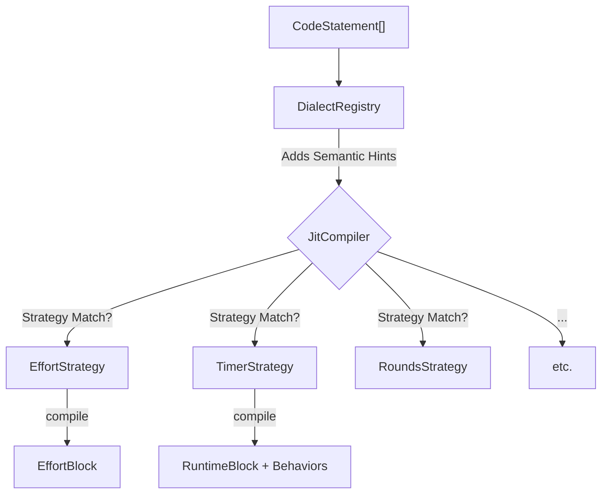
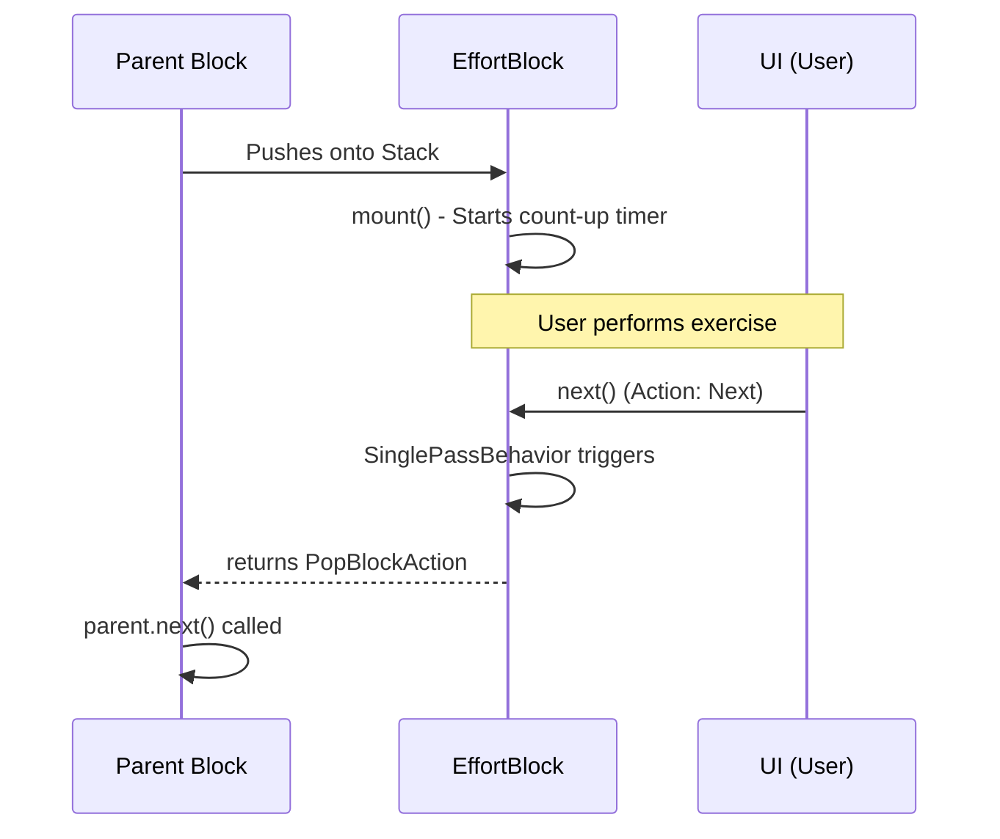
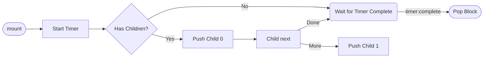
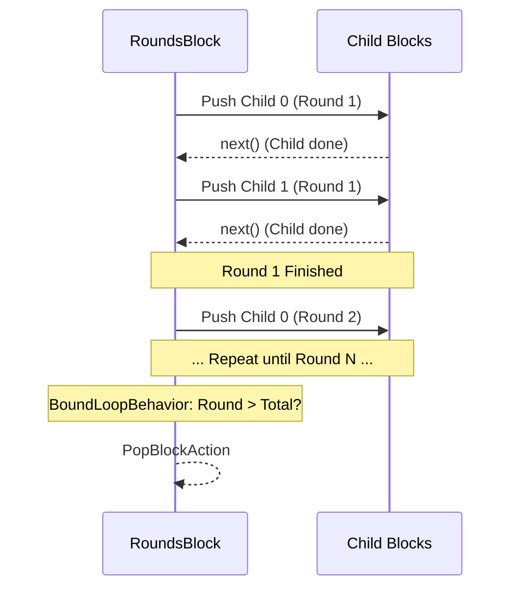
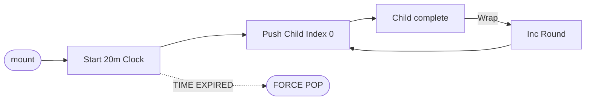
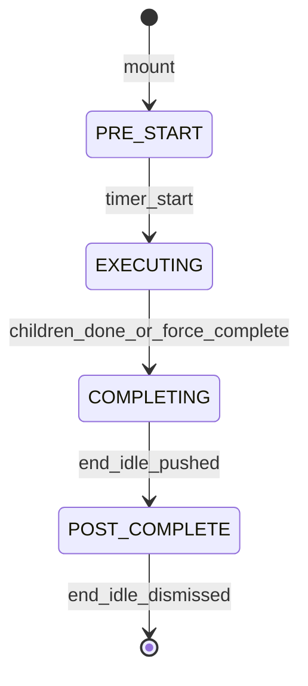

# JIT Strategies Overview

> **Author**: AI Assistant  
> **Created**: 2026-01-04  
> **Purpose**: Comprehensive reference for all JIT compilation strategies, their behaviors, and execution flows

---

## 🏗️ Architecture Overview

The JIT (Just-In-Time) compiler uses a **strategy pattern** to compile code statements into runtime blocks. 

### Compilation Pipeline


### High-Level Responsibility
1.  **🔍 Matching**: Analyze fragments (Timer, Rounds, Reps) and hints (`behavior.effort`).
2.  **🛠️ Composition**: Pick a set of single-responsibility behaviors.
3.  **📦 Injection**: Create the block and inject it into the runtime stack.

---

## ⚡ Strategy Matching Order

Strategies are checked in order. **First match wins**.

| Priority | Strategy | 🧩 Match Criteria (Key Fragments/Hints) |
|:---:|---|---|
| 1️⃣ | `TimeBoundRoundsStrategy` | **Timer** ➕ **Rounds** |
| 2️⃣ | `IntervalStrategy` | **Timer** ➕ (`repeating_interval` OR `emom`) |
| 3️⃣ | `TimerStrategy` | **Timer** OR `behavior.timer` |
| 4️⃣ | `RoundsStrategy` | **Rounds** (without Timer) |
| 5️⃣ | `GroupStrategy` | **Children** OR `behavior.group` |
| 6️⃣ | `EffortStrategy` | *Default Fallback* (untimed exercises) |

> [!NOTE]
> `WorkoutRootStrategy` and `IdleBlockStrategy` are **Factory-Built**. They are invoked directly by the system, not matched via JIT.

---

## 🧩 JIT-Matched Strategies

---

### 1. EffortStrategy
> **"The Simple Exercise"** (e.g., "10 Pushups")

| Quick Facts | Value |
|---:|---|
| **Primary Use** | Untimed, round-less exercises |
| **Stepping** | Manual (User clicks Next) |
| **Flow** | Single Pass |

#### 🔄 Stepping Flow & Interaction


*   **⏹️ Exit Condition**: User manually triggers `next()`.
*   **🔗 Parent/Child**: Leaf node. Always pops itself on the first `next()` call.

---

### 2. TimerStrategy
> **"The Clocked Segment"** (e.g., "30s Plank", "Rest 1m")

| Quick Facts | Value |
|---:|---|
| **Primary Use** | Time-bound execution |
| **Stepping** | Automatic (Timer expired) OR Manual (Skip) |
| **Flow** | Sequential Children (optional) |

#### 🔄 Stepping Flow & Interaction


*   **⏹️ Exit Condition**: `timer:complete` event OR `next()` (if no children left).
*   **🔗 Parent/Child**: Acts as a container. If children exist, they are run sequentially while the timer ticks.

---

### 3. RoundsStrategy
> **"The Repeater"** (e.g., "5 Rounds of...")

| Quick Facts | Value |
|---:|---|
| **Primary Use** | Multi-round sequences |
| **Stepping** | Child Completion Driven |
| **Flow** | Loop N Times |

#### 🔄 Stepping Flow & Interaction


*   **⏹️ Exit Condition**: `BoundLoopBehavior` detects specified rounds are finished.
*   **🔗 Parent/Child**: Coordinates child execution. Increments Round index when child index wraps.

---

### 4. IntervalStrategy (EMOM)
> **"The Paced Loop"** (e.g., "EMOM 10: 15 Air Squats")

| Quick Facts | Value |
|---:|---|
| **Primary Use** | Intervals / EMOM |
| **Stepping** | Timer Triggered |
| **Flow** | Paced Rounds |

#### 🔄 Stepping Flow & Interaction
*   **mount()**: Starts interval timer + pushes first child.
*   **child next()**: Toggles `IntervalWaitingBehavior` (displays "Waiting...") until timer expires.
*   **timer:complete**: Forced `next()` -> `IntervalTimerRestartBehavior` resets clock -> Pushes child again.
*   **⏹️ Exit Condition**: Reaches total interval count.
*   **🔗 Parent/Child**: Synchronizes child execution with a fixed repeating clock.

---

### 5. TimeBoundRoundsStrategy (AMRAP)
> **"As Many Rounds As Possible"** (e.g., "AMRAP 20")

| Quick Facts | Value |
|---:|---|
| **Primary Use** | Time Cap / Work Capacity |
| **Stepping** | Infinite Child Loop |
| **Flow** | Loop until Timer Death |

#### 🔄 Stepping Flow & Interaction


*   **⏹️ Exit Condition**: `CompletionBehavior` monitors the bound timer. When time is up, the block is popped regardless of child state.
*   **🔗 Parent/Child**: Parent defines the "Life Span" of the children.

---

### 6. GroupStrategy
> **"The Logical Group"** (Nested sequences)

| Quick Facts | Value |
|---:|---|
| **Primary Use** | Organization / Hierarchy |
| **Stepping** | Sequential |
| **Flow** | Single Pass |

*   **⏹️ Exit Condition**: `SinglePassBehavior` - when the last child returns `next()`.
*   **🔗 Parent/Child**: Simple passthrough. No special timing or looping logic.

---

## 🏭 Factory-Built Strategies

---

### 7. WorkoutRootStrategy
> **"The Mission Control"**

This is the top-most level of every workout. It manages phases (Ready → Work → Cooldown).

#### 🏗️ Component Map
| Category | Behaviors |
|:---:|---|
| **Flow** | `WorkoutFlowStateMachine`, `WorkoutOrchestrator` |
| **UI** | `WorkoutStateBehavior`, `DisplayModeBehavior`, `RoundDisplayBehavior` |
| **Injection** | `IdleInjectionBehavior` (Start/End) |
| **Sync** | `TimerBehavior` (The "True" Master Clock) |

#### 🔄 Phase Transition Flow


*   **⏹️ Exit Condition**: Entire workout is finished and post-analytics idle block is dismissed.
*   **🔗 Parent/Child**: Holds the top-level statements of the script.

---

### 8. IdleBlockStrategy
> **"The Wait State"** (Ready screen, Rest, Cooldown)

| Quick Facts | Value |
|---:|---|
| **Primary Use** | Transitions / Preparation |
| **Stepping** | Manual (Button click) |
| **Flow** | Blocking |

*   **⏹️ Exit Condition**: `PopOnEventBehavior` (on `timer:start`) or `PopOnNextBehavior`.
*   **🔗 Parent/Child**: Always a leaf node. Designed to "block" the parent's execution until the user is ready.

---

## 🎨 Visualization: The Runtime Stack

When an AMRAP contains a Group, which contains an Exercise:

```text
    STACK DEPTH
      ▲
      │  ┌───────────────────────┐
    3 │  │     EffortBlock       │ ◀── Leaf (User clicks Next)
      │  └───────────────────────┘
      │               ▲
      │  ┌───────────────────────┐
    2 │  │     GroupBlock        │ ◀── Container (Passes through)
      │  └───────────────────────┘
      │               ▲
      │  ┌───────────────────────┐
    1 │  │     AMRAPBlock        │ ◀── Controller (Watches 20m Timer)
      │  └───────────────────────┘
      │               ▲
      │  ┌───────────────────────┐
    0 │  │     RootBlock         │ ◀── Orchestrator (Main phases)
      │  └───────────────────────┘
      └──────────────────────────────────▶ TIME
```

---

## 📑 Related Documentation

- [Root/Idle Decomposition Plan](./root-idle-decomposition-plan.md)
- [Loop Coordinator Decomposition Plan](./loop-coordinator-decomposition-plan.md)
- [Behavior Update Plan](./behavior-update-plan.md)
