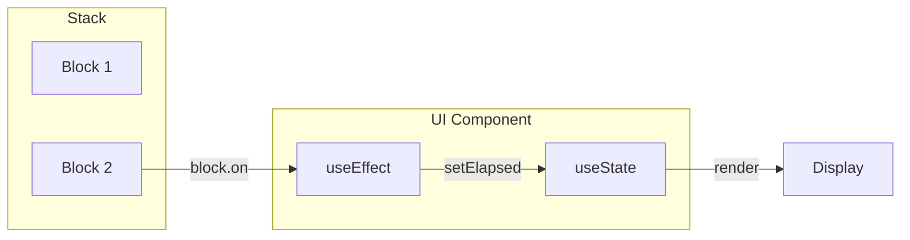

# UI Layer

> **Input:** Blocks from stack  
> **Output:** React components bound via `block.on()`

## Simplified Architecture (Option D)

UI components bind directly to blocks. No memory subscriptions needed.



## UI Hooks

| Hook | Purpose |
|------|---------|
| `useStack()` | Get current block stack |
| `useCurrentBlock()` | Get top block |
| N/A | No memory hooks needed! |

## Direct Block Binding

```typescript
function TimerDisplay({ block }: { block: IRuntimeBlock }) {
  const [elapsed, setElapsed] = useState(block.timerState?.elapsed ?? 0);
  
  useEffect(() => {
    // Register handler - auto-cleans on block unmount
    return block.on('tick', () => {
      setElapsed(block.timerState?.elapsed ?? 0);
    });
  }, [block]);
  
  return <span>{formatTime(elapsed)}</span>;
}
```

## Stack Subscription

```typescript
function WorkoutDisplay() {
  const stack = useStack();
  const [blocks, setBlocks] = useState(stack.blocks);
  
  useEffect(() => {
    return stack.onChange(setBlocks);
  }, [stack]);
  
  return (
    <div>
      {blocks.map(block => (
        <BlockCard key={block.key.value} block={block} />
      ))}
    </div>
  );
}
```

## Testing UI Components

```typescript
describe('TimerDisplay', () => {
  it('updates on tick', () => {
    // Create block - NO STACK NEEDED
    const block = new TimerBlock(60000);
    
    render(<TimerDisplay block={block} />);
    expect(screen.getByText('01:00')).toBeInTheDocument();
    
    // Simulate tick
    block.timerState.elapsed = 5000;
    block.emit('tick');
    
    expect(screen.getByText('00:55')).toBeInTheDocument();
  });
  
  it('cleans up handler on unmount', () => {
    const block = new TimerBlock(60000);
    const { unmount } = render(<TimerDisplay block={block} />);
    
    unmount();
    
    // Handler was removed (block.off called via cleanup)
    // No memory leaks
  });
});
```

## Test Contract

```typescript
// UI tests validate:
// 1. Component binds to block via on()
// 2. Component updates on emit()
// 3. Handler cleans up on component unmount
// 4. Handler cleans up on block unmount

const block = new TimerBlock(60000);
const handlerSpy = vi.fn();

const unsubscribe = block.on('tick', handlerSpy);
block.emit('tick');
expect(handlerSpy).toHaveBeenCalledTimes(1);

unsubscribe();
block.emit('tick');
expect(handlerSpy).toHaveBeenCalledTimes(1); // Not called again
```

## Related Files

- [[04-memory-layer|Memory Layer]] (deprecated for UI)
- [[IRuntimeBlock|IRuntimeBlock]] (bind target)
