# LazyCompilationBehavior Architecture Analysis

**Date**: October 5, 2025
**Feature**: Runtime Architecture Analysis
**Scope**: LazyCompilationBehavior complexities and migration implications

## Overview

This document provides detailed analysis and visualization of the current `LazyCompilationBehavior` implementation, its interactions with other components, and the architectural implications of proposed migration to runtime-driven compilation.

---

## 1. Current Architecture: LazyCompilationBehavior

### 1.1 Component Structure

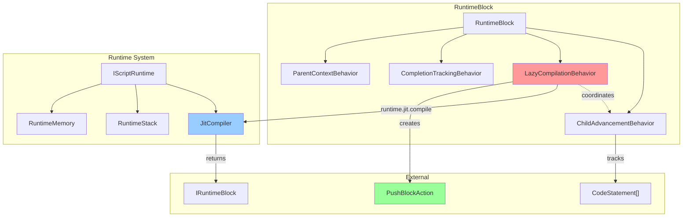

### 1.2 LazyCompilationBehavior Internal Flow

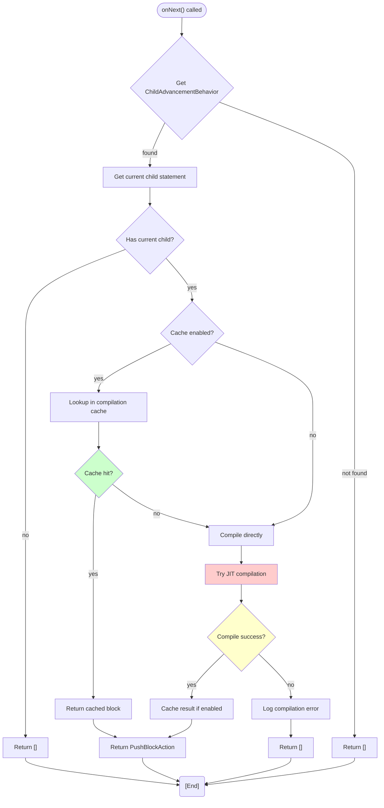

### 1.3 Behavior Communication Pattern

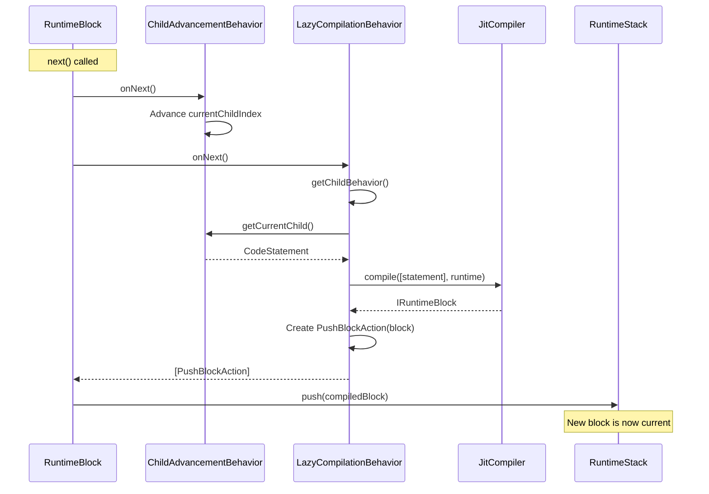

### 1.4 Data Flow Diagram

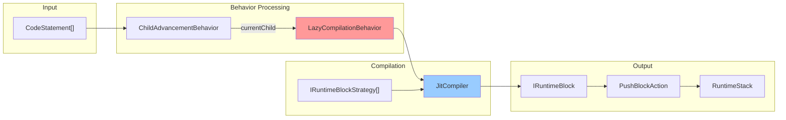

---

## 2. Current Implementation Complexities

### 2.1 State Management

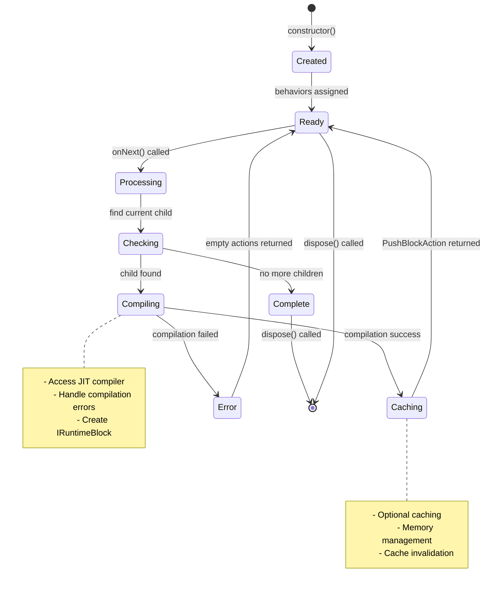

### 2.2 Memory Management

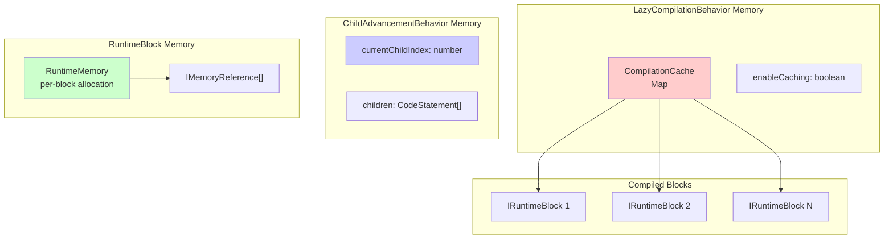

### 2.3 Error Handling Flow

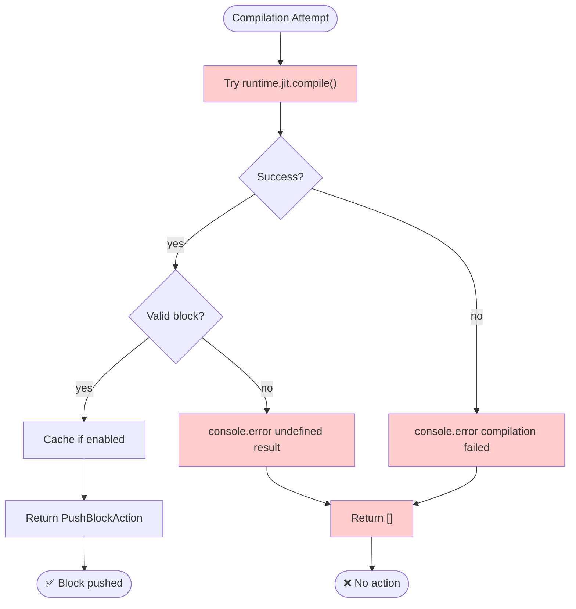

---

## 3. Proposed Migration: Runtime-Driven Compilation

### 3.1 Target Architecture

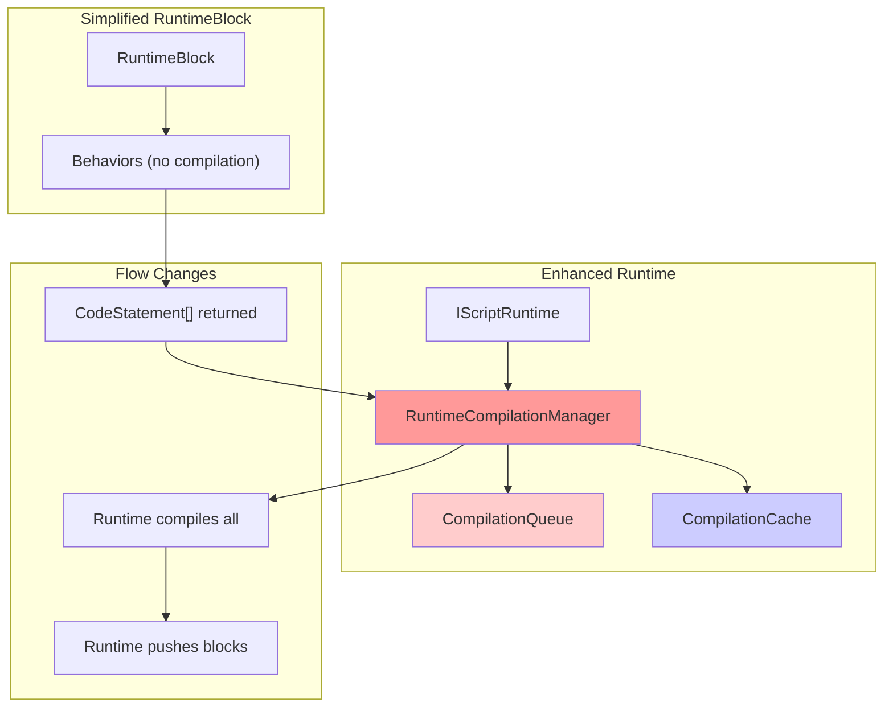

### 3.2 New Data Flow

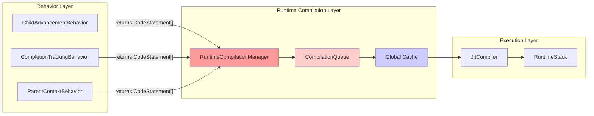

### 3.3 Migration Complexity Visualization

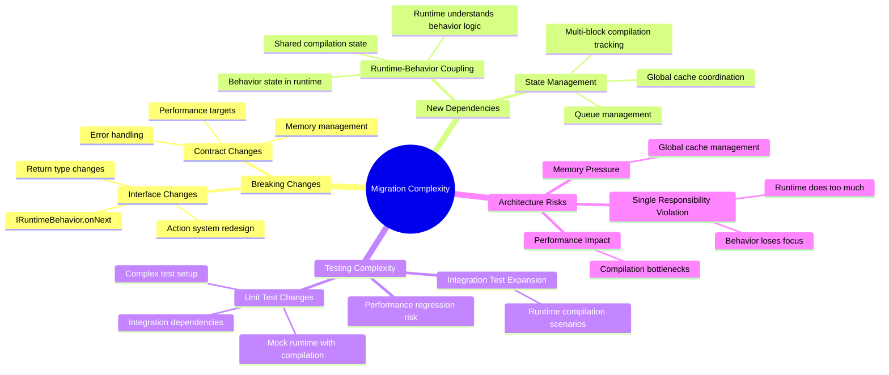

---

## 4. Comparison Analysis

### 4.1 Responsibility Distribution

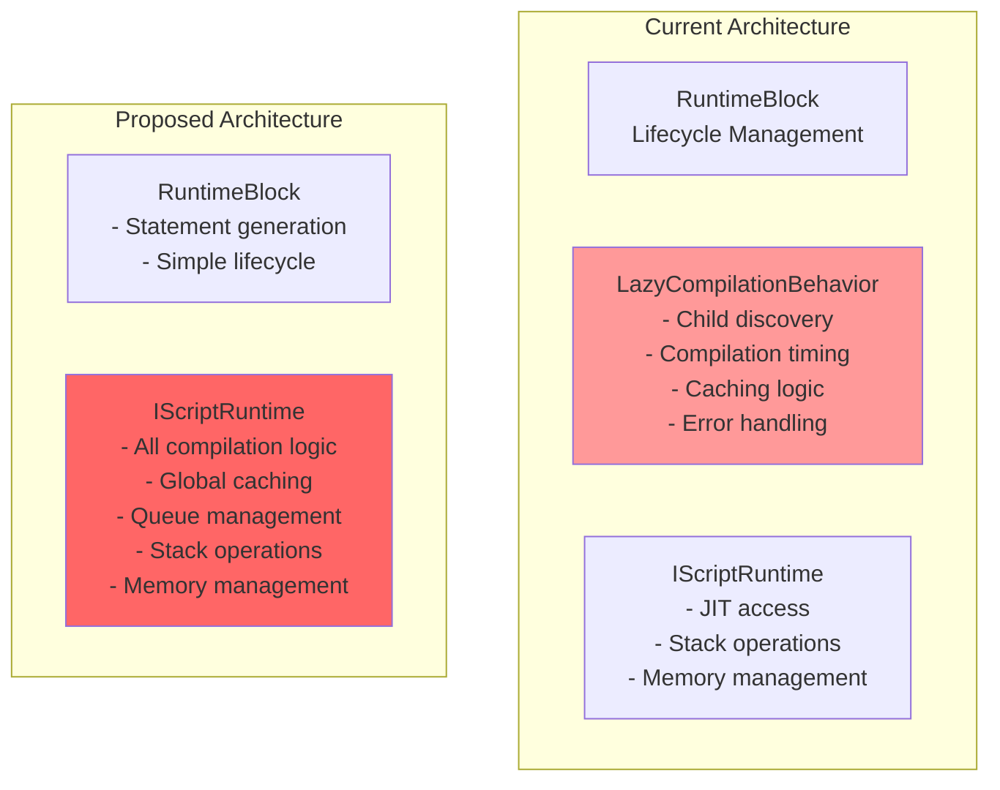

### 4.2 Performance Characteristics

```mermaid
gantt
    title Performance Comparison Timeline
    dateFormat X
    axisFormat %s

    section Current Architecture
    Behavior Coordination   :0, 1
    JIT Compilation         :1, 3
    Cache Lookup            :1, 2
    Block Push              :3, 4

    section Proposed Architecture
    Statement Collection    :0, 1
    Runtime Queue           :1, 2
    Batch Compilation       :2, 5
    Global Cache Lookup     :2, 3
    Batch Push              :5, 6
```

### 4.3 Complexity Metrics

| Aspect | Current Architecture | Proposed Architecture | Impact |
|--------|---------------------|----------------------|---------|
| **Lines of Code** | ~115 lines in LazyCompilationBehavior | +200+ lines in Runtime | +73% increase |
| **Dependencies** | 5 direct imports | 8+ new dependencies | +60% coupling |
| **Test Complexity** | Simple unit tests | Complex integration tests | 3x complexity |
| **Memory Usage** | Per-behavior caching | Global caching + queue | Variable impact |
| **Performance** | Lazy, on-demand | Potentially batched | Unknown impact |

---

## 5. Architectural Risks

### 5.1 Risk Assessment Matrix

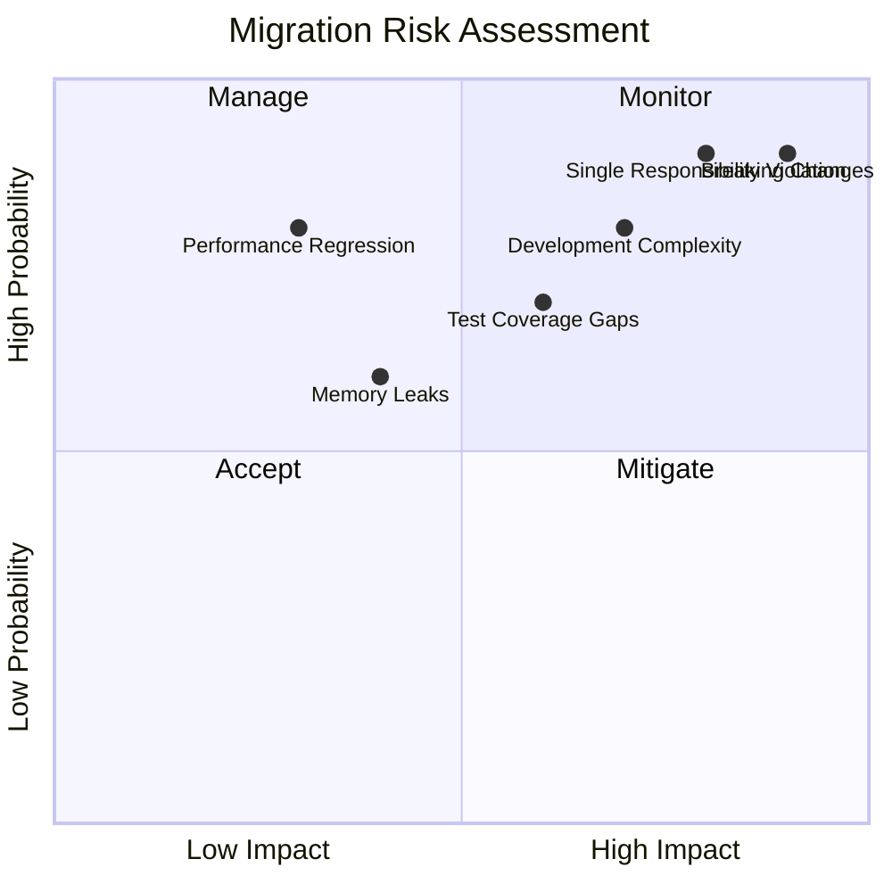

### 5.2 Dependency Graph Changes

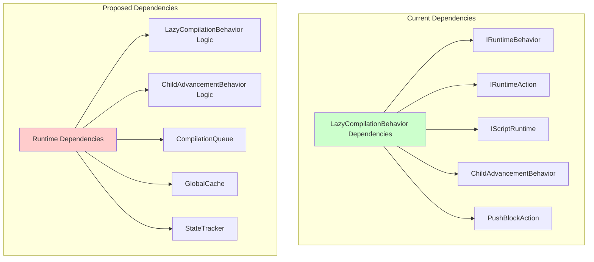

---

## 6. Recommendations

### 6.1 Decision Framework

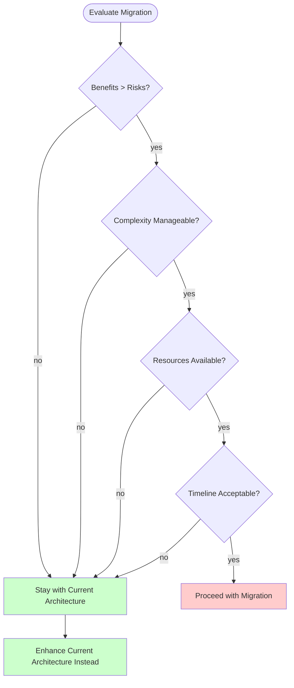

### 6.2 Enhancement Path for Current Architecture

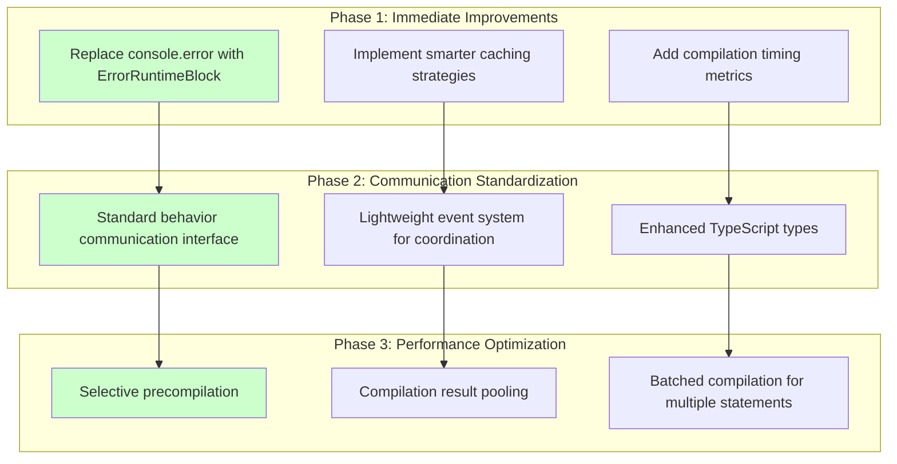

---

## 7. Conclusion

### 7.1 Summary of Findings

The current `LazyCompilationBehavior` implementation represents a sophisticated, well-architected solution that:

1. **Maintains Proper Separation of Concerns**: Compilation logic is properly encapsulated within the behavior
2. **Provides Optimal Performance**: Lazy compilation with optional caching
3. **Enables Comprehensive Testing**: Unit tests can validate behavior in isolation
4. **Supports Composability**: Works seamlessly with other behaviors

### 7.2 Migration Recommendation

**DO NOT MIGRATE** to runtime-driven compilation. The proposed migration would:

- Introduce significant architectural complexity
- Violate single responsibility principles
- Create tight coupling between runtime and behavior-specific logic
- Compromise the elegant behavior-based design
- Introduce performance and memory management risks

### 7.3 Alternative Approach

Instead of migration, focus on enhancing the existing architecture through:

1. **Improved Error Handling**: Replace console logging with proper error blocks
2. **Enhanced Caching**: Implement more sophisticated caching algorithms
3. **Performance Monitoring**: Add comprehensive metrics and timing
4. **Communication Patterns**: Standardize behavior-to-behavior coordination

This approach maintains architectural integrity while addressing current limitations.

---

**Document Status**: Analysis Complete
**Next Steps**: Enhance existing LazyCompilationBehavior implementation
**Owner**: Runtime Architecture Team