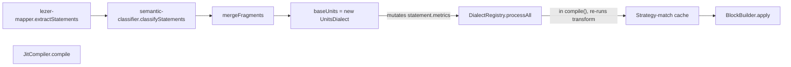
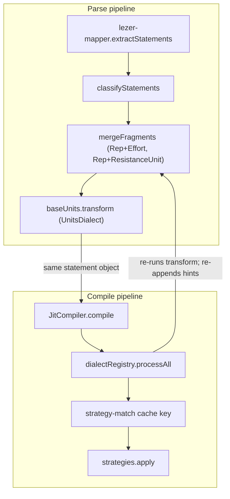
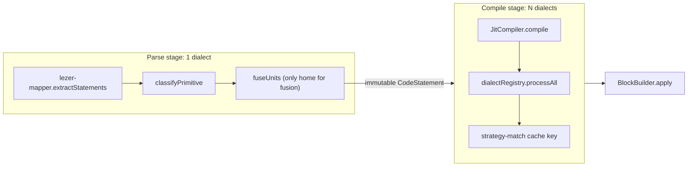
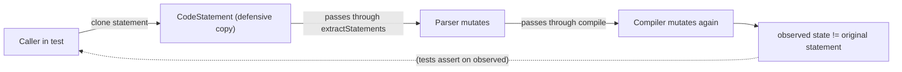

# Finding 01 — Parser and compiler are both Dialect homes; the "parser is Unit-free" promise is broken

> **Status:** Candidate. Surfaced by an architecture review walk on 2026-06-19.
> **Confidence:** High. **Seam test:** Creates a real seam (`DialectStage` with N adapters).
> Collapses the fake one (parser↔compiler mutation). **Priority:** Highest leverage.

## One-sentence problem

`CONTEXT.md` and `docs/01-overview.md` both promise *"the parser is Unit-free: it emits
bare Number + Text; Fusion (a Dialect concern) turns them into dimensioned Metrics."*
The code contradicts this: `extractStatements` runs `baseUnits.transform` on every
statement, and the compiler then runs the same `transform` step again through
`DialectRegistry.processAll`. There are two parallel fusion homes (`mergeFragments`
in `semantic-classifier.ts` and `fuseUnits.ts`) with overlapping rules.

## Path at a glance (existing)



Solid boxes are modules; arrows are the actual call order. The
`baseUnits → registry` hop is the bug: the parser mutates the statement and the
compiler mutates it again. Both hops trust that `fuseUnits` is idempotent, which
is true today but is a workaround, not a contract.

## Files involved (line counts)

| File | Lines | Role in the problem |
|------|------:|---------------------|
| `src/parser/lezer-mapper.ts` | 33 | Runs `baseUnits.transform` inside `extractStatements` (lines 21-27) |
| `src/parser/semantic-classifier.ts` | 305 | `mergeFragments` (lines 248-319) fuses `Rep+ResistanceUnit` and `Effort+Effort` |
| `src/dialects/units/fuseUnits.ts` | 344 | The UnitSet-driven fuser — overlap with `mergeFragments` |
| `src/dialects/UnitsDialect.ts` | small | The single dialect the parser currently runs |
| `src/services/DialectRegistry.ts` | 89 | `process()` runs `transform` + `analyze` in one pass (lines 51-71); `processAll()` (76-80) is called by the compiler |
| `src/runtime/compiler/JitCompiler.ts` | 157 | `compile()` calls `this.dialectRegistry.processAll(effectiveNodes)` (line 107); strategy-match cache key is computed *after* dialect processing |

## What the code is doing today

`lezer-mapper.ts:9-15` defends the dual-home design with a comment:

> *"Fusion is idempotent, so the compile-time Dialect Stack may run additional
> unit-bearing dialects on top without double-counting."*

That is a workaround, not a contract. It works because `fuseUnits` is idempotent, but
it makes the parser's "unit-free" promise unfalsifiable: there's no test that would
fail if the parser started emitting, say, `Effort` with a different fusion rule than
the compiler.

`DialectRegistry.process()` (lines 51-66) runs each dialect's `transform` *and*
`analyze` in one pass and mutates the statement in place:

```ts
dialect.transform?.(statement);
const analysis: DialectAnalysis = dialect.analyze(statement);
if (analysis.metrics?.length) {
  statement.metrics.add(...analysis.metrics);
}
```

`JitCompiler.compile()` (lines 79-153) calls `processAll` on the input statements
(line 107) before computing the strategy-match cache key (line 117). The cache
invalidation rule (`JitCompiler.ts:54-56`) only handles *strategy* registration, not
dialect re-registration — so a late-registered dialect silently invalidates nothing
and the cache returns the wrong strategies for the new dialect set.

Tests cope by `clone()`-ing statements before `compile()`:
`src/__tests__/smoke/application-launch.smoke.test.ts:91-108` does this defensively.
This is the smell: callers must hide the side effect from themselves.

## Why the architecture is costing

- **Locality**: fusion knowledge is split between `semantic-classifier.mergeFragments`
  and `dialects/units/fuseUnits.ts` with different selection rules. A maintainer fixing
  one is unaware of the other.
- **Leverage**: `DialectRegistry` looks like a real seam but is actually two
  assembly points (one inside the parser, one inside the compiler) with no contract
  between them.
- **Testability**: the `mixed-timers.md` "Invalid runtime state for next event" bug
  (open per `docs/testing-gap-analysis-timers.md:55-57`) lives in this overlap.
  Tests for fusion behaviour must explicitly sequence "parser pass" then "compiler
  pass" to reproduce.
- **Honesty**: `docs/01-overview.md` and `CONTEXT.md` claim a property the code
  doesn't enforce. Future contributors who believe the docs will be wrong on day one.

## Solution in plain English

One seam: `DialectStage` — a named assembly point in the pipeline. The parser owns
a "parse stage" with exactly one dialect (`baseUnits`); the compiler's
`DialectRegistry` is the "compile stage" with N dialects.

Concretely:

- The parser becomes a pure value boundary. `extractStatements` returns immutable
  `CodeStatement`s. `classifyPrimitive` is the only place primitives emit metrics.
  `mergeFragments` moves into `fuseUnits` (it is a unit-aware transform).
- The compiler's `compile()` becomes a `Statement[] -> Block` transform with **no
  mutation**. The `processAll` call inside `compile()` moves to one explicit place —
  either the parser or a "compile stage" wrapper. The strategy-match cache key then
  reflects what the rest of the system sees.
- A new `CONTEXT.md` term **Dialect Stage** — a named assembly point in the
  pipeline — describes the pattern. Each stage owns its own ordered dialect list.

## Benefits, in the right vocabulary

- **Locality:** all fusion logic lives in `fuseUnits`; the parser's "unit-free"
  promise becomes a testable contract enforced by code review.
- **Leverage:** `DialectRegistry` becomes a real seam with one assembly point. New
  dialects are registered once.
- **Testability:** `JitCompiler.compile()` is pure. The defensive `clone()` pattern
  in tests goes away. The strategy-match cache key is honest.
- **Bug-fix leverage:** the `mixed-timers.md` bug is rooted in this overlap;
  fixing the architecture is a precondition for the test, not the other way around.

## Risks

- Touches many callers. The few tests that mutate metrics on a `ParsedCodeStatement`
  (`src/parser/semantic-classifier.test.ts:240-262`) will need rewriting.
- The comment in `lezer-mapper.ts:9-15` is load-bearing in the sense that the
  "idempotent fusion" property keeps the current code working. Removing that comment
  without preserving the property would break things silently. A regression test
  for fusion idempotence across stages should be the first deliverable.

## Diagrams

### Existing — parser/compiler both mutate the same statement



Two pipelines own fusion logic. The `A4 → B1` arrow is a JavaScript object
reference, not a value boundary; `B2` re-runs the same `transform` step the
parser already ran. Idempotence is the only thing keeping it correct.

### Proposed — `DialectStage` with one-way value boundary



One arrow, one direction, one dialect per stage. The strategy-match cache key
is computed *after* dialect processing, but the parser is no longer in the
picture — the cache is honest because nothing else mutates the statement
upstream of it.

### Test-smell — callers must clone to hide the side effect



`src/__tests__/smoke/application-launch.smoke.test.ts:91-108` does this
defensively. After the refactor, the dotted `observed → test` arrow becomes a
direct read: tests pass a statement, get a block, no clone, no surprise.

## ADR conflict

This finding contradicts the `lezer-mapper.ts:9-15` comment and the parallel
"compile-time Dialect Stack" claim in `docs/01-overview.md`. It does *not* contradict
any document under `docs/` because no `docs/adr/` exists — but if the project adopts
a `docs/adr/` directory, this is the strongest candidate for the first ADR ("parse
stage and compile stage are distinct Dialect Stages; no dialect runs in both").
