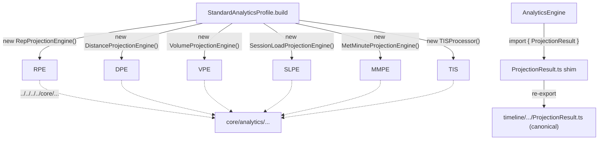
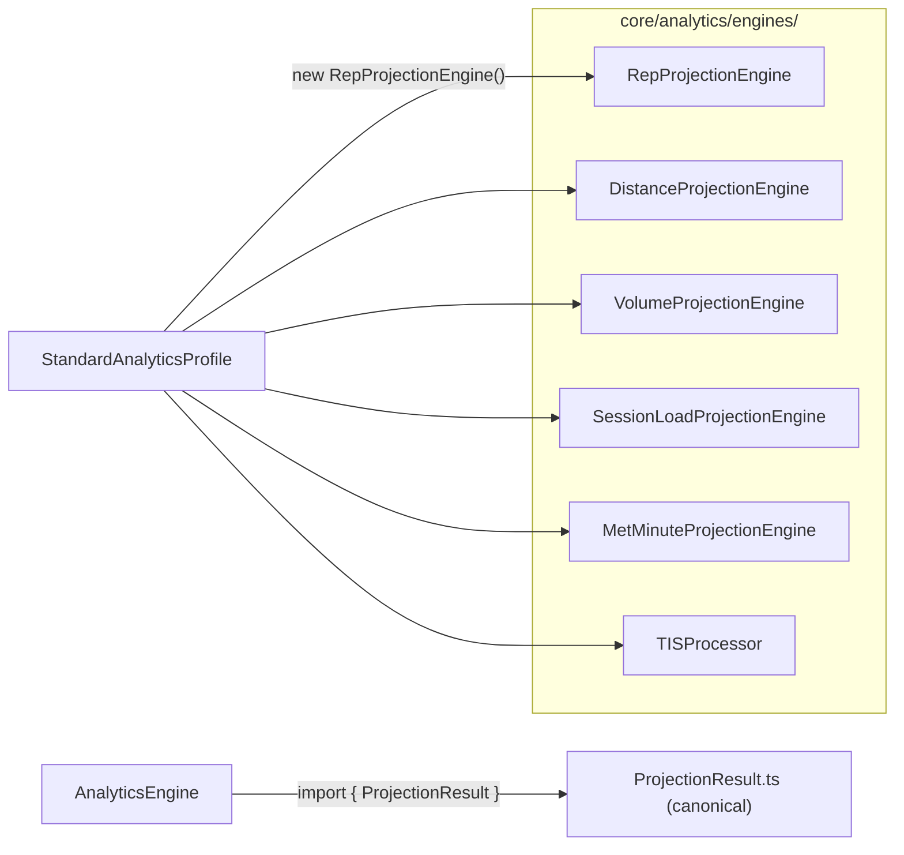

# Finding 02 — The `src/timeline/analytics/` subtree is a misnomered home for projection engines

> **Status:** Candidate. Surfaced by an architecture review walk on 2026-06-19.
> **Confidence:** High. **Seam test:** Collapses a fake seam (one module pretending to
> live under two homes); the `ISummaryProcessor` contract is the real seam and stays.
> **Priority:** Lowest risk, highest mechanical return.

## One-sentence problem

The six projection engines and the canonical `ProjectionResult` type live under
`src/timeline/analytics/analytics/engines/`, but `src/timeline/` is supposed to be
the GitTreeSidebar and TimelineView. The engines have nothing to do with that.
A re-export shim in `src/core/analytics/ProjectionResult.ts` exists with a
*"Future: move the canonical definition here"* comment that was never executed.

## Path at a glance (existing)

```mermaid
flowchart LR
  subgraph CORE[core/analytics/]
    SA[StandardAnalyticsProfile]
    AE[AnalyticsEngine]
    Sh["ProjectionResult.ts (6-line shim)"]
  end
  subgraph TIMELINE["timeline/analytics/analytics/"]
    T1[ProjectionResult.ts (canonical)]
    T2[engines/RepProjectionEngine]
    T3[engines/DistanceProjectionEngine]
    T4[engines/VolumeProjectionEngine]
    T5[engines/SessionLoadProjectionEngine]
    T6[engines/MetMinuteProjectionEngine]
    T7[engines/TISProcessor]
  end
  SA --> T2
  SA --> T3
  SA --> T4
  SA --> T5
  SA --> T6
  SA --> T7
  Sh --> T1
  AE --> Sh
```

`core/` reaches into `timeline/analytics/analytics/engines/` and back out
through the shim. Every arrow is structural noise; the engines have no
relationship to `TimelineView.tsx` or `GitTreeSidebar.ts`, the only legitimate
residents of `src/timeline/`.

## Files involved (line counts)

| File | Lines | Role in the problem |
|------|------:|---------------------|
| `src/timeline/analytics/analytics/ProjectionResult.ts` | 40 | Canonical `ProjectionResult` type, in the wrong place |
| `src/core/analytics/ProjectionResult.ts` | 6 | Re-export shim ("Future: move the canonical definition here") |
| `src/timeline/analytics/analytics/engines/RepProjectionEngine.ts` | ~50 | One of six engines misplaced |
| `src/timeline/analytics/analytics/engines/DistanceProjectionEngine.ts` | ~50 | Same |
| `src/timeline/analytics/analytics/engines/VolumeProjectionEngine.ts` | ~80 | Same |
| `src/timeline/analytics/analytics/engines/SessionLoadProjectionEngine.ts` | ~80 | Same |
| `src/timeline/analytics/analytics/engines/MetMinuteProjectionEngine.ts` | ~80 | Same |
| `src/timeline/analytics/analytics/engines/TISProcessor.ts` | ~120 | Same |
| `src/core/analytics/StandardAnalyticsProfile.ts` | 74 | Imports engines across the misplaced subtree via 4-5 levels of `../../../../` |
| `src/core/analytics/AnalyticsEngine.ts` | 151 | Imports `ProjectionResult` from the shim |
| `src/timeline/TimelineView.tsx`, `src/timeline/GitTreeSidebar.ts` | — | The only legitimate residents of `src/timeline/` |

## What the code is doing today

`StandardAnalyticsProfile.build()` (lines 32-37) lists engines via:

```ts
const allSummary: ISummaryProcessor[] = [
  new RepProjectionEngine(),
  new DistanceProjectionEngine(),
  new VolumeProjectionEngine(),
  new SessionLoadProjectionEngine(),
  new MetMinuteProjectionEngine(),
  new TISProcessor(),
];
```

These imports come from `src/timeline/analytics/analytics/engines/` — three directory
levels deep, and every engine then reaches back into `core/` via
`../../../../core/...`. The round-trip is structural noise.

`src/core/analytics/ProjectionResult.ts` is a literal six-line shim:

```ts
/**
 * Re-exported from timeline for backward compatibility.
 * Future: move the canonical definition here.
 */
export type { ProjectionResult } from '../../timeline/analytics/analytics/ProjectionResult';
```

The "Future" is the present. Nothing else should be using the shim path, and even
`AnalyticsEngine` itself could import the canonical type directly once it lives in
`core/`.

## Deletion test

`src/timeline/analytics/analytics/` deletion: would it *concentrate* complexity
(which is the signal we want) or *move* it? It concentrates. The engines belong
next to the `ISummaryProcessor` contract, the `AnalyticsEngine`, and the
`StandardAnalyticsProfile` that assembles them.

## Solution in plain English

Move `ProjectionResult.ts` and the six engines from
`src/timeline/analytics/analytics/engines/` into `src/core/analytics/engines/`.
Delete the shim. Delete the now-empty `src/timeline/analytics/` directory.

After the move:

- `StandardAnalyticsProfile` imports from `./engines/RepProjectionEngine` (one level).
- `AnalyticsEngine` imports `ProjectionResult` from `./ProjectionResult` (zero
  levels).
- `src/timeline/` shrinks to `TimelineView.tsx`, `GitTreeSidebar.ts`, and `index.ts` —
  what it was named for.

## Benefits, in the right vocabulary

- **Locality:** the `ProjectionResult` type, the `ISummaryProcessor` contract, and
  every engine live next to `AnalyticsEngine` and `StandardAnalyticsProfile`. Adding
  an engine is one file in the right place.
- **Leverage:** import paths collapse by 3 levels. The shim disappears. The misnomer
  disappears.
- **Testability:** `tests/parser-compliance/` and `tests/cast-integration/` already
  cover the engines; a single import surface makes the test harness simpler.

## Risks

- Low. The only files importing from the misnomered subtree are `StandardAnalyticsProfile`,
  `AnalyticsEngine`, and the engine test files. A bulk import-path rewrite is
  mechanical.
- Watch for any path-aliased imports (`@/timeline/...`); search-and-replace should
  catch them.

## Diagrams

### Existing — engines reached via 3-4 import levels



Solid arrows are direct imports; dotted arrows are the engines reaching back
into `core/`. The shim is a 6-line round-trip whose only purpose is to defer
a move that should have been made when the engines were placed.

### Proposed — flat imports under one subtree



One import level. The shim file is gone. The `timeline/` subtree shrinks to
`TimelineView.tsx`, `GitTreeSidebar.ts`, and `index.ts` — what it was named
for.

## ADR conflict

None. No `docs/adr/` exists. This is a pure housekeeping move that no decision
record needs to permit.
