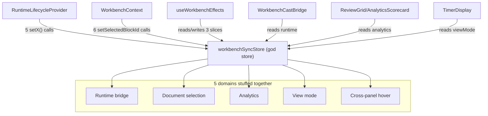
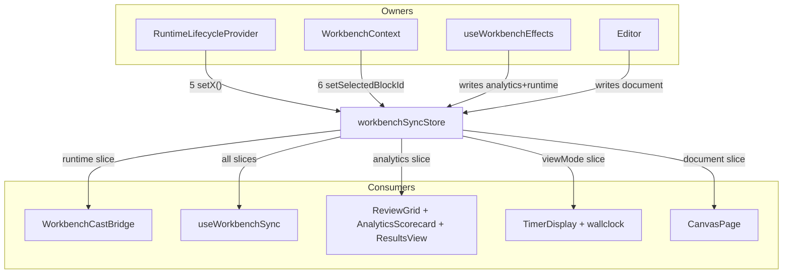
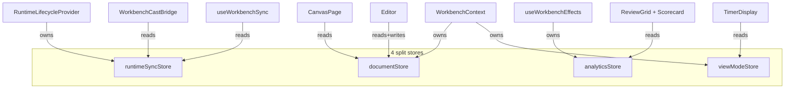
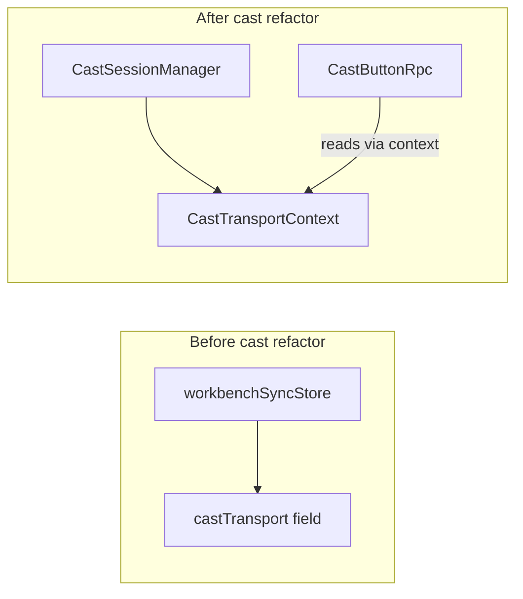

# Finding 03 — `workbenchSyncStore` is five stores pretending to be one (god store, post-cast-refactor)

> **Status:** Candidate. Surfaced by an architecture review walk on 2026-06-19.
> **Confidence:** Medium. **Seam test:** Collapses a fake seam (one store pretending to
> be 5); no new seam. **Priority:** High leverage, but the boundary between
> "document selection" and "view mode" is fuzzy.

## One-sentence problem

The cast refactor already pulled `castTransport` out of the store and into
`CastTransportContext`. What's left in `workbenchSyncStore` is four distinct
domains stuffed into one Zustand store, with `WorkbenchContext.tsx` (723 lines)
acting as the orchestrator. `useWorkbenchEffects.ts` even labels its own job
enumeration in the file header.

## Path at a glance (existing)

Many owners, many consumers, one store. Every owner writes to multiple
domains; every consumer reads from multiple domains. The cast refactor
already proved the cure for `castTransport` (pulled into
`CastTransportContext`).

## Files involved (line counts)

| File | Lines | Role in the problem |
|------|------:|---------------------|
| `src/stores/workbenchSyncStore.ts` | 271 | The god store; 5 domains (runtime, document, analytics, view mode, cross-panel) |
| `src/components/layout/useWorkbenchEffects.ts` | 213 | Bridge hook between runtime/event sources and the workbench store |
| `src/contexts/WorkbenchContext.tsx` | 723 | 6 direct calls to `useWorkbenchSyncStore.getState().setSelectedBlockId(...)` (lines 409, 417, 452, 491, 495) |
| `src/contexts/RuntimeLifecycleProvider.tsx` | 179 | Uses 1 slice (`subscriptionManager`); writes via 5 separate `useWorkbenchSyncStore.getState().setX(...)` calls |
| `src/components/organisms/cast/WorkbenchCastBridge.tsx` | 62 | Reads the runtime slice |
| `src/components/organisms/review/AnalyticsScorecard.tsx` | — | Reads the analytics slice |
| `src/components/organisms/review/FullscreenReview.tsx` | — | Reads the analytics slice |
| `src/components/organisms/review/ResultsView.tsx` | — | Reads the analytics slice |

## What the code is doing today

`workbenchSyncStore.ts` carries five distinct domains, each with its own ownership
and consumer set:

1. **Runtime bridge** — `runtime`, `execution`, `handles`, `subscriptionManager`.
   Set by `RuntimeLifecycleProvider`. Read by `useWorkbenchEffects`,
   `WorkbenchCastBridge`, `useWorkbenchSync`.

2. **Document selection** — `selectedBlock`, `selectedBlockId`, `documentItems`,
   `cursorLine`, `highlightedLine`. Set by editor + workbench. Read by many.

3. **Analytics** — `analyticsSegments`, `analyticsGroups`, `selectedAnalyticsIds`,
   `lastSelectedAnalyticsId`, `userOutputOverrides`, `gridViewPreset`. Set by
   `useWorkbenchEffects` on block change. Read by ReviewGrid, AnalyticsScorecard.

4. **View mode** — `viewMode`. Synced from `WorkbenchContext`. Read by
   TimerDisplay, wallclock panel.

5. **Cross-panel** — `hoveredBlockKey`. A single mouseover cursor that crosses
   no domain boundary worth a global store.

`useWorkbenchEffects.ts:1-7` is honest about the trouble:

> *// useWorkbenchEffects — keeps the workbench store in sync with runtime
> // lifecycle (handles), block changes (analytics segment flushes), and
> // external state. Owns no rendering; coordinates multiple sources.*

The cast refactor proved the pattern of pulling a domain out of the god store (see
`docs/cast-architecture-plan.md`, Phase 3.1, now executed — `castTransport` is
in `CastTransportContext` instead). The remaining four domains are the same
pattern, unapplied.

`RuntimeLifecycleProvider` writes the runtime slice via five separate
`useWorkbenchSyncStore.getState().setX(...)` calls — the same dependency pattern
the cast refactor just deleted for `castTransport`. The Phase 1.6 instruction
("keep the field, read via `getState()` one-shot, drop the React subscription")
is followed for `subscriptionManager` but not generalized to the rest of the slices.

`WorkbenchContext.tsx` has six direct calls to
`useWorkbenchSyncStore.getState().setSelectedBlockId(...)` — proving the
document-selection slice is *also* written from many places, not just one owner.

## Why the architecture is costing

- **Locality**: the "do many jobs" comment in `useWorkbenchEffects.ts` is a smell
  signal, not a description. Changes to analytics flushing logic must read
  `useWorkbenchEffects.ts` to know it's there.
- **Leverage**: the cast refactor demonstrated the value of pulling a domain out
  of the god store. Analytics and document selection are the same pattern.
- **Testability**: tests mock `useWorkbenchSyncStore` with a single shape
  (`TimerDisplay.a11y.test.tsx`, `ReviewGrid.smoke.test.tsx`). They cannot
  exercise one slice without instantiating all five. `WorkbenchContext.tsx` is
  723 lines because it must reach into a single store that holds 5 domains;
  after the split, the context shrinks.

## Solution in plain English

Split into four narrowly-scoped stores, each with one ownership source and one
consumer set:

- **`runtimeSyncStore`** — owned by `RuntimeLifecycleProvider`. Consumed by
  `useWorkbenchEffects`, `WorkbenchCastBridge`. The handles-bridge and the
  analyticsSegment-flush move entirely into this store + provider.
- **`documentStore`** — owned by `WorkbenchContext` and the editor. Consumed by
  editor components, workbench effects, canvas. The 6 `setSelectedBlockId`
  calls in `WorkbenchContext.tsx` become in-store writes against a typed owner.
- **`analyticsStore`** — owned by `useWorkbenchEffects`. Consumed by ReviewGrid,
  AnalyticsScorecard, ResultsView. `userOutputOverrides` already has its own
  `useUserOverrides.ts`; that hook becomes the natural store boundary.
- **`viewModeStore`** — owned by `WorkbenchContext`. Consumed by TimerDisplay
  and the workbench.

The five writers on `RuntimeLifecycleProvider` collapse to one — the provider
owns the only field it needs to share. The `subscriptionManager` field is the
last-mile of the cast refactor; if the project adopts a
`SubscriptionManagerContext` (per the cast plan's Phase 4), it can leave the
god store entirely.

## Benefits, in the right vocabulary

- **Locality:** the "do many jobs" comment in `useWorkbenchEffects.ts` becomes
  honest because each job reads one store. The 6 `setSelectedBlockId` calls in
  `WorkbenchContext.tsx` become in-store writes against a typed owner.
- **Leverage:** same pattern the cast refactor proved out. A new domain (e.g.
  a future journal-selection store) does not have to negotiate a slot in the
  god store.
- **Testability:** each store testable without mounting the workbench;
  `WorkbenchContext.tsx` shrinks substantially. Mock-the-store becomes
  mock-this-slice.

## Risks

- Many test files mock `useWorkbenchSyncStore` with a single shape; they will
  need updating to mock the split stores.
- The runtime-sub-bridge is load-bearing: `useWorkbenchEffects` flushes
  `analyticsSegments` on block change (lines 86, 131) and that's the only path
  that survives runtime disposal. The split must preserve this — it is the
  reason the runtime-bridge slice and the analytics slice are co-located today.
- The boundary between "document selection" and "view mode" is fuzzy (the URL
  is the source of truth for both). The split needs to be guided by ownership,
  not by which component reads which field.

## Diagrams

### Existing — one store, many owners, many consumers

The cast refactor already split `castTransport` out of this store into
`CastTransportContext`. The same pattern applies to the remaining 4
domains.

### Proposed — four narrowly-scoped stores, one owner each

Each arrow is one owner and one consumer set. `WorkbenchContext.tsx` shrinks
because it stops reaching into a single store to find 5 different domains.
Tests mock one store, not one shape.

### Cast-refactor precedent — the pattern to apply

`docs/cast-architecture-plan.md` Phase 3.1 pulled `castTransport` out of the
god store and into `CastTransportContext`. This finding applies the same
pattern to the remaining 4 domains. The pattern is proven; only the
boundary lines are new.

## ADR conflict

None. The cast refactor is *itself* the precedent — and it's already been
executed. This finding applies the same pattern to the remaining four domains.
