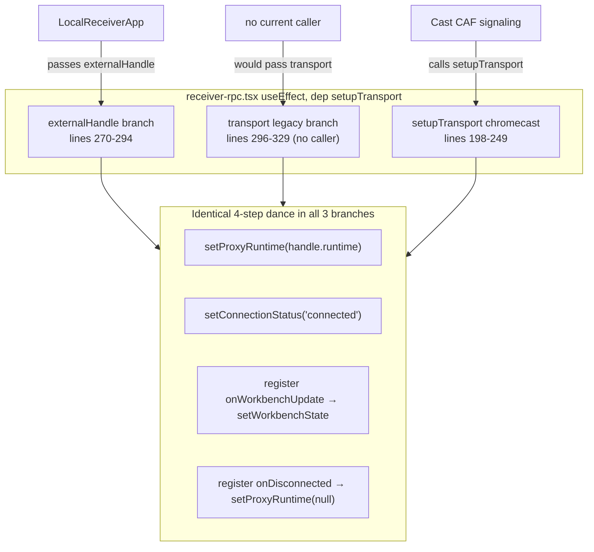
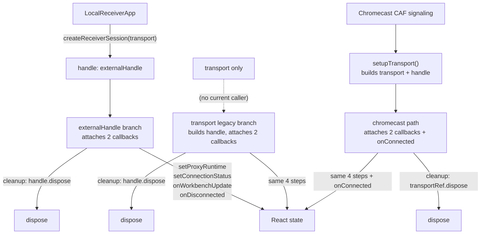
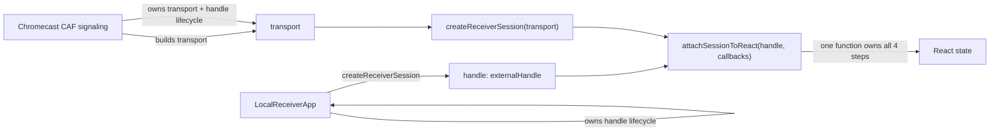

# Finding 04 — `ReceiverApp` has three init paths duplicating `ReceiverSessionManager` wiring

> **Status:** Candidate. Surfaced by an architecture review walk on 2026-06-19.
> **Confidence:** High. **Seam test:** Collapses a fake seam (three init paths in
> one component). **Priority:** Locality win; no architectural risk.

## One-sentence problem

After the cast refactor, `ReceiverApp` still has three init paths in one `useEffect`
that hand-roll the same 4-step dance (`setProxyRuntime`, `setConnectionStatus`,
register `onWorkbenchUpdate`, register `onDisconnected`) that `createReceiverSession`
already encapsulates. The middle branch has no current caller.

## Path at a glance (existing)



Three branches, one 4-step dance repeated three times, three different
cleanup patterns. The middle branch has no current caller.

## Files involved (line counts)

| File | Lines | Role in the problem |
|------|------:|---------------------|
| `playground/src/receiver-rpc.tsx` | 669 | The page component; three init paths in one `useEffect` (lines 198-329) |
| `src/services/cast/rpc/ReceiverSessionManager.ts` | 160 | The factory that already encapsulates receiver-side session creation |
| `src/services/cast/adapters/LocalReceiverBackend.ts` | 162 | The local-tab adapter that produces the transport for the local path |

## What the code is doing today

`receiver-rpc.tsx:250+` (one `useEffect`, dependency on `[setupTransport]`) hosts
three branches:

1. **`externalHandle` branch (lines 270-294)** — the parent (`LocalReceiverApp`)
   built the handle; this branch attaches `onWorkbenchUpdate` + `onDisconnected`
   callbacks.
2. **`transport` legacy branch (lines 296-329)** — the parent passed only a
   transport; this branch builds a new `createReceiverSession(transport)` and
   attaches the same two callbacks. The comment says *"Legacy: callers passing
   `transport` only"*, but no current caller does that (every production caller
   either passes `externalHandle` from `LocalReceiverApp` or uses
   `setupTransport`).
3. **`setupTransport` chromecast path (lines 198-249)** — builds a transport,
   calls `createReceiverSession`, attaches the same callbacks +
   `transportInstance.onConnected`.

All three end with the identical 4-step dance:

```ts
setProxyRuntime(handle.runtime);
setConnectionStatus('connected');
handle.onWorkbenchUpdate((state) => setWorkbenchState(state));
handle.onDisconnected(() => setProxyRuntime(null));
```

The `setupTransport` version adds `transportInstance.onConnected` because it owns
the transport lifecycle; the other two don't.

The signature mismatch is also visible: `setupTransport` calls
`transportRef.current?.dispose()` (line 222) and writes to `transportRef`, while
the `externalHandle` branch writes to `runtimeRef` directly. The
`setProxyRuntime(null)` cleanup dance is replicated three times.

## Why the architecture is costing

- **Locality**: the React-side wiring is in three places with three cleanup
  patterns. Maintainers must reason about all three to add a new callback
  (audio, workbench mode, etc.).
- **Leverage**: `ReceiverSessionManager` is a real seam (one factory for two
  adapters — `chromecast` and `local-tab` converge on it). The React side
  doesn't use the seam it paid for.
- **Testability**: tests for `ReceiverApp` must cover three init paths. The
  legacy `transport` branch has no production caller and is therefore
  dead-but-not-removable.

## Solution in plain English

`ReceiverSessionManager` exposes `attachSessionToReact(handle, { onWorkbenchState,
onDisconnected })` — one helper that owns the 4-step dance.

`ReceiverApp` accepts either:

- an `externalHandle` (already wrapped — local path, parent owns lifecycle), or
- a `transport` (will be wrapped — chromecast path, component owns lifecycle).

The legacy `transport` branch disappears (no caller). The `setupTransport` for
chromecast becomes: "build transport, call helper, listen for next offer." The
`useEffect` dependency is one value, not three branches.

The `disposeOnRef.current?.dispose()` cleanup in `setupTransport` (line 222) and
the `handle.dispose()` in the legacy branch cleanup (line 326) collapse to one
rule: "the handle owner disposes" — the parent (`LocalReceiverApp`) for the
local path, the `setupTransport` cleanup for the chromecast path.

## Benefits, in the right vocabulary

- **Locality:** the React-side wiring is one function in one place. The
  receiver session manager owns the wiring; the React tree owns rendering.
- **Leverage:** the helper is reusable for future widgets or test harnesses.
- **Testability:** the legacy `transport` branch is a 30-line hand-rolled
  duplicate. Deleting it removes a test surface that exists for no reason.

## Risks

- `LocalReceiverApp` (line 518) does the session creation before `ReceiverApp`
  mounts, so `externalHandle` is the production path. The chromecast path uses
  `setupTransport` and must keep its own transport-lifecycle. The refactor
  must preserve "the parent owns the handle for the local path, the chromecast
  path owns the handle itself."

## Diagrams

### Existing — three init paths converge on the same dance



Three arrows into the same dance; three different cleanup rules. The
`Transport → B2` edge is dotted because the branch has no caller.

### Proposed — `attachSessionToReact` owns the dance



One helper. The middle branch is gone. The owner-of-dispose rule is one
phrase: "the parent owns the handle for the local path, the chromecast path
owns it itself."

## ADR conflict

None. This is a leftover of the cast refactor (`docs/cast-architecture-plan.md`,
Phase 2.2-2.3) — the cast plan describes `LocalReceiverApp` and `ReceiverApp`
adopting `createReceiverSession`, but doesn't explicitly call out that
`ReceiverApp` still hand-rolls the attach dance in three places. This is a
follow-on to the executed cast plan, not a contradiction of it.
