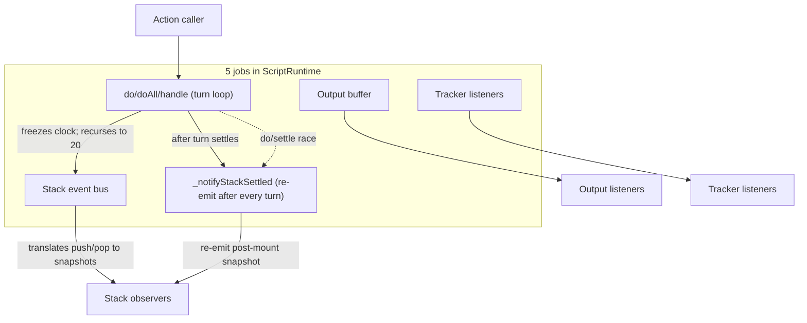
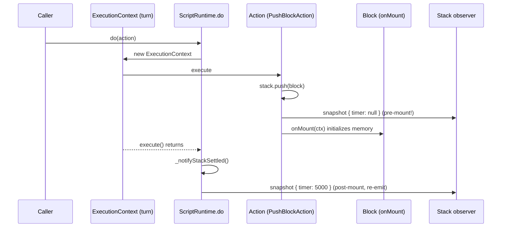
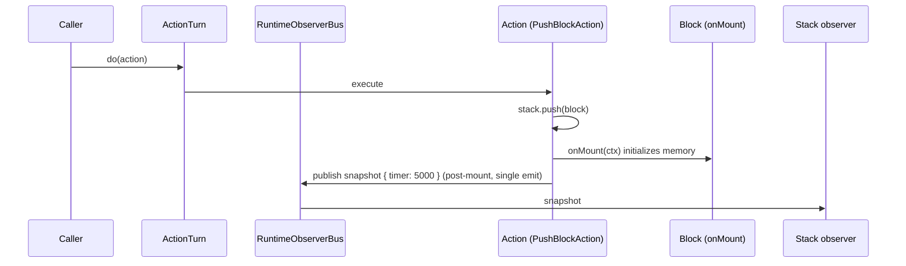

# Finding 05 — `ScriptRuntime.do` is action dispatcher, snapshot-rebuilder, recursion guard, and depth-recovery path

> **Status:** Candidate. Surfaced by an architecture review walk on 2026-06-19.
> **Confidence:** Medium. **Seam test:** No new seam; collapses a fake one. The
> bus is internal. **Priority:** High architectural impact; touches the most
> churn-prone file in the repo (code health 1.0/10).

## One-sentence problem

`ScriptRuntime.ts` (454 lines, code health 1.0/10) carries five distinct jobs in
one class. The `_notifyStackSettled` workaround — a snapshot re-emit after every
turn — is a leak: a module whose seam is "actions in, snapshots out" is
publishing pre-mount state and re-publishing post-mount state, with timing
controlled by `ExecutionContext.execute()` returning. The
`mixed-timers.md` "Invalid runtime state for next event" bug is the next failure
of the same architectural choice.

## Path at a glance (existing)



Five jobs, one class. The dotted `J1 → J5` arrow is the workaround: a
snapshot re-emit because `push` fires before `onMount` initializes memory.
`mixed-timers.md` "Invalid runtime state for next event" is the next failure
of this architecture.

## Files involved (line counts)

| File | Lines | Role in the problem |
|------|------:|---------------------|
| `src/runtime/ScriptRuntime.ts` | 453 | The god class: action turn, stack event bus, output buffer, tracker listeners, settled-snapshot re-emit |
| `src/runtime/ExecutionContext.ts` | (referenced) | The recursion guard `ExecutionContext` is used by `do`/`doAll`/`handle`; `maxActionDepth = 20` |
| `src/runtime/compiler/JitCompiler.ts` | 157 | Calls `runtime.do(action)` via `PushBlockAction`/`PopBlockAction` |

## What the code is doing today

`ScriptRuntime` carries five jobs:

1. **Action turn** — `do`/`doAll`/`handle` (lines 142-159) use
   `ExecutionContext` to manage recursion up to `maxActionDepth = 20`. Time is
   frozen during the turn.

2. **Stack event bus** — `_stackSubscriptionUnsub` (line 56) plus the
   snapshot-building code at 100-128 that translates `push`/`pop` events into
   `StackSnapshot`s for observers.

3. **Output buffer** — `_output: OutputEmitter` (line 48) plus the
   `subscribeToOutput`/`addOutput` API (lines 195-227).

4. **Tracker listeners** — `subscribeToTracker` with a reference-counted
   subscription (lines 234-260).

5. **Settled-snapshot re-emit** — `_notifyStackSettled` (lines 167-178) is
   called after every turn. The comment at lines 110-119 admits the workaround:

   > *"After the full execution turn settles (push + mount + child pushes all
   > done), re-notify stack observers so Chromecast proxy runtimes see
   > post-mount state. Without this, leaf blocks (no children pushed on mount)
   > would have `timer:null` in the Chromecast snapshot because push fires
   > before mount initializes memory."*

This is the symptom: a module whose seam is supposed to be "actions in,
snapshots out" is leaking internal ordering into its observable surface.

`dispose()` (lines 320-381) is 60 lines doing 6 things. `pushBlock`/`popBlock`
(lines 386-450) are also large wrappers that mix hook calls, action dispatch,
span tracking, and wrapper cleanup. The `BlockLifecycleOptions` parameter is
shared between push and pop, but the actual lifecycle is implicit — no
`Behavior.onMount`/`onUnmount` contract is enforced; the actions invoke those,
but the timing is the `ExecutionContext`'s.

The `do`/settle race is currently untested (per `docs/testing-gap-analysis-timers.md`
line 11-12).

## Why the architecture is costing

- **Locality**: the timer-state race ("leaf blocks have `timer:null`") can be
  introduced by any change to the action ordering. The code has no contract
  that says "snapshots reflect post-mount state."
- **Leverage**: `do`/`doAll`/`handle` are three entry points that all delegate
  to one turn. They could be one method. The `mixed-timers.md` bug is exactly
  the kind of bug that vanishes when the turn semantics are isolated.
- **Testability**: the `do`/settle race is untested; `tests/runtime-compliance/`
  can only assert what comes out, not what should be observable in the
  middle. A bus-with-post-mount contract is testable with a stub action that
  mounts nothing.

## Solution in plain English

Reframe the class around one responsibility: **maintain the live stack and
emit snapshots and outputs at the correct boundaries**.

Concretely:

- Pull the action turn (`do`/`doAll`/`handle`) into an `ActionTurn` module
  that takes a `ScriptRuntime` and a queue. `ScriptRuntime.do` delegates.
- The stack-snapshot and output emission becomes a `RuntimeObserverBus` —
  the push and pop actions publish to it **after** mount/unmount has
  completed (not before). The bus's contract is "the snapshot reflects
  post-mount state."
- The `_notifyStackSettled` workaround disappears because the bus's contract
  excludes pre-mount state.
- `dispose()` becomes a single dispatcher: stop the clock, tear down the bus,
  dispose blocks. The reference-counted tracker sub and the stack sub
  become bus-level concerns.
- A new `CONTEXT.md` term **Mounted Block** — a Block whose `onMount` has
  completed and whose memory is readable — names the post-mount state.
  Snapshots expose only Mounted Blocks.

## Benefits, in the right vocabulary

- **Locality:** the timer-state race becomes impossible to introduce because
  the snapshot contract excludes pre-mount state. The bug class is closed
  at the architecture level.
- **Leverage:** the `do`/`doAll`/`handle` triple delegates to one turn.
  The `mixed-timers.md` "Invalid runtime state for next event" bug
  (open per `docs/testing-gap-analysis-timers.md:55-57`) is fixed by the
  architecture, not by a new test.
- **Testability:** the `do`/settle race is testable with a stub action that
  mounts nothing. The `RuntimeObserverBus` is an internal surface that can
  be exercised without a full runtime.

## Risks

- The post-mount ordering is load-bearing for Chromecast (the TV proxy
  runtime needs a snapshot immediately after the action so the TV doesn't
  lag). The current `_notifyStackSettled` workaround works because the
  post-turn snapshot fires *after* `ExecutionContext.execute()` returns. The
  refactor must preserve that ordering.
- The `IBehaviorContext` contract is the only externally-observable surface;
  the ordering is currently implicit in action-dispatch. A test that
  asserts "snapshot excludes pre-mount blocks" should be the first
  deliverable.
- Touches the most churn-prone file in the repo. A/B behaviour tests
  (current output == refactored output) over the `tests/runtime-compliance/`
  suite should land alongside.

## Diagrams

### Existing — the do/settle race in detail



Two snapshots for one push. The first is wrong; the second is the
workaround. The `mixed-timers.md` bug is the case where the workaround
arrives too late (or the action ordering violates an implicit invariant).

### Proposed — `ActionTurn` + `RuntimeObserverBus`



One snapshot per push, by contract. The `_notifyStackSettled` workaround
disappears because the bus excludes pre-mount state.

### `mixed-timers.md` bug path — the symptom

```mermaid
flowchart LR
  T1[forced rest *:30 Rest] --> T2[collectible timer :? Pushups]
  T2 -.->|"Invalid runtime state for next event"| Bug[bug]

  subgraph root[Architectural root]
    Turn[do() and _notifyStackSettled share ordering]
    Snap[Pre-mount snapshot leaks into observable state]
  end
  Snap --> Bug
  Turn --> Snap
```

`docs/testing-gap-analysis-timers.md:55-57` flags this. The fix isn't a new
test — it's making the architecture's snapshot contract exclude pre-mount
state.

## ADR conflict

None. No `docs/adr/` exists. The `docs/testing-gap-analysis-timers.md` is the
existing decision-record-by-other-name that names the symptom (the
"Invalid runtime state for next event" bug). This finding is the
architectural fix for the same bug; it is not a contradiction.
