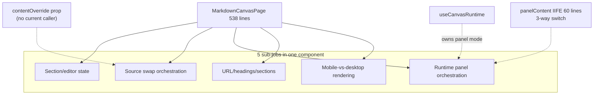
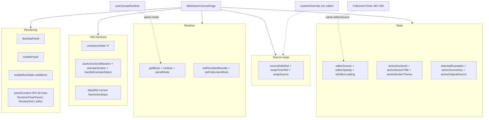

# Finding 06 — `MarkdownCanvasPage` is a 539-line page wrapper doing five sub-jobs

> **Status:** Candidate. Surfaced by an architecture review walk on 2026-06-19.
> **Confidence:** Medium. **Seam test:** No new seam; collapses a fake one.
> **Priority:** Locality win; the page is high-churn and the seams are still
> settling.

## One-sentence problem

`MarkdownCanvasPage` is the highest-churn page in the playground (99.8th %ile,
32 commits per `CLAUDE.md`) and it has five distinct sub-jobs mixed in one
component: editor state, source-swap orchestration, runtime panel orchestration,
URL/headings/sections, and mobile-vs-desktop rendering. The `panelContent` IIFE
is 60 lines returning one of three JSX trees. A `contentOverride` prop is wired
but no current caller passes it.

## Path at a glance (existing)



Five sub-jobs; the panel-mode state machine lives in a hook but the
panel-content logic lives in the page. The dotted arrows are the seams
that are still misplaced.

## Files involved (line counts)

| File | Lines | Role in the problem |

|------|------:|---------------------|
| `playground/src/canvas/MarkdownCanvasPage.tsx` | 538 | The page; 5 sub-jobs, 60-line `panelContent` IIFE, dead `contentOverride` path |
| `playground/src/canvas/parseCanvasMarkdown.ts` | (size not measured) | The markdown parser for the canvas content |
| `playground/src/hooks/useCanvasRuntime.ts` | (size not measured) | Owns the panel-mode state machine; the page reaches into it |
| `playground/src/App.tsx` | 676 | 86 commits per `CLAUDE.md`; passes `workoutFiles` to the canvas |

## What the code is doing today

`MarkdownCanvasPage` has five sub-jobs mixed in one component:

1. **Section/editor state** — `editorSource`, `editorOpacity`,
   `isEditorLoading`, `activeSectionId`, `activeSectionTitle`,
   `activeSectionTheme`, `selectedExamples`, `activeSourceKey`,
   `activeOriginalSource`.
2. **Source swap orchestration** — `sourceEditsRef`, `swapTimerRef`,
   `swapSource` callback with debounced fade.
3. **Runtime panel orchestration** — `getBlock`, `runtime` from
   `useCanvasRuntime`, `setPersistedResults`, `setFullscreenBlock`,
   `panelMode`.
4. **URL/headings/sections** — `useQueryState('h')`, `useActiveScrollSection`,
   `activateSection`, `handleExampleSelect`, `depsRef.current` for
   `NavActionDeps`.
5. **Mobile-vs-desktop panel rendering** — `desktopPanel`, `mobilePanel`,
   `mobileRunState` `useMemo` with `blockHasTimer`.

The `panelContent` IIFE (lines 348-411) is 60 lines returning one of three JSX
trees: `RuntimeTimerPanel` / `ReviewGrid` / editor. The "panel mode" state
machine lives in `useCanvasRuntime` (which this component does not own), and
the editor is shown in both the `panelContent` *and* the `FullscreenTimer`
(lines 487-490) — the same `editorSource` is the source of truth for both.

The component reads its panel-mode and runtime state through `runtime` (a
`useCanvasRuntime` return) but the panel-mode and the editor are the same
state — the editor swap is decoupled from the panel mode. `swapSource`
(contentOverride, ...)` exists at line 188 and the `contentOverride` prop is
wired at lines 207-211; the parent (`App.tsx`) doesn't pass `contentOverride`
in the canvas path, so this code path is exercised only through the dev tools
or future editor integration.

The `mobileRunState` `useMemo` at line 458 is a wrapper around
`runtime.runState` that exists only to override `onRun` for mobile timers.
That's a `useMobileRunOverride` hook at most.

## Why the architecture is costing

- **Locality**: the panel-mode state machine lives in `useCanvasRuntime` (a
  hook module), but the panel-content logic and source-swap logic live in the
  page. Two files cooperate to know "what should be shown right now."
- **Leverage**: 5 sub-jobs collapse to 2-3. The `contentOverride` dead path
  is deletable.
- **Testability**: `useCanvasRuntime` is the testable surface (already
  testable if the swap logic moves there). The page itself becomes a layout
  composition.

## Solution in plain English

The natural seam is "panel state machine" with three modes
(`editor | running | review`) and the source-swap logic — the rest is
rendering.

- `useCanvasRuntime` already has the panel-mode state. Pull the `panelContent`
  IIFE into a `<CanvasPanelContent mode={runtime.panelMode} block={...} ...>`
  component.
- Let `useCanvasRuntime` own the source-swap (since it owns the panel mode
  and the runtime).
- `desktopPanel`/`mobilePanel` collapse to one `<CanvasEditorPanel
  variant="desktop|mobile">` — the `variant` prop already exists.
- The `mobileRunState` `useMemo` becomes a `useMobileRunOverride` hook.
- The `contentOverride` dead path is deletable.

## Benefits, in the right vocabulary

- **Locality:** the panel-mode state machine lives in one place
  (`useCanvasRuntime`); the page renders it.
- **Leverage:** the 5 sub-jobs collapse to 2-3. The `contentOverride` dead
  path is deletable.
- **Testability:** `useCanvasRuntime` is the testable surface. The page
  itself becomes a layout composition with fewer reasons to churn.

## Risks

- The `depsRef.current` pattern at lines 257-260 is a workaround for `useMemo`
  capturing stale closures; moving the consumer out of the page needs to
  preserve the "no stale `deps`" guarantee.
- The mobile-vs-desktop branch is genuinely two panels with different
  `runState` overrides; collapsing them is a UX call (do they differ in more
  ways than `onRun`?).
- The surface area is large and the page has 32 commits, so the boundaries
  are still settling. A refactor done too early will be redone.

## Diagrams

### Existing — five sub-jobs fan in to one component



Five sub-jobs in one component. The dotted edges are the leak points: the
hook owns the mode but the page renders the mode; the editor is the source
of truth for two unrelated consumers.

### Proposed — hook owns panel state, page renders

```mermaid
flowchart LR
  Hook["useCanvasRuntime<br/>(owns panel state machine<br/>+ source swap + run override)"]
  Page[MarkdownCanvasPage<br/>(layout only)]

  Hook -->|"panelMode, block, runState"| CPC["CanvasPanelContent<br/>(mode-driven)"]
  Page --> CPC

  Hook -->|"swapSource, debounce"| Edit[Editor source]
  Page --> CEP["CanvasEditorPanel<br/>variant=desktop|mobile"]

  Hook -->|"useMobileRunOverride"| Mobile[Mobile run state]
  Page --> Mobile

  Dead["contentOverride (deleted)"] -.-> X[.]
```

The hook owns the seam (panel-mode state machine + source swap + mobile
override). The page composes the layout. The dead `contentOverride` path
is deleted.

## ADR conflict

None. The `playground/src/App.tsx` to `MarkdownCanvasPage` data flow is
informal and undocumented. A `CONTEXT.md` term **Workbench Effects** (see
Finding 03) generalizes the pattern of renderless components that coordinate
runtime sources into a coordination store; the canvas page is a candidate
expression of that pattern.
