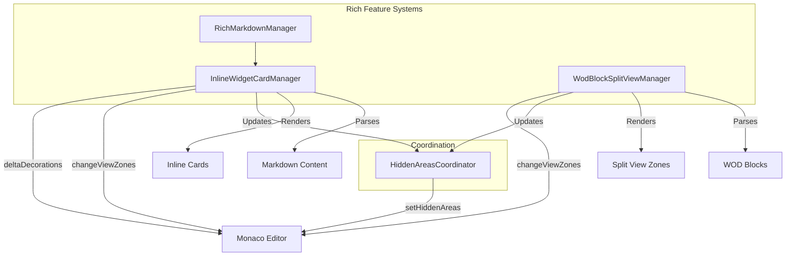

# Monaco Editor Rich Features & Behaviors

This document details the architecture and implementation pathways used to inject special behaviors (Rich Features) into the Monaco Editor within the WOD Wiki project.

## 1. Architecture Overview

The editor's rich capabilities are powered by two primary, complementary systems that operate on top of the standard Monaco Editor instance:

1.  **InlineWidgetCardManager**: A unified system for handling generic rich content (Headings, Blockquotes, Images, YouTube, Frontmatter).
2.  **WodBlockSplitViewManager**: A specialized system dedicated to handling WOD Blocks with a complex "Split View" interface.

Both systems rely on a shared utility, **HiddenAreasCoordinator**, to manage code folding without conflicts.

### High-Level Diagram



---

## 2. InlineWidgetCardManager

**Location**: `src/editor/inline-cards/InlineWidgetCardManager.ts`

This system transforms standard Markdown elements into rich, interactive widgets. It is designed to be extensible via configuration.

### Core Components

*   **CardParser**: Scans the document model to identify "Cards" based on regex patterns (e.g., lines starting with `#`, `>`, `![`, etc.).
*   **CardRenderer**: Responsible for:
    *   Creating React components for `ViewZones`.
    *   Generating `IModelDeltaDecoration` arrays for inline styling.
*   **Configuration (`config.ts`)**: Defines behavior for each card type (`heading`, `blockquote`, `image`, `youtube`, `frontmatter`).

### Pathways & Modifications

The manager uses three main Monaco pathways to apply effects:

1.  **ViewZones (`changeViewZones`)**:
    *   Used for **Images**, **YouTube**, and **Frontmatter**.
    *   Inserts a custom DOM node (React Root) *between* lines of code.
    *   **Mechanism**: The manager calculates the height of the widget and inserts a zone. The original source code lines are typically hidden (see Hidden Areas) so the widget appears to replace the code.

2.  **Decorations (`deltaDecorations`)**:
    *   Used for **Headings** and **Blockquotes**.
    *   **Inline Styling**: Applies CSS classes to specific ranges (e.g., making text larger/bold).
    *   **Inline Hiding**: Uses `inlineClassName` with `display: none` (or similar) to hide markdown syntax characters like `#` or `>`.
    *   *Note*: These do not shift layout like ViewZones; they modify the appearance of existing text.

3.  **Hidden Areas (`setHiddenAreas`)**:
    *   Used when a ViewZone "replaces" the source code.
    *   The source lines are "folded" (hidden) so only the widget is visible.
    *   Managed via `HiddenAreasCoordinator`.

### Interaction Model

*   **Preview Mode**: The default state. Widgets are visible, source code is hidden or styled.
*   **Edit Mode**: Triggered when the cursor enters the range of a card.
    *   **`edit-only`**: The widget disappears, and raw markdown is shown (e.g., Headings).
    *   **`side-by-side`**: A split view or adjacent editor appears (e.g., Frontmatter).
    *   **`full-preview`**: The widget remains visible (e.g., Images, until explicitly clicked).

---

## 3. WodBlockSplitViewManager

**Location**: `src/editor/features/WodBlockSplitViewFeature.tsx`

This is a specialized manager for `wod-block` elements (fenced code blocks tagged with `wod`). It provides a more complex interactive experience than standard cards.

### The "Split View" Concept

Instead of just rendering a widget, this feature creates a **Split View** interface:
*   **Left Pane**: Displays the code.
    *   *Passive*: Static syntax-highlighted code.
    *   *Active*: A fully functional **nested Monaco Editor** instance.
*   **Right Pane**: Displays the parsed/executed result of the WOD.

### Pathways & Modifications

1.  **ViewZones**:
    *   A large ViewZone is created to hold the entire Split View UI.
    *   This ViewZone is placed *above* the WOD block.

2.  **Hidden Areas**:
    *   The original ` ```wod ... ``` ` block in the main editor is **completely hidden**.
    *   The ViewZone takes its place visually.

3.  **Nested Editor (The "Mini-Monaco")**:
    *   When the user clicks to edit or moves the cursor into the block, the Left Pane initializes a *new, separate* Monaco Editor instance (`monaco.editor.create`).
    *   This mini-editor is synced bi-directionally with the main editor's model.
    *   **Why?** This allows for a constrained editing environment (e.g., no scrolling out of bounds) and custom behaviors specific to WOD editing, while keeping the main editor's "view" clean.

---

## 4. Shared Utilities: HiddenAreasCoordinator

**Location**: `src/editor/utils/HiddenAreasCoordinator.ts`

**Problem**: Monaco's `setHiddenAreas` is destructive—it overwrites *all* currently hidden areas. If the Image Manager hides lines 10-12 and the WOD Manager hides lines 50-60, they would overwrite each other's work if they called `setHiddenAreas` directly.

**Solution**:
*   The `HiddenAreasCoordinator` acts as a central registry.
*   Features register their hidden ranges under a namespace (e.g., `'inline-cards'`, `'wod-blocks'`).
*   The coordinator merges all ranges and calls `setHiddenAreas` *once* with the combined list.

## 5. Summary of Monaco APIs Used

| API | Purpose | Used By |
| :--- | :--- | :--- |
| `editor.changeViewZones` | Insert custom DOM elements (React components) between lines. | Images, Video, Frontmatter, WOD Blocks |
| `editor.deltaDecorations` | Apply CSS styles to text ranges (color, size) or hide specific characters. | Headings, Blockquotes |
| `editor.setHiddenAreas` | Completely collapse/hide lines of code (folding). | All "Replacement" widgets (Images, WODs) |
| `editor.onDidChangeCursorPosition` | Detect when to switch between Preview and Edit modes. | All Managers |
| `editor.onDidChangeModelContent` | Trigger re-parsing of content to update widgets. | All Managers |
| `monaco.editor.create` | Create a nested editor instance for WOD block editing. | WOD Split View |

## 6. Key Files

*   `src/markdown-editor/MarkdownEditor.tsx`: Main entry point, instantiates managers.
*   `src/editor/inline-cards/InlineWidgetCardManager.ts`: Manager for generic rich features.
*   `src/editor/features/WodBlockSplitViewFeature.tsx`: Manager for WOD blocks.
*   `src/editor/utils/HiddenAreasCoordinator.ts`: Utility for managing code folding.
*   `src/editor/inline-cards/config.ts`: Configuration for card behaviors.
