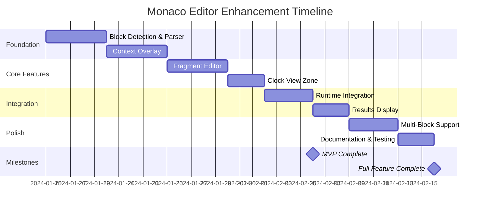

# Executive Summary - Monaco Editor Enhancement

## Project Overview

This document provides a high-level executive summary of the proposed Monaco Editor enhancement for WOD Wiki. This initiative transforms the current single-script editor into a comprehensive markdown-based workout journal with contextual editing, inline execution, and multi-workout support.

## Business Value

### Current Limitations
- Single workout per editor instance
- No markdown support for journaling or notes
- Separate testing tools (RuntimeTestBench) not integrated
- Manual script editing without visual guidance
- No inline workout execution or results tracking

### Proposed Solution Benefits
1. **Enhanced User Experience**
   - Full-page markdown editor for workout journaling
   - Visual context panel showing parsed workout structure
   - Inline workout execution with live timer
   - Results tracking directly in the document

2. **Improved Productivity**
   - Point-and-click fragment editing alongside manual editing
   - Multiple workouts in a single document
   - Real-time visual feedback on workout structure
   - Immediate workout execution without leaving the editor

3. **Better Organization**
   - Title line for document naming
   - Markdown formatting for notes and structure
   - Multiple WOD blocks per document for training logs
   - Inline results make document a complete training record

## Technical Approach

### Key Principles
✅ **Zero Breaking Changes** - Existing components remain functional
✅ **No Core Logic Changes** - Parser and runtime unchanged
✅ **Incremental Delivery** - 9 testable phases over 3-4 weeks
✅ **Component Reuse** - Leverages existing UI components

### Architecture Highlights

**Current State:**
```
WodWiki Component → Monaco Editor (single workout)
RuntimeTestBench (separate tool) → Parser → Runtime → Clock
```

**Proposed State:**
```
MarkdownEditor → Monaco (markdown mode)
    ↓
WodBlockManager → Detects multiple ```wod blocks
    ↓
Per Block:
  - Parser Instance → Context Overlay → Fragment Editor
  - Runtime Instance → Clock ViewZone → Results ViewZone
```

### Technology Integration

**Leverages Monaco Editor's Native Capabilities:**
- `IOverlayWidget` for context panel (right 50% of screen)
- `IViewZone` for inline clock and results display
- `IContentWidget` for tooltips and suggestions (existing)
- Decorations for block highlighting and status indicators

**React Integration:**
- Custom widget base classes with React root management
- Reusable UI components from existing codebase
- Hooks for lifecycle management
- Context API for state management

## Implementation Plan Summary

### Phase Breakdown (3-4 weeks)

| Week | Phases | Key Deliverables |
|------|--------|------------------|
| **Week 1** | 1-3 | Foundation (markdown editor), Parser integration, Context overlay |
| **Week 2** | 4-5 | Fragment editor UI, Clock view zone |
| **Week 3** | 6-7 | Runtime integration, Results display |
| **Week 4** | 8-9 | Multi-block support, Polish & documentation |

### MVP Definition (End of Week 3)
- Full-page markdown editor with WOD block support ✓
- Context panel shows parsed workout structure ✓
- Can start workouts and view live timer ✓
- Single block workflow fully functional ✓
- No breaking changes to existing code ✓

### Full Feature Set (End of Week 4)
- All MVP features plus:
- Fragment editing through context panel ✓
- Results display after workout completion ✓
- Multiple simultaneous workouts ✓
- Basic markdown toolbar ✓
- Professional polish and documentation ✓

## Risk Assessment

### Low Risk
- **Monaco widget complexity** → Mitigated by base classes and proven patterns
- **State synchronization** → Mitigated by thorough testing strategy
- **Breaking existing functionality** → Mitigated by parallel implementation

### Medium Risk
- **Performance with many blocks** → Mitigated by lazy widget creation and virtualization
- **Complex user interactions** → Mitigated by incremental delivery and user feedback

### Mitigation Strategies
1. Start simple, iterate based on feedback
2. Comprehensive test coverage (unit, integration, visual)
3. Performance monitoring and optimization phase
4. No changes to existing components
5. Clear rollback path (new code in separate directory)

## Success Metrics

### Technical Metrics
- ✅ All existing tests continue to pass
- ✅ No increase in build time (>5%)
- ✅ No memory leaks (tested with profiler)
- ✅ Parsing latency <500ms for typical workouts
- ✅ Widget render time <100ms
- ✅ Zero breaking changes to existing APIs

### User Experience Metrics
- ✅ Can create workout document in <30 seconds
- ✅ Can add WOD block in <5 seconds
- ✅ Can start workout in <3 clicks
- ✅ Inline timer updates feel smooth (no lag)
- ✅ Context panel provides helpful guidance
- ✅ No confusion about how to use features

### Quality Metrics
- ✅ Test coverage >80% for new code
- ✅ All new components have Storybook stories
- ✅ TypeScript errors: 0 new errors
- ✅ Accessibility audit passes (WCAG 2.1 AA)
- ✅ Documentation complete for all public APIs

## Resource Requirements

### Development Team
- **1 Senior React Developer** - Core implementation (3-4 weeks)
- **1 QA Engineer** - Testing strategy and execution (ongoing)
- **1 UX Designer** (optional) - Visual polish and feedback (1 week)

### Technical Infrastructure
- No new dependencies required (uses existing Monaco, React, Tailwind)
- No new CI/CD changes
- Existing Storybook for visual testing
- Existing Vitest for unit/integration tests

## Timeline and Milestones



### Key Dates (Estimated)
- **Week 1 End:** Foundation complete, can detect and parse blocks
- **Week 2 End:** Context overlay and fragment editor functional
- **Week 3 End:** MVP complete (can execute workouts with timer)
- **Week 4 End:** Full feature set with polish and documentation

## Return on Investment

### Development Investment
- **3-4 weeks** of focused development
- **~100 hours** of engineering time
- **Zero** additional tooling or infrastructure costs

### Expected Returns
1. **Improved User Engagement**
   - More intuitive workout creation
   - Better training documentation
   - Increased feature adoption

2. **Reduced Support Burden**
   - Visual guidance reduces user errors
   - Inline help and examples
   - Better documentation workflow

3. **Platform Differentiation**
   - Unique markdown + workout execution combo
   - Professional UX comparable to modern editors
   - Foundation for future features

4. **Technical Benefits**
   - Clean, maintainable architecture
   - Reusable component patterns
   - No technical debt added
   - Easier future enhancements

## Decision Points

### Go/No-Go Criteria

**Proceed with implementation if:**
- ✓ Team capacity available (1 senior dev for 3-4 weeks)
- ✓ Current functionality must remain stable
- ✓ Need for enhanced workout journaling validated
- ✓ Risk tolerance acceptable (low-medium risk)

**Consider deferring if:**
- ✗ Team bandwidth unavailable
- ✗ Other high-priority features more urgent
- ✗ User research indicates different needs
- ✗ Technical debt must be addressed first

## Next Steps

### Immediate Actions (Week 0)
1. **Stakeholder Review** - Review and approve this plan
2. **Resource Allocation** - Assign development team
3. **Kickoff Meeting** - Align on scope and timeline
4. **Setup Phase** - Create feature branch, initial scaffolding

### Phase 1 Kickoff (Week 1)
1. Create `src/markdown-editor/` directory structure
2. Implement `MarkdownEditor.tsx` base component
3. Create block detection utilities
4. Write initial tests
5. Create first Storybook stories

### Ongoing Throughout
1. Daily standups for progress tracking
2. Weekly demos to stakeholders
3. Continuous integration and testing
4. Documentation updates
5. User feedback collection (if applicable)

## Appendix: Documentation Structure

This planning package includes:

1. **[README.md](./README.md)** - Quick start and navigation
2. **[01-monaco-widgets-research.md](./01-monaco-widgets-research.md)** - Technical research
3. **[02-architecture-overview.md](./02-architecture-overview.md)** - System design
4. **[03-implementation-plan.md](./03-implementation-plan.md)** - Detailed phases
5. **[04-component-interfaces.md](./04-component-interfaces.md)** - API contracts
6. **[05-integration-patterns.md](./05-integration-patterns.md)** - Best practices
7. **[06-visual-reference.md](./06-visual-reference.md)** - UX mockups and flows

**Total Documentation:** 3,700+ lines, 100KB+ of comprehensive planning

## Conclusion

This Monaco Editor enhancement represents a **low-risk, high-value** improvement to WOD Wiki that:

- **Maintains stability** - No changes to existing code
- **Delivers incrementally** - Each phase produces value
- **Reuses proven components** - Minimizes new code
- **Follows best practices** - Clean architecture and testing
- **Provides clear value** - Better UX for workout creation and tracking

The comprehensive planning reduces implementation risk and ensures a smooth delivery over 3-4 weeks.

---

**Recommendation:** Proceed with implementation following the phased approach outlined in the detailed planning documents.

**Prepared by:** GitHub Copilot Coding Agent
**Date:** November 13, 2024
**Version:** 1.0
