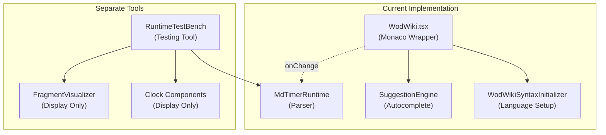
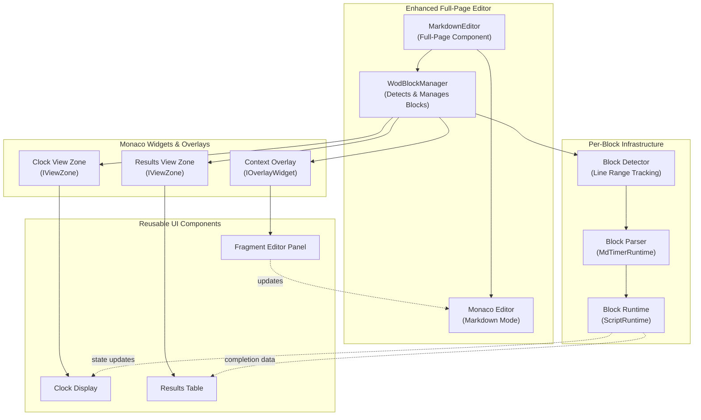
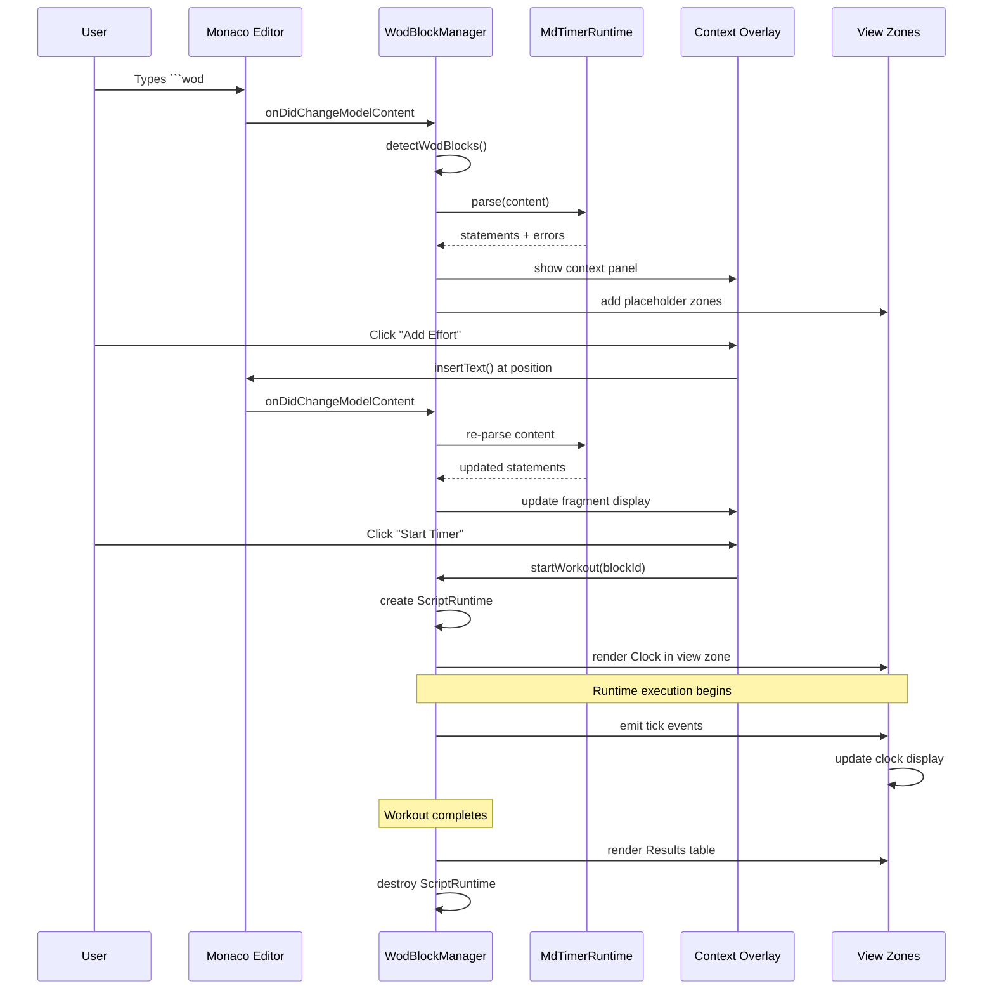

# Architecture Overview - Enhanced Monaco Editor with WOD Context

## Current Architecture



**Current State:**
- Monaco editor is a standalone component with basic syntax highlighting
- RuntimeTestBench exists as a separate testing tool
- No integration between editor and runtime execution
- Each WodWiki instance handles a single workout script
- No markdown support (only raw WOD script)

## Proposed Architecture



## Key Architectural Decisions

### 1. Full-Page Markdown Editor

**Decision:** Create a new top-level component that wraps Monaco with markdown editing capabilities.

**Rationale:**
- Allows free-form page creation with multiple WOD blocks
- Supports markdown styling (headers, lists, emphasis)
- Title line can be extracted for file naming
- Familiar UX for content creators

**Impact:**
- New component: `MarkdownEditor.tsx`
- Existing `WodWiki.tsx` can remain for backward compatibility
- New markdown language mode registration

### 2. Multiple WOD Block Management

**Decision:** Track and manage multiple `````wod` blocks independently.

**Rationale:**
- Users can create workout journals with multiple exercises
- Each block has its own parser instance
- Each block can have independent runtime state
- Allows side-by-side workout comparisons

**Implementation:**
```typescript
interface WodBlock {
  id: string;                    // Unique block identifier
  startLine: number;             // Start of ```wod
  endLine: number;               // End of ```
  content: string;               // Workout script content
  parser: MdTimerRuntime;        // Dedicated parser instance
  runtime?: ScriptRuntime;       // Optional runtime (when started)
  overlayId?: string;            // Context overlay widget ID
  clockZoneId?: string;          // Clock view zone ID
  resultsZoneId?: string;        // Results view zone ID
}
```

### 3. Context Overlay Positioning

**Decision:** Use `IOverlayWidget` with right-side positioning, appearing when cursor is in WOD block.

**Rationale:**
- Overlay widgets can be positioned relative to editor
- Don't interfere with text flow
- Can overflow editor boundaries for larger displays
- Easy show/hide based on cursor position

**Positioning Strategy:**
```typescript
getPosition(): IOverlayWidgetPosition {
  const editorLayout = editor.getLayoutInfo();
  const lineTop = editor.getTopForLineNumber(currentBlock.startLine);
  
  return {
    preference: {
      top: lineTop,
      left: editorLayout.width / 2  // Right half of editor
    }
  };
}
```

### 4. Inline View Zones for Results

**Decision:** Use `IViewZone` to insert clock and results inline after WOD blocks.

**Rationale:**
- View zones create space in the document flow
- Natural placement after workout block
- Don't interfere with editing
- Can be dynamically sized based on content

**Zone Management:**
```typescript
editor.changeViewZones((accessor) => {
  // Add clock zone after block end
  const clockZoneId = accessor.addZone({
    afterLineNumber: block.endLine,
    heightInPx: 200,
    domNode: clockContainer
  });
  
  // Add results zone after clock
  const resultsZoneId = accessor.addZone({
    afterLineNumber: block.endLine,
    heightInPx: 300,
    domNode: resultsContainer,
    ordinal: 1  // Ensure it comes after clock
  });
});
```

### 5. Parser and Runtime Lifecycle

**Decision:** Create parser instances on-demand, runtime instances only when workout starts.

**Rationale:**
- Minimize memory footprint
- Avoid unnecessary parsing of unchanged blocks
- Runtime state only exists during active workouts
- Clean separation of concerns

**Lifecycle:**
```typescript
// On block detection/edit
parseBlock(block: WodBlock) {
  if (!block.parser) {
    block.parser = new MdTimerRuntime();
  }
  const script = block.parser.read(block.content);
  block.parsed = script.statements;
  block.errors = script.errors;
}

// On workout start
startWorkout(block: WodBlock) {
  const compiler = new JitCompiler([/* strategies */]);
  block.runtime = new ScriptRuntime(block.parsed, compiler);
  block.runtime.start();
}

// On workout complete/stop
stopWorkout(block: WodBlock) {
  block.runtime?.stop();
  block.runtime = undefined;  // Release runtime
}
```

### 6. React Component Reuse

**Decision:** Reuse existing UI components from RuntimeTestBench and clock modules.

**Rationale:**
- Proven implementations already exist
- Consistent UX across tools
- Reduce code duplication
- Faster implementation

**Reusable Components:**
- `FragmentVisualizer` - Display parsed fragments
- `ClockAnchor` - Timer display
- `TimeDisplay` - Time formatting
- `RuntimeStackPanel` - Stack visualization (optional, for debugging)
- `MemoryPanel` - Memory visualization (optional, for debugging)

### 7. State Management

**Decision:** Use React Context for editor-level state, local state for block-specific data.

**Rationale:**
- Context provides access to editor instance across components
- Block state is naturally local to each block
- Avoids prop drilling
- Simple state updates through hooks

**Context Structure:**
```typescript
interface MarkdownEditorContext {
  editor: monaco.editor.IStandaloneCodeEditor | null;
  blocks: Map<string, WodBlock>;
  activeBlockId: string | null;
  registerBlock: (block: WodBlock) => void;
  unregisterBlock: (blockId: string) => void;
  updateBlock: (blockId: string, updates: Partial<WodBlock>) => void;
  startWorkout: (blockId: string) => void;
  stopWorkout: (blockId: string) => void;
}
```

## Data Flow



## Component Hierarchy

```
MarkdownEditor (New root component)
├─ Monaco Editor Instance
│  └─ Markdown language mode
├─ WodBlockManager (State management)
│  ├─ Block detection hooks
│  ├─ Parser instances (per block)
│  └─ Runtime instances (per active block)
├─ Monaco Widgets
│  └─ ContextOverlay (IOverlayWidget) - Right side panel
│     ├─ FragmentVisualizer (displays parsed code)
│     ├─ FragmentEditor (add/edit statements)
│     └─ WorkoutControls (start/stop/pause)
└─ Monaco View Zones (per block)
   ├─ ClockZone (IViewZone) - Inline timer display
   │  └─ ClockAnchor + TimeDisplay components
   └─ ResultsZone (IViewZone) - Inline results table
      └─ ResultsTable component
```

## File Organization

```
src/
├─ markdown-editor/                  # New directory
│  ├─ MarkdownEditor.tsx             # Main component
│  ├─ WodBlockManager.tsx            # Block tracking & lifecycle
│  ├─ hooks/
│  │  ├─ useWodBlocks.ts             # Block detection & state
│  │  ├─ useBlockParser.ts           # Parsing integration
│  │  └─ useBlockRuntime.ts          # Runtime integration
│  ├─ widgets/
│  │  ├─ ContextOverlay.tsx          # Overlay widget wrapper
│  │  ├─ ContextPanel.tsx            # Panel content
│  │  └─ ReactMonacoWidget.ts        # Base widget class
│  ├─ zones/
│  │  ├─ ClockViewZone.tsx           # Clock zone wrapper
│  │  ├─ ResultsViewZone.tsx         # Results zone wrapper
│  │  └─ ReactViewZone.ts            # Base view zone class
│  ├─ components/
│  │  ├─ FragmentEditor.tsx          # Statement editing UI
│  │  ├─ WorkoutControls.tsx         # Start/stop controls
│  │  └─ MarkdownToolbar.tsx         # Basic markdown formatting
│  └─ utils/
│     ├─ blockDetection.ts           # WOD block parsing
│     └─ markdownLanguage.ts         # Language definition
├─ editor/                            # Existing (unchanged)
│  └─ WodWiki.tsx                    # Backward compatible
└─ runtime-test-bench/               # Existing (unchanged)
   └─ RuntimeTestBench.tsx           # Separate testing tool
```

## Migration Strategy

**Phase 1:** Build new components alongside existing ones
- No changes to existing `WodWiki.tsx`
- New `MarkdownEditor` in separate directory
- Parallel development without breaking changes

**Phase 2:** Component testing in isolation
- Storybook stories for each new component
- Unit tests for block detection and management
- Integration tests for widget lifecycle

**Phase 3:** Gradual adoption
- Add new stories demonstrating markdown editor
- Existing stories continue to work
- Documentation updates

**Phase 4:** Future consideration
- Optionally refactor WodWiki to use shared infrastructure
- Not required for initial implementation

## Key Constraints Maintained

✅ **No changes to parser logic** - Uses existing `MdTimerRuntime`
✅ **No changes to runtime logic** - Uses existing `ScriptRuntime`
✅ **Backward compatibility** - Existing `WodWiki` component untouched
✅ **Testable increments** - Each phase can be tested independently
✅ **Component reuse** - Leverages existing UI components

## Performance Considerations

1. **Debounced parsing** - 500ms debounce on content changes (existing pattern)
2. **Lazy widget creation** - Only create widgets for visible blocks
3. **Runtime lifecycle** - Create runtime only when starting workout
4. **Efficient decorations** - Use `createDecorationsCollection` for batch updates
5. **View zone recycling** - Reuse DOM nodes where possible
