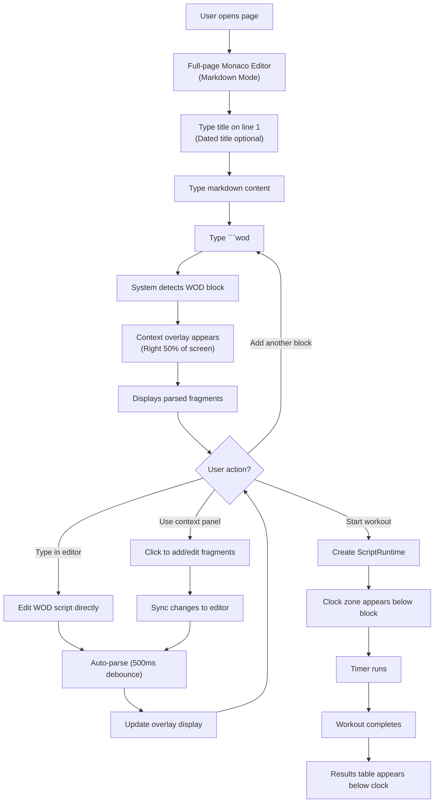
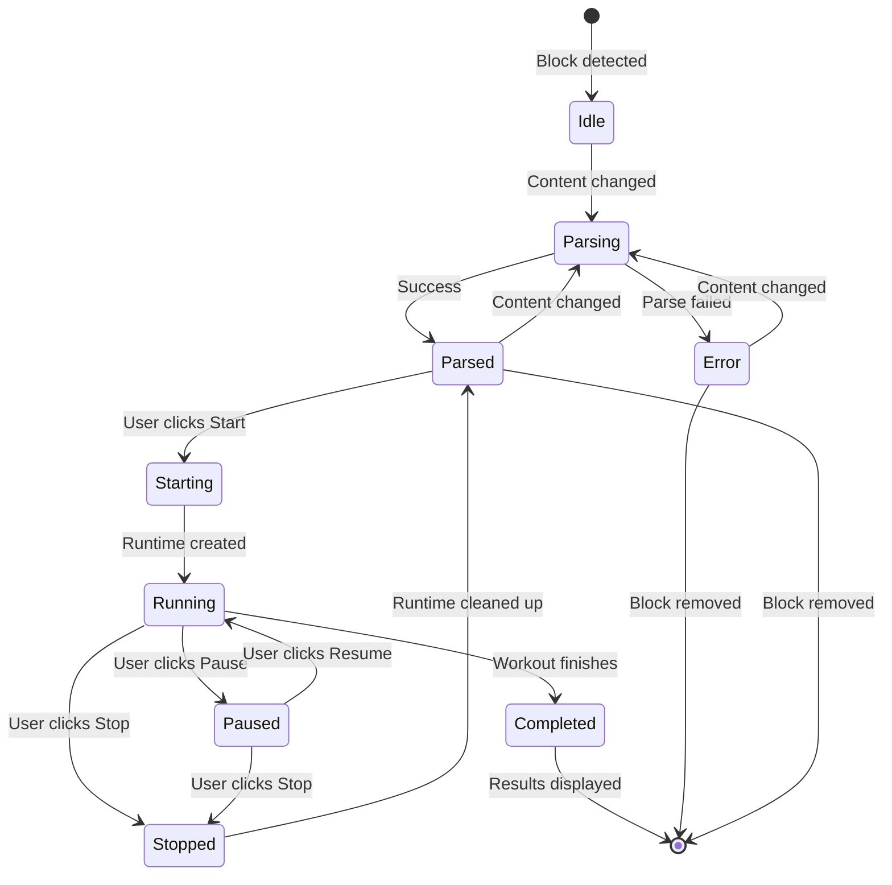
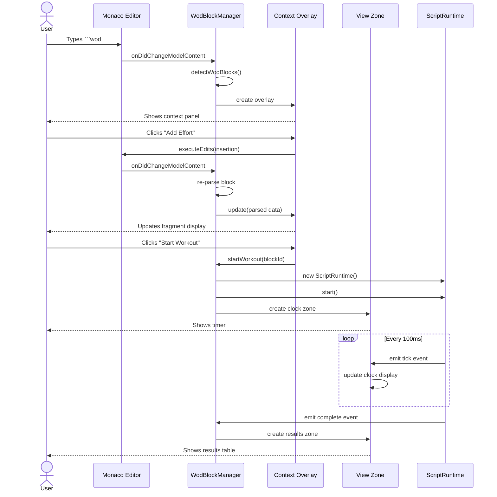
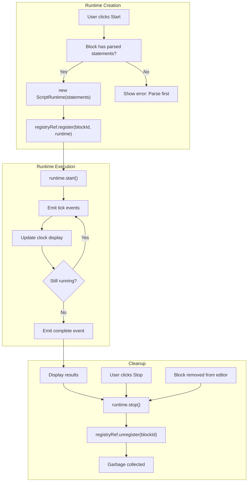

# Visual Reference Guide

## Overview

This document provides visual diagrams and mockups to help understand the enhanced Monaco editor UX and component interactions.

## User Experience Flow



## Screen Layout

```
┌─────────────────────────────────────────────────────────────────┐
│                        Markdown Toolbar                          │
│  [B] [I] [H1] [H2] [Code] [```wod Block] [Save]                │
└─────────────────────────────────────────────────────────────────┘

┌─────────────────────────────────┬───────────────────────────────┐
│                                 │                               │
│   Monaco Editor                 │    Context Overlay            │
│   (Markdown Mode)               │    (When in WOD block)        │
│                                 │                               │
│  # My Workout - 2024-01-15      │  ┌─────────────────────────┐ │
│                                 │  │ Parsed Fragments        │ │
│  Today's workout was awesome!   │  │                         │ │
│                                 │  │ ○ Timer: 20:00          │ │
│  ```wod                         │  │ ○ Action: AMRAP         │ │
│  20:00 AMRAP                    │  │ ○ Effort: 5 Pullups     │ │
│    + 5 Pullups                  │  │ ○ Effort: 10 Pushups    │ │
│    + 10 Pushups                 │  │ ○ Effort: 15 Squats     │ │
│    + 15 Squats                  │  └─────────────────────────┘ │
│  ```                            │                               │
│  ┌────────────────────────────┐ │  ┌─────────────────────────┐ │
│  │ Clock: 00:00 / 20:00       │ │  │ Fragment Editor         │ │
│  │ [▶ Start] [⏸ Pause]        │ │  │                         │ │
│  └────────────────────────────┘ │  │ [+ Add Effort]          │ │
│  ┌────────────────────────────┐ │  │ [+ Add Timer]           │ │
│  │ Results Table              │ │  │ [+ Add Rounds]          │ │
│  │ Time: 20:00                │ │  └─────────────────────────┘ │
│  │ Rounds: 8                  │ │                               │
│  │ Reps: 240                  │ │  ┌─────────────────────────┐ │
│  └────────────────────────────┘ │  │ Workout Controls        │ │
│                                 │  │                         │ │
│  More markdown content...       │  │ [▶ Start Workout]       │ │
│                                 │  │ [⏹ Stop Workout]        │ │
│                                 │  │ [⏸ Pause]               │ │
│                                 │  └─────────────────────────┘ │
│                                 │                               │
└─────────────────────────────────┴───────────────────────────────┘
```

## Component Placement Diagram

```mermaid
graph TB
    subgraph "Full Page Layout"
        Toolbar["Markdown Toolbar<br/>(IOverlayWidget)<br/>Position: TOP_CENTER"]
        
        subgraph "Monaco Editor Container"
            Editor["Monaco Editor<br/>(Markdown Language)"]
            
            subgraph "WOD Block 1 (Lines 5-10)"
                Block1Content["```wod<br/>20:00 AMRAP<br/>  + 5 Pullups<br/>```"]
                Overlay1["Context Overlay<br/>(IOverlayWidget)<br/>Right 50%"]
                ClockZone1["Clock View Zone<br/>(IViewZone)<br/>After line 10"]
                ResultsZone1["Results View Zone<br/>(IViewZone)<br/>After ClockZone1"]
            end
            
            subgraph "WOD Block 2 (Lines 20-25)"
                Block2Content["```wod<br/>(21-15-9)<br/>  Thrusters<br/>```"]
                Overlay2["Context Overlay<br/>(IOverlayWidget)<br/>Right 50%"]
                ClockZone2["Clock View Zone<br/>(IViewZone)<br/>After line 25"]
            end
        end
    end
    
    Editor --> Block1Content
    Block1Content --> Overlay1
    Block1Content --> ClockZone1
    ClockZone1 --> ResultsZone1
    
    Editor --> Block2Content
    Block2Content --> Overlay2
    Block2Content --> ClockZone2
```

## State Machine - WOD Block Lifecycle



## Widget Interaction Diagram



## Data Flow - Parse to Display

```mermaid
graph LR
    subgraph "Editor Content"
        Text["```wod<br/>20:00 AMRAP<br/>  + 5 Pullups<br/>```"]
    end
    
    subgraph "Detection"
        Detect["detectWodBlocks()"]
        Block["WodBlock{<br/>  id: 'block-1'<br/>  startLine: 5<br/>  endLine: 8<br/>  content: '20:00...'<br/>}"]
    end
    
    subgraph "Parsing"
        Parser["MdTimerRuntime"]
        AST["ICodeStatement[]"]
        Fragments["Fragments:<br/>- Timer(20:00)<br/>- Action(AMRAP)<br/>- Effort(5 Pullups)"]
    end
    
    subgraph "Display"
        Overlay["Context Overlay"]
        FragViz["FragmentVisualizer"]
        Colors["Color-coded chips:<br/>🟠 20:00<br/>🟢 AMRAP<br/>⚫ 5 Pullups"]
    end
    
    Text --> Detect
    Detect --> Block
    Block --> Parser
    Parser --> AST
    AST --> Fragments
    Fragments --> Overlay
    Overlay --> FragViz
    FragViz --> Colors
```

## Runtime Lifecycle - Memory Management



## Multi-Block Scenario

```
Editor with 3 WOD blocks:

┌─────────────────────────────────────────────────────────────┐
│ # My Training Log - 2024-01-15                              │
│                                                             │
│ Morning session:                                            │
│ ```wod                          [Context Overlay for Block 1]
│ 20:00 AMRAP                     Showing fragments...       │
│   + 5 Pullups                   [Start Workout] button     │
│ ```                                                         │
│ [Clock Zone 1: 05:32 / 20:00]                              │
│                                                             │
│ Evening session:                                            │
│ ```wod                          [Context Overlay for Block 2]
│ (21-15-9)                       Showing fragments...       │
│   Thrusters 95lb                [Start Workout] button     │
│ ```                                                         │
│ [Clock Zone 2: Not started]                                │
│                                                             │
│ Cool down:                                                  │
│ ```wod                          [Context Overlay for Block 3]
│ 10:00                           Showing fragments...       │
│   Stretch                       [Start Workout] button     │
│ ```                                                         │
│ [Clock Zone 3: Completed]                                  │
│ [Results Zone 3: 10:00, 100% complete]                     │
└─────────────────────────────────────────────────────────────┘

State:
- Block 1: RUNNING (5:32 elapsed)
- Block 2: PARSED (ready to start)
- Block 3: COMPLETED (results showing)

Runtime Registry:
{
  'block-1': ScriptRuntime (active),
  'block-3': undefined (completed, cleaned up)
}
```

## Responsive Behavior

### Desktop (≥1200px)
```
┌──────────────────┬──────────────────┐
│                  │                  │
│   Editor (50%)   │  Overlay (50%)   │
│                  │                  │
└──────────────────┴──────────────────┘
```

### Tablet (768px - 1199px)
```
┌──────────────────┬──────────┐
│                  │          │
│   Editor (60%)   │ Overlay  │
│                  │  (40%)   │
└──────────────────┴──────────┘
```

### Mobile (< 768px)
```
┌──────────────────┐
│                  │
│   Editor (100%)  │
│                  │
└──────────────────┘
│                  │
│  Overlay         │
│  (Collapsed,     │
│   expandable)    │
└──────────────────┘
```

## Color Coding Reference

Fragment types use consistent colors across all views:

| Fragment Type | Color | Icon | Example |
|---------------|-------|------|---------|
| Timer | 🟠 Orange | ⏱️ | `20:00` |
| Rounds | 🟤 Brown | 🔄 | `(21-15-9)` |
| Effort | ⚫ Black | 💪 | `5 Pullups` |
| Resistance | 🟢 Green | 💪 | `95lb` |
| Distance | 🟢 Green | 📏 | `400m` |
| Reps | 🟢 Green | ✖️ | `x15` |
| Action | 🔵 Blue | 🎬 | `AMRAP`, `EMOM` |

## Editor Decorations

### WOD Block Boundaries
```typescript
// Green gutter marker for start of WOD block
glyphMarginClassName: 'wod-block-start'  // ▶ icon

// Background highlight for WOD block content
className: 'wod-block-content'  // Light blue background

// Active block highlight
className: 'wod-block-active'  // Darker blue background
```

### Parse Status Indicators
```typescript
// Success: Green gutter icon
glyphMarginClassName: 'parse-success'  // ✓ icon

// Error: Red gutter icon + underline
glyphMarginClassName: 'parse-error'  // ⚠️ icon
className: 'parse-error-line'  // Red wavy underline
```

## Keyboard Shortcuts

| Shortcut | Action | Context |
|----------|--------|---------|
| `Ctrl+Shift+W` | Insert WOD block template | Anywhere in editor |
| `Ctrl+Enter` | Start workout | Cursor in WOD block |
| `Ctrl+.` | Toggle context overlay | Cursor in WOD block |
| `Escape` | Hide context overlay | Overlay visible |
| `F10` | Step through execution | Workout running (debug) |
| `Space` | Pause/Resume workout | Workout running |
| `Ctrl+Shift+S` | Stop workout | Workout running |

## Animation Timings

| Element | Animation | Duration |
|---------|-----------|----------|
| Overlay appear | Slide in from right | 300ms |
| Overlay hide | Slide out to right | 200ms |
| View zone insert | Height expand | 250ms |
| View zone remove | Height collapse | 200ms |
| Fragment highlight | Background fade | 150ms |
| Parse error | Shake + color flash | 400ms |

## Accessibility Features

### ARIA Labels
```typescript
// Context overlay
aria-label="Workout context panel"
role="complementary"

// Clock zone
aria-label="Workout timer"
role="timer"
aria-live="polite"

// Results zone
aria-label="Workout results"
role="region"

// Workout controls
aria-label="Start workout"
aria-disabled={!canStart}
```

### Keyboard Navigation
- `Tab` moves focus between overlay elements
- `Enter` activates buttons
- `Escape` closes overlay
- `Arrow keys` navigate fragments in editor

### Screen Reader Support
- Live regions announce timer updates (throttled)
- Status changes announced
- Parse errors read aloud
- Results announced on completion

## Visual States Summary

### WOD Block States
1. **Idle** - Just created, no parsing yet (dim border)
2. **Parsing** - Parse in progress (pulsing border)
3. **Parsed** - Successfully parsed (green border)
4. **Error** - Parse error (red border, error indicator)
5. **Starting** - Runtime initializing (yellow border)
6. **Running** - Workout active (blue border, animated)
7. **Paused** - Workout paused (blue border, static)
8. **Completed** - Workout finished (green border, checkmark)
9. **Stopped** - Workout stopped early (gray border)

### Overlay States
1. **Hidden** - Not in WOD block
2. **Visible** - Showing context
3. **Editing** - User editing fragment
4. **Executing** - Workout running (controls change)

### Zone States
1. **Not Created** - Block not parsed or no runtime
2. **Placeholder** - "Ready to start" message
3. **Active** - Timer updating
4. **Completed** - Results displayed
5. **Removed** - Block deleted or reset
