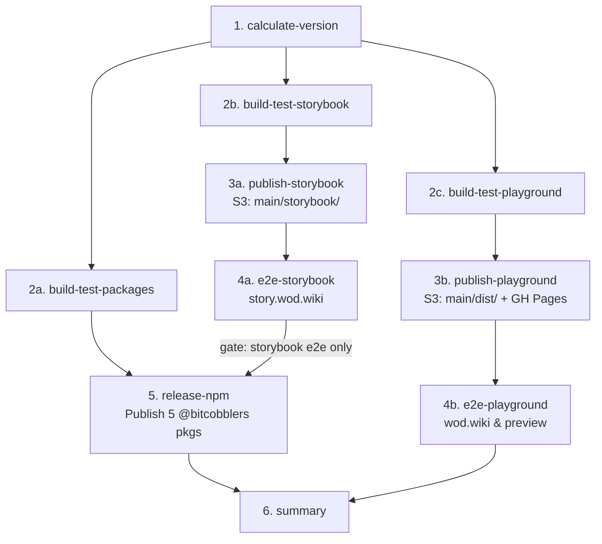

# Monorepo Reunification Specification & Execution Runbook

**Document:** Master Handoff Specification  
**Source Effort:** Wayfinder Map [#979](https://github.com/SergeiGolos/wod-wiki/issues/979)  
**Date:** 2026-08-26  
**Status:** Approved & Ready for Execution  

---

## 1. Executive Summary & Objective

This specification details the end-to-end plan to reunify `wod-wiki` and `wod-wiki-engine` back into a single Bun workspace monorepo.

### 1.1 Core Problems Solved
- **Eliminates Inter-Repo Friction:** No more multi-repo version desynchronization, `use-engine` bridging, local tarball packing, or multi-step release sequencing.
- **Unified Version Line:** A single version stream (`{major}.{minor}.{run_number}`) starting at **`0.11.x`** stamps all 5 npm packages and both web applications.
- **Parallel CI/CD Pipelines:** A 6-phase parallel workflow graph for PR previews (`https://<slug>.preview.wod.wiki`, `https://<slug>.story.wod.wiki`, `https://<slug>.e2e.wod.wiki`) and production releases (`https://wod.wiki`, `https://story.wod.wiki`, npmjs).
- **Fast Developer Experience:** Instant Hot Module Replacement (HMR) across all packages via Vite source aliasing with zero build latency, plus targeted single-package workflows.

---

## 2. Monorepo Topology

```
wod-wiki/
├── package.json                  # Root workspace manifest (workspaces: ["packages/*", "apps/*"])
├── bun.lock                      # Single workspace lockfile
├── bunfig.toml                   # Shared bun runtime config
├── tsconfig.base.json            # Base strict compiler configuration (ES2022)
├── tsconfig.json                 # Composite root project referencing all packages & apps
├── vitest.workspace.ts           # Vitest workspace configuration (packages/*)
├── playwright.journal.config.ts  # Playwright E2E configuration (apps/playground)
├── playwright.storybook.config.ts# Playwright E2E configuration (apps/storybook)
├── .eslintrc.json                # Unified workspace ESLint rules
├── .github/
│   ├── workflows/
│   │   ├── pull-request.yml      # Parallel PR preview pipeline
│   │   ├── main.yml              # Parallel Main release pipeline
│   │   ├── preview-e2e.yml       # Reusable deployed preview E2E runner
│   │   ├── codeql.yml
│   │   └── sync-wiki.yml
│   └── actions/
│       └── setup-env/
├── apps/
│   ├── playground/               # The wod.wiki web application (Private)
│   │   ├── package.json          # @bitcobblers/wod-wiki-playground
│   │   ├── tsconfig.json
│   │   ├── vite.config.ts        # @/ alias points to ./src, imports CODEMIRROR_SINGLETON_DEPS
│   │   ├── vite.receiver.config.ts
│   │   ├── index.html
│   │   ├── receiver-rpc.html
│   │   ├── src/                  # Application source (components, views, stores, panels, services)
│   │   ├── tests/                # Unit test runner (run-isolated.ts, unit-setup.ts)
│   │   └── dist/                 # Production build artifact
│   └── storybook/                # Canonical Component Workbench (Private)
│       ├── package.json          # @bitcobblers/wod-wiki-storybook
│       ├── tsconfig.json
│       ├── vite.config.ts
│       ├── vitest.config.ts
│       ├── aliases.ts            # Source aliases for direct package imports in dev
│       ├── .storybook/           # main.ts, preview.tsx
│       ├── src/                  # Stories & fixtures
│       └── storybook-static/     # Storybook build artifact
├── packages/
│   ├── core/                     # @bitcobblers/wod-wiki-core (Public npm)
│   ├── lang/                     # @bitcobblers/wod-wiki-lang (Public npm)
│   ├── wql/                      # @bitcobblers/wod-wiki-wql (Public npm)
│   ├── engine/                   # @bitcobblers/wod-wiki-engine (Public npm umbrella facade + CLI)
│   └── ui/                       # @bitcobblers/wod-wiki-ui (Public npm components & CSS)
├── bench/                        # Performance benchmarks
├── docs/                         # Architecture, ADRs, Research, Specs
├── markdown/                     # Static workout notes & collections
└── scripts/                      # Unified workspace scripts
    ├── stamp-version.ts          # Version stamping across packages/* and apps/*
    ├── generate-static-block-index.ts
    ├── generate-static-shells.ts
    ├── check-architecture-regressions.cjs
    └── check-unused-exports-regressions.cjs
```

---

## 3. Complete Bun Command Surface

The workspace provides high-level convenience commands alongside granular single-package filtering:

### 3.1 Primary Workflow Commands

| Command | Action | Implementation |
| --- | --- | --- |
| **`bun playground`** (or `bun dev`) | Builds package dependencies if needed, runs lint check, and boots the Playground app on `http://localhost:5173`. | `bun run build:packages && bun run lint:playground && bun run --filter '@bitcobblers/wod-wiki-playground' dev` |
| **`bun storybook`** | Builds package dependencies if needed, runs lint check, and boots Storybook on `http://localhost:6006`. | `bun run build:packages && bun run lint:storybook && bun run --filter '@bitcobblers/wod-wiki-storybook' storybook` |
| **`bun package`** (or `bun packages`) | Lints, typechecks, and builds all 5 packages in `packages/*`. | `bun run lint:packages && bun run typecheck:packages && bun run build:packages` |
| **`bun test`** | Runs the complete test suite across the entire workspace (packages + playground + storybook). | `bun run test:packages && bun run test:playground:unit && bun run test:storybook` |
| **`bun test:package`** | Runs unit tests across all 5 engine packages using Vitest. | `vitest run` |
| **`bun test:storybook`** | Runs Storybook component/interaction test runner. | `bun run --filter '@bitcobblers/wod-wiki-storybook' test` |
| **`bun test:playground`** | Runs Playwright E2E tests against the local playground project. | `bun x playwright test --config playwright.journal.config.ts` |
| **`bun test:playground:unit`** | Runs fast isolated unit & component tests in `apps/playground/tests/`. | `bun run --filter '@bitcobblers/wod-wiki-playground' test` |

### 3.2 Granular Linting & Typechecking Commands

| Command | Scope | Implementation |
| --- | --- | --- |
| **`bun lint`** | Lints all packages and applications | `eslint packages/*/src apps/*/src --ext .ts,.tsx` |
| **`bun lint:package`** | Lints `packages/*` only | `eslint packages/*/src --ext .ts,.tsx` |
| **`bun lint:playground`** | Lints `apps/playground` only | `eslint apps/playground/src --ext .ts,.tsx` |
| **`bun lint:storybook`** | Lints `apps/storybook` only | `eslint apps/storybook/src --ext .ts,.tsx` |
| **`bun typecheck`** | Typechecks composite workspace | `tsc --noEmit` |
| **`bun typecheck:package`** | Typechecks all packages | `bun run --filter '@bitcobblers/wod-wiki-*' typecheck` |
| **`bun typecheck:playground`**| Typechecks playground | `bun run --filter '@bitcobblers/wod-wiki-playground' typecheck` |
| **`bun typecheck:storybook`** | Typechecks storybook | `bun run --filter '@bitcobblers/wod-wiki-storybook' typecheck` |

---

## 4. Root `package.json` Specification

```json
{
  "name": "wod-wiki",
  "version": "0.11.0",
  "private": true,
  "type": "module",
  "packageManager": "bun@1.3.14",
  "workspaces": [
    "packages/*",
    "apps/*"
  ],
  "scripts": {
    "version:stamp": "bun scripts/stamp-version.ts",
    "version:bump": "bun scripts/stamp-version.ts --bump",
    "version:prerelease": "bun scripts/stamp-version.ts --prerelease",

    "playground": "bun run build:packages && bun run --filter '@bitcobblers/wod-wiki-playground' dev",
    "storybook": "bun run build:packages && bun run --filter '@bitcobblers/wod-wiki-storybook' storybook",
    "package": "bun run lint:packages && bun run typecheck:packages && bun run build:packages",
    "packages": "bun run package",

    "dev": "bun run playground",
    "dev:storybook": "bun run storybook",
    "dev:all": "bun run --filter '*' dev",

    "build": "bun run build:packages && bun run build:apps",
    "build:packages": "bun run --filter '@bitcobblers/wod-wiki-*' build",
    "build:apps": "bun run --filter '@bitcobblers/wod-wiki-playground' build && bun run --filter '@bitcobblers/wod-wiki-storybook' build",
    "build:app": "bun run --filter '@bitcobblers/wod-wiki-playground' build",
    "build:storybook": "bun run --filter '@bitcobblers/wod-wiki-storybook' build",

    "clean": "bun run --filter '*' clean",
    "typecheck": "tsc --noEmit",
    "typecheck:package": "bun run --filter '@bitcobblers/wod-wiki-*' typecheck",
    "typecheck:packages": "bun run typecheck:package",
    "typecheck:playground": "bun run --filter '@bitcobblers/wod-wiki-playground' typecheck",
    "typecheck:storybook": "bun run --filter '@bitcobblers/wod-wiki-storybook' typecheck",

    "lint": "eslint packages/*/src apps/*/src --ext .ts,.tsx",
    "lint:package": "eslint packages/*/src --ext .ts,.tsx",
    "lint:packages": "bun run lint:package",
    "lint:playground": "eslint apps/playground/src --ext .ts,.tsx",
    "lint:storybook": "eslint apps/storybook/src --ext .ts,.tsx",

    "test": "bun run test:packages && bun run test:playground:unit && bun run test:storybook",
    "test:package": "vitest run",
    "test:packages": "bun run test:package",
    "test:storybook": "bun run --filter '@bitcobblers/wod-wiki-storybook' test",
    "test:playground": "bun x playwright test --config playwright.journal.config.ts",
    "test:playground:unit": "bun run --filter '@bitcobblers/wod-wiki-playground' test",
    "test:e2e": "bun run test:playground",
    "test:e2e:storybook": "bun x playwright test --config playwright.storybook.config.ts",

    "generate:static-index": "bun run scripts/generate-static-block-index.ts",
    "check:architecture": "node scripts/check-architecture-regressions.cjs && node scripts/check-unused-exports-regressions.cjs",
    "analyze:deps": "bun x madge --extensions ts,tsx --ts-config tsconfig.json --exclude __tests__ --circular apps/playground/src"
  },
  "devDependencies": {
    "@playwright/test": "^1.62.1",
    "@types/node": "^20.19.43",
    "@types/react": "^19.2.18",
    "@types/react-dom": "^19.2.4",
    "@typescript-eslint/eslint-plugin": "^8.67.0",
    "@typescript-eslint/parser": "^8.67.0",
    "eslint": "^8.57.1",
    "eslint-plugin-react-hooks": "^7.1.1",
    "tsup": "^8.5.1",
    "typescript": "^5.9.3",
    "vitest": "^2.1.9"
  }
}
```

---

## 5. Step-by-Step Cutover Execution Runbook

The migration is executed as a single pull request on `wod-wiki`:

### Step 1: Initialize Migration Branch & Fetch Engine History
```bash
git checkout main
git pull origin main
git checkout -b chore/reunify-monorepo

# Add engine remote and fetch tags
git remote add engine https://github.com/SergeiGolos/wod-wiki-engine.git || git remote set-url engine https://github.com/SergeiGolos/wod-wiki-engine.git
git fetch engine --tags
```

### Step 2: Merge Engine History with Full Blame Preservation
```bash
git merge --allow-unrelated-histories engine/main \
  -m "Merge wod-wiki-engine into wod-wiki (monorepo reunification)"
```

### Step 3: Relocate Playground into `apps/playground/`
```bash
mkdir -p apps/playground
git mv playground/* apps/playground/ 2>/dev/null || true
git mv src apps/playground/src
git mv tests apps/playground/tests
```

### Step 4: Clean Up Retired Artifacts
```bash
git rm -f scripts/use-engine.ts 2>/dev/null || true
git rm -f scripts/fix-codemirror-deps.cjs 2>/dev/null || true
git rm -f scripts/dev-start.cjs 2>/dev/null || true
```

### Step 5: Update Root Manifest & Configurations
1. Write unified root `package.json` (as specified in §4).
2. Configure `apps/playground/package.json`:
   ```json
   {
     "name": "@bitcobblers/wod-wiki-playground",
     "version": "0.11.0",
     "private": true,
     "type": "module",
     "scripts": {
       "dev": "vite",
       "build": "vite build && bun run ../../scripts/generate-static-shells.ts",
       "preview": "vite preview",
       "test": "bun tests/run-isolated.ts ./src --preload ./tests/unit-setup.ts",
       "test:components": "bun test tests --preload ./tests/setup.ts",
       "test:coverage": "bun tests/run-isolated.ts ./src --preload ./tests/unit-setup.ts",
       "clean": "rm -rf dist",
       "typecheck": "tsc --noEmit"
     },
     "dependencies": {
       "@bitcobblers/wod-wiki-core": "^0.11.0",
       "@bitcobblers/wod-wiki-lang": "^0.11.0",
       "@bitcobblers/wod-wiki-wql": "^0.11.0",
       "@bitcobblers/wod-wiki-engine": "^0.11.0",
       "@bitcobblers/wod-wiki-ui": "^0.11.0"
     }
   }
   ```
3. Update `apps/playground/vite.config.ts`:
   - Set `@/` resolve alias to `path.resolve(__dirname, 'src')`.
   - Add `CODEMIRROR_SINGLETON_DEPS` resolve aliases for CodeMirror deduplication.
4. Copy `scripts/stamp-version.ts` from engine repo to root `scripts/stamp-version.ts`.

### Step 6: Install, Lockfile Generation & Local Verification
```bash
bun install
bun run lint
bun run typecheck
bun run build
bun run test
```

### Step 7: Update CI Workflows
- Update `.github/workflows/pull-request.yml` and `.github/workflows/main.yml` according to the 6-phase parallel DAG in [`docs/research/004-unified-parallel-pipeline-dag.md`](docs/research/004-unified-parallel-pipeline-dag.md).

### Step 8: Commit & Open PR
```bash
git add .
git commit -m "feat(monorepo): reunify wod-wiki and wod-wiki-engine into single workspace"
git push origin chore/reunify-monorepo
```

---

## 6. Unified Parallel CI/CD Architecture



### 6.1 URL Routing Reference
- **PR Playground Preview:** `https://<slug>.preview.wod.wiki` (`s3://$AWS_PREVIEW_S3_BUCKET/<slug>/dist/`)
- **PR Storybook Preview:** `https://<slug>.story.wod.wiki` (`s3://$AWS_PREVIEW_S3_BUCKET/<slug>/storybook/`)
- **PR E2E HTML Report:** `https://<slug>.e2e.wod.wiki` (`s3://$AWS_PREVIEW_S3_BUCKET/<slug>/e2e-report/`)
- **Main S3 Playground:** `https://main.preview.wod.wiki` (`s3://$AWS_PREVIEW_S3_BUCKET/main/dist/`)
- **Main S3 Storybook:** `https://story.wod.wiki` (`s3://$AWS_PREVIEW_S3_BUCKET/main/storybook/`)
- **Main Production Release:** `https://wod.wiki` (GitHub Pages)

---

## 7. Cutover-Day Checklist & Post-Migration Aftermath

### Pre-Merge:
- [ ] Verify `NPM_TOKEN` in `wod-wiki` has write permissions to `@bitcobblers` on npmjs.com.
- [ ] Confirm all `AWS_PREVIEW_*` secrets are configured in `wod-wiki`.

### Post-Merge:
- [ ] Verify first unified release on `main` calculates version `0.11.x` (or `0.12.x`).
- [ ] Verify npm packages are published successfully to `npmjs.com/@bitcobblers/*`.
- [ ] Verify Storybook deploys to `https://story.wod.wiki`.
- [ ] Verify Playground deploys to `https://wod.wiki` and `https://main.preview.wod.wiki`.
- [ ] **Archive `wod-wiki-engine`:**
  1. Add a prominent notice to `wod-wiki-engine/README.md` redirecting to `https://github.com/SergeiGolos/wod-wiki`.
  2. Set repository status to **Archived (Read-Only)** in GitHub settings.
