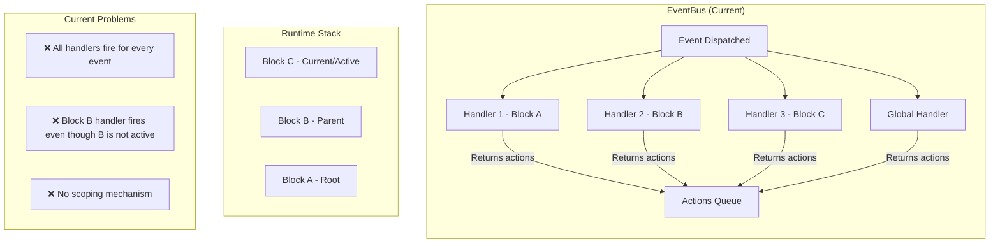
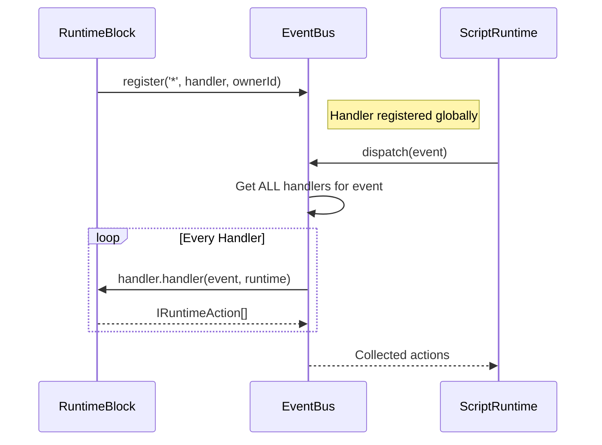
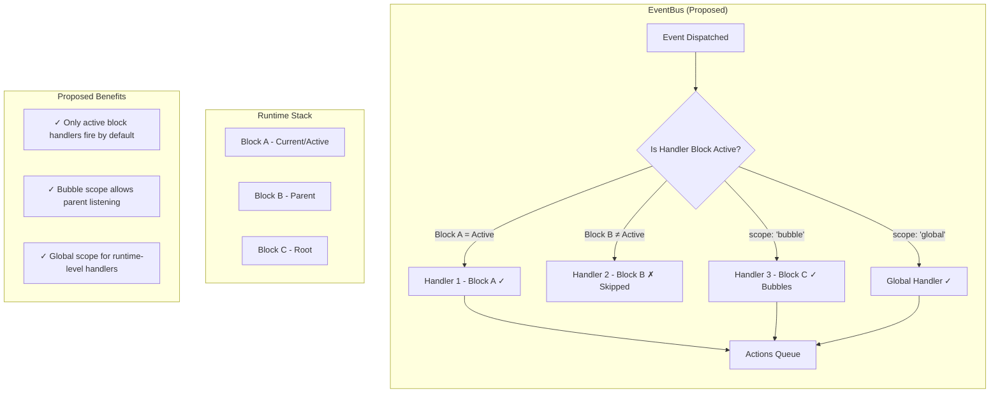
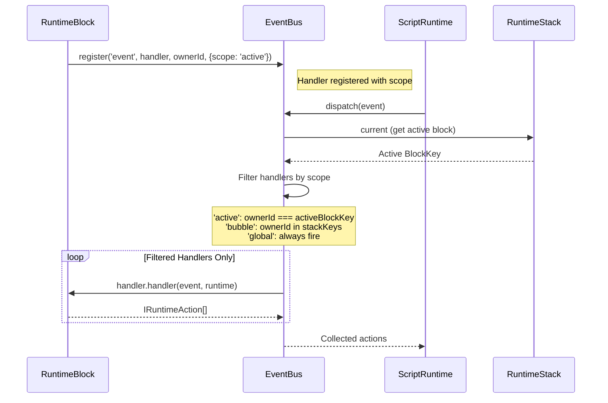
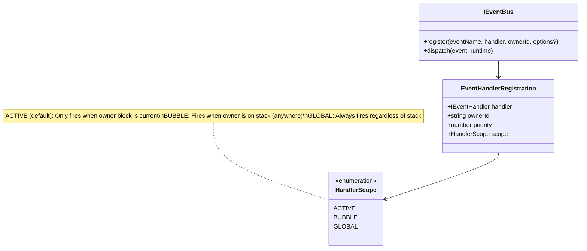

# Event Bus Scoped Handlers - Architecture Plan

## Problem Statement

The current event bus architecture has **event collisions** where:
1. All registered handlers receive all events, regardless of which block is currently active
2. Handlers create and queue actions instead of acting directly and returning actions
3. Actions are created in handlers rather than in lifecycle methods (`onPush`, `onPop`, `onNext`)

## Goals

1. **Scoped Event Handlers**: Handlers registered by behaviors should only trigger when the registering block is the **active block** on the stack (by default)
2. **Bubble-up Option**: Override the default scope to allow parent blocks to listen to events from child blocks
3. **Direct Action Return**: Event handlers should act directly and return `IRuntimeAction[]` that the runtime processes
4. **Clean Separation**: Runtime actions come from lifecycle methods (`onPush`, `onPop`, `onNext`, `onEvent`)

---

## Current Architecture (Before)



### Current Event Registration Flow



---

## Proposed Architecture (After)



### Proposed Event Registration Flow



---

## Handler Scope Options



---

## Code Changes

### 1. Update `IEventBus` Interface

**Before:**
```typescript
// src/runtime/contracts/events/IEventBus.ts
export interface IEventBus {
    register(
        eventName: string,
        handler: IEventHandler,
        ownerId: string,
        priority?: number
    ): () => void;
    // ...
}
```

**After:**
```typescript
// src/runtime/contracts/events/IEventBus.ts

export type HandlerScope = 'active' | 'bubble' | 'global';

export interface EventHandlerOptions {
    priority?: number;
    scope?: HandlerScope;  // default: 'active'
}

export interface IEventBus {
    register(
        eventName: string,
        handler: IEventHandler,
        ownerId: string,
        options?: EventHandlerOptions
    ): () => void;
    // ...
}
```

### 2. Update `EventBus` Implementation

**Before:**
```typescript
// src/runtime/events/EventBus.ts
export type EventHandlerRegistration = {
  handler: IEventHandler;
  ownerId: string;
  priority: number;
};

export class EventBus implements IEventBus {
  register(
    eventName: string,
    handler: IEventHandler,
    ownerId: string,
    priority: number = 0
  ): () => void {
    const list = this.handlersByEvent.get(eventName) ?? [];
    const updated = [...list, { handler, ownerId, priority }];
    updated.sort((a, b) => b.priority - a.priority);
    this.handlersByEvent.set(eventName, updated);
    return () => this.unregisterById(handler.id);
  }

  dispatch(event: IEvent, runtime: IScriptRuntime): IRuntimeAction[] {
    // ... gets ALL handlers and calls them
    const list = [
      ...(this.handlersByEvent.get('*') ?? []),
      ...(this.handlersByEvent.get(event.name) ?? [])
    ];
    
    for (const entry of list) {
      const result = entry.handler.handler(event, runtime);
      // ...
    }
  }
}
```

**After:**
```typescript
// src/runtime/events/EventBus.ts
import { HandlerScope, EventHandlerOptions } from '../contracts/events/IEventBus';

export type EventHandlerRegistration = {
  handler: IEventHandler;
  ownerId: string;
  priority: number;
  scope: HandlerScope;  // NEW
};

export class EventBus implements IEventBus {
  register(
    eventName: string,
    handler: IEventHandler,
    ownerId: string,
    options: EventHandlerOptions = {}
  ): () => void {
    const { priority = 0, scope = 'active' } = options;
    
    const list = this.handlersByEvent.get(eventName) ?? [];
    const updated = [...list, { handler, ownerId, priority, scope }];
    updated.sort((a, b) => b.priority - a.priority);
    this.handlersByEvent.set(eventName, updated);
    return () => this.unregisterById(handler.id);
  }

  dispatch(event: IEvent, runtime: IScriptRuntime): IRuntimeAction[] {
    const activeBlockKey = runtime.stack.current?.key.toString();
    const stackKeys = new Set(runtime.stack.keys.map(k => k.toString()));
    
    const allHandlers = [
      ...(this.handlersByEvent.get('*') ?? []),
      ...(this.handlersByEvent.get(event.name) ?? [])
    ];
    
    // Filter handlers based on scope
    const eligibleHandlers = allHandlers.filter(entry => {
      switch (entry.scope) {
        case 'global':
          return true;
        case 'bubble':
          return stackKeys.has(entry.ownerId);
        case 'active':
        default:
          return entry.ownerId === activeBlockKey;
      }
    });

    const actions: IRuntimeAction[] = [];
    for (const entry of eligibleHandlers) {
      try {
        const result = entry.handler.handler(event, runtime);
        if (result && result.length > 0) {
          actions.push(...result);
        }
      } catch (error) {
        console.error(`EventBus handler error for ${event.name}:`, error);
      }
    }

    return actions;
  }
}
```

### 3. Update `RuntimeBlock` Event Registration

**Before:**
```typescript
// src/runtime/RuntimeBlock.ts
private registerEventDispatcher() {
    const handler: IEventHandler = {
        id: `dispatcher-${this.key.toString()}`,
        name: `EventDispatcher-${this.label}`,
        handler: (event: IEvent, runtime: IScriptRuntime) => {
            // Manual check for active block
            if (runtime.stack.current !== this) {
                return [];
            }
            // ... dispatch to behaviors
        }
    };

    // Register for ALL events with no scope
    const unsub = this._runtime?.eventBus?.register?.('*', handler, this.key.toString());
}
```

**After:**
```typescript
// src/runtime/RuntimeBlock.ts
private registerEventDispatcher() {
    const handler: IEventHandler = {
        id: `dispatcher-${this.key.toString()}`,
        name: `EventDispatcher-${this.label}`,
        handler: (event: IEvent, runtime: IScriptRuntime) => {
            // No manual check needed - EventBus handles scope filtering
            const actions: IRuntimeAction[] = [];
            for (const behavior of this.behaviors) {
                if (behavior.onEvent) {
                    const result = behavior.onEvent(event, this);
                    if (result) {
                        actions.push(...result);
                    }
                }
            }
            return actions;
        }
    };

    // Register with 'active' scope (default) - only fires when this block is current
    const unsub = this._runtime?.eventBus?.register?.(
        '*', 
        handler, 
        this.key.toString(),
        { scope: 'active' }  // NEW: explicit scope
    );
    if (unsub) {
        this._unsubscribers.push(unsub);
    }
}
```

### 4. Update Behaviors to Use Bubble Scope When Needed

**Before:**
```typescript
// Example: LoopCoordinatorBehavior needs to listen to child timer:complete events
onEvent(event: IEvent, block: IRuntimeBlock): IRuntimeAction[] {
    // Currently receives ALL events because EventBus doesn't filter
    if (event.name === 'timer:complete' && this.config.loopType === LoopType.INTERVAL) {
        // ...
    }
}
```

**After:**
```typescript
// Behaviors that need to listen to child events can be registered with bubble scope
// This is done at the block level, not the behavior level

// In RuntimeBlock or a specific block type that needs bubble scope:
private registerEventDispatcher() {
    const handler: IEventHandler = { /* ... */ };

    // Use 'bubble' scope to receive events from child blocks too
    const unsub = this._runtime?.eventBus?.register?.(
        '*', 
        handler, 
        this.key.toString(),
        { scope: 'bubble' }  // Receives events when on stack (not just active)
    );
}
```

### 5. Update Runtime-Level Handlers to Use Global Scope

**Before:**
```typescript
// src/runtime/ScriptRuntime.ts
// Event-based span tracking handler
this._spanTracker = new SpanTrackingHandler();
this.eventBus.register('stack:push', this._spanTracker, 'runtime');
this.eventBus.register('stack:pop', this._spanTracker, 'runtime');

// Handle explicit next events
this.eventBus.register('next', new NextEventHandler('runtime-next-handler'), 'runtime');
```

**After:**
```typescript
// src/runtime/ScriptRuntime.ts
// Event-based span tracking handler - needs global scope
this._spanTracker = new SpanTrackingHandler();
this.eventBus.register('stack:push', this._spanTracker, 'runtime', { scope: 'global' });
this.eventBus.register('stack:pop', this._spanTracker, 'runtime', { scope: 'global' });

// Handle explicit next events - needs global scope
this.eventBus.register('next', new NextEventHandler('runtime-next-handler'), 'runtime', { scope: 'global' });
```

---

## Event Handler Action Flow

```mermaid
flowchart TD
    subgraph Lifecycle["Block Lifecycle"]
        Push["onPush()"] --> |"Returns"| A1[IRuntimeAction[]]
        Next["onNext()"] --> |"Returns"| A2[IRuntimeAction[]]
        Pop["onPop()"] --> |"Returns"| A3[IRuntimeAction[]]
    end
    
    subgraph Event["Event Handling"]
        Event1["onEvent(event)"] --> |"Acts directly on block"| Block[Block State Modified]
        Block --> |"Returns"| A4[IRuntimeAction[]]
    end
    
    subgraph Runtime["ScriptRuntime"]
        A1 --> Queue[Action Queue]
        A2 --> Queue
        A3 --> Queue
        A4 --> Queue
        Queue --> Process[processActions()]
        Process --> Execute[Execute Each Action]
    end
    
    note1["All lifecycle methods return actions\nActions are processed by runtime\nHandlers don't execute actions directly"]
```

---

## Migration Path

### Phase 1: Add Scope to EventBus
1. Add `HandlerScope` type to `IEventBus`
2. Update `EventBus.register()` to accept options
3. Update `EventBus.dispatch()` to filter by scope
4. Default scope is `'active'` for backward compatibility

### Phase 2: Update Runtime-Level Registrations
1. Update `ScriptRuntime` to use `scope: 'global'` for runtime handlers
2. Update `SpanTrackingHandler` registration
3. Update `NextEventHandler` registration

### Phase 3: Update Block Registrations
1. Update `RuntimeBlock.registerEventDispatcher()` to use explicit scope
2. Remove manual `runtime.stack.current !== this` checks
3. Test that default `'active'` scope works correctly

### Phase 4: Support Bubble Scope for Parent Listening
1. Identify blocks that need to listen to child events
2. Update those blocks to use `scope: 'bubble'`
3. Document when to use each scope

---

## Test Cases

### Scope Filtering Tests

```typescript
describe('EventBus scoped handlers', () => {
  it('should only fire active-scope handler when owner is current block', () => {
    const bus = new EventBus();
    const stack = new RuntimeStack();
    
    const blockA = new MockBlock('block-a');
    const blockB = new MockBlock('block-b');
    
    stack.push(blockA);
    stack.push(blockB); // blockB is now current
    
    let handlerACalled = false;
    let handlerBCalled = false;
    
    bus.register('test', { id: 'a', name: 'A', handler: () => { handlerACalled = true; return []; } }, 'block-a', { scope: 'active' });
    bus.register('test', { id: 'b', name: 'B', handler: () => { handlerBCalled = true; return []; } }, 'block-b', { scope: 'active' });
    
    bus.dispatch({ name: 'test', timestamp: new Date() }, mockRuntime);
    
    expect(handlerACalled).toBe(false); // A is not active
    expect(handlerBCalled).toBe(true);  // B is active
  });

  it('should fire bubble-scope handler when owner is on stack', () => {
    const bus = new EventBus();
    const stack = new RuntimeStack();
    
    const blockA = new MockBlock('block-a');
    const blockB = new MockBlock('block-b');
    
    stack.push(blockA);
    stack.push(blockB); // blockB is now current
    
    let handlerACalled = false;
    
    bus.register('test', { id: 'a', name: 'A', handler: () => { handlerACalled = true; return []; } }, 'block-a', { scope: 'bubble' });
    
    bus.dispatch({ name: 'test', timestamp: new Date() }, mockRuntime);
    
    expect(handlerACalled).toBe(true); // A is on stack, should receive bubbled events
  });

  it('should always fire global-scope handlers', () => {
    const bus = new EventBus();
    
    let handlerCalled = false;
    
    bus.register('test', { id: 'global', name: 'Global', handler: () => { handlerCalled = true; return []; } }, 'runtime', { scope: 'global' });
    
    bus.dispatch({ name: 'test', timestamp: new Date() }, mockRuntime);
    
    expect(handlerCalled).toBe(true);
  });
});
```

---

## Summary

| Aspect | Before | After |
|--------|--------|-------|
| **Handler Scope** | All handlers fire for all events | Handlers filtered by scope (`active`, `bubble`, `global`) |
| **Active Block Check** | Manual in each handler | Automatic in EventBus dispatch |
| **Parent Listening** | Not supported cleanly | Use `scope: 'bubble'` |
| **Runtime Handlers** | No distinction | Use `scope: 'global'` |
| **Backward Compatibility** | N/A | Default `'active'` scope maintains behavior |

This architecture change provides:
1. ✅ Reduced event collision
2. ✅ Clear scoping semantics
3. ✅ Parent block can opt-in to listen to child events
4. ✅ Clean separation between runtime-level and block-level handlers
5. ✅ Backward compatible with default `'active'` scope
