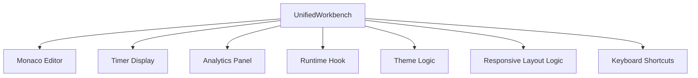
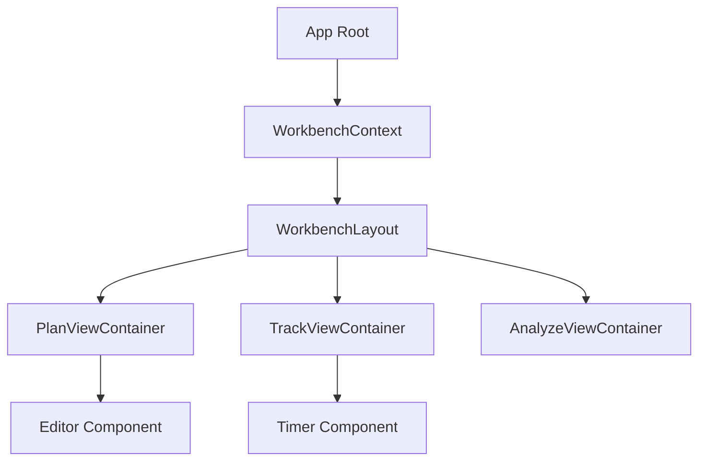
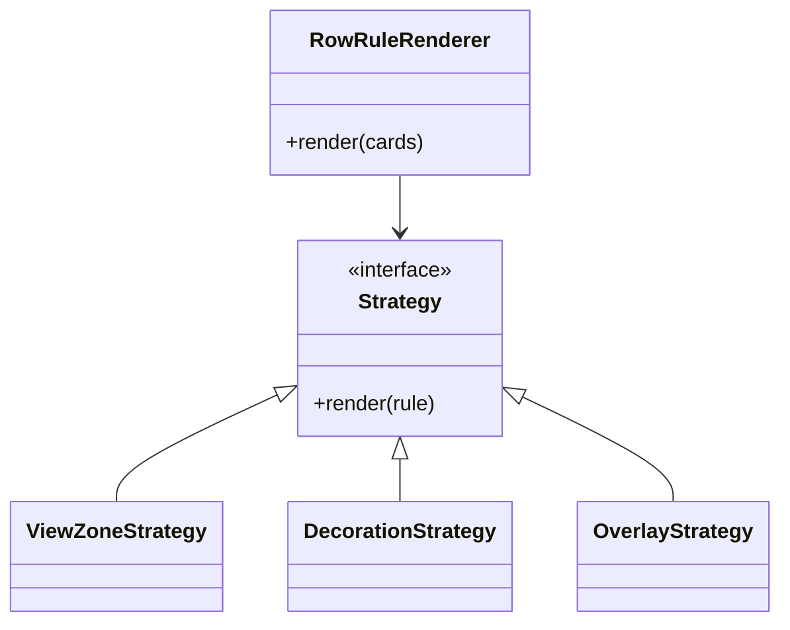

# Refactoring & Decoupling Plan

This document identifies areas of high complexity and coupling in the codebase and proposes specific refactoring strategies to simplify the solution, improve maintainability, and enhance testability.

## 1. Overview

The current codebase has several "God Objects" and areas where UI, state management, and business logic are tightly coupled. This makes it difficult to:
*   Test individual components/logic in isolation.
*   Extend functionality without risking regressions.
*   Understand the code flow for new developers.

The primary goals of this refactoring are:
1.  **Separation of Concerns**: Isolate UI, State, and Logic.
2.  **Decoupling**: Reduce dependencies between core systems (e.g., Runtime and UI).
3.  **Simplification**: Break down large files and classes into smaller, focused units.

---

## 2. Identified Areas of High Complexity

| Component / File | Complexity Type | Primary Issues |
| :--- | :--- | :--- |
| `UnifiedWorkbench.tsx` | **God Component** | Handles layout, global state, keyboard shortcuts, runtime initialization, and view switching all in one place. |
| `RowRuleRenderer.ts` | **God Class** | Manages Monaco view zones, decorations, hidden areas, and overlays via a massive switch statement and imperative DOM manipulation. |
| `TimerDisplay.tsx` | **UI/Logic Coupling** | Mixes time formatting, memory subscription, progress calculation, and complex conditional rendering. |
| `TimerBehavior.ts` | **Runtime Coupling** | Core business logic is tightly bound to `IScriptRuntime` and event emission, making it hard to test without a full runtime mock. |

---

## 3. Detailed Analysis & Proposed Solutions

### 3.1. UnifiedWorkbench (Layout & State)

**Current State:**
`UnifiedWorkbench.tsx` (~500 lines) acts as the central hub. It imports and manages everything: Editor, Timer, Analytics, Command Palette, Theme, and Runtime state.



**Problem:**
*   **State Explosion**: It manages `editorInstance`, `cursorLine`, `isDebugMode`, `isMobile`, `analyticsState`, `hoveredBlockKey`, etc.
*   **Prop Drilling**: It passes these props down 3-4 levels deep.
*   **Mixed Responsibilities**: It handles both *what* to show (routing/view mode) and *how* to show it (layout/CSS).

**Proposed Solution: Context-Based Architecture**
Move state management into dedicated Context Providers and separate the "Layout" from the "Logic".

1.  **Extract `WorkbenchLayout`**: A pure UI component that takes slots (`leftPanel`, `rightPanel`, `toolbar`).
2.  **Create `WorkbenchContext`**: Consolidate view state (`viewMode`, `isMobile`, `activeBlock`).
3.  **Custom Hooks**: Move logic into `useWorkbenchNavigation`, `useWorkbenchRuntimeIntegration`.

**Refactored Structure:**



**Code Example (Refactored):**

```tsx
// WorkbenchLayout.tsx (Pure UI)
export const WorkbenchLayout = ({ header, main, sidebar }) => (
  <div className="flex flex-col h-screen">
    <div className="h-14">{header}</div>
    <div className="flex-1 flex overflow-hidden">
      <div className="flex-1">{main}</div>
      {sidebar && <div className="w-[300px]">{sidebar}</div>}
    </div>
  </div>
);

// UnifiedWorkbench.tsx (Container/Logic)
export const UnifiedWorkbench = () => {
  const { viewMode } = useWorkbench();
  const { runtime } = useRuntimeIntegration();

  return (
    <WorkbenchLayout
      header={<WorkbenchHeader />}
      main={
        viewMode === 'plan' ? <PlanView /> :
        viewMode === 'track' ? <TrackView runtime={runtime} /> :
        <AnalyzeView />
      }
    />
  );
};
```

### 3.2. RowRuleRenderer (Editor Rendering)

**Current State:**
`RowRuleRenderer.ts` (~840 lines) contains a massive `renderCards` method with a switch statement for every rule type. It manually manages React roots and DOM nodes.

```typescript
// Current Pattern
switch (rule.overrideType) {
  case 'header': renderHeader(); break;
  case 'footer': renderFooter(); break;
  case 'overlay': renderOverlay(); break;
  // ... cases keep growing
}
```

**Problem:**
*   **Open/Closed Violation**: Adding a new rule type requires modifying the core renderer.
*   **Complexity**: Mixing ViewZone logic (Monaco specific) with React rendering logic.
*   **Fragility**: Manual DOM manipulation and `ReactDOM.createRoot` management is error-prone.

**Proposed Solution: Strategy Pattern & Composite Renderer**
Create an interface `IRuleRenderer` and implement it for each type.

1.  **Interface Definition**:
    ```typescript
    interface IRuleRenderer {
      canHandle(rule: RowRule): boolean;
      render(context: RenderContext, rule: RowRule): void;
      dispose(): void;
    }
    ```
2.  **Strategies**:
    *   `ViewZoneRenderer`: Handles headers, footers, full cards.
    *   `DecorationRenderer`: Handles styled rows.
    *   `OverlayRenderer`: Handles floating overlays.
    *   `HiddenAreaRenderer`: Handles folding.

**Refactored Structure:**



### 3.3. TimerDisplay (UI Complexity)

**Current State:**
`TimerDisplay.tsx` (~750 lines) is a monolithic component. It calculates progress, formats time, manages subscriptions to memory, and renders the UI.

**Problem:**
*   **Hard to Test**: Testing the "Next" button logic requires rendering the full component with a runtime context.
*   **Visual Noise**: The JSX is deeply nested with conditionals for "Compact Mode", "Mobile Mode", "Clock Mode".

**Proposed Solution: MVVM-like Separation**
Split into `Logic Hook` (ViewModel) and `Pure Components` (View).

1.  **`useTimerViewModel`**: Hook that returns formatted strings, progress percentages, and handler functions.
    ```typescript
    const {
      mainTimeDisplay, // "12:45.3"
      progressPercent, // 45
      isRunning,
      onStart,
      primaryTimerLabel
    } = useTimerViewModel(props);
    ```
2.  **Pure Components**:
    *   `TimerReadout`: Just displays the big number.
    *   `TimerControls`: Just displays the buttons.
    *   `ActivityCard`: Displays the current block info.
    *   `SecondaryTimerList`: Displays the small timers.

**Refactored Component:**

```tsx
export const TimerDisplay = (props) => {
  const model = useTimerViewModel(props);

  return (
    <div className="flex flex-col gap-4">
      <SecondaryTimerList timers={model.secondaryTimers} />
      <TimerReadout value={model.mainTimeDisplay} />
      {model.showProgress && <ProgressBar value={model.progressPercent} />}
      <ActivityCard data={model.currentCard} />
      <TimerControls
        onStart={model.onStart}
        onStop={model.onStop}
        isRunning={model.isRunning}
      />
    </div>
  );
};
```

### 3.4. TimerBehavior (Logic Coupling)

**Current State:**
`TimerBehavior.ts` (~430 lines) directly interacts with `IScriptRuntime.handle()` to emit events. It also manages `TimerStateManager`.

**Problem:**
*   **Direct Dependency**: Cannot use `TimerBehavior` without a full `ScriptRuntime`.
*   **Mixed Responsibilities**: Ticking logic, Event emission, and State management are mixed.

**Proposed Solution: Event Bus & Observer**
Decouple the behavior from the runtime using an event interface.

1.  **Extract `TimerLogic`**: A pure class that handles start/stop/tick math.
2.  **Event Output**: Instead of calling `runtime.handle()`, it should emit local events that the Runtime *subscribes* to.

```typescript
// TimerLogic.ts
class TimerLogic extends EventEmitter {
  tick(timestamp: number) {
    // ... calculate ...
    this.emit('tick', { elapsed, remaining });
  }
}

// TimerBehavior.ts (Adapter)
class TimerBehavior implements IRuntimeBehavior {
  private logic: TimerLogic;

  onPush(runtime) {
    this.logic.on('tick', (data) => {
      runtime.handle({ name: 'timer:tick', data });
    });
  }
}
```

---

## 4. Refactoring Roadmap

This is a suggested order of operations to minimize disruption.

### Phase 1: Leaf Node Cleanup (Low Risk)
1.  **TimerDisplay**: Extract sub-components (`TimerReadout`, `TimerControls`). No logic change.
2.  **TimerDisplay**: Create `useTimerViewModel` and move logic there.

### Phase 2: Editor Rendering (Medium Risk)
1.  **RowRuleRenderer**: Create the `IRuleRenderer` interface.
2.  **RowRuleRenderer**: Implement `DecorationStrategy` and move styling logic there.
3.  **RowRuleRenderer**: Implement `OverlayStrategy` and move overlay logic there.
4.  **RowRuleRenderer**: Implement `ViewZoneStrategy` (most complex) last.

### Phase 3: Architecture & Layout (High Risk)
1.  **UnifiedWorkbench**: Create `WorkbenchLayout` pure component.
2.  **UnifiedWorkbench**: Extract `useWorkbenchRuntime` (already started, needs completion).
3.  **UnifiedWorkbench**: Create `WorkbenchContext` and wrap the application.
4.  **TimerBehavior**: Refactor internal logic into `TimerLogic` class (pure TypeScript, no Runtime dependency).

## 5. Benefits Summary

*   **Testability**: Pure logic classes (`TimerLogic`) and pure UI components (`TimerReadout`) can be unit tested easily.
*   **Maintainability**: Smaller files with single responsibilities are easier to read and debug.
*   **Extensibility**: Adding a new row rule type becomes "Create new Strategy class" instead of "Edit 800-line switch statement".
*   **Performance**: Separating Layout from State prevents unnecessary re-renders of the entire workbench.
