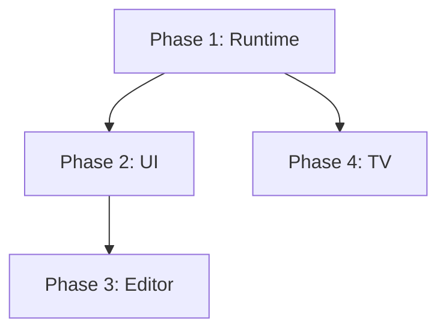

# Comprehensive Development Roadmap

This document outlines the strategic roadmap for WOD Wiki, moving from core stability to advanced ecosystem features. It is based on the [Documentation Index and Status](./Documentation_Index_and_Status.md) analysis.

## Executive Summary

The immediate priority is to fix the core "Workout" experience (EMOMs and Sound), which is currently broken or incomplete. Once the runtime is solid, we will focus on the "App" experience (UI/UX), then the "Wiki" features (Editor), and finally the "TV" ecosystem.

---

## Phase 1: Runtime Integrity (The "Workout" Phase) ⚠️ PARTIAL

**Goal**: Ensure that all standard workout formats (For Time, AMRAP, EMOM, Rep Schemes) execute correctly and provide audio feedback.

**Status**: Core cleanup completed. EMOM/Sound still pending.

### 1.0 Runtime Cleanup ✅ COMPLETED
*   **Timer Memory Model**: Unified `TimerState` model with `TimerSpan[]` and `isRunning` boolean
*   **Memory Search**: Fixed to use `type` field (e.g., `timer:${blockId}`) instead of `id`
*   **Strategy Pattern**: Strategies split into `src/runtime/strategies/` directory
*   **TimerBehavior**: Removed deprecated code, unified with `TimerStateManager`
*   **Hook Consistency**: `useTimerReferences`, `useTimerElapsed` updated to use new model

### 1.1 Fix EMOM / Intervals (Critical) ❌ PENDING
*   **Problem**: `IntervalStrategy` is a stub, and `LoopCoordinator` flushes children immediately without waiting for the interval timer.
*   **Tasks**:
    *   Implement `IntervalStrategy.ts`: Logic to create a parent `IntervalBlock` (likely wrapping a Timer).
    *   Update `LoopCoordinatorBehavior`: Add `INTERVAL` mode logic to wait for `intervalDuration` before advancing to the next round.
    *   Test: Verify standard "EMOM 10" execution.

### 1.2 Audio Feedback
*   **Problem**: `SoundBehavior` exists but isn't connected to an audio source.
*   **Tasks**:
    *   Create `AudioService`: Simple service to play beeps/boops (using Web Audio API or HTML5 Audio).
    *   Integrate: Update `RuntimeControlsBehavior` or `RootLifecycleBehavior` to handle `PlaySoundAction`s emitted by `SoundBehavior`.
    *   Defaults: Add default beeps for "3-2-1" and "Round Start".

### 1.3 History Persistence
*   **Problem**: `HistoryBehavior` creates `ExecutionSpan`s in memory, but they are lost on refresh.
*   **Tasks**:
    *   Implement `ExecutionLogService`: Subscribe to `EXECUTION_SPAN_TYPE` memory changes.
    *   Persist: Save completed logs to Local Storage (via `useLocalLibrary` or similar).
    *   UI: Verify the "History Timeline" panel reads from this persistent log.

---

## Phase 2: User Experience (The "App" Phase) ✅ COMPLETED

**Goal**: Refactor the UI to be cleaner, decoupled, and responsive.

**Status**: All major items completed.

### 2.1 Workbench Decoupling ✅ COMPLETED
*   **Problem**: `UnifiedWorkbench` was tightly coupled to `WodWiki` and `RuntimeStack`.
*   **Solution Implemented**:
    *   Created `RuntimeFactory.ts` - Factory for runtime instance creation
    *   Created `RuntimeProvider.tsx` - React context for runtime lifecycle
    *   Created `useWorkbenchRuntime` hook - Encapsulates runtime logic
    *   Created `WorkoutEventBus.ts` and `useWorkoutEvents.ts` - Event-driven workout flow
    *   Extracted panel components (`PlanPanel`, `TrackPanelIndex`, `TrackPanelPrimary`, etc.)
    *   File reduced from 761 to 493 lines (35% reduction)

### 2.2 Command Palette (`Ctrl+.`) ✅ COMPLETED
*   **Solution Implemented**:
    *   `CommandPalette.tsx` component
    *   `CommandContext.tsx` with `useRegisterCommand` hook
    *   Global keyboard binding via Monaco integration

### 2.3 Responsive Layout ✅ COMPLETED
*   **Solution Implemented**:
    *   `SlidingViewport` component for mobile-first tabbed interface
    *   Mobile detection with adaptive panel rendering
    *   Three-view system: Plan, Track, Analyze

---

## Phase 3: Editor Power (The "Wiki" Phase) ⚠️ PARTIAL

**Goal**: Transform the editor into a rich media experience.

### 3.1 Rich Markdown Features ⚠️ PARTIAL
*   **WOD Block Cards**: ✅ COMPLETED - `RichMarkdownManager` with inline card rendering
*   **Images**: ❌ Missing - Implement drag-and-drop handler to convert images to Base64
*   **FrontMatter**: ❌ Missing - Hide YAML blocks when not editing
*   **YouTube**: ❌ Missing - Detect YouTube URLs and render an embed widget

### 3.2 Autocomplete & Intelligence ✅ COMPLETED
*   **Solution Implemented**:
    *   `ExerciseIndexManager` - Loads and caches exercise database (873+ exercises)
    *   `ExerciseSuggestionProvider` - Monaco completion provider with 150ms debounce + LRU cache (100 entries)
    *   `ExerciseHoverProvider` - Rich hover documentation with metadata

### 3.3 Editor Cleanup ✅ COMPLETED
*   **Solution Implemented**:
    *   `MarkdownEditor.tsx` refactored from 363 to 267 lines (26% reduction)
    *   `useMarkdownEditorSetup` hook extracts Monaco initialization logic
    *   Card action handler extracted to dedicated callback
    *   Theme definitions centralized

---

## Phase 4: Ecosystem (The "TV" Phase)

**Goal**: Extend the experience to the living room.

### 4.1 Relay Server
*   **Task**: Build and deploy the WebSocket server (`server/` directory).
*   **Features**: Room pairing, State forwarding.

### 4.2 Web Integration
*   **Task**: Add "Cast" button to the Web App.
*   **Logic**: Connect `RuntimeStack` events to `CastManager` to broadcast state updates.

### 4.3 Android TV App
*   **Task**: Initialize React Native TV project.
*   **Features**: Receiver view, Remote Control event handling, Heart Rate integration.

---

## Dependency Graph

*Note: Phase 3 and Phase 4 can be executed in parallel after Phase 2.*
