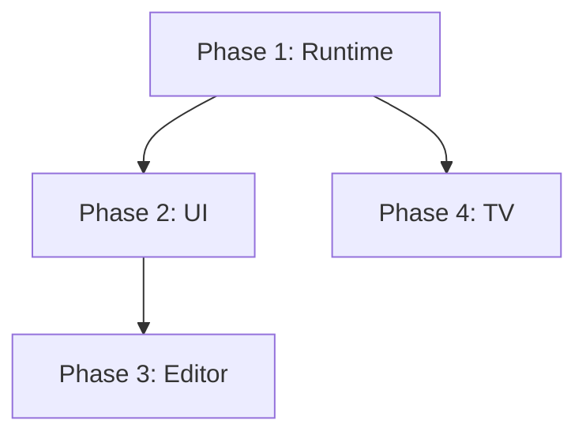

# Comprehensive Development Roadmap

This document outlines the strategic roadmap for WOD Wiki, moving from core stability to advanced ecosystem features. It is based on the [Documentation Index and Status](./Documentation_Index_and_Status.md) analysis.

## Executive Summary

The immediate priority is to fix the core "Workout" experience (EMOMs and Sound), which is currently broken or incomplete. Once the runtime is solid, we will focus on the "App" experience (UI/UX), then the "Wiki" features (Editor), and finally the "TV" ecosystem.

---

## Phase 1: Runtime Integrity (The "Workout" Phase)

**Goal**: Ensure that all standard workout formats (For Time, AMRAP, EMOM, Rep Schemes) execute correctly and provide audio feedback.

### 1.1 Fix EMOM / Intervals (Critical)
*   **Problem**: `IntervalStrategy` is a stub, and `LoopCoordinator` flushes children immediately without waiting for the interval timer.
*   **Tasks**:
    *   Implement `IntervalStrategy.ts`: Logic to create a parent `IntervalBlock` (likely wrapping a Timer).
    *   Update `LoopCoordinatorBehavior`: Add `INTERVAL` mode logic to wait for `intervalDuration` before advancing to the next round.
    *   Test: Verify standard "EMOM 10" execution.

### 1.2 Audio Feedback
*   **Problem**: `SoundBehavior` exists but isn't connected to an audio source.
*   **Tasks**:
    *   Create `AudioService`: Simple service to play beeps/boops (using Web Audio API or HTML5 Audio).
    *   Integrate: Update `RuntimeControlsBehavior` or `RootLifecycleBehavior` to handle `PlaySoundAction`s emitted by `SoundBehavior`.
    *   Defaults: Add default beeps for "3-2-1" and "Round Start".

### 1.3 History Persistence
*   **Problem**: `HistoryBehavior` creates `ExecutionSpan`s in memory, but they are lost on refresh.
*   **Tasks**:
    *   Implement `ExecutionLogService`: Subscribe to `EXECUTION_SPAN_TYPE` memory changes.
    *   Persist: Save completed logs to Local Storage (via `useLocalLibrary` or similar).
    *   UI: Verify the "History Timeline" panel reads from this persistent log.

---

## Phase 2: User Experience (The "App" Phase)

**Goal**: Refactor the UI to be cleaner, decoupled, and responsive.

### 2.1 Workbench Decoupling
*   **Problem**: `UnifiedWorkbench` is tightly coupled to `WodWiki` and `RuntimeStack`, making it hard to test or swap views.
*   **Tasks**:
    *   Refactor `UnifiedWorkbench` to accept `slots` (`leftPanel`, `editor`, `rightPanel`) instead of direct components.
    *   Create `WorkbenchContainer`: A smart wrapper that connects the Redux/Context state to the dumb Workbench.

### 2.2 Command Palette (`Cmd+K`)
*   **Problem**: Power users need faster navigation.
*   **Tasks**:
    *   Install `cmdk` (or similar).
    *   Create `CommandMenu.tsx`.
    *   Register global actions: "Play", "Reset", "Format", "Insert EMOM".

### 2.3 Responsive Layout
*   **Problem**: The app is desktop-only.
*   **Tasks**:
    *   Implement Mobile View: Tabbed interface (Editor <-> Runtime) for screens < 768px.
    *   Update `UnifiedWorkbench` to handle collapsing sidebars gracefully.

---

## Phase 3: Editor Power (The "Wiki" Phase)

**Goal**: Transform the editor into a rich media experience.

### 3.1 Rich Markdown Features
*   **Problem**: The plan for Images and FrontMatter exists but code is missing.
*   **Tasks**:
    *   **Images**: Implement drag-and-drop handler to convert images to Base64 (or blob URLs) and insert into markdown. Use `ViewZone` to render previews.
    *   **FrontMatter**: Hide YAML blocks when not editing; render a "Properties Table" instead.
    *   **YouTube**: Detect YouTube URLs and render an embed widget.

### 3.2 Autocomplete & Intelligence
*   **Problem**: Users have to guess exercise names.
*   **Tasks**:
    *   Index: Create `ExerciseIndex` service that scans the current document + a library of known movements.
    *   Provider: Implement Monaco `CompletionItemProvider` to suggest exercises.
    *   Aliases: Support "DU" -> "Double Unders".

---

## Phase 4: Ecosystem (The "TV" Phase)

**Goal**: Extend the experience to the living room.

### 4.1 Relay Server
*   **Task**: Build and deploy the WebSocket server (`server/` directory).
*   **Features**: Room pairing, State forwarding.

### 4.2 Web Integration
*   **Task**: Add "Cast" button to the Web App.
*   **Logic**: Connect `RuntimeStack` events to `CastManager` to broadcast state updates.

### 4.3 Android TV App
*   **Task**: Initialize React Native TV project.
*   **Features**: Receiver view, Remote Control event handling, Heart Rate integration.

---

## Dependency Graph

*Note: Phase 3 and Phase 4 can be executed in parallel after Phase 2.*
