# Block Isolation Testing Plan

> **Author**: WOD Wiki Team  
> **Created**: 2026-01-06  
> **Purpose**: Comprehensive testing strategy for isolating and validating runtime blocks created by JIT strategies

---

## 📋 Overview

This document outlines a testing strategy for isolating blocks created by JIT strategies and validating their behavior through simulated lifecycle events (mount, next, unmount). The approach leverages the existing test harness infrastructure to create deterministic, reproducible tests.

### Goals

1. **Isolate blocks** created by each strategy for targeted testing
2. **Simulate lifecycle events** (mount, next, unmount) in controlled scenarios
3. **Assert expected actions** are produced during each lifecycle phase
4. **Validate state transitions** and timing behaviors
5. **Ensure proper resource cleanup** on block disposal

---

## 🏗️ Test Harness Architecture

The existing test infrastructure provides the foundation for block isolation testing:


### Harness Responsibilities

| Harness | Purpose | Use Case |
|---------|---------|----------|
| `BehaviorTestHarness` | Lightweight harness with real memory/stack/clock | Testing behaviors and blocks in isolation |
| `MockBlock` | Configurable `IRuntimeBlock` stub | Creating blocks with custom behaviors for unit tests |
| `RuntimeTestBuilder` | Full `ScriptRuntime` builder | Integration testing with JIT compilation |

---

## 🧪 Test Categories

### 1. Behavior Unit Tests

Test individual behaviors attached to blocks in complete isolation.

```mermaid
flowchart LR
    subgraph "Setup"
        A[Create BehaviorTestHarness]
        B[Create MockBlock with Behavior]
    end
    
    subgraph "Execute"
        C[push → mount → next → unmount]
    end
    
    subgraph "Assert"
        D[Check Actions]
        E[Check State]
        F[Check Events]
    end
    
    A --> B --> C --> D
    C --> E
    C --> F
```



**Example: TimerBehavior Unit Test**

```typescript
describe('TimerBehavior', () => {
  let harness: BehaviorTestHarness;

  beforeEach(() => {
    harness = new BehaviorTestHarness()
      .withClock(new Date('2024-01-01T12:00:00Z'));
  });

  it('should start timer on mount', () => {
    const behavior = new TimerBehavior('up');
    const block = new MockBlock('timer-test', [behavior]);
    
    harness.push(block);
    harness.mount();
    
    expect(behavior.isRunning()).toBe(true);
    expect(harness.wasEventEmitted('timer:started')).toBe(true);
  });
});
```

---

### 2. Strategy Block Tests

Test blocks created by specific strategies using `RuntimeTestBuilder`.


**Example: Timer Strategy Block Test**

```typescript
describe('GenericTimerStrategy Block', () => {
  it('should create timer block from script', () => {
    const harness = new RuntimeTestBuilder()
      .withScript('10:00 Run')
      .withStrategy(new GenericTimerStrategy())
      .build();
    
    const block = harness.pushStatement(0);
    
    expect(block.blockType).toBe('Timer');
    expect(block.getBehavior(BoundTimerBehavior)).toBeDefined();
  });
});
```

---

### 3. Lifecycle Phase Tests

Test specific lifecycle phases with detailed action validation.


---

## 📊 Block Types and Test Scenarios

Each strategy creates blocks with specific behaviors. The following table maps strategies to their test scenarios:

### Strategy → Block → Test Matrix


---

## 🔬 Test Assembly Patterns

### Pattern 1: Isolated Behavior Testing

Use `BehaviorTestHarness` + `MockBlock` for testing a single behavior.


**Template:**

```typescript
import { describe, it, expect, beforeEach } from 'bun:test';
import { BehaviorTestHarness, MockBlock } from '@/testing/harness';
import { TargetBehavior } from '@/runtime/behaviors/TargetBehavior';

describe('TargetBehavior', () => {
  let harness: BehaviorTestHarness;

  beforeEach(() => {
    harness = new BehaviorTestHarness()
      .withClock(new Date('2024-01-01T12:00:00Z'));
  });

  describe('onPush (mount)', () => {
    it('should perform expected initialization', () => {
      const behavior = new TargetBehavior(/* args */);
      const block = new MockBlock('test', [behavior]);
      
      harness.push(block);
      const actions = harness.mount();
      
      // Assert expected actions
      expect(actions.length).toBeGreaterThan(0);
      // Assert behavior state
      expect(behavior.someState()).toBe(expectedValue);
    });
  });

  describe('onNext', () => {
    it('should handle next correctly', () => {
      const behavior = new TargetBehavior(/* args */);
      const block = new MockBlock('test', [behavior]);
      
      harness.push(block);
      harness.mount();
      
      const actions = harness.next();
      
      // Assert actions returned
      expect(harness.findActions(ExpectedActionType).length).toBe(1);
    });
  });

  describe('onPop (unmount)', () => {
    it('should cleanup resources', () => {
      const behavior = new TargetBehavior(/* args */);
      const block = new MockBlock('test', [behavior]);
      
      harness.push(block);
      harness.mount();
      
      const actions = harness.unmount();
      
      // Assert cleanup completed
      expect(harness.stackDepth).toBe(0);
    });
  });
});
```

---

### Pattern 2: Strategy Integration Testing

Use `RuntimeTestBuilder` to test full strategy → block compilation.


**Template:**

```typescript
import { describe, it, expect } from 'bun:test';
import { RuntimeTestBuilder } from '@/testing/harness';
import { TargetStrategy } from '@/runtime/compiler/strategies/TargetStrategy';
import { ExpectedBehavior } from '@/runtime/behaviors/ExpectedBehavior';

describe('TargetStrategy Integration', () => {
  it('should compile script to expected block type', () => {
    const harness = new RuntimeTestBuilder()
      .withScript('10:00 Exercise')
      .withStrategy(new TargetStrategy())
      .build();
    
    const block = harness.pushStatement(0);
    
    expect(block.blockType).toBe('ExpectedType');
  });

  it('should attach expected behaviors', () => {
    const harness = new RuntimeTestBuilder()
      .withScript('10:00 Exercise')
      .withStrategy(new TargetStrategy())
      .build();
    
    const block = harness.pushStatement(0);
    
    expect(block.getBehavior(ExpectedBehavior)).toBeDefined();
  });

  it('should handle lifecycle correctly', () => {
    const harness = new RuntimeTestBuilder()
      .withScript('10:00 Exercise')
      .withStrategy(new TargetStrategy())
      .withClock(new Date('2024-01-01T12:00:00Z'))
      .build();
    
    const block = harness.pushStatement(0);
    
    // Mount
    const mountActions = block.mount(harness.runtime, {
      startTime: harness.runtime.clock.now
    });
    expect(mountActions.length).toBeGreaterThan(0);
    
    // Next (if applicable)
    const nextActions = block.next(harness.runtime, {});
    // Assert based on expected behavior
    
    // Unmount
    const unmountActions = block.unmount(harness.runtime, {
      completedAt: harness.runtime.clock.now
    });
    // Assert cleanup
  });
});
```

---

### Pattern 3: Multi-Block Stack Testing

Test parent-child block interactions.


**Template:**

```typescript
describe('Parent-Child Block Interaction', () => {
  it('should properly manage child block lifecycle', () => {
    const harness = new BehaviorTestHarness()
      .withClock(new Date('2024-01-01T12:00:00Z'));
    
    // Create parent with child-running behavior
    const parent = new MockBlock('parent', [
      new ChildRunnerBehavior(/* children */)
    ]);
    
    const child = new MockBlock('child', [
      new SinglePassBehavior()
    ]);
    
    // Parent mounted
    harness.push(parent);
    harness.mount();
    expect(harness.stackDepth).toBe(1);
    
    // Simulate parent pushing child
    harness.push(child);
    harness.mount();
    expect(harness.stackDepth).toBe(2);
    
    // Child completes on next()
    const actions = harness.next();
    expect(harness.findActions(PopBlockAction)).toHaveLength(1);
    
    // After child pops, parent should handle
    harness.unmount(); // child
    expect(harness.stackDepth).toBe(1);
    
    // Parent continues or completes
    harness.next();
    harness.unmount();
    expect(harness.stackDepth).toBe(0);
  });
});
```

---

## ✅ Assertion Categories

### 1. Action Assertions

Verify that lifecycle methods return expected actions.


**Examples:**

```typescript
// Assert specific action type was produced
expect(harness.findActions(PopBlockAction).length).toBe(1);

// Assert action was produced during specific phase
const mountActions = harness.capturedActions
  .filter(c => c.phase === 'mount');
expect(mountActions.length).toBeGreaterThan(0);

// Assert action properties
const emitActions = harness.findActions(EmitEventAction);
expect(emitActions[0].eventName).toBe('timer:started');
```

---

### 2. Event Assertions

Verify that events are properly emitted.

```typescript
// Check event was emitted
expect(harness.wasEventEmitted('timer:started')).toBe(true);

// Get event details
const events = harness.findEvents('timer:complete');
expect(events[0].data.blockId).toBe('test-block');
expect(events[0].timestamp).toEqual(expectedTime);

// Assert handleSpy was called
expect(harness.handleSpy).toHaveBeenCalledTimes(2);
```

---

### 3. State Assertions

Verify block and behavior state changes.

```typescript
// Behavior state
const timer = block.getBehavior(TimerBehavior);
expect(timer.isRunning()).toBe(true);
expect(timer.isPaused()).toBe(false);
expect(timer.getElapsedAt(harness.clock.now)).toBeGreaterThan(0);

// Block timing state
expect(block.executionTiming.startTime).toBeDefined();
expect(block.executionTiming.completedAt).toBeDefined();

// MockBlock custom state
block.state.isComplete = true;
expect(block.state.isComplete).toBe(true);
```

---

### 4. Stack Assertions

Verify stack operations.

```typescript
// Stack depth
expect(harness.stackDepth).toBe(2);

// Current block
expect(harness.currentBlock).toBe(expectedBlock);
expect(harness.currentBlock?.blockType).toBe('Timer');

// Block references
expect(harness.blocks[0]).toBe(rootBlock);
expect(harness.blocks[1]).toBe(childBlock);
```

---

### 5. Memory Assertions

Verify memory allocation and values.

```typescript
// Pre-allocate memory for test
harness.withMemory('round', 'test-block', { current: 1, total: 5 });

// Allocate during test
const ref = harness.allocateMemory('metric', 'test', 42);

// Retrieve and assert
const value = harness.getMemory<number>('metric', 'test');
expect(value).toBe(42);

// Via block context
const blockRef = block.context.get<number>('round');
expect(blockRef?.get()).toBe({ current: 1, total: 5 });
```

---

### 6. Time Assertions

Verify timing-related behaviors.

```typescript
// Advance clock
harness.advanceClock(5000);
expect(harness.clock.now.getTime()).toBe(startTime.getTime() + 5000);

// Timer elapsed
const timer = block.getBehavior(TimerBehavior);
expect(timer.getElapsedAt(harness.clock.now)).toBeGreaterThanOrEqual(5000);

// Timer remaining (countdown)
expect(timer.getRemainingMs(harness.clock.now)).toBeLessThanOrEqual(5000);

// Timer completion
harness.advanceClock(10000);
expect(timer.isComplete(harness.clock.now)).toBe(true);
```

---

## 📁 Test File Organization

```
tests/
├── harness/
│   ├── __tests__/
│   │   ├── BehaviorTestHarness.test.ts
│   │   ├── MockBlock.test.ts
│   │   └── RuntimeTestBuilder.test.ts
│   └── index.ts
│
├── blocks/
│   ├── EffortBlock.test.ts
│   ├── TimerBlock.test.ts
│   ├── RoundsBlock.test.ts
│   ├── IntervalBlock.test.ts
│   ├── AmrapBlock.test.ts
│   └── GroupBlock.test.ts
│
├── strategies/
│   ├── GenericTimerStrategy.test.ts
│   ├── GenericLoopStrategy.test.ts
│   ├── GenericGroupStrategy.test.ts
│   ├── AmrapLogicStrategy.test.ts
│   └── IntervalLogicStrategy.test.ts
│
└── lifecycle/
    ├── MountBehavior.test.ts
    ├── NextBehavior.test.ts
    ├── UnmountBehavior.test.ts
    └── EventDrivenTransitions.test.ts
```

---

## 🔄 Complete Lifecycle Test Example

This example demonstrates a full lifecycle test for an AMRAP block:


```typescript
describe('AMRAP Block Full Lifecycle', () => {
  let harness: BehaviorTestHarness;

  beforeEach(() => {
    harness = new BehaviorTestHarness()
      .withClock(new Date('2024-01-01T12:00:00Z'));
  });

  it('should complete full AMRAP lifecycle', () => {
    // Setup: Create AMRAP block with 10s duration
    const timerBehavior = new BoundTimerBehavior(10000, 'up', 'AMRAP');
    const loopBehavior = new UnboundLoopBehavior();
    const completionBehavior = new CompletionBehavior(
      (_block, now) => timerBehavior.isComplete(now),
      ['timer:tick', 'timer:complete']
    );
    
    const block = new MockBlock('amrap-test', [
      timerBehavior,
      loopBehavior,
      completionBehavior
    ], { blockType: 'AMRAP' });

    // Phase 1: Mount
    harness.push(block);
    const mountActions = harness.mount();
    
    expect(timerBehavior.isRunning()).toBe(true);
    expect(harness.wasEventEmitted('timer:started')).toBe(true);
    
    // Phase 2: Simulate rounds
    harness.advanceClock(3000); // 3 seconds
    expect(timerBehavior.isComplete(harness.clock.now)).toBe(false);
    
    // Simulate child completion triggering next()
    const nextActions1 = harness.next();
    // Loop behavior should allow continuation
    
    harness.advanceClock(3000); // 6 seconds total
    const nextActions2 = harness.next();
    
    // Phase 3: Timer expires
    harness.advanceClock(5000); // 11 seconds total - past 10s
    expect(timerBehavior.isComplete(harness.clock.now)).toBe(true);
    
    // Completion behavior should trigger on next tick event
    harness.simulateEvent('timer:tick');
    
    // Phase 4: Unmount
    const unmountActions = harness.unmount();
    
    expect(harness.stackDepth).toBe(0);
    expect(timerBehavior.isRunning()).toBe(false);
  });
});
```

---

## 📋 Strategy-Specific Test Checklists

### EffortStrategy Tests

- [ ] Block type is "Effort"
- [ ] Count-up timer starts on mount
- [ ] SinglePassBehavior triggers pop on first next()
- [ ] Timer stops on unmount
- [ ] timer:started event emitted

### TimerStrategy Tests

- [ ] Block type is "Timer"
- [ ] Timer direction (up/down) set correctly
- [ ] Bound timer has duration
- [ ] Unbound timer runs indefinitely
- [ ] CompletionBehavior triggers on timer:complete
- [ ] Children managed if present

### RoundsStrategy Tests

- [ ] Block type is "Rounds"
- [ ] BoundLoopBehavior initialized with round count
- [ ] Round counter increments on child completion
- [ ] Exit when all rounds complete
- [ ] Child index wraps properly

### IntervalStrategy Tests

- [ ] Block type is "Interval" or "EMOM"
- [ ] Interval timer restarts after each period
- [ ] IntervalWaitingBehavior shows waiting state
- [ ] Correct number of intervals executed
- [ ] timer:complete triggers next interval

### AmrapStrategy Tests

- [ ] Block type is "AMRAP"
- [ ] Unbound loop allows infinite rounds
- [ ] Bound timer controls duration
- [ ] timer:complete forces pop regardless of child state
- [ ] Round count recorded on completion

### GroupStrategy Tests

- [ ] Block type is "Group"
- [ ] SinglePassBehavior for sequential execution
- [ ] Children executed in order
- [ ] Pops after last child completes

---

## 🎯 Summary

This testing plan provides:

1. **Clear test categories** for different levels of isolation
2. **Reusable patterns** using the existing harness infrastructure
3. **Comprehensive assertions** covering actions, events, state, stack, memory, and time
4. **Visual diagrams** to understand test flows
5. **Strategy-specific checklists** to ensure complete coverage

The approach ensures that blocks created by JIT strategies can be tested in isolation with full control over their lifecycle, enabling confident refactoring and feature development.
